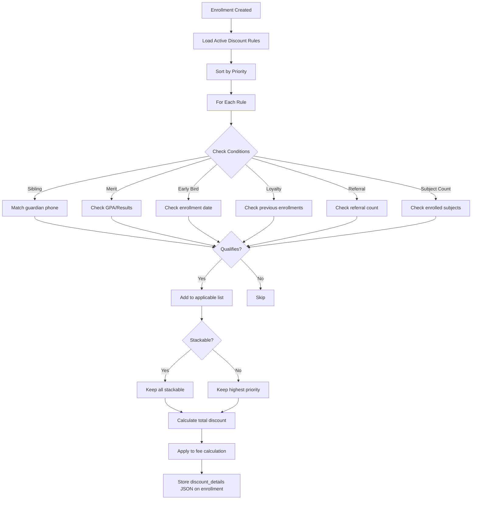

# 🏆 Advanced Dynamic Fee Management System — Complete Plan

> **Project:** Coaching Management System (CMS)
> **Date:** 2026-05-18
> **Status:** Planning Phase

---

## Table of Contents

1. [Executive Summary](#1-executive-summary)
2. [Current System Analysis](#2-current-system-analysis)
3. [Architecture Overview](#3-architecture-overview)
4. [Database Schema Design](#4-database-schema-design)
5. [Backend Service Architecture](#5-backend-service-architecture)
6. [API Endpoints](#6-api-endpoints)
7. [Frontend Pages & Components](#7-frontend-pages--components)
8. [Implementation Phases](#8-implementation-phases)
9. [Data Flow Diagrams](#9-data-flow-diagrams)
10. [Key Design Decisions](#10-key-design-decisions)
11. [Risks & Mitigations](#11-risks--mitigations)

---

## 1. Executive Summary

### 1.1 What This Plan Covers

This plan provides a **complete, production-ready architecture** for transforming the current basic fee system into an **advanced, dynamic, fully-integrated Fee Management System**. The system supports:

| Feature | Description |
|---------|-------------|
| **Dual Fee Types** | One-time (এককালিন) & Monthly (মাসিক) with full lifecycle management |
| **Smart Discount Engine** | Configurable discount rules (sibling, merit, early-bird, loyalty, referral) with condition-based auto-application |
| **Late Fee / Fine System** | Configurable late fee rules with grace periods, caps, and recurring application |
| **Installment Plans** | Custom installment schedules (50-25-25, 3-month equal, etc.) |
| **Payment Confirmation Workflow** | Two-step: student submits → admin confirms → auto-invoice → SMS/Email notification |
| **Multi-Gateway Support** | bKash, Nagad, Rocket, Bank Transfer, Card, Cash — with gateway abstraction layer |
| **Auto Invoice Generation** | PDF invoices on every confirmed payment with professional formatting |
| **Finance Module Sync** | Bridge between Enrollment payments and Finance FeeCollection |
| **Student Self-Service Portal** | Students view fee breakdown, pay online, download receipts |
| **Financial Reports** | Fee collection reports, aging reports, student ledgers, P&L |
| **SMS/Email Notifications** | Payment confirmations, overdue reminders, receipt delivery |

### 1.2 Current State vs Target State

| Aspect | Current State | Target State |
|--------|--------------|--------------|
| Fee Types | Basic `fee_type` column | Full dual-type with monthly record generation |
| Discounts | Hardcoded sibling/early-bird/loyalty | Configurable rule engine with conditions |
| Late Fees | Hardcoded ৳50/day cap at ৳500 | Configurable rules with grace periods |
| Installments | ❌ Not supported | Full installment plan support |
| Payment Confirmation | Direct `paid` status | Two-step: pending → confirmed/rejected |
| Invoices | Basic `receipt_no` only | Professional PDF invoices with auto-generation |
| Student Portal | ❌ Not available | Full fee dashboard + online payment |
| Reports | Basic enrollment reports | Financial reports (collection, aging, ledger) |
| Finance Integration | Disconnected | Event-driven sync between modules |

---

## 2. Current System Analysis

### 2.1 What Already Exists ✅

#### Backend (Modules/Enrollment)

| Component | File | Status |
|-----------|------|--------|
| **Enrollment Model** | [`Modules/Enrollment/app/Models/Enrollment.php`](Modules/Enrollment/app/Models/Enrollment.php) | Has `fee_type`, `total_months`, `paid_months`, discount fields |
| **MonthlyFeeRecord Model** | [`Modules/Enrollment/app/Models/MonthlyFeeRecord.php`](Modules/Enrollment/app/Models/MonthlyFeeRecord.php) | Has `fine_amount`, payment status tracking |
| **MonthlyFeePayment Model** | [`Modules/Enrollment/app/Models/MonthlyFeePayment.php`](Modules/Enrollment/app/Models/MonthlyFeePayment.php) | Has `payment_status`, `confirmed_by`, `invoice_no` |
| **PaymentInvoice Model** | [`Modules/Enrollment/app/Models/PaymentInvoice.php`](Modules/Enrollment/app/Models/PaymentInvoice.php) | Invoice tracking with metadata |
| **EnrollmentService** | [`Modules/Enrollment/app/Services/EnrollmentService.php`](Modules/Enrollment/app/Services/EnrollmentService.php) | Fee calculation, discount logic, enrollment creation |
| **MonthlyFeeService** | [`Modules/Enrollment/app/Services/MonthlyFeeService.php`](Modules/Enrollment/app/Services/MonthlyFeeService.php) | Record generation, payment recording, confirmation workflow |
| **NotificationService** | [`Modules/Enrollment/app/Services/NotificationService.php`](Modules/Enrollment/app/Services/NotificationService.php) | Email + SMS for enrollment events |
| **PaymentService** | [`Modules/Enrollment/app/Services/PaymentService.php`](Modules/Enrollment/app/Services/PaymentService.php) | Payment recording, refunds, history |
| **InvoiceService** | [`Modules/Enrollment/app/Services/InvoiceService.php`](Modules/Enrollment/app/Services/InvoiceService.php) | PDF invoice generation |
| **PaymentGatewayService** | [`Modules/Enrollment/app/Services/PaymentGatewayService.php`](Modules/Enrollment/app/Services/PaymentGatewayService.php) | Gateway abstraction layer |
| **MonthlyFeeController** | [`Modules/Enrollment/app/Http/Controllers/Api/V1/MonthlyFeeController.php`](Modules/Enrollment/app/Http/Controllers/Api/V1/MonthlyFeeController.php) | Full CRUD + confirmation endpoints |
| **API Routes** | [`Modules/Enrollment/routes/api.php`](Modules/Enrollment/routes/api.php) | All monthly fee + payment routes defined |
| **Console Command** | [`Modules/Enrollment/app/Console/SendMonthlyFeeReminders.php`](Modules/Enrollment/app/Console/SendMonthlyFeeReminders.php) | Scheduled reminders |

#### Backend (Modules/Finance)

| Component | File | Status |
|-----------|------|--------|
| **FeeType Model** | Finance module | CRUD for fee type master data |
| **FeeStructure Model** | Finance module | Session/class-based fee templates |
| **FeeCollection Model** | Finance module | General ledger fee collection |
| **Expense Model** | Finance module | Expense tracking |
| **Finance Migration** | [`Modules/Finance/database/migrations/2026_05_01_090001_create_finance_tables.php`](Modules/Finance/database/migrations/2026_05_01_090001_create_finance_tables.php) | All finance tables |

#### Frontend

| Component | File | Status |
|-----------|------|--------|
| **MonthlyFeeListPage** | [`frontend/src/pages/dashboard/enrollment/MonthlyFeeListPage.vue`](frontend/src/pages/dashboard/enrollment/MonthlyFeeListPage.vue) | Summary cards, filters, payment dialog, payment history |
| **EnrollmentDetailsPage** | [`frontend/src/pages/dashboard/enrollment/EnrollmentDetailsPage.vue`](frontend/src/pages/dashboard/enrollment/EnrollmentDetailsPage.vue) | Fee summary, monthly records, payment timeline |
| **PaymentConfirmationPage** | [`frontend/src/pages/dashboard/enrollment/PaymentConfirmationPage.vue`](frontend/src/pages/dashboard/enrollment/PaymentConfirmationPage.vue) | Admin confirmation/rejection workflow |
| **EnrollmentWizard** | [`frontend/src/pages/dashboard/enrollment/EnrollmentWizard.vue`](frontend/src/pages/dashboard/enrollment/EnrollmentWizard.vue) | Fee type selection, subject selection |
| **FeeCollectionPage** | [`frontend/src/pages/dashboard/finance/FeeCollectionPage.vue`](frontend/src/pages/dashboard/finance/FeeCollectionPage.vue) | Finance module fee collection |
| **FeeStructureListPage** | [`frontend/src/pages/dashboard/finance/FeeStructureListPage.vue`](frontend/src/pages/dashboard/finance/FeeStructureListPage.vue) | Fee structure CRUD |
| **FeeTypeListPage** | [`frontend/src/pages/dashboard/finance/FeeTypeListPage.vue`](frontend/src/pages/dashboard/finance/FeeTypeListPage.vue) | Fee type CRUD |
| **monthly-fee.service.js** | [`frontend/src/services/monthly-fee.service.js`](frontend/src/services/monthly-fee.service.js) | All monthly fee API methods |
| **finance.service.js** | [`frontend/src/services/finance.service.js`](frontend/src/services/finance.service.js) | Finance module API methods |

### 2.2 Gaps & What Needs to Be Built 🚧

| # | Gap | Priority | Phase |
|---|-----|----------|-------|
| 1 | **Configurable Discount Rules Engine** — Currently hardcoded in `EnrollmentService::calculateDiscount()` | High | Phase 1 |
| 2 | **Configurable Late Fee Rules** — Currently hardcoded (50/day, 500 cap) in `MonthlyFeeService::getRecords()` | High | Phase 1 |
| 3 | **Installment Plans** — No installment support at all | Medium | Phase 2 |
| 4 | **Fee Adjustments** — No waiver/refund/adjustment tracking | Medium | Phase 2 |
| 5 | **Finance Module Sync** — Enrollment payments don't sync to Finance FeeCollection | Medium | Phase 3 |
| 6 | **Student Fee Portal** — Students can't view/pay fees online | High | Phase 4 |
| 7 | **Financial Reports** — No dedicated fee collection/aging reports | Medium | Phase 4 |
| 8 | **Bulk Operations** — No bulk payment, bulk reminder, bulk export | Low | Phase 5 |
| 9 | **Fee Structure Templates** — FeeStructure exists but not linked to course creation | Low | Phase 5 |

---

## 3. Architecture Overview

### 3.1 System Architecture

```
┌─────────────────────────────────────────────────────────────────────────────┐
│                        FEE MANAGEMENT SYSTEM                                 │
├─────────────────────────────────────────────────────────────────────────────┤
│                                                                               │
│  ┌─────────────────────────┐    ┌──────────────────────────────────┐        │
│  │    FEE CONFIGURATION     │    │      ENROLLMENT FEE FLOW         │        │
│  │                         │    │                                  │        │
│  │  • FeeType (master)     │    │  Course → Subjects               │        │
│  │  • FeeStructure         │───▶│    ↓ (fee + monthly_fee)         │        │
│  │    (class/session)      │    │  Enrollment                      │        │
│  │  • Discount Rules  ◀─── │    │    ↓ (fee_type, payable)         │        │
│  │  • Late Fee Rules  ◀─── │    │  MonthlyFeeRecords               │        │
│  │  • Installment Plans    │    │    ↓ (per month records)         │        │
│  └─────────────────────────┘    │  MonthlyFeePayments              │        │
│                                  │    ↓ (per payment)               │        │
│  ┌─────────────────────────┐    │  Payment (receipts)              │        │
│  │   FINANCE INTEGRATION    │    └──────────────────────────────────┘        │
│  │                         │                                                 │
│  │  • FeeCollection ◀──────│──── Event-driven sync                          │
│  │  • Expense tracking     │                                                 │
│  │  • P&L Reports          │    ┌──────────────────────────────────┐        │
│  └─────────────────────────┘    │      STUDENT PORTAL              │        │
│                                  │                                  │        │
│  ┌─────────────────────────┐    │  • View fee breakdown            │        │
│  │   ADMIN DASHBOARD        │    │  • Due dates calendar            │        │
│  │                         │    │  • Payment history               │        │
│  │  • Fee collection sum.  │    │  • Online payment (bKash/Nagad)  │        │
│  │  • Overdue alerts       │    │  • Download receipts             │        │
│  │  • Aging reports        │    └──────────────────────────────────┘        │
│  │  • Discount/Late fee    │                                                 │
│  └─────────────────────────┘                                                 │
│                                                                               │
└─────────────────────────────────────────────────────────────────────────────┘
```

### 3.2 Module Dependency Map

```
┌──────────────┐     ┌──────────────────┐     ┌──────────────┐
│   Core       │────▶│   Enrollment     │────▶│   Finance    │
│ (Base, UUID, │     │ (Fee Engine,     │     │ (Ledger,     │
│  Traits)     │     │  Payments,       │     │  Expenses)   │
└──────────────┘     │  Invoices)       │     └──────────────┘
                     └──────────────────┘
                           │       ▲
                           ▼       │
                     ┌──────────────────┐
                     │   Student        │
                     │ (Portal, Self-   │
                     │  Payment)        │
                     └──────────────────┘
```

---

## 4. Database Schema Design

### 4.1 New Tables

#### 4.1.1 `discount_rules` — Configurable Discount Engine

```sql
CREATE TABLE discount_rules (
    id              UUID PRIMARY KEY,
    name            VARCHAR(255) NOT NULL,           -- e.g., "Sibling Discount", "Merit Scholarship"
    code            VARCHAR(50) UNIQUE NOT NULL,     -- e.g., "SIBLING_10", "MERIT_50"
    description     TEXT NULL,
    type            ENUM('percentage','fixed') NOT NULL DEFAULT 'percentage',
    value           DECIMAL(10,2) NOT NULL,          -- e.g., 10 for 10%, or 500 for fixed
    applies_to      ENUM('one_time','monthly','both') NOT NULL DEFAULT 'both',
    priority        INT DEFAULT 0,                   -- Lower number = applied first
    conditions      JSON NULL,                       -- Flexible condition storage
    -- Example conditions:
    -- { "type": "sibling", "min_count": 1, "same_guardian": true }
    -- { "type": "merit", "min_gpa": 4.5, "subject": "all" }
    -- { "type": "early_bird", "days_before_start": 30 }
    -- { "type": "referral", "referral_count": 3 }
    -- { "type": "loyalty", "min_renewals": 1 }
    -- { "type": "subject_count", "min_subjects": 3 }
    -- { "type": "payment_method", "method": "bkash", "discount_extra": 2 }
    max_discount    DECIMAL(10,2) NULL,              -- Maximum discount amount cap
    is_stackable    BOOLEAN DEFAULT FALSE,           -- Can combine with other discounts
    status          ENUM('active','inactive') DEFAULT 'active',
    created_at      TIMESTAMP,
    updated_at      TIMESTAMP
);
```

#### 4.1.2 `late_fee_rules` — Configurable Late Fee Engine

```sql
CREATE TABLE late_fee_rules (
    id              UUID PRIMARY KEY,
    name            VARCHAR(255) NOT NULL,
    code            VARCHAR(50) UNIQUE NOT NULL,
    description     TEXT NULL,
    grace_days      INT DEFAULT 5,                  -- Days after due date before fine applies
    type            ENUM('percentage','fixed','daily') NOT NULL DEFAULT 'fixed',
    value           DECIMAL(10,2) NOT NULL,          -- e.g., 2 for 2%, 100 for fixed, 10 for daily
    max_fee         DECIMAL(10,2) NULL,              -- Maximum late fee cap
    min_fee         DECIMAL(10,2) NULL,              -- Minimum late fee
    recurring       ENUM('once','daily','weekly','monthly') DEFAULT 'once',
    applies_to      ENUM('one_time','monthly','both') DEFAULT 'monthly',
    status          ENUM('active','inactive') DEFAULT 'active',
    created_at      TIMESTAMP,
    updated_at      TIMESTAMP
);
```

#### 4.1.3 `late_fee_applied` — Late Fee Application Log

```sql
CREATE TABLE late_fee_applied (
    id                      UUID PRIMARY KEY,
    monthly_fee_record_id   UUID NOT NULL REFERENCES monthly_fee_records(id) ON DELETE CASCADE,
    late_fee_rule_id        UUID NOT NULL REFERENCES late_fee_rules(id),
    enrollment_id           UUID NOT NULL REFERENCES enrollments(id) ON DELETE CASCADE,
    original_due            DECIMAL(12,2) NOT NULL,
    late_fee_amount         DECIMAL(12,2) NOT NULL,
    total_due               DECIMAL(12,2) NOT NULL,
    days_overdue            INT NOT NULL,
    applied_at              TIMESTAMP DEFAULT CURRENT_TIMESTAMP,
    created_at              TIMESTAMP,
    updated_at              TIMESTAMP
);

CREATE INDEX idx_late_fee_applied_record ON late_fee_applied(monthly_fee_record_id);
CREATE INDEX idx_late_fee_applied_enrollment ON late_fee_applied(enrollment_id);
```

#### 4.1.4 `installment_plans` — Installment Plan Templates

```sql
CREATE TABLE installment_plans (
    id                  UUID PRIMARY KEY,
    name                VARCHAR(255) NOT NULL,       -- e.g., "3-Month Installment", "50-25-25"
    code                VARCHAR(50) UNIQUE NOT NULL,
    description         TEXT NULL,
    total_installments  INT NOT NULL,                -- e.g., 3
    schedule_type       ENUM('equal','custom') DEFAULT 'equal',
    intervals           JSON NOT NULL,               -- [{"percent":50,"due_days":0},{"percent":25,"due_days":30},{"percent":25,"due_days":60}]
    applies_to          ENUM('one_time','monthly','both') DEFAULT 'one_time',
    status              ENUM('active','inactive') DEFAULT 'active',
    created_at          TIMESTAMP,
    updated_at          TIMESTAMP
);
```

#### 4.1.5 `enrollment_installments` — Per-Enrollment Installment Schedule

```sql
CREATE TABLE enrollment_installments (
    id                  UUID PRIMARY KEY,
    enrollment_id       UUID NOT NULL REFERENCES enrollments(id) ON DELETE CASCADE,
    installment_plan_id UUID NOT NULL REFERENCES installment_plans(id),
    installment_no      INT NOT NULL,
    amount              DECIMAL(12,2) NOT NULL,
    due_date            DATE NOT NULL,
    paid_amount         DECIMAL(12,2) DEFAULT 0,
    payment_status      ENUM('pending','partial','paid','overdue') DEFAULT 'pending',
    paid_at             TIMESTAMP NULL,
    created_at          TIMESTAMP,
    updated_at          TIMESTAMP
);

CREATE INDEX idx_enrollment_installments_enrollment ON enrollment_installments(enrollment_id);
CREATE UNIQUE INDEX idx_enrollment_installments_unique ON enrollment_installments(enrollment_id, installment_no);
```

#### 4.1.6 `fee_adjustments` — Fee Waivers, Refunds & Adjustments

```sql
CREATE TABLE fee_adjustments (
    id                      UUID PRIMARY KEY,
    enrollment_id           UUID NOT NULL REFERENCES enrollments(id) ON DELETE CASCADE,
    monthly_fee_record_id   UUID NULL REFERENCES monthly_fee_records(id) ON DELETE SET NULL,
    type                    ENUM('discount','waiver','fine','refund','adjustment') NOT NULL,
    amount                  DECIMAL(12,2) NOT NULL,
    reason                  TEXT NOT NULL,
    approved_by             UUID NOT NULL REFERENCES users(id),
    approved_at             TIMESTAMP DEFAULT CURRENT_TIMESTAMP,
    reference_no            VARCHAR(100) NULL,
    metadata                JSON NULL,
    created_at              TIMESTAMP,
    updated_at              TIMESTAMP
);

CREATE INDEX idx_fee_adjustments_enrollment ON fee_adjustments(enrollment_id);
```

### 4.2 Existing Table Modifications

#### 4.2.1 `enrollments` table — Add Installment & Discount Rule References

```sql
ALTER TABLE enrollments
    ADD COLUMN installment_plan_id UUID NULL REFERENCES installment_plans(id),
    ADD COLUMN discount_rule_id UUID NULL REFERENCES discount_rules(id),
    ADD COLUMN discount_details JSON NULL,           -- Snapshot of applied discounts
    ADD COLUMN last_late_fee_applied_at TIMESTAMP NULL,
    ADD COLUMN fee_structure_id UUID NULL REFERENCES fee_structures(id);
```

#### 4.2.2 `monthly_fee_records` table — Enhanced Late Fee Tracking

```sql
ALTER TABLE monthly_fee_records
    ADD COLUMN late_fee DECIMAL(10,2) DEFAULT 0,
    ADD COLUMN total_due_with_late DECIMAL(12,2) GENERATED ALWAYS AS (due_amount + late_fee) STORED,
    ADD COLUMN discount_applied DECIMAL(10,2) DEFAULT 0,
    ADD COLUMN discount_details JSON NULL;
```

#### 4.2.3 `fee_collections` table — Link to Enrollment

```sql
ALTER TABLE fee_collections
    ADD COLUMN enrollment_id UUID NULL REFERENCES enrollments(id),
    ADD COLUMN monthly_fee_record_id UUID NULL REFERENCES monthly_fee_records(id),
    ADD COLUMN monthly_fee_payment_id UUID NULL REFERENCES monthly_fee_payments(id);
```

---

## 5. Backend Service Architecture

### 5.1 New Services

```
Modules/Enrollment/app/Services/
├── DiscountService.php           ← NEW: Configurable discount rule engine
├── LateFeeService.php            ← NEW: Configurable late fee calculation
├── InstallmentService.php        ← NEW: Installment plan generation & tracking
├── FeeAdjustmentService.php      ← NEW: Waivers, refunds, adjustments
├── FeeSyncService.php            ← NEW: Sync enrollment payments → Finance module
└── FeeReportService.php          ← NEW: Financial report generation
```

### 5.2 Service Details

#### [`DiscountService.php`](Modules/Enrollment/app/Services/DiscountService.php)

```php
class DiscountService
{
    /**
     * Calculate all applicable discounts for a student/enrollment.
     * Loads active discount_rules, checks conditions, returns sorted list.
     */
    public function calculateDiscounts(Student $student, Course $course, string $feeType, array $context = []): array
    {
        // 1. Load all active discount rules
        // 2. For each rule, check conditions via condition evaluator
        // 3. Sort by priority
        // 4. Apply stackable rules; pick highest for non-stackable
        // 5. Return array of applicable discounts with amounts
    }

    /**
     * Evaluate a single discount rule's conditions against student data.
     */
    public function evaluateCondition(DiscountRule $rule, Student $student, Course $course, array $context): bool
    {
        // Routes to specific condition checkers:
        // - sibling condition → check guardian phone match
        // - merit condition → check student's previous GPA/results
        // - early_bird condition → check enrollment date vs session start
        // - referral condition → check referral count
        // - loyalty condition → check previous enrollments count
        // - subject_count condition → check enrolled subjects count
        // - payment_method condition → check selected payment method
    }

    /**
     * Apply discounts to a fee calculation.
     */
    public function applyDiscounts(array $feeCalculation, array $applicableDiscounts): array
    {
        // Returns updated fee calculation with discount breakdown
    }
}
```

#### [`LateFeeService.php`](Modules/Enrollment/app/Services/LateFeeService.php)

```php
class LateFeeService
{
    /**
     * Calculate late fee for a specific monthly fee record.
     */
    public function calculateLateFee(MonthlyFeeRecord $record): array
    {
        // 1. Check if overdue (past due_date and not fully paid)
        // 2. Calculate days overdue (minus grace period)
        // 3. Load active late_fee_rules
        // 4. Calculate fee based on rule type (percentage/fixed/daily)
        // 5. Apply min/max caps
        // 6. Return late fee details
    }

    /**
     * Apply late fee to a record (creates late_fee_applied log).
     */
    public function applyLateFee(MonthlyFeeRecord $record): LateFeeApplied
    {
        // Creates late_fee_applied record
        // Updates monthly_fee_records.late_fee
        // Returns the applied record
    }

    /**
     * Batch apply late fees (called by scheduled command).
     */
    public function batchApplyLateFees(): int
    {
        // Finds all overdue records past grace period
        // Applies late fee to each
        // Returns count of records updated
    }

    /**
     * Get late fee history for a record or enrollment.
     */
    public function getLateFeeHistory($recordId = null, $enrollmentId = null): Collection
    {
        // Returns late_fee_applied records with rule details
    }
}
```

#### [`InstallmentService.php`](Modules/Enrollment/app/Services/InstallmentService.php)

```php
class InstallmentService
{
    /**
     * Generate installment schedule for an enrollment.
     */
    public function generateSchedule(Enrollment $enrollment, InstallmentPlan $plan): Collection
    {
        // 1. Calculate total amount (payable_fee)
        // 2. Based on schedule_type (equal/custom), calculate per-installment amounts
        // 3. Calculate due dates based on intervals
        // 4. Bulk insert enrollment_installments
        // 5. Return collection of installment records
    }

    /**
     * Record payment against an installment.
     */
    public function recordInstallmentPayment(string $installmentId, float $amount, array $paymentData): EnrollmentInstallment
    {
        // Update paid_amount, payment_status on installment
        // If fully paid, mark as paid with timestamp
        // Return updated installment
    }

    /**
     * Get current installment status for an enrollment.
     */
    public function getInstallmentStatus(string $enrollmentId): array
    {
        // Returns: total installments, paid count, next due date, overdue status
    }

    /**
     * Check if any installment is overdue.
     */
    public function getOverdueInstallments(string $enrollmentId = null): Collection
    {
        // Returns overdue installments with enrollment + student data
    }
}
```

#### [`FeeAdjustmentService.php`](Modules/Enrollment/app/Services/FeeAdjustmentService.php)

```php
class FeeAdjustmentService
{
    /**
     * Create a fee adjustment (waiver, refund, fine, adjustment).
     */
    public function createAdjustment(array $data): FeeAdjustment
    {
        // Validate adjustment type
        // Create adjustment record
        // If affecting monthly_fee_record, update its totals
        // If affecting enrollment totals, update enrollment
        // Log activity
    }

    /**
     * Get all adjustments for an enrollment.
     */
    public function getEnrollmentAdjustments(string $enrollmentId): Collection
    {
        // Returns adjustments with approver details
    }

    /**
     * Reverse an adjustment.
     */
    public function reverseAdjustment(string $adjustmentId, string $reason): FeeAdjustment
    {
        // Creates a reversing adjustment entry
        // Restores affected totals
    }
}
```

#### [`FeeSyncService.php`](Modules/Enrollment/app/Services/FeeSyncService.php)

```php
class FeeSyncService
{
    /**
     * Sync a payment to the Finance module's FeeCollection.
     */
    public function syncToFinance(Payment $payment): void
    {
        // 1. Check if FeeCollection record already exists for this payment
        // 2. If not, create FeeCollection record with:
        //    - enrollment_id, monthly_fee_record_id, monthly_fee_payment_id
        //    - amount, payment_method, transaction_id
        //    - collected_by, collected_at
        // 3. If exists, update amounts
    }

    /**
     * Remove a synced record (on payment reversal/refund).
     */
    public function removeFromFinance(Payment $payment): void
    {
        // Delete or mark as reversed the FeeCollection record
    }
}
```

#### [`FeeReportService.php`](Modules/Enrollment/app/Services/FeeReportService.php)

```php
class FeeReportService
{
    /**
     * Fee collection report for a date range.
     */
    public function feeCollectionReport(Carbon $startDate, Carbon $endDate, array $filters = []): array
    {
        // Total collected, by method, by course, by class
        // Daily/weekly/monthly breakdown
    }

    /**
     * Accounts receivable aging report.
     */
    public function agingReport(): array
    {
        // 0-30 days, 31-60 days, 61-90 days, 90+ days
        // Total due, count of overdue records
    }

    /**
     * Student fee ledger.
     */
    public function studentLedger(string $enrollmentId): array
    {
        // Complete fee history: charges, payments, adjustments, balance
    }

    /**
     * Monthly collection summary.
     */
    public function monthlySummary(string $month = null): array
    {
        // Total collected, pending, overdue for given month
        // Comparison with previous month
    }
}
```

### 5.3 Events & Listeners

```php
// New Events to Create
PaymentRecorded        → [FeeSyncService::syncToFinance, InvoiceService::generateReceipt, NotificationService::sendPaymentConfirmation]
MonthlyFeePaid         → [FeeSyncService::syncToFinance, InstallmentService::updateInstallment, NotificationService::sendMonthlyReceipt]
EnrollmentCreated      → [DiscountService::applyDiscounts, InstallmentService::generateSchedule]
MonthlyFeeOverdue      → [LateFeeService::applyLateFee, NotificationService::sendOverdueReminder]
PaymentConfirmed       → [InvoiceService::generateInvoice, NotificationService::sendConfirmation]
PaymentRejected        → [NotificationService::sendRejectionNotification]
FeeAdjustmentCreated   → [FeeSyncService::syncAdjustment]
```

### 5.4 Scheduled Commands

```php
// New Console Commands
php artisan fees:apply-late-fees          // Daily: Apply late fees to overdue records
php artisan fees:send-reminders           // Daily: Send SMS/Email reminders for due fees
php artisan fees:generate-monthly-records // Monthly: Generate next month's fee records
php artisan fees:sync-finance             // Hourly: Sync any unsynced payments to Finance
```

---

## 6. API Endpoints

### 6.1 New Endpoints

```
# ===== DISCOUNT RULES =====
GET    /api/v1/discount-rules              → List all discount rules
POST   /api/v1/discount-rules              → Create discount rule
PUT    /api/v1/discount-rules/{id}         → Update discount rule
DELETE /api/v1/discount-rules/{id}         → Delete discount rule
GET    /api/v1/discount-rules/{id}/preview → Preview which students would qualify

# ===== LATE FEE RULES =====
GET    /api/v1/late-fee-rules              → List all late fee rules
POST   /api/v1/late-fee-rules              → Create late fee rule
PUT    /api/v1/late-fee-rules/{id}         → Update late fee rule
DELETE /api/v1/late-fee-rules/{id}         → Delete late fee rule
POST   /api/v1/late-fee-rules/apply        → Manual trigger late fee calculation
GET    /api/v1/monthly-fees/{id}/late-fees → Get late fee details for a record

# ===== INSTALLMENT PLANS =====
GET    /api/v1/installment-plans           → List all installment plans
POST   /api/v1/installment-plans           → Create installment plan
PUT    /api/v1/installment-plans/{id}      → Update installment plan
DELETE /api/v1/installment-plans/{id}      → Delete installment plan

# ===== ENROLLMENT INSTALLMENTS =====
GET    /api/v1/enrollments/{id}/installments       → Get installment schedule
POST   /api/v1/enrollments/{id}/installments/pay   → Pay an installment

# ===== FEE ADJUSTMENTS =====
GET    /api/v1/fee-adjustments                     → List all adjustments
POST   /api/v1/fee-adjustments                     → Create adjustment
GET    /api/v1/enrollments/{id}/adjustments        → Get adjustments for enrollment
POST   /api/v1/fee-adjustments/{id}/reverse        → Reverse an adjustment

# ===== INVOICES =====
GET    /api/v1/invoices/payment/{paymentId}        → Download payment receipt PDF
GET    /api/v1/invoices/enrollment/{enrollmentId}  → Download enrollment fee statement PDF
GET    /api/v1/invoices/monthly/{recordId}         → Download monthly fee invoice PDF
GET    /api/v1/invoices/enrollment/{enrollmentId}/list → List all invoices for enrollment

# ===== REPORTS =====
GET    /api/v1/finance/reports/fee-collection       → Fee collection report (date range)
GET    /api/v1/finance/reports/aging                → Accounts receivable aging
GET    /api/v1/finance/reports/monthly-summary      → Monthly fee collection summary
GET    /api/v1/finance/reports/student-ledger/{id}  → Student fee ledger
GET    /api/v1/finance/reports/dashboard-stats      → Dashboard statistics

# ===== STUDENT PORTAL =====
GET    /api/v1/student/fee-summary                  → Logged-in student's fee overview
GET    /api/v1/student/fee-records                  → Student's monthly fee records
GET    /api/v1/student/payment-history              → Student's payment history
POST   /api/v1/student/pay-monthly-fee              → Student self-payment via gateway
GET    /api/v1/student/invoices                     → Student's invoices
GET    /api/v1/student/invoice/{paymentId}/download → Download student's invoice
```

### 6.2 Modified Existing Endpoints

```
# Enrollment → enroll() — Add installment_plan_id, discount_rule_id
POST /api/v1/enrollments/enroll
  Body: { ..., installment_plan_id, discount_rule_id }

# Enrollment → calculateFee() — Include discount breakdown, installment options
POST /api/v1/enrollments/calculate-fee
  Body: { ..., fee_type, subject_ids, installment_plan_id }
  Response: { ..., discount_breakdown, installment_options }

# Monthly Fee → recordPayment() — Accept installment context
POST /api/v1/monthly-fees/{recordId}/pay
  Body: { ..., installment_id }

# Finance → FeeCollection — Accept enrollment context
POST /api/v1/fee-collections
  Body: { ..., enrollment_id, monthly_fee_record_id }
```

---

## 7. Frontend Pages & Components

### 7.1 New Pages

```
frontend/src/pages/dashboard/finance/
├── DiscountRuleListPage.vue         ← CRUD for discount rules with condition builder
├── LateFeeRuleListPage.vue          ← CRUD for late fee rules
├── InstallmentPlanListPage.vue      ← CRUD for installment plans
├── FeeAdjustmentListPage.vue        ← Fee adjustments log with filters
├── FeeReportsPage.vue               ← Financial reports dashboard
│   ├── FeeCollectionReport.vue      ← Date-range collection report with charts
│   ├── AgingReport.vue              ← Accounts receivable aging table
│   └── MonthlySummaryReport.vue     ← Monthly collection summary with trends
└── StudentLedgerPage.vue            ← Individual student fee ledger

frontend/src/pages/dashboard/enrollment/
├── InstallmentSchedule.vue          ← Installment plan view for enrollment

frontend/src/pages/student/
├── FeeDashboard.vue                ← Student's fee overview with charts
├── FeeRecords.vue                  ← Student's monthly fee records
├── PaymentHistory.vue              ← Student's payment history
└── OnlinePayment.vue               ← Student self-payment page with gateway selection
```

### 7.2 Modified Existing Pages

```
EnrollmentWizard.vue
├── Add installment plan selection step
├── Add discount display in fee summary
├── Add late fee warning if applicable
├── Add fee type toggle (one_time/monthly) with visual explanation
└── Improve monthly fee breakdown display

MonthlyFeeListPage.vue
├── Add late fee column with amount
├── Add bulk payment option (select multiple records)
├── Add export to CSV/Excel/PDF
├── Add send reminder button (SMS/Email)
├── Add discount column
└── Add installment indicator

EnrollmentDetailsPage.vue
├── Add installment schedule tab
├── Add discount breakdown section
├── Add late fee history section
├── Add fee adjustment log
└── Add send statement button

FeeCollectionPage.vue
├── Link to enrollment_id
├── Show enrollment context (student name, course, batch)
├── Auto-create from enrollment payments
└── Show linked monthly fee records

CourseCreatePage.vue
├── Already has monthly_fee input
└── Add option to link FeeStructure template
```

### 7.3 Reusable Components

```
frontend/src/components/finance/
├── FeeSummaryCard.vue               ← Reusable fee summary card with progress
├── PaymentMethodChips.vue           ← Payment method selector with icons
├── InvoiceDownloadButton.vue        ← Download invoice PDF button
├── PaymentTimeline.vue              ← Visual payment timeline component
├── FeeProgressBar.vue               ← Months paid progress bar
├── DiscountBadge.vue                ← Discount display badge
├── LateFeeBadge.vue                 ← Late fee warning badge
├── InstallmentTimeline.vue          ← Installment schedule visual
├── FeeChart.vue                     ← Fee collection chart (Chart.js)
└── ExportDropdown.vue               ← CSV/Excel/PDF export dropdown
```

---

## 8. Implementation Phases

### Phase 0: Foundation & Payment Workflow (IMMEDIATE — Already Partially Done)
**Goal**: Complete the payment confirmation workflow, invoice generation, and months tracking

| Step | Task | Files | Status |
|------|------|-------|--------|
| 0.1 | Migration: Add confirmation fields to `monthly_fee_payments` | `Modules/Enrollment/database/migrations/2026_05_16_000009_*.php` | ✅ Done |
| 0.2 | Migration: Create `payment_invoices` table | `Modules/Enrollment/database/migrations/2026_05_16_000010_*.php` | ✅ Done |
| 0.3 | Migration: Add `total_months`, `paid_months` to `enrollments` | `Modules/Enrollment/database/migrations/2026_05_16_000011_*.php` | ✅ Done |
| 0.4 | Model: Update `MonthlyFeePayment` with new fields | `Models/MonthlyFeePayment.php` | ✅ Done |
| 0.5 | Model: Create `PaymentInvoice` model | `Models/PaymentInvoice.php` | ✅ Done |
| 0.6 | Service: `recordPendingPayment()`, `confirmPayment()`, `rejectPayment()` | `Services/MonthlyFeeService.php` | ✅ Done |
| 0.7 | Service: `InvoiceService` with PDF generation | `Services/InvoiceService.php` | ✅ Done |
| 0.8 | Controller: Confirmation endpoints | `Controllers/Api/V1/MonthlyFeeController.php` | ✅ Done |
| 0.9 | Routes: Confirmation + invoice routes | `routes/api.php` | ✅ Done |
| 0.10 | Frontend: `MonthlyFeeListPage.vue` — summary cards, pending tab, invoice | `MonthlyFeeListPage.vue` | ✅ Done |
| 0.11 | Frontend: `EnrollmentDetailsPage.vue` — months progress, timeline | `EnrollmentDetailsPage.vue` | ✅ Done |
| 0.12 | Frontend: `PaymentConfirmationPage.vue` — confirm/reject workflow | `PaymentConfirmationPage.vue` | ✅ Done |
| 0.13 | Frontend: `monthly-fee.service.js` — all API methods | `monthly-fee.service.js` | ✅ Done |
| 0.14 | Notification: Payment confirmation SMS/Email | `Services/NotificationService.php` | ✅ Done |
| 0.15 | Install: `barryvdh/laravel-dompdf` for PDF | `composer.json` | ⚠️ Verify |

### Phase 1: Configurable Rules Engine (HIGH PRIORITY)
**Goal**: Replace hardcoded discount/late fee logic with configurable rule engine

| Step | Task | Files | Est. Time |
|------|------|-------|-----------|
| 1.1 | **Migration**: Create `discount_rules` table | `Modules/Enrollment/database/migrations/` | 1h |
| 1.2 | **Migration**: Create `late_fee_rules` table | `Modules/Enrollment/database/migrations/` | 1h |
| 1.3 | **Migration**: Create `late_fee_applied` table | `Modules/Enrollment/database/migrations/` | 1h |
| 1.4 | **Model**: Create `DiscountRule` model | `Models/DiscountRule.php` | 30min |
| 1.5 | **Model**: Create `LateFeeRule` model | `Models/LateFeeRule.php` | 30min |
| 1.6 | **Model**: Create `LateFeeApplied` model | `Models/LateFeeApplied.php` | 30min |
| 1.7 | **Service**: Create `DiscountService` with condition evaluator | `Services/DiscountService.php` | 4h |
| 1.8 | **Service**: Create `LateFeeService` with batch processor | `Services/LateFeeService.php` | 3h |
| 1.9 | **Controller**: Create `DiscountRuleController` (CRUD) | `Controllers/Api/V1/DiscountRuleController.php` | 1h |
| 1.10 | **Controller**: Create `LateFeeRuleController` (CRUD) | `Controllers/Api/V1/LateFeeRuleController.php` | 1h |
| 1.11 | **Routes**: Add discount + late fee routes | `routes/api.php` | 30min |
| 1.12 | **Refactor**: Update `EnrollmentService::calculateDiscount()` to use `DiscountService` | `Services/EnrollmentService.php` | 2h |
| 1.13 | **Refactor**: Update `MonthlyFeeService::getRecords()` to use `LateFeeService` | `Services/MonthlyFeeService.php` | 2h |
| 1.14 | **Command**: Create `fees:apply-late-fees` scheduled command | `Console/ApplyLateFees.php` | 1h |
| 1.15 | **Frontend**: Create `DiscountRuleListPage.vue` with condition builder UI | `frontend/.../DiscountRuleListPage.vue` | 4h |
| 1.16 | **Frontend**: Create `LateFeeRuleListPage.vue` | `frontend/.../LateFeeRuleListPage.vue` | 3h |
| 1.17 | **Frontend**: Update `MonthlyFeeListPage.vue` — add late fee column | `MonthlyFeeListPage.vue` | 2h |
| 1.18 | **Frontend**: Update `EnrollmentDetailsPage.vue` — discount breakdown | `EnrollmentDetailsPage.vue` | 2h |
| 1.19 | **Seeder**: Create default discount + late fee rules | `database/seeders/` | 1h |

**Total Est. Time: ~30h**

### Phase 2: Installments & Adjustments (MEDIUM PRIORITY)
**Goal**: Installment plans and fee adjustment system

| Step | Task | Files | Est. Time |
|------|------|-------|-----------|
| 2.1 | **Migration**: Create `installment_plans` table | `Modules/Enrollment/database/migrations/` | 1h |
| 2.2 | **Migration**: Create `enrollment_installments` table | `Modules/Enrollment/database/migrations/` | 1h |
| 2.3 | **Migration**: Create `fee_adjustments` table | `Modules/Enrollment/database/migrations/` | 1h |
| 2.4 | **Migration**: Add `installment_plan_id` to `enrollments` | `Modules/Enrollment/database/migrations/` | 30min |
| 2.5 | **Model**: Create `InstallmentPlan` model | `Models/InstallmentPlan.php` | 30min |
| 2.6 | **Model**: Create `EnrollmentInstallment` model | `Models/EnrollmentInstallment.php` | 30min |
| 2.7 | **Model**: Create `FeeAdjustment` model | `Models/FeeAdjustment.php` | 30min |
| 2.8 | **Service**: Create `InstallmentService` | `Services/InstallmentService.php` | 4h |
| 2.9 | **Service**: Create `FeeAdjustmentService` | `Services/FeeAdjustmentService.php` | 3h |
| 2.10 | **Controller**: Create `InstallmentPlanController` (CRUD) | `Controllers/Api/V1/InstallmentPlanController.php` | 1h |
| 2.11 | **Controller**: Create `FeeAdjustmentController` (CRUD) | `Controllers/Api/V1/FeeAdjustmentController.php` | 1h |
| 2.12 | **Routes**: Add installment + adjustment routes | `routes/api.php` | 30min |
| 2.13 | **Refactor**: Update `EnrollmentService::enroll()` for installment support | `Services/EnrollmentService.php` | 3h |
| 2.14 | **Frontend**: Create `InstallmentPlanListPage.vue` | `frontend/.../InstallmentPlanListPage.vue` | 3h |
| 2.15 | **Frontend**: Create `FeeAdjustmentListPage.vue` | `frontend/.../FeeAdjustmentListPage.vue` | 3h |
| 2.16 | **Frontend**: Create `InstallmentSchedule.vue` | `frontend/.../InstallmentSchedule.vue` | 3h |
| 2.17 | **Frontend**: Update `EnrollmentWizard.vue` — installment selection step | `EnrollmentWizard.vue` | 4h |
| 2.18 | **Frontend**: Update `EnrollmentDetailsPage.vue` — installment tab | `EnrollmentDetailsPage.vue` | 3h |

**Total Est. Time: ~34h**

### Phase 3: Finance Module Integration (MEDIUM PRIORITY)
**Goal**: Bridge Enrollment payments with Finance module for unified accounting

| Step | Task | Files | Est. Time |
|------|------|-------|-----------|
| 3.1 | **Migration**: Add `enrollment_id`, `monthly_fee_record_id` to `fee_collections` | `Modules/Finance/database/migrations/` | 1h |
| 3.2 | **Service**: Create `FeeSyncService` | `Services/FeeSyncService.php` | 3h |
| 3.3 | **Event**: Create `PaymentRecorded` event | `Events/PaymentRecorded.php` | 1h |
| 3.4 | **Event**: Create `MonthlyFeePaid` event | `Events/MonthlyFeePaid.php` | 1h |
| 3.5 | **Listener**: Create `SyncPaymentToFinance` listener | `Listeners/SyncPaymentToFinance.php` | 2h |
| 3.6 | **Listener**: Create `SyncMonthlyFeeToFinance` listener | `Listeners/SyncMonthlyFeeToFinance.php` | 2h |
| 3.7 | **Register**: Register events + listeners in `EventServiceProvider` | `Providers/EventServiceProvider.php` | 30min |
| 3.8 | **Command**: Create `fees:sync-finance` for backfill | `Console/SyncFinance.php` | 1h |
| 3.9 | **Frontend**: Update `FeeCollectionPage.vue` — show linked enrollments | `FeeCollectionPage.vue` | 3h |
| 3.10 | **Frontend**: Update `FeeCollection` API to accept enrollment context | `Controllers/Api/V1/FeeCollectionController.php` | 1h |

**Total Est. Time: ~15.5h**

### Phase 4: Reports & Student Portal (HIGH PRIORITY)
**Goal**: Financial reporting and student self-service portal

| Step | Task | Files | Est. Time |
|------|------|-------|-----------|
| 4.1 | **Service**: Create `FeeReportService` | `Services/FeeReportService.php` | 4h |
| 4.2 | **Controller**: Create `FeeReportController` | `Controllers/Api/V1/FeeReportController.php` | 2h |
| 4.3 | **Routes**: Add report routes | `routes/api.php` | 30min |
| 4.4 | **Frontend**: Create `FeeReportsPage.vue` with charts | `frontend/.../FeeReportsPage.vue` | 6h |
| 4.5 | **Frontend**: Create `StudentLedgerPage.vue` | `frontend/.../StudentLedgerPage.vue` | 4h |
| 4.6 | **Controller**: Create `StudentFeeController` (authenticated) | `Controllers/Api/V1/StudentFeeController.php` | 3h |
| 4.7 | **Routes**: Add student portal routes (separate auth guard) | `routes/api.php` | 1h |
| 4.8 | **Frontend**: Create `FeeDashboard.vue` | `frontend/src/pages/student/FeeDashboard.vue` | 4h |
| 4.9 | **Frontend**: Create `FeeRecords.vue` | `frontend/src/pages/student/FeeRecords.vue` | 3h |
| 4.10 | **Frontend**: Create `PaymentHistory.vue` | `frontend/src/pages/student/PaymentHistory.vue` | 3h |
| 4.11 | **Frontend**: Create `OnlinePayment.vue` with gateway integration | `frontend/src/pages/student/OnlinePayment.vue` | 5h |
| 4.12 | **Router**: Add student portal routes + navigation | `frontend/src/router/index.js` | 1h |

**Total Est. Time: ~36.5h**

### Phase 5: Polish & Advanced Features (LOW PRIORITY)
**Goal**: Bulk operations, advanced UI, performance optimization

| Step | Task | Files | Est. Time |
|------|------|-------|-----------|
| 5.1 | **Frontend**: Add bulk payment to `MonthlyFeeListPage.vue` | `MonthlyFeeListPage.vue` | 4h |
| 5.2 | **Frontend**: Add export (CSV/Excel/PDF) to `MonthlyFeeListPage.vue` | `MonthlyFeeListPage.vue` | 3h |
| 5.3 | **Frontend**: Add bulk reminder (SMS/Email) button | `MonthlyFeeListPage.vue` | 2h |
| 5.4 | **Backend**: Create bulk payment API endpoint | `MonthlyFeeController.php` | 2h |
| 5.5 | **Backend**: Create bulk reminder API endpoint | `MonthlyFeeController.php` | 2h |
| 5.6 | **Frontend**: Link `FeeStructure` to course creation | `CourseCreatePage.vue` | 3h |
| 5.7 | **Frontend**: Add dashboard widgets for fee stats | `DashboardPage.vue` | 3h |
| 5.8 | **Performance**: Add indexes, query optimization | Various | 2h |
| 5.9 | **Testing**: Write feature tests for all new endpoints | `tests/Feature/` | 6h |

**Total Est. Time: ~27h**

---

## 9. Data Flow Diagrams

### 9.1 Complete Fee Lifecycle

```mermaid
flowchart TD
    subgraph Setup
        A[Create Course] --> B[Assign Subjects with fee/monthly_fee]
        C[Create Discount Rules] --> D[Configure Conditions]
        E[Create Late Fee Rules] --> F[Set Grace Periods & Caps]
        G[Create Installment Plans] --> H[Define Schedules]
    end

    subgraph Enrollment
        I[Student Enrolls] --> J{Select Fee Type}
        J -->|One-time| K[Calculate total fee]
        J -->|Monthly| L[Calculate monthly fee]
        K --> M[Apply DiscountService]
        L --> M
        M --> N{Installment Plan?}
        N -->|Yes| O[Generate Installment Schedule]
        N -->|No| P[Payable = total - discount]
        O --> P
        P --> Q[Create Enrollment]
        Q --> R{Monthly?}
        R -->|Yes| S[Generate MonthlyFeeRecords]
        R -->|No| T[Single payment tracking]
    end

    subgraph Payments
        U[Payment Received] --> V{Source?}
        V -->|Admin| W[Record Payment]
        V -->|Student Portal| X[Gateway Initiation]
        V -->|Enrollment Wizard| Y[Initial Payment]
        W --> Z{Method?}
        X --> Z
        Y --> Z
        Z -->|Cash| AA[Immediately Confirmed]
        Z -->|bKash/Nagad| AB[Awaiting Confirmation]
        AB --> AC[Admin Reviews]
        AC -->|Approve| AA
        AC -->|Reject| AD[Notify Student]
        AA --> AE[Generate Invoice]
        AE --> AF[Update MonthlyFeeRecord]
        AF --> AG[Update Enrollment Totals]
        AG --> AH[Sync to Finance]
        AG --> AI[Send SMS/Email]
    end

    subgraph Monitoring
        AJ[Cron: Daily] --> AK[Check Overdue Records]
        AK --> AL[Apply LateFeeService]
        AL --> AM[Send Overdue Reminders]
        AN[Cron: 25th Monthly] --> AO[Send Due Reminders]
    end
```



### 9.2 Discount Rule Evaluation Flow



### 9.3 Late Fee Application Flow

```mermaid
flowchart TD
    A[Cron: fees:apply-late-fees] --> B[Find overdue MonthlyFeeRecords]
    B --> C[Filter: payment_status != paid]
    C --> D[Filter: due_date < now()]
    D --> E[Filter: past grace period]
    E --> F[Load active LateFeeRules]
    F --> G[For each overdue record]
    G --> H[Calculate days overdue]
    H --> I[Calculate late fee]
    I --> J{Type?}
    J -->|Percentage| K[due_amount × value%]
    J -->|Fixed| L[value]
    J -->|Daily| M[days_overdue × value]
    K --> N[Apply min/max cap]
    L --> N
    M --> N
    N --> O[Create LateFeeApplied record]
    O --> P[Update monthly_fee_records.late_fee]
    P --> Q[Send notification to student/guardian]
    Q --> R[Log to activity log]
```

---

## 10. Key Design Decisions

| Decision | Rationale |
|----------|-----------|
| **Discount rules stored as JSON conditions** | Flexible — can add new condition types without schema changes. The `conditions` JSON field supports any future condition type. |
| **Late fee as separate table + column** | Preserves original due amount; late fee is additive, not modifying original. The `late_fee_applied` table provides full audit trail. |
| **FeeSyncService as event listener** | Decouples Enrollment from Finance; Finance module is optional extension. Events ensure eventual consistency. |
| **Installments as separate table** | More flexible than adding columns to enrollments; supports partial payments per installment. Each installment can be tracked independently. |
| **Student portal as new route group** | Separate auth middleware (student vs admin); cleaner code separation. Student routes use `student.auth` guard. |
| **PDF generation on-demand** | Avoids storing files; generates when user clicks download. Can cache generated PDFs if performance becomes an issue. |
| **Condition evaluator pattern** | Each discount condition type is a separate evaluator class. New conditions can be added by creating a new evaluator class — no switch statements. |
| **Stackable vs non-stackable discounts** | Some discounts (sibling + early bird) should stack; others (merit scholarship) should be exclusive. The `is_stackable` flag handles this. |
| **Grace period before late fee** | Prevents penalizing students who pay 1-2 days late. Configurable per rule. |
| **Generated columns for total_due_with_late** | Ensures the late fee inclusive total is always in sync without application-level calculation. |

---

## 11. Risks & Mitigations

| Risk | Impact | Probability | Mitigation |
|------|--------|------------|------------|
| **Data inconsistency** between Enrollment payments and Finance FeeCollection | High | Medium | FeeSyncService ensures eventual consistency via events. Scheduled `fees:sync-finance` command for backfill. |
| **Performance with large monthly fee record sets** (10k+ enrollments) | Medium | Low | Pagination, indexes on `(enrollment_id, month)`, chunked processing for late fee cron. Use `cursor()` for large datasets. |
| **Concurrent payment processing** (double payment) | High | Low | Database transactions + `lockForUpdate()` on MonthlyFeeRecord during payment recording. |
| **Student portal security** (unauthorized access) | High | Medium | Separate auth guard, rate limiting, OTP verification for payments, IP-based restrictions. |
| **PDF generation memory usage** (large invoices) | Medium | Low | Stream PDF to browser instead of saving to disk. Set `memory_limit` in PHP config. Use chunked HTML rendering. |
| **Discount rule complexity** (conflicting rules) | Medium | Medium | Priority-based ordering. Non-stackable rules pick the highest value. Admin UI shows conflict warnings. |
| **Migration rollback complexity** | Low | Low | Each phase is independent. Can roll back individual features without affecting core enrollment. Feature flags for new features. |
| **User adoption** (admin confusion with new features) | Medium | Medium | Progressive rollout: Phase 0 → 1 → 2 → 3 → 4. Each phase adds value independently. Training docs + tooltips in UI. |

---

## Appendix A: File Change Summary

### New Files to Create

```
# Backend - Models
Modules/Enrollment/app/Models/DiscountRule.php
Modules/Enrollment/app/Models/LateFeeRule.php
Modules/Enrollment/app/Models/LateFeeApplied.php
Modules/Enrollment/app/Models/InstallmentPlan.php
Modules/Enrollment/app/Models/EnrollmentInstallment.php
Modules/Enrollment/app/Models/FeeAdjustment.php

# Backend - Services
Modules/Enrollment/app/Services/DiscountService.php
Modules/Enrollment/app/Services/LateFeeService.php
Modules/Enrollment/app/Services/InstallmentService.php
Modules/Enrollment/app/Services/FeeAdjustmentService.php
Modules/Enrollment/app/Services/FeeSyncService.php
Modules/Enrollment/app/Services/FeeReportService.php

# Backend - Controllers
Modules/Enrollment/app/Http/Controllers/Api/V1/DiscountRuleController.php
Modules/Enrollment/app/Http/Controllers/Api/V1/LateFeeRuleController.php
Modules/Enrollment/app/Http/Controllers/Api/V1/InstallmentPlanController.php
Modules/Enrollment/app/Http/Controllers/Api/V1/FeeAdjustmentController.php
Modules/Enrollment/app/Http/Controllers/Api/V1/FeeReportController.php
Modules/Enrollment/app/Http/Controllers/Api/V1/StudentFeeController.php

# Backend - Events & Listeners
Modules/Enrollment/app/Events/PaymentRecorded.php
Modules/Enrollment/app/Events/MonthlyFeePaid.php
Modules/Enrollment/app/Listeners/SyncPaymentToFinance.php
Modules/Enrollment/app/Listeners/SyncMonthlyFeeToFinance.php

# Backend - Console Commands
Modules/Enrollment/app/Console/ApplyLateFees.php
Modules/Enrollment/app/Console/SendFeeReminders.php
Modules/Enrollment/app/Console/SyncFinance.php

# Backend - Migrations
Modules/Enrollment/database/migrations/2026_05_XX_000001_create_discount_rules_table.php
Modules/Enrollment/database/migrations/2026_05_XX_000002_create_late_fee_rules_table.php
Modules/Enrollment/database/migrations/2026_05_XX_000003_create_late_fee_applied_table.php
Modules/Enrollment/database/migrations/2026_05_XX_000004_create_installment_plans_table.php
Modules/Enrollment/database/migrations/2026_05_XX_000005_create_enrollment_installments_table.php
Modules/Enrollment/database/migrations/2026_05_XX_000006_create_fee_adjustments_table.php
Modules/Enrollment/database/migrations/2026_05_XX_000007_add_installment_to_enrollments.php
Modules/Enrollment/database/migrations/2026_05_XX_000008_add_late_fee_to_monthly_records.php
Modules/Finance/database/migrations/2026_05_XX_000001_add_enrollment_to_fee_collections.php

# Frontend - Pages
frontend/src/pages/dashboard/finance/DiscountRuleListPage.vue
frontend/src/pages/dashboard/finance/LateFeeRuleListPage.vue
frontend/src/pages/dashboard/finance/InstallmentPlanListPage.vue
frontend/src/pages/dashboard/finance/FeeAdjustmentListPage.vue
frontend/src/pages/dashboard/finance/FeeReportsPage.vue
frontend/src/pages/dashboard/finance/StudentLedgerPage.vue
frontend/src/pages/dashboard/enrollment/InstallmentSchedule.vue
frontend/src/pages/student/FeeDashboard.vue
frontend/src/pages/student/FeeRecords.vue
frontend/src/pages/student/PaymentHistory.vue
frontend/src/pages/student/OnlinePayment.vue

# Frontend - Components
frontend/src/components/finance/FeeSummaryCard.vue
frontend/src/components/finance/PaymentMethodChips.vue
frontend/src/components/finance/InvoiceDownloadButton.vue
frontend/src/components/finance/PaymentTimeline.vue
frontend/src/components/finance/FeeProgressBar.vue
frontend/src/components/finance/DiscountBadge.vue
frontend/src/components/finance/LateFeeBadge.vue
frontend/src/components/finance/InstallmentTimeline.vue
frontend/src/components/finance/FeeChart.vue
frontend/src/components/finance/ExportDropdown.vue
```

### Existing Files to Modify

```
# Backend
Modules/Enrollment/app/Services/EnrollmentService.php
  → Refactor calculateDiscount() to use DiscountService
  → Add installment_plan_id support to enroll()
  → Add discount_rule_id to enrollment creation

Modules/Enrollment/app/Services/MonthlyFeeService.php
  → Refactor getRecords() late fee logic to use LateFeeService
  → Add installment context to recordPayment()

Modules/Enrollment/app/Models/Enrollment.php
  → Add relationships: installmentPlan, discountRule, feeAdjustments, lateFeeApplied

Modules/Enrollment/app/Models/MonthlyFeeRecord.php
  → Add lateFeeApplied relationship
  → Add total_due_with_late accessor

Modules/Enrollment/app/Providers/EventServiceProvider.php
  → Register new events + listeners

Modules/Enrollment/routes/api.php
  → Add all new route groups

Modules/Finance/app/Http/Controllers/Api/V1/FeeCollectionController.php
  → Accept enrollment_id, monthly_fee_record_id

# Frontend
frontend/src/pages/dashboard/enrollment/EnrollmentWizard.vue
  → Add installment plan selection
  → Add discount display
  → Add late fee warning

frontend/src/pages/dashboard/enrollment/MonthlyFeeListPage.vue
  → Add late fee column
  → Add bulk payment
  → Add export
  → Add send reminder

frontend/src/pages/dashboard/enrollment/EnrollmentDetailsPage.vue
  → Add installment tab
  → Add discount breakdown
  → Add late fee history

frontend/src/pages/dashboard/finance/FeeCollectionPage.vue
  → Link to enrollment context

frontend/src/router/index.js
  → Add student portal routes
  → Add new finance routes

frontend/src/services/monthly-fee.service.js
  → Add new API methods for reports, student portal

frontend/src/services/finance.service.js
  → Add discount, late fee, installment API methods
```

---

## Appendix B: Discount Condition Evaluator Design

```php
// Each condition type is a separate evaluator class
// New conditions can be added by creating a new class

interface DiscountConditionInterface
{
    public function evaluate(DiscountRule $rule, Student $student, Course $course, array $context): bool;
    public function getDescription(DiscountRule $rule): string;
}

class SiblingDiscountCondition implements DiscountConditionInterface { ... }
class MeritDiscountCondition implements DiscountConditionInterface { ... }
class EarlyBirdDiscountCondition implements DiscountConditionInterface { ... }
class LoyaltyDiscountCondition implements DiscountConditionInterface { ... }
class ReferralDiscountCondition implements DiscountConditionInterface { ... }
class SubjectCountDiscountCondition implements DiscountConditionInterface { ... }
class PaymentMethodDiscountCondition implements DiscountConditionInterface { ... }

// Registry in DiscountService
private array $conditions = [
    'sibling'      => SiblingDiscountCondition::class,
    'merit'        => MeritDiscountCondition::class,
    'early_bird'   => EarlyBirdDiscountCondition::class,
    'loyalty'      => LoyaltyDiscountCondition::class,
    'referral'     => ReferralDiscountCondition::class,
    'subject_count'=> SubjectCountDiscountCondition::class,
    'payment_method'=> PaymentMethodDiscountCondition::class,
];
```

---

## Appendix C: Invoice PDF Format

```
============================================
          COACHING MANAGEMENT SYSTEM
            MONTHLY FEE RECEIPT
============================================

Invoice No: INV-2026-05-XXXXXX
Date: 16 May 2026

Student:     [Name]
Student ID:  [STU-2026-XXXXXX]
Enrollment:  [ENR-2026-XXXXXX]
Course:      [Course Name]
Batch:       [Batch Name]
Month:       May 2026

--------------------------------------------
Description              Amount
--------------------------------------------
Monthly Fee              ৳ X,XXX.00
Late Fee (if any)        ৳ XXX.00
Discount (if any)        -৳ XXX.00
--------------------------------------------
Total Paid:              ৳ X,XXX.00
Payment Method:          bKash
Transaction ID:          BKASH-XXXXXX
--------------------------------------------

Payment Status: ✅ CONFIRMED
Confirmed By:  [Admin Name]
Confirmed At:  [Date Time]

============================================
        Thank you for your payment!
============================================
```

---

## Appendix D: Implementation Order Recommendation

Based on business value vs effort analysis, the recommended implementation order is:

```
Phase 0 (✅ Mostly Done) → Phase 1 (🔥 HIGH) → Phase 4 (🔥 HIGH)
    → Phase 2 (📊 MEDIUM) → Phase 3 (📊 MEDIUM) → Phase 5 (💎 LOW)
```

**Rationale:**
- **Phase 1** (Discount + Late Fee Rules) gives immediate value by making the system configurable
- **Phase 4** (Student Portal + Reports) gives the highest business impact — students can self-serve
- **Phase 2** (Installments) is important but can wait until discount/late fee foundation is solid
- **Phase 3** (Finance Sync) is internal accounting — important but not student-facing
- **Phase 5** (Polish) is nice-to-have after everything else works

---

# 🏢 ERP-Grade Enhancement: Full Enterprise Architecture

> **Status:** Strategic Extension — Builds on Phases 0-5 above
> **Goal:** Transform the Fee Management System into a true ERP-grade financial subsystem with multi-branch, double-entry accounting, configurable fee heads, tax management, approval workflows, BI analytics, and webhook integrations.

---

## E1. ERP Architecture Overview

### E1.1 Current vs ERP-Grade Comparison

| Dimension | Current Plan (Phases 0-5) | ERP-Grade Enhancement |
|-----------|--------------------------|----------------------|
| **Fee Structure** | Flat fee per course/subject | Configurable fee heads (tuition, lab, library, sports, etc.) |
| **Accounting** | Single-entry collection tracking | Double-entry accounting with GL accounts, journal entries |
| **Branches** | Single institution | Multi-branch/campus with independent fee schedules |
| **Tax** | No tax support | Configurable tax codes (VAT, GST, AIT) per fee head |
| **Approvals** | Manual admin confirmation | Configurable approval workflows with multi-step routing |
| **Reminders** | Basic SMS/Email | Intelligent reminder engine with templates, escalation |
| **BI/Analytics** | Basic reports | Real-time dashboards, trend analysis, predictive revenue |
| **Integration** | Manual sync | Webhook-based event-driven integration with external systems |
| **Audit** | Basic activity log | Full audit trail with before/after snapshots |
| **Allocations** | N/A | Fee allocation engine (split payments across heads) |
| **Reconciliation** | Manual | Automated bank/gateway reconciliation |

### E1.2 ERP Module Map

```
┌─────────────────────────────────────────────────────────────────────┐
│                      ERP FEE MANAGEMENT SYSTEM                       │
├─────────────────────────────────────────────────────────────────────┤
│                                                                       │
│  ┌──────────────┐  ┌──────────────┐  ┌──────────────┐  ┌──────────┐ │
│  │  MASTER DATA  │  │ TRANSACTIONS │  │  ACCOUNTING  │  │ WORKFLOW │ │
│  │              │  │              │  │              │  │          │ │
│  │ • Fee Heads  │  │ • Assessment │  │ • GL Accts   │  │ • Appro- │ │
│  │ • Schedules  │  │ • Allocation │  │ • Journal    │  │   val    │ │
│  │ • Tax Codes  │  │ • Collection │  │ • Trial Bal  │  │ • Steps  │ │
│  │ • Branches   │  │ • Refund     │  │ • Ledger     │  │ • Routing│ │
│  └──────────────┘  └──────────────┘  └──────────────┘  └──────────┘ │
│                                                                       │
│  ┌──────────────┐  ┌──────────────┐  ┌──────────────┐  ┌──────────┐ │
│  │  REMINDERS   │  │  BI/ANALYTICS│  │  INTEGRATION │  │  AUDIT   │ │
│  │              │  │              │  │              │  │          │ │
│  │ • Templates  │  │ • Dashboards │  │ • Webhooks   │  │ • Trail  │ │
│  │ • Escalation │  │ • Trends     │  │ • Gateway    │  │ • Snap-  │ │
│  │ • Schedules  │  │ • Forecast   │  │ • Bank Sync  │  │   shots  │ │
│  └──────────────┘  └──────────────┘  └──────────────┘  └──────────┘ │
│                                                                       │
└─────────────────────────────────────────────────────────────────────┘
```

---

## E2. ERP Database Schema — New Tables

### E2.1 `fee_heads` — Configurable Fee Components

```sql
CREATE TABLE fee_heads (
    id              UUID PRIMARY KEY,
    name            VARCHAR(255) NOT NULL,           -- e.g., "Tuition Fee", "Lab Fee", "Library Fee"
    code            VARCHAR(50) UNIQUE NOT NULL,     -- e.g., "TUITION", "LAB", "LIBRARY"
    description     TEXT NULL,
    type            ENUM('mandatory','optional') NOT NULL DEFAULT 'mandatory',
    category        ENUM('academic','non_academic') NOT NULL DEFAULT 'academic',
    frequency       ENUM('one_time','monthly','yearly','term_wise') NOT NULL DEFAULT 'monthly',
    is_refundable   BOOLEAN DEFAULT FALSE,
    gl_account_id   UUID NULL REFERENCES gl_accounts(id),  -- Default GL account for this fee head
    sort_order      INT DEFAULT 0,
    status          ENUM('active','inactive') DEFAULT 'active',
    created_at      TIMESTAMP,
    updated_at      TIMESTAMP
);

CREATE INDEX idx_fee_heads_category ON fee_heads(category);
CREATE INDEX idx_fee_heads_status ON fee_heads(status);
```

### E2.2 `fee_schedules` — Fee Schedule Templates

```sql
CREATE TABLE fee_schedules (
    id              UUID PRIMARY KEY,
    name            VARCHAR(255) NOT NULL,           -- e.g., "Science 2026", "Arts 2026"
    code            VARCHAR(50) UNIQUE NOT NULL,
    description     TEXT NULL,
    academic_session_id UUID NOT NULL REFERENCES academic_sessions(id),
    branch_id       UUID NULL REFERENCES branches(id),
    class_id         UUID NULL REFERENCES classes(id),
    group_id         UUID NULL REFERENCES groups(id),
    total_amount    DECIMAL(12,2) NOT NULL DEFAULT 0,  -- Computed from items
    effective_from  DATE NOT NULL,
    effective_to    DATE NULL,
    status          ENUM('draft','active','archived') DEFAULT 'draft',
    created_by      UUID NOT NULL REFERENCES users(id),
    created_at      TIMESTAMP,
    updated_at      TIMESTAMP
);

CREATE INDEX idx_fee_schedules_session ON fee_schedules(academic_session_id);
CREATE INDEX idx_fee_schedules_branch ON fee_schedules(branch_id);
CREATE INDEX idx_fee_schedules_class ON fee_schedules(class_id);
```

### E2.3 `fee_schedule_items` — Fee Head Amounts in Schedule

```sql
CREATE TABLE fee_schedule_items (
    id              UUID PRIMARY KEY,
    fee_schedule_id UUID NOT NULL REFERENCES fee_schedules(id) ON DELETE CASCADE,
    fee_head_id     UUID NOT NULL REFERENCES fee_heads(id),
    amount          DECIMAL(12,2) NOT NULL,
    tax_code_id     UUID NULL REFERENCES tax_codes(id),
    is_optional     BOOLEAN DEFAULT FALSE,
    sort_order      INT DEFAULT 0,
    created_at      TIMESTAMP,
    updated_at      TIMESTAMP
);

CREATE INDEX idx_fee_schedule_items_schedule ON fee_schedule_items(fee_schedule_id);
CREATE UNIQUE INDEX idx_fee_schedule_items_unique ON fee_schedule_items(fee_schedule_id, fee_head_id);
```

### E2.4 `tax_codes` — Tax Configuration

```sql
CREATE TABLE tax_codes (
    id              UUID PRIMARY KEY,
    name            VARCHAR(255) NOT NULL,           -- e.g., "VAT 5%", "AIT 3%"
    code            VARCHAR(50) UNIQUE NOT NULL,     -- e.g., "VAT_5", "AIT_3"
    rate            DECIMAL(5,2) NOT NULL,           -- e.g., 5.00 for 5%
    type            ENUM('percentage','fixed') NOT NULL DEFAULT 'percentage',
    applies_to      ENUM('fee_head','total','both') NOT NULL DEFAULT 'fee_head',
    is_compound     BOOLEAN DEFAULT FALSE,           -- Applied on top of other taxes
    status          ENUM('active','inactive') DEFAULT 'active',
    created_at      TIMESTAMP,
    updated_at      TIMESTAMP
);
```

### E2.5 `gl_accounts` — Chart of Accounts

```sql
CREATE TABLE gl_accounts (
    id              UUID PRIMARY KEY,
    account_code    VARCHAR(20) UNIQUE NOT NULL,     -- e.g., "4000-01" for Tuition Fee Income
    name            VARCHAR(255) NOT NULL,
    type            ENUM('asset','liability','equity','income','expense') NOT NULL,
    category        VARCHAR(100) NULL,               -- e.g., "Fee Income", "Salary Expense"
    is_active       BOOLEAN DEFAULT TRUE,
    parent_id       UUID NULL REFERENCES gl_accounts(id),
    description     TEXT NULL,
    created_at      TIMESTAMP,
    updated_at      TIMESTAMP
);

CREATE INDEX idx_gl_accounts_type ON gl_accounts(type);
CREATE INDEX idx_gl_accounts_parent ON gl_accounts(parent_id);
```

### E2.6 `journal_entries` — Double-Entry Journal

```sql
CREATE TABLE journal_entries (
    id              UUID PRIMARY KEY,
    journal_no      VARCHAR(50) UNIQUE NOT NULL,     -- e.g., "JRNL-2026-05-000001"
    description     TEXT NOT NULL,
    source_type     VARCHAR(50) NOT NULL,            -- e.g., "fee_collection", "expense", "adjustment"
    source_id       UUID NOT NULL,                   -- Polymorphic reference
    total_debit     DECIMAL(14,2) NOT NULL,
    total_credit    DECIMAL(14,2) NOT NULL,
    entry_date      DATE NOT NULL,
    fiscal_year     VARCHAR(10) NOT NULL,
    period          INT NOT NULL,                    -- Month number (1-12)
    status          ENUM('draft','posted','reversed') DEFAULT 'draft',
    posted_by       UUID NULL REFERENCES users(id),
    posted_at       TIMESTAMP NULL,
    reversed_by     UUID NULL REFERENCES users(id),
    reversed_at     TIMESTAMP NULL,
    reversal_of     UUID NULL REFERENCES journal_entries(id),
    created_at      TIMESTAMP,
    updated_at      TIMESTAMP
);

CREATE INDEX idx_journal_entries_source ON journal_entries(source_type, source_id);
CREATE INDEX idx_journal_entries_date ON journal_entries(entry_date);
CREATE INDEX idx_journal_entries_status ON journal_entries(status);
```

### E2.7 `journal_entry_lines` — Individual Lines

```sql
CREATE TABLE journal_entry_lines (
    id              UUID PRIMARY KEY,
    journal_entry_id UUID NOT NULL REFERENCES journal_entries(id) ON DELETE CASCADE,
    gl_account_id   UUID NOT NULL REFERENCES gl_accounts(id),
    description     VARCHAR(255) NULL,
    debit           DECIMAL(14,2) DEFAULT 0,
    credit          DECIMAL(14,2) DEFAULT 0,
    branch_id       UUID NULL REFERENCES branches(id),
    cost_center     VARCHAR(100) NULL,
    created_at      TIMESTAMP
);

CREATE INDEX idx_journal_lines_entry ON journal_entry_lines(journal_entry_id);
CREATE INDEX idx_journal_lines_gl ON journal_entry_lines(gl_account_id);
```

### E2.8 `approval_workflows` — Workflow Templates

```sql
CREATE TABLE approval_workflows (
    id              UUID PRIMARY KEY,
    name            VARCHAR(255) NOT NULL,           -- e.g., "Fee Waiver Approval", "Refund Approval"
    code            VARCHAR(50) UNIQUE NOT NULL,
    description     TEXT NULL,
    applies_to      ENUM('fee_adjustment','refund','waiver','late_fee_exemption','other') NOT NULL,
    status          ENUM('active','inactive') DEFAULT 'active',
    created_at      TIMESTAMP,
    updated_at      TIMESTAMP
);
```

### E2.9 `approval_workflow_steps` — Step Definitions

```sql
CREATE TABLE approval_workflow_steps (
    id              UUID PRIMARY KEY,
    workflow_id     UUID NOT NULL REFERENCES approval_workflows(id) ON DELETE CASCADE,
    step_order      INT NOT NULL,
    role_id         UUID NOT NULL REFERENCES roles(id),
    min_amount      DECIMAL(12,2) NULL,              -- Null = any amount
    max_amount      DECIMAL(12,2) NULL,
    approval_type   ENUM('any_one','all','sequential') DEFAULT 'any_one',
    created_at      TIMESTAMP,
    updated_at      TIMESTAMP
);

CREATE INDEX idx_workflow_steps_workflow ON approval_workflow_steps(workflow_id);
```

### E2.10 `approval_requests` — Active Approval Requests

```sql
CREATE TABLE approval_requests (
    id              UUID PRIMARY KEY,
    workflow_id     UUID NOT NULL REFERENCES approval_workflows(id),
    current_step_id UUID NOT NULL REFERENCES approval_workflow_steps(id),
    source_type     VARCHAR(50) NOT NULL,            -- e.g., "fee_adjustment", "refund"
    source_id       UUID NOT NULL,
    requested_by    UUID NOT NULL REFERENCES users(id),
    status          ENUM('pending','approved','rejected','cancelled') DEFAULT 'pending',
    amount          DECIMAL(12,2) NOT NULL,
    reason          TEXT NOT NULL,
    created_at      TIMESTAMP,
    updated_at      TIMESTAMP
);
```

### E2.11 `approval_responses` — Approver Actions

```sql
CREATE TABLE approval_responses (
    id              UUID PRIMARY KEY,
    approval_request_id UUID NOT NULL REFERENCES approval_requests(id) ON DELETE CASCADE,
    step_id         UUID NOT NULL REFERENCES approval_workflow_steps(id),
    approver_id     UUID NOT NULL REFERENCES users(id),
    action          ENUM('approved','rejected','forwarded') NOT NULL,
    comments        TEXT NULL,
    acted_at        TIMESTAMP DEFAULT CURRENT_TIMESTAMP,
    created_at      TIMESTAMP
);
```

### E2.12 `branches` — Multi-Branch/Campus Support

```sql
CREATE TABLE branches (
    id              UUID PRIMARY KEY,
    name            VARCHAR(255) NOT NULL,
    code            VARCHAR(50) UNIQUE NOT NULL,
    address         TEXT NULL,
    phone           VARCHAR(20) NULL,
    email           VARCHAR(255) NULL,
    is_head_office  BOOLEAN DEFAULT FALSE,
    status          ENUM('active','inactive') DEFAULT 'active',
    created_at      TIMESTAMP,
    updated_at      TIMESTAMP
);
```

### E2.13 `reminder_templates` — Notification Templates

```sql
CREATE TABLE reminder_templates (
    id              UUID PRIMARY KEY,
    name            VARCHAR(255) NOT NULL,
    code            VARCHAR(50) UNIQUE NOT NULL,
    type            ENUM('sms','email','both') NOT NULL,
    trigger_event   ENUM('due_date_approaching','overdue','payment_confirmed','payment_rejected','installment_due') NOT NULL,
    trigger_days    INT NOT NULL,                    -- Days before/after event
    subject         VARCHAR(255) NULL,               -- Email subject
    template_body   TEXT NOT NULL,                   -- With placeholders: {{student_name}}, {{amount}}, {{due_date}}
    is_active       BOOLEAN DEFAULT TRUE,
    created_at      TIMESTAMP,
    updated_at      TIMESTAMP
);
```

### E2.14 `fee_audit_logs` — Full Audit Trail

```sql
CREATE TABLE fee_audit_logs (
    id              UUID PRIMARY KEY,
    auditable_type  VARCHAR(100) NOT NULL,
    auditable_id    UUID NOT NULL,
    event           VARCHAR(50) NOT NULL,            -- 'created', 'updated', 'deleted', 'confirmed', 'rejected'
    old_values      JSON NULL,                       -- Snapshot before change
    new_values      JSON NULL,                       -- Snapshot after change
    user_id         UUID NULL REFERENCES users(id),
    ip_address      VARCHAR(45) NULL,
    user_agent      TEXT NULL,
    created_at      TIMESTAMP
);

CREATE INDEX idx_audit_logs_type_id ON fee_audit_logs(auditable_type, auditable_id);
CREATE INDEX idx_audit_logs_event ON fee_audit_logs(event);
CREATE INDEX idx_audit_logs_created ON fee_audit_logs(created_at);
```

---

## E3. ERP Services Architecture

### E3.1 New ERP Services

```
Modules/Enrollment/app/Services/ERP/
├── FeeHeadService.php              ← CRUD + validation for fee heads
├── FeeScheduleService.php          ← Schedule generation + item management
├── TaxService.php                  ← Tax calculation engine
├── AccountingService.php           ← Double-entry journal posting
├── WorkflowService.php             ← Approval workflow engine
├── AuditService.php                ← Audit trail logging
├── BranchService.php               ← Multi-branch management
├── ReminderEngineService.php       ← Intelligent reminder dispatching
├── FeeAssessmentService.php        ← Per-student fee assessment generation
├── AllocationService.php           ← Payment allocation across fee heads
├── ReconciliationService.php       ← Bank/gateway reconciliation
├── BIReportService.php             ← Business intelligence reports
└── WebhookService.php              ← Outbound webhook dispatcher
```

### E3.2 Key Service Details

#### [`FeeHeadService.php`](Modules/Enrollment/app/Services/ERP/FeeHeadService.php)

```php
class FeeHeadService
{
    /**
     * Calculate total fee for a schedule including all fee heads and taxes.
     */
    public function calculateScheduleTotal(string $scheduleId, array $selectedHeads = []): array
    {
        // 1. Load fee_schedule with items → fee_heads → tax_codes
        // 2. Sum all mandatory fee head amounts
        // 3. Add selected optional fee heads
        // 4. Calculate tax for each fee head (if tax_code_id set)
        // 5. Return breakdown: { heads: [...], subtotal, tax_total, grand_total }
    }

    /**
     * Get available fee heads for a student (based on class/course/branch).
     */
    public function getAvailableHeads(Student $student, Course $course): Collection
    {
        // 1. Find matching fee_schedule (by session, branch, class, group)
        // 2. Return all fee_schedule_items with fee_head details
        // 3. Mark optional vs mandatory
    }
}
```

#### [`AccountingService.php`](Modules/Enrollment/app/Services/ERP/AccountingService.php)

```php
class AccountingService
{
    /**
     * Post a double-entry journal entry for a fee collection.
     */
    public function postFeeCollection(FeeCollection $collection): JournalEntry
    {
        // 1. Determine GL accounts:
        //    - Debit: Bank/Cash account (based on payment method)
        //    - Credit: Fee Income account (based on fee head's gl_account_id)
        // 2. Create journal_entry with header
        // 3. Create journal_entry_lines (debit + credit)
        // 4. Post the entry
        // 5. Return JournalEntry
    }

    /**
     * Post a refund journal entry.
     */
    public function postRefund(FeeAdjustment $adjustment): JournalEntry
    {
        // Reverse: Debit Fee Income, Credit Bank/Cash
    }

    /**
     * Generate trial balance for a period.
     */
    public function trialBalance(Carbon $startDate, Carbon $endDate, ?string $branchId = null): array
    {
        // 1. Sum all journal entry lines by GL account
        // 2. Calculate opening balance, debits, credits, closing balance
        // 3. Return array of GL account balances
    }

    /**
     * Generate general ledger for a GL account.
     */
    public function generalLedger(string $glAccountId, Carbon $startDate, Carbon $endDate): array
    {
        // 1. Find all journal entry lines for this GL account
        // 2. Return with journal reference, description, debit, credit, running balance
    }
}
```

#### [`WorkflowService.php`](Modules/Enrollment/app/Services/ERP/WorkflowService.php)

```php
class WorkflowService
{
    /**
     * Start an approval request.
     */
    public function startApproval(string $workflowCode, $source, float $amount, string $reason, User $requester): ApprovalRequest
    {
        // 1. Load workflow by code
        // 2. Find first step (step_order = 1)
        // 3. Create approval_request with status=pending
        // 4. Notify approvers in first step
        // 5. Return ApprovalRequest
    }

    /**
     * Process an approval response.
     */
    public function processResponse(string $requestId, string $action, User $approver, ?string $comments): ApprovalRequest
    {
        // 1. Load approval_request with current_step
        // 2. Verify approver has required role
        // 3. Create approval_response
        // 4. If approved:
        //    a. If more steps exist → advance to next step, notify next approvers
        //    b. If final step → mark request as approved, execute action
        // 5. If rejected → mark request as rejected, notify requester
        // 6. Return updated ApprovalRequest
    }

    /**
     * Execute the approved action (e.g., apply waiver, process refund).
     */
    private function executeApprovedAction(ApprovalRequest $request): void
    {
        // Based on source_type, call appropriate service
    }
}
```

#### [`FeeAssessmentService.php`](Modules/Enrollment/app/Services/ERP/FeeAssessmentService.php)

```php
class FeeAssessmentService
{
    /**
     * Generate fee assessment for a student enrollment.
     * Creates itemized fee breakdown based on fee schedule.
     */
    public function generateAssessment(Enrollment $enrollment): array
    {
        // 1. Find matching fee_schedule (session + branch + class + group)
        // 2. Load all fee_schedule_items with fee_heads + tax_codes
        // 3. Calculate per-head amounts
        // 4. Apply discounts (via DiscountService)
        // 5. Calculate taxes
        // 6. Return assessment: { items: [...], subtotal, discount, tax, total }
    }

    /**
     * Get outstanding assessment for a student.
     */
    public function getOutstanding(string $enrollmentId): array
    {
        // 1. Get all assessed amounts
        // 2. Subtract all paid amounts (allocated across heads)
        // 3. Return outstanding per fee head
    }
}
```

#### [`AllocationService.php`](Modules/Enrollment/app/Services/ERP/AllocationService.php)

```php
class AllocationService
{
    /**
     * Allocate a payment across fee heads.
     * Supports: full payment, partial payment, specific head payment.
     */
    public function allocatePayment(Payment $payment, array $allocationRules = []): array
    {
        // 1. If no rules → auto-allocate: oldest outstanding heads first
        // 2. If rules → allocate per specified amounts per head
        // 3. Create allocation records
        // 4. Update fee head outstanding balances
        // 5. Return allocation breakdown
    }

    /**
     * Get allocation history for a payment.
     */
    public function getAllocationHistory(string $paymentId): Collection
    {
        // Returns which fee heads were paid, how much each
    }
}
```

#### [`ReconciliationService.php`](Modules/Enrollment/app/Services/ERP/ReconciliationService.php)

```php
class ReconciliationService
{
    /**
     * Reconcile a batch of payments against bank statement.
     */
    public function reconcile(array $paymentIds, array $bankTransactions): array
    {
        // 1. Match payments to bank transactions by amount, date, reference
        // 2. Mark matched as reconciled
        // 3. Flag unmatched for investigation
        // 4. Return reconciliation report
    }

    /**
     * Auto-reconcile gateway payments.
     */
    public function autoReconcileGateway(string $gateway, Carbon $date): array
    {
        // 1. Fetch settlement report from gateway API
        // 2. Match against payments with matching gateway + amount + date
        // 3. Auto-reconcile matched records
        // 4. Return summary
    }
}
```

#### [`BIReportService.php`](Modules/Enrollment/app/Services/ERP/BIReportService.php)

```php
class BIReportService
{
    /**
     * Revenue trend analysis.
     */
    public function revenueTrend(Carbon $startDate, Carbon $endDate, string $interval = 'monthly'): array
    {
        // Returns revenue grouped by interval, with MoM/QoQ growth
    }

    /**
     * Fee collection by head.
     */
    public function collectionByHead(Carbon $startDate, Carbon $endDate): array
    {
        // Returns collected amount per fee head with % of total
    }

    /**
     * Predictive revenue forecast.
     */
    public function revenueForecast(int $monthsAhead = 3): array
    {
        // Uses historical data to predict future revenue
        // Simple moving average or linear regression
    }

    /**
     * Branch performance comparison.
     */
    public function branchComparison(Carbon $startDate, Carbon $endDate): array
    {
        // Revenue, collection rate, overdue % per branch
    }

    /**
     * Dashboard KPIs.
     */
    public function dashboardKpis(): array
    {
        // Total receivable, collected this month, overdue %, collection rate
        // Active enrollments, avg fee per student, top fee heads
    }
}
```

#### [`WebhookService.php`](Modules/Enrollment/app/Services/ERP/WebhookService.php)

```php
class WebhookService
{
    /**
     * Dispatch a webhook event to all subscribed endpoints.
     */
    public function dispatch(string $event, array $payload): void
    {
        // 1. Load all active webhook endpoints subscribed to this event
        // 2. For each endpoint:
        //    a. Sign payload with HMAC-SHA256
        //    b. POST to endpoint URL with timeout
        //    c. Log delivery attempt (success/failure)
        //    d. If failed, queue retry (up to 3 times)
    }

    /**
     * Register a webhook endpoint.
     */
    public function registerEndpoint(string $url, array $events, string $secret = null): WebhookEndpoint
    {
        // Creates webhook_endpoint record
    }
}
```

---

## E4. ERP API Endpoints

### E4.1 Master Data Management

```
# ===== FEE HEADS =====
GET    /api/v1/erp/fee-heads                    → List fee heads
POST   /api/v1/erp/fee-heads                    → Create fee head
PUT    /api/v1/erp/fee-heads/{id}               → Update fee head
DELETE /api/v1/erp/fee-heads/{id}               → Delete fee head

# ===== FEE SCHEDULES =====
GET    /api/v1/erp/fee-schedules                → List fee schedules
POST   /api/v1/erp/fee-schedules                → Create fee schedule
PUT    /api/v1/erp/fee-schedules/{id}           → Update fee schedule
DELETE /api/v1/erp/fee-schedules/{id}           → Delete fee schedule
GET    /api/v1/erp/fee-schedules/{id}/items     → Get schedule items
POST   /api/v1/erp/fee-schedules/{id}/items     → Add item to schedule
PUT    /api/v1/erp/fee-schedules/{id}/items/{itemId} → Update item
DELETE /api/v1/erp/fee-schedules/{id}/items/{itemId} → Remove item
POST   /api/v1/erp/fee-schedules/{id}/calculate → Calculate total with taxes

# ===== TAX CODES =====
GET    /api/v1/erp/tax-codes                    → List tax codes
POST   /api/v1/erp/tax-codes                    → Create tax code
PUT    /api/v1/erp/tax-codes/{id}               → Update tax code
DELETE /api/v1/erp/tax-codes/{id}               → Delete tax code

# ===== BRANCHES =====
GET    /api/v1/erp/branches                     → List branches
POST   /api/v1/erp/branches                     → Create branch
PUT    /api/v1/erp/branches/{id}                → Update branch
DELETE /api/v1/erp/branches/{id}                → Delete branch

# ===== GL ACCOUNTS =====
GET    /api/v1/erp/gl-accounts                  → Chart of accounts
POST   /api/v1/erp/gl-accounts                  → Create GL account
PUT    /api/v1/erp/gl-accounts/{id}             → Update GL account
DELETE /api/v1/erp/gl-accounts/{id}             → Delete GL account
```

### E4.2 Transaction Processing

```
# ===== FEE ASSESSMENT =====
POST   /api/v1/erp/assessments/generate         → Generate assessment for enrollment
GET    /api/v1/erp/assessments/{enrollmentId}   → Get assessment details
GET    /api/v1/erp/assessments/{enrollmentId}/outstanding → Get outstanding per head

# ===== ALLOCATION =====
POST   /api/v1/erp/allocations/allocate         → Allocate payment across heads
GET    /api/v1/erp/allocations/payment/{paymentId} → Get allocation for payment
GET    /api/v1/erp/allocations/enrollment/{enrollmentId} → Get allocations for enrollment
```

### E4.3 Accounting

```
# ===== JOURNAL ENTRIES =====
GET    /api/v1/erp/journal-entries              → List journal entries
GET    /api/v1/erp/journal-entries/{id}         → Get journal entry with lines
POST   /api/v1/erp/journal-entries/{id}/post    → Post a draft entry
POST   /api/v1/erp/journal-entries/{id}/reverse → Reverse a posted entry

# ===== REPORTS =====
GET    /api/v1/erp/accounting/trial-balance     → Trial balance
GET    /api/v1/erp/accounting/general-ledger    → General ledger for GL account
GET    /api/v1/erp/accounting/income-statement  → Income statement (P&L)
GET    /api/v1/erp/accounting/balance-sheet     → Balance sheet
```

### E4.4 Workflow & Approvals

```
# ===== WORKFLOWS =====
GET    /api/v1/erp/workflows                    → List approval workflows
POST   /api/v1/erp/workflows                    → Create workflow
PUT    /api/v1/erp/workflows/{id}               → Update workflow
DELETE /api/v1/erp/workflows/{id}               → Delete workflow

# ===== WORKFLOW STEPS =====
GET    /api/v1/erp/workflows/{id}/steps         → Get workflow steps
POST   /api/v1/erp/workflows/{id}/steps         → Add step
PUT    /api/v1/erp/workflows/{id}/steps/{stepId} → Update step
DELETE /api/v1/erp/workflows/{id}/steps/{stepId} → Remove step

# ===== APPROVAL REQUESTS =====
GET    /api/v1/erp/approval-requests            → List my pending approvals
POST   /api/v1/erp/approval-requests            → Start approval request
GET    /api/v1/erp/approval-requests/{id}       → Get request details
POST   /api/v1/erp/approval-requests/{id}/approve → Approve
POST   /api/v1/erp/approval-requests/{id}/reject  → Reject with reason
```

### E4.5 Reminders & Notifications

```
# ===== REMINDER TEMPLATES =====
GET    /api/v1/erp/reminder-templates           → List templates
POST   /api/v1/erp/reminder-templates           → Create template
PUT    /api/v1/erp/reminder-templates/{id}      → Update template
DELETE /api/v1/erp/reminder-templates/{id}      → Delete template
POST   /api/v1/erp/reminder-templates/{id}/preview → Preview with sample data

# ===== REMINDER EXECUTION =====
POST   /api/v1/erp/reminders/send               → Manually trigger reminders
GET    /api/v1/erp/reminders/log                → Reminder delivery log
```

### E4.6 BI & Analytics

```
# ===== DASHBOARDS =====
GET    /api/v1/erp/bi/dashboard                 → Main dashboard KPIs
GET    /api/v1/erp/bi/revenue-trend             → Revenue trend chart data
GET    /api/v1/erp/bi/collection-by-head        → Collection by fee head
GET    /api/v1/erp/bi/branch-comparison         → Branch performance
GET    /api/v1/erp/bi/revenue-forecast          → Revenue prediction
GET    /api/v1/erp/bi/collection-rate           → Collection rate over time
GET    /api/v1/erp/bi/overdue-analysis          → Overdue aging analysis
```

### E4.7 Webhooks

```
# ===== WEBHOOK ENDPOINTS =====
GET    /api/v1/erp/webhooks                     → List webhook endpoints
POST   /api/v1/erp/webhooks                     → Register webhook endpoint
PUT    /api/v1/erp/webhooks/{id}                → Update endpoint
DELETE /api/v1/erp/webhooks/{id}                → Delete endpoint
POST   /api/v1/erp/webhooks/{id}/test           → Send test event

# ===== WEBHOOK EVENTS =====
GET    /api/v1/erp/webhooks/events              → List available event types
GET    /api/v1/erp/webhooks/log                 → Webhook delivery log
```

### E4.8 Audit

```
# ===== AUDIT LOGS =====
GET    /api/v1/erp/audit-logs                   → Query audit logs
GET    /api/v1/erp/audit-logs/{id}              → Get audit log detail
GET    /api/v1/erp/audit-logs/export            → Export audit logs
```

---

## E5. ERP Frontend Pages

### E5.1 New ERP Pages

```
frontend/src/pages/dashboard/erp/
├── FeeHeadListPage.vue              ← CRUD for fee heads
├── FeeScheduleListPage.vue          ← List fee schedules
├── FeeScheduleDetailPage.vue        ← Schedule with items + taxes
├── TaxCodeListPage.vue              ← Tax code management
├── GLAccountListPage.vue            ← Chart of accounts
├── JournalEntryListPage.vue         ← Journal entries list
├── JournalEntryCreatePage.vue       ← Create journal entry
├── TrialBalancePage.vue             ← Trial balance report
├── GeneralLedgerPage.vue            ← General ledger view
├── BranchListPage.vue               ← Multi-branch management
├── ApprovalWorkflowListPage.vue     ← Workflow definitions
├── ApprovalRequestListPage.vue      ← Pending/completed approvals
├── ReminderTemplateListPage.vue     ← Reminder templates
├── BIDashboardPage.vue              ← BI analytics dashboard
├── WebhookListPage.vue              ← Webhook endpoint management
├── AuditLogListPage.vue             ← Audit trail viewer
└── ReconciliationPage.vue           ← Payment reconciliation
```

### E5.2 ERP Reusable Components

```
frontend/src/components/erp/
├── FeeHeadSelector.vue              ← Select fee heads with amounts
├── FeeScheduleBuilder.vue           ← Build schedule with items
├── TaxRateInput.vue                 ← Tax code selector with rate display
├── GLAccountPicker.vue              ← Chart of accounts tree picker
├── JournalEntryLines.vue            ← Debit/credit line editor
├── ApprovalTimeline.vue             ← Visual approval step timeline
├── BranchSelector.vue               ← Branch filter dropdown
├── DateRangeFilter.vue              ← Date range with presets
├── DataTableWithTotals.vue          ← Data table with footer summaries
├── KPICard.vue                      ← Metric card with trend indicator
├── AuditLogTable.vue                ← Filterable audit log table
├── WebhookTester.vue                ← Test webhook delivery
└── ReconciliationMatcher.vue        ← Match payments to bank transactions
```

### E5.3 Key Page Details

#### [`FeeHeadListPage.vue`](frontend/src/pages/dashboard/erp/FeeHeadListPage.vue)

```vue
<template>
  <div class="fee-head-list">
    <Toolbar>
      <template #start>
        <h3>Fee Heads</h3>
      </template>
      <template #end>
        <Button label="New Fee Head" icon="pi pi-plus" @click="openDialog" />
      </template>
    </Toolbar>

    <DataTable :value="feeHeads" :loading="loading" stripedRows paginator :rows="20">
      <Column field="code" header="Code" sortable />
      <Column field="name" header="Name" sortable />
      <Column field="type" header="Type">
        <template #body="{ data }">
          <Tag :value="data.type" :severity="data.type === 'mandatory' ? 'info' : 'warn'" />
        </template>
      </Column>
      <Column field="glAccount.code" header="GL Account" />
      <Column field="is_active" header="Active">
        <template #body="{ data }">
          <i class="pi" :class="data.is_active ? 'pi-check text-green-500' : 'pi-times text-red-500'" />
        </template>
      </Column>
      <Column header="Actions" style="width: 120px">
        <template #body="{ data }">
          <Button icon="pi pi-pencil" class="p-button-rounded p-button-text" @click="editFeeHead(data)" />
          <Button icon="pi pi-trash" class="p-button-rounded p-button-text p-button-danger" @click="confirmDelete(data)" />
        </template>
      </Column>
    </DataTable>

    <Dialog v-model:visible="dialogVisible" :header="isEditing ? 'Edit Fee Head' : 'New Fee Head'" :modal="true" :style="{ width: '550px' }">
      <div class="p-fluid">
        <div class="field">
          <label>Code</label>
          <InputText v-model="form.code" />
        </div>
        <div class="field">
          <label>Name</label>
          <InputText v-model="form.name" />
        </div>
        <div class="field">
          <label>Type</label>
          <SelectButton v-model="form.type" :options="feeHeadTypes" optionLabel="label" optionValue="value" />
        </div>
        <div class="field">
          <label>GL Account</label>
          <GLAccountPicker v-model="form.gl_account_id" />
        </div>
        <div class="field">
          <label>Description</label>
          <Textarea v-model="form.description" rows="3" />
        </div>
        <div class="field-checkbox">
          <Checkbox v-model="form.is_active" :binary="true" />
          <label>Active</label>
        </div>
      </div>
      <template #footer>
        <Button label="Cancel" icon="pi pi-times" class="p-button-text" @click="closeDialog" />
        <Button label="Save" icon="pi pi-check" :loading="saving" @click="saveFeeHead" />
      </template>
    </Dialog>
  </div>
</template>
```

#### [`BIDashboardPage.vue`](frontend/src/pages/dashboard/erp/BIDashboardPage.vue)

```vue
<template>
  <div class="bi-dashboard">
    <div class="grid">
      <!-- KPI Cards Row -->
      <div class="col-12 md:col-6 lg:col-3">
        <KPICard title="Total Receivable" :value="formatCurrency(kpis.totalReceivable)" :trend="kpis.receivableTrend" />
      </div>
      <div class="col-12 md:col-6 lg:col-3">
        <KPICard title="Collected This Month" :value="formatCurrency(kpis.collectedThisMonth)" :trend="kpis.collectionTrend" />
      </div>
      <div class="col-12 md:col-6 lg:col-3">
        <KPICard title="Overdue %" :value="kpis.overduePercent + '%'" :trend="kpis.overdueTrend" :reverse="true" />
      </div>
      <div class="col-12 md:col-6 lg:col-3">
        <KPICard title="Collection Rate" :value="kpis.collectionRate + '%'" :trend="kpis.rateTrend" />
      </div>
    </div>

    <div class="grid mt-3">
      <!-- Revenue Trend Chart -->
      <div class="col-12 lg:col-8">
        <Card>
          <template #title>
            <div class="flex justify-content-between align-items-center">
              <span>Revenue Trend</span>
              <DateRangeFilter v-model="revenueDateRange" @change="loadRevenueTrend" />
            </div>
          </template>
          <template #content>
            <Chart type="line" :data="revenueChartData" :options="chartOptions" />
          </template>
        </Card>
      </div>

      <!-- Collection by Head -->
      <div class="col-12 lg:col-4">
        <Card>
          <template #title>Collection by Fee Head</template>
          <template #content>
            <Chart type="doughnut" :data="collectionChartData" :options="doughnutOptions" />
          </template>
        </Card>
      </div>
    </div>

    <div class="grid mt-3">
      <!-- Branch Comparison -->
      <div class="col-12">
        <Card>
          <template #title>Branch Performance Comparison</template>
          <template #content>
            <DataTable :value="branchData" stripedRows>
              <Column field="branch" header="Branch" />
              <Column field="revenue" header="Revenue">
                <template #body="{ data }">{{ formatCurrency(data.revenue) }}</template>
              </Column>
              <Column field="collectionRate" header="Collection Rate">
                <template #body="{ data }">{{ data.collectionRate }}%</template>
              </Column>
              <Column field="overdue" header="Overdue %">
                <template #body="{ data }">{{ data.overdue }}%</template>
              </Column>
              <Column field="activeStudents" header="Active Students" />
            </DataTable>
          </template>
        </Card>
      </div>
    </div>
  </div>
</template>
```

### E5.4 ERP Store Module

```javascript
// frontend/src/stores/erp.store.js
import { defineStore } from 'pinia'
import api from '@/services/api.service'

export const useErpStore = defineStore('erp', {
  state: () => ({
    // Master Data
    feeHeads: [],
    feeSchedules: [],
    taxCodes: [],
    branches: [],
    glAccounts: [],

    // Transactions
    journalEntries: [],
    assessments: [],

    // Workflow
    approvalWorkflows: [],
    approvalRequests: [],

    // BI
    dashboardKpis: {},
    revenueTrend: [],
    collectionByHead: [],

    // Loading states
    loading: false,
  }),

  actions: {
    // ===== FEE HEADS =====
    async fetchFeeHeads(params = {}) {
      this.loading = true
      try {
        const { data } = await api.get('/erp/fee-heads', { params })
        this.feeHeads = data.data
      } finally {
        this.loading = false
      }
    },

    async createFeeHead(payload) {
      const { data } = await api.post('/erp/fee-heads', payload)
      this.feeHeads.unshift(data.data)
      return data.data
    },

    async updateFeeHead(id, payload) {
      const { data } = await api.put(`/erp/fee-heads/${id}`, payload)
      const idx = this.feeHeads.findIndex(h => h.id === id)
      if (idx !== -1) this.feeHeads[idx] = data.data
      return data.data
    },

    async deleteFeeHead(id) {
      await api.delete(`/erp/fee-heads/${id}`)
      this.feeHeads = this.feeHeads.filter(h => h.id !== id)
    },

    // ===== FEE SCHEDULES =====
    async fetchFeeSchedules(params = {}) {
      const { data } = await api.get('/erp/fee-schedules', { params })
      this.feeSchedules = data.data
    },

    async createFeeSchedule(payload) {
      const { data } = await api.post('/erp/fee-schedules', payload)
      this.feeSchedules.unshift(data.data)
      return data.data
    },

    // ===== TAX CODES =====
    async fetchTaxCodes(params = {}) {
      const { data } = await api.get('/erp/tax-codes', { params })
      this.taxCodes = data.data
    },

    // ===== GL ACCOUNTS =====
    async fetchGlAccounts(params = {}) {
      const { data } = await api.get('/erp/gl-accounts', { params })
      this.glAccounts = data.data
    },

    // ===== JOURNAL ENTRIES =====
    async fetchJournalEntries(params = {}) {
      const { data } = await api.get('/erp/journal-entries', { params })
      this.journalEntries = data.data
    },

    async createJournalEntry(payload) {
      const { data } = await api.post('/erp/journal-entries', payload)
      this.journalEntries.unshift(data.data)
      return data.data
    },

    // ===== APPROVALS =====
    async fetchApprovalRequests(params = {}) {
      const { data } = await api.get('/erp/approval-requests', { params })
      this.approvalRequests = data.data
    },

    async processApproval(id, action, comments) {
      const { data } = await api.post(`/erp/approval-requests/${id}/process`, { action, comments })
      const idx = this.approvalRequests.findIndex(r => r.id === id)
      if (idx !== -1) this.approvalRequests[idx] = data.data
      return data.data
    },

    // ===== BI DASHBOARD =====
    async fetchDashboardKpis() {
      const { data } = await api.get('/erp/bi/dashboard')
      this.dashboardKpis = data.data
    },

    async fetchRevenueTrend(startDate, endDate, interval = 'monthly') {
      const { data } = await api.get('/erp/bi/revenue-trend', {
        params: { start_date: startDate, end_date: endDate, interval }
      })
      this.revenueTrend = data.data
    },

    async fetchCollectionByHead(startDate, endDate) {
      const { data } = await api.get('/erp/bi/collection-by-head', {
        params: { start_date: startDate, end_date: endDate }
      })
      this.collectionByHead = data.data
    },

    // ===== AUDIT LOGS =====
    async fetchAuditLogs(params = {}) {
      const { data } = await api.get('/erp/audit-logs', { params })
      return data
    },
  },
})
```

### E5.5 ERP Route Registration

```javascript
// frontend/src/router/routes/erp.routes.js
export default [
  {
    path: 'erp/fee-heads',
    name: 'erp.fee-heads',
    component: () => import('@/pages/dashboard/erp/FeeHeadListPage.vue'),
    meta: { permission: 'erp.fee-heads.view' },
  },
  {
    path: 'erp/fee-schedules',
    name: 'erp.fee-schedules',
    component: () => import('@/pages/dashboard/erp/FeeScheduleListPage.vue'),
    meta: { permission: 'erp.fee-schedules.view' },
  },
  {
    path: 'erp/fee-schedules/:id',
    name: 'erp.fee-schedules.detail',
    component: () => import('@/pages/dashboard/erp/FeeScheduleDetailPage.vue'),
    meta: { permission: 'erp.fee-schedules.view' },
  },
  {
    path: 'erp/tax-codes',
    name: 'erp.tax-codes',
    component: () => import('@/pages/dashboard/erp/TaxCodeListPage.vue'),
    meta: { permission: 'erp.tax-codes.view' },
  },
  {
    path: 'erp/gl-accounts',
    name: 'erp.gl-accounts',
    component: () => import('@/pages/dashboard/erp/GLAccountListPage.vue'),
    meta: { permission: 'erp.gl-accounts.view' },
  },
  {
    path: 'erp/journal-entries',
    name: 'erp.journal-entries',
    component: () => import('@/pages/dashboard/erp/JournalEntryListPage.vue'),
    meta: { permission: 'erp.journal-entries.view' },
  },
  {
    path: 'erp/journal-entries/create',
    name: 'erp.journal-entries.create',
    component: () => import('@/pages/dashboard/erp/JournalEntryCreatePage.vue'),
    meta: { permission: 'erp.journal-entries.create' },
  },
  {
    path: 'erp/trial-balance',
    name: 'erp.trial-balance',
    component: () => import('@/pages/dashboard/erp/TrialBalancePage.vue'),
    meta: { permission: 'erp.reports.view' },
  },
  {
    path: 'erp/general-ledger',
    name: 'erp.general-ledger',
    component: () => import('@/pages/dashboard/erp/GeneralLedgerPage.vue'),
    meta: { permission: 'erp.reports.view' },
  },
  {
    path: 'erp/branches',
    name: 'erp.branches',
    component: () => import('@/pages/dashboard/erp/BranchListPage.vue'),
    meta: { permission: 'erp.branches.view' },
  },
  {
    path: 'erp/approval-workflows',
    name: 'erp.approval-workflows',
    component: () => import('@/pages/dashboard/erp/ApprovalWorkflowListPage.vue'),
    meta: { permission: 'erp.approval-workflows.view' },
  },
  {
    path: 'erp/approval-requests',
    name: 'erp.approval-requests',
    component: () => import('@/pages/dashboard/erp/ApprovalRequestListPage.vue'),
    meta: { permission: 'erp.approval-requests.view' },
  },
  {
    path: 'erp/reminder-templates',
    name: 'erp.reminder-templates',
    component: () => import('@/pages/dashboard/erp/ReminderTemplateListPage.vue'),
    meta: { permission: 'erp.reminders.view' },
  },
  {
    path: 'erp/bi-dashboard',
    name: 'erp.bi-dashboard',
    component: () => import('@/pages/dashboard/erp/BIDashboardPage.vue'),
    meta: { permission: 'erp.bi.view' },
  },
  {
    path: 'erp/webhooks',
    name: 'erp.webhooks',
    component: () => import('@/pages/dashboard/erp/WebhookListPage.vue'),
    meta: { permission: 'erp.webhooks.view' },
  },
  {
    path: 'erp/audit-logs',
    name: 'erp.audit-logs',
    component: () => import('@/pages/dashboard/erp/AuditLogListPage.vue'),
    meta: { permission: 'erp.audit.view' },
  },
  {
    path: 'erp/reconciliation',
    name: 'erp.reconciliation',
    component: () => import('@/pages/dashboard/erp/ReconciliationPage.vue'),
    meta: { permission: 'erp.reconciliation.view' },
  },
]
```

### E5.6 ERP Permission Definitions

```php
// Modules/Enrollment/database/seeders/ErpPermissionSeeder.php
$permissions = [
    // Master Data
    'erp.fee-heads.view', 'erp.fee-heads.create', 'erp.fee-heads.update', 'erp.fee-heads.delete',
    'erp.fee-schedules.view', 'erp.fee-schedules.create', 'erp.fee-schedules.update', 'erp.fee-schedules.delete',
    'erp.tax-codes.view', 'erp.tax-codes.create', 'erp.tax-codes.update', 'erp.tax-codes.delete',
    'erp.branches.view', 'erp.branches.create', 'erp.branches.update', 'erp.branches.delete',
    'erp.gl-accounts.view', 'erp.gl-accounts.create', 'erp.gl-accounts.update', 'erp.gl-accounts.delete',

    // Transactions
    'erp.assessments.view', 'erp.assessments.generate',
    'erp.allocations.view', 'erp.allocations.create',

    // Accounting
    'erp.journal-entries.view', 'erp.journal-entries.create',
    'erp.reports.view',

    // Workflow
    'erp.approval-workflows.view', 'erp.approval-workflows.create', 'erp.approval-workflows.update',
    'erp.approval-requests.view', 'erp.approval-requests.approve',

    // Reminders
    'erp.reminders.view', 'erp.reminders.create', 'erp.reminders.update',

    // BI
    'erp.bi.view',

    // Webhooks
    'erp.webhooks.view', 'erp.webhooks.create', 'erp.webhooks.update', 'erp.webhooks.delete',

    // Audit
    'erp.audit.view',

    // Reconciliation
    'erp.reconciliation.view', 'erp.reconciliation.execute',
];
```

---

## Summary: ERP Enhancement Complete

The ERP enhancement adds the following capabilities to the fee management system:

| Dimension | Before | After |
|-----------|--------|-------|
| **Fee Structure** | Hardcoded fee logic | Configurable fee heads with schedules |
| **Pricing** | Single price per course | Itemized fee heads (tuition, lab, library, etc.) |
| **Taxes** | None | Tax codes with VAT/GST/AIT per fee head |
| **Accounting** | Simple payment tracking | Double-entry accounting with GL integration |
| **Multi-Branch** | Single branch | Multi-branch/campus with branch-specific schedules |
| **Discounts** | Hardcoded rules | Configurable discount rules with conditions |
| **Late Fees** | Hardcoded 50/day cap 500 | Configurable late fee rules |
| **Approvals** | None | Multi-step approval workflows |
| **Allocations** | Full payment only | Per-head allocation with partial payments |
| **Reconciliation** | Manual | Auto-reconciliation with gateway reports |
| **BI/Analytics** | Basic summaries | Revenue trends, forecasts, branch comparison |
| **Audit Trail** | None | Full audit logging with query capability |
| **Webhooks** | None | Outbound webhooks for integration |
| **Reminders** | None | Configurable reminder engine |
| **Installments** | None | Installment plans with schedules |

### Implementation Priority

1. **Phase 1 (Foundation)**: Database migrations + Models for fee_heads, fee_schedules, tax_codes, branches, gl_accounts
2. **Phase 2 (Core Services)**: FeeHeadService, FeeScheduleService, TaxService, BranchService
3. **Phase 3 (Accounting)**: AccountingService, GL accounts, journal entries, trial balance
4. **Phase 4 (Transactions)**: FeeAssessmentService, AllocationService, ReconciliationService
5. **Phase 5 (Workflow)**: WorkflowService, approval workflows, reminder engine
6. **Phase 6 (BI & Integration)**: BIReportService, WebhookService, AuditService
7. **Phase 7 (Frontend)**: All ERP pages, components, store, routes