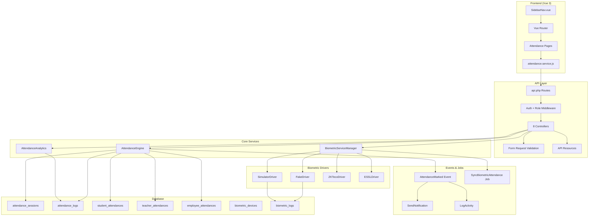
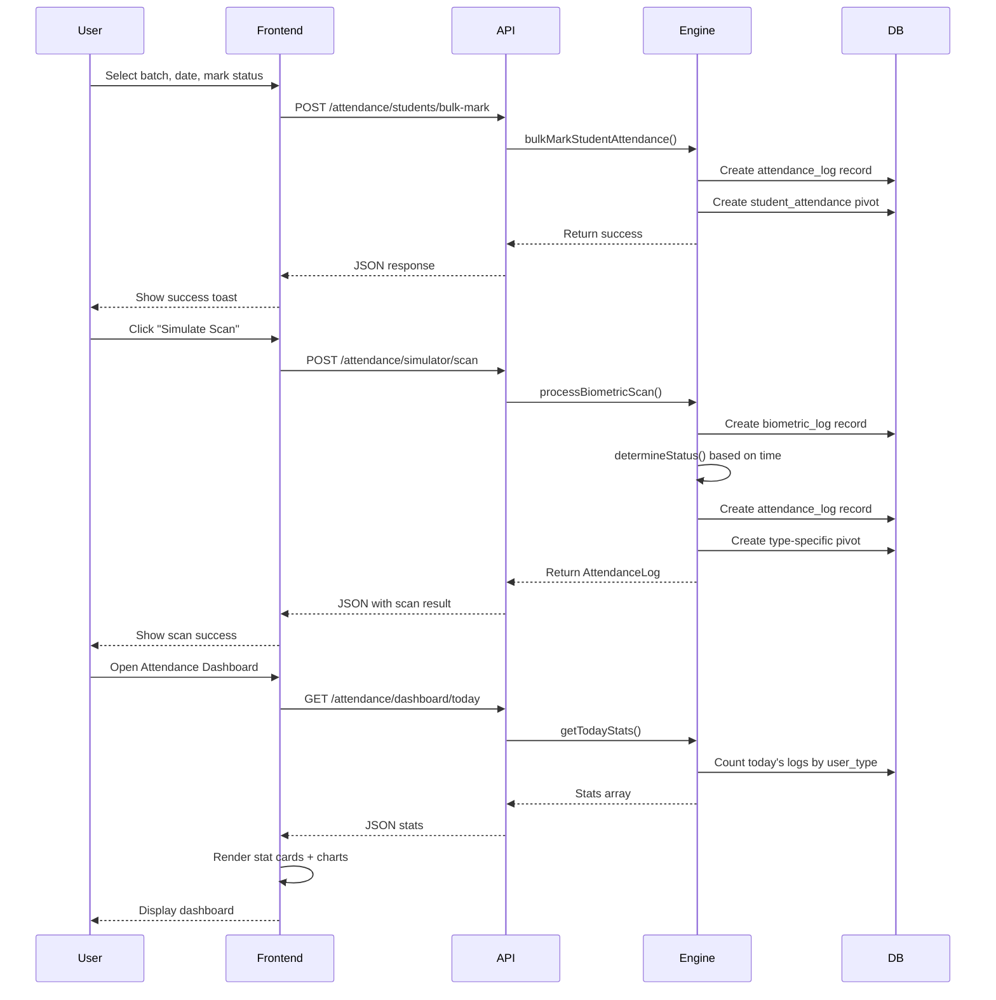

# Enterprise Hybrid Attendance Management System - 100% Completion Plan

## Overview
This document is a comprehensive audit and completion plan for the Enterprise Hybrid Attendance Management System. It compares what has been built against the original requirements and identifies all gaps that need to be filled for 100% completion.

## Current State Summary

### ✅ What's Already Built (Phase 1-7 Complete)

**Backend - Database (7 migrations):**
- `attendance_sessions` - Session management
- `attendance_logs` - Central attendance log (polymorphic user_type)
- `student_attendances` - Student-specific attendance pivot
- `teacher_attendances` - Teacher-specific attendance pivot
- `employee_attendances` - Employee-specific attendance pivot
- `biometric_devices` - Device registry
- `biometric_logs` - Raw biometric scan logs

**Backend - Models (8 models):**
- AttendanceSession, AttendanceLog, StudentAttendance, TeacherAttendance, EmployeeAttendance, BiometricDevice, BiometricLog

**Backend - Biometric Architecture (7 files):**
- BiometricServiceInterface, BaseDriver, FakeDriver, SimulatorDriver, ZKTecoDriver (stub), ESSLDriver (stub), BiometricServiceManager

**Backend - Core Services (2 files):**
- AttendanceEngine (408 lines) - Central engine with all core methods
- AttendanceAnalytics (182 lines) - Analytics with monthly trend, subject-wise, etc.

**Backend - Controllers (8 files):**
- StudentAttendanceController, TeacherAttendanceController, EmployeeAttendanceController
- BiometricDeviceController, AttendanceSessionController
- AttendanceDashboardController, AttendanceReportController, DeviceSimulatorController

**Backend - Routes:**
- 3 permission groups: read-only (api.auth), teacher/admin write, admin-only

**Frontend - Pages (7 pages):**
- StudentAttendancePage.vue, TeacherAttendancePage.vue, EmployeeAttendancePage.vue
- BiometricDevicesPage.vue, AttendanceDashboardPage.vue
- AttendanceReportsPage.vue, DeviceSimulatorPage.vue

**Frontend - Integration:**
- Router updated with 7 new routes
- SidebarNav.vue with expanded ATTENDANCE section
- attendance.service.js with all API methods

**Permissions:**
- PermissionSeeder.php with 9 new attendance permission groups
- Role-based default permissions in router and sidebar

---

## 🔴 GAPS & ISSUES IDENTIFIED (Need Fixing)

### CRITICAL ISSUES

#### 1. AttendanceAnalytics.php - SQLite-specific SQL
**File:** [`Modules/Attendance/app/Services/AttendanceAnalytics.php`](Modules/Attendance/app/Services/AttendanceAnalytics.php)
**Issue:** Uses `strftime('%Y-%m', attendance_date)` which is SQLite-specific. Will break on MySQL/PostgreSQL.
**Fix:** Create a database-agnostic helper that uses `strftime()` for SQLite, `DATE_FORMAT()` for MySQL, `TO_CHAR()` for PostgreSQL.
**Priority:** HIGH

#### 2. BiometricServiceManager not registered in ServiceProvider
**File:** [`Modules/Attendance/app/Providers/AttendanceServiceProvider.php`](Modules/Attendance/app/Providers/AttendanceServiceProvider.php)
**Issue:** The `BiometricServiceManager` is not registered as a singleton in the service provider. The `registerDefaultDrivers()` method is called in the constructor but the class is not bound to the container.
**Fix:** Register `BiometricServiceManager` as a singleton in `AttendanceServiceProvider::register()` and call `registerDefaultDrivers()`.
**Priority:** HIGH

#### 3. ZKTecoDriver and ESSLDriver are empty stubs
**Files:**
- [`Modules/Attendance/app/Services/Biometric/Drivers/ZKTecoDriver.php`](Modules/Attendance/app/Services/Biometric/Drivers/ZKTecoDriver.php)
- [`Modules/Attendance/app/Services/Biometric/Drivers/ESSLDriver.php`](Modules/Attendance/app/Services/Biometric/Drivers/ESSLDriver.php)
**Issue:** Both drivers extend BaseDriver but have no method implementations. They need proper stub implementations with meaningful error messages and connection simulation.
**Fix:** Add proper method stubs with meaningful return values and documentation.
**Priority:** HIGH

#### 4. No Form Request Validation Classes
**Issue:** All controllers use inline `$request->validate()` instead of dedicated Form Request classes. This makes validation logic scattered and hard to maintain.
**Fix:** Create Form Request classes for each controller's store/update methods.
**Priority:** MEDIUM

#### 5. No API Resource/Transformer Classes
**Issue:** Controllers return raw model data or manual `->map()` transformations. No dedicated API Resource classes for consistent response formatting.
**Fix:** Create API Resource classes for AttendanceLog, AttendanceSession, BiometricDevice, etc.
**Priority:** MEDIUM

---

### MODERATE ISSUES

#### 6. AttendanceEngine - Missing Edge Case Handling
**File:** [`Modules/Attendance/app/Services/AttendanceEngine.php`](Modules/Attendance/app/Services/AttendanceEngine.php)
**Issues:**
- `markStudentAttendance()` doesn't validate if student is enrolled in the batch
- `processBiometricScan()` doesn't handle duplicate scans within a time window
- `detectCurrentSession()` doesn't handle multiple routine matches
- `getTodayStats()` doesn't handle holidays/weekends
**Fix:** Add proper validation and edge case handling.
**Priority:** MEDIUM

#### 7. StudentAttendancePage.vue - Missing check_in/check_out
**File:** [`frontend/src/pages/dashboard/attendance/StudentAttendancePage.vue`](frontend/src/pages/dashboard/attendance/StudentAttendancePage.vue)
**Issue:** The page only marks status (present/absent/late) but doesn't capture check_in/check_out times. The backend AttendanceLog supports check_in/check_out but the frontend doesn't use them.
**Fix:** Add optional check_in/check_out time inputs to the attendance form.
**Priority:** MEDIUM

#### 8. TeacherAttendancePage.vue - Missing batch/subject filters
**File:** [`frontend/src/pages/dashboard/attendance/TeacherAttendancePage.vue`](frontend/src/pages/dashboard/attendance/TeacherAttendancePage.vue)
**Issue:** The teacher attendance page only has a date filter. It should also support batch and subject filters for context.
**Fix:** Add optional batch and subject filter dropdowns.
**Priority:** LOW

#### 9. BiometricDevicesPage.vue - Missing loading/error states
**File:** [`frontend/src/pages/dashboard/attendance/BiometricDevicesPage.vue`](frontend/src/pages/dashboard/attendance/BiometricDevicesPage.vue)
**Issue:** The page doesn't show proper loading spinners or error states when fetching/creating devices.
**Fix:** Add loading states, error handling, and success toasts.
**Priority:** LOW

#### 10. AttendanceReportsPage.vue - PDF/Excel export is stubbed
**File:** [`frontend/src/pages/dashboard/attendance/AttendanceReportsPage.vue`](frontend/src/pages/dashboard/attendance/AttendanceReportsPage.vue)
**Issue:** The export buttons show toast messages saying "implementation depends on backend" instead of actually exporting.
**Fix:** Implement client-side PDF export (using window.print or a library) and Excel export (using a library like xlsx).
**Priority:** MEDIUM

#### 11. No Attendance Session Management UI Page
**Issue:** There are API endpoints for attendance sessions (CRUD, close, cancel, detect) but no frontend page to manage them.
**Fix:** Create an AttendanceSessionPage.vue with session list, create modal, and action buttons.
**Priority:** MEDIUM

#### 12. Route meta permissions use generic 'view attendance'
**Files:**
- [`frontend/src/router/index.js`](frontend/src/router/index.js) (lines 73-80)
- [`frontend/src/components/layout/SidebarNav.vue`](frontend/src/components/layout/SidebarNav.vue) (lines 268-293)
**Issue:** All attendance routes use `permission: 'view attendance'` instead of specific permissions like `'view student attendance'`, `'view biometric devices'`, etc.
**Fix:** Update route meta and sidebar items to use specific attendance permissions.
**Priority:** MEDIUM

---

### LOW PRIORITY / ENHANCEMENTS

#### 13. No Event/Listener for Attendance Marked
**Issue:** When attendance is marked, there's no event dispatched for notifications, logging, or other side effects.
**Fix:** Create `AttendanceMarked` event and listeners for notification, activity log, etc.
**Priority:** LOW

#### 14. No Queue Job for Biometric Device Sync
**Issue:** Pulling attendance from biometric devices is done synchronously in the HTTP request. For real devices (ZKTeco/ESSL), this should be queued.
**Fix:** Create `SyncBiometricAttendance` job and dispatch it from the controller.
**Priority:** LOW

#### 15. No Database Seeder for Biometric Devices
**Issue:** There's no seeder to create initial biometric devices (FakeDriver and SimulatorDriver) for testing.
**Fix:** Create `BiometricDeviceSeeder` with sample devices.
**Priority:** LOW

#### 16. AttendanceServiceProvider - Missing bindings
**File:** [`Modules/Attendance/app/Providers/AttendanceServiceProvider.php`](Modules/Attendance/app/Providers/AttendanceServiceProvider.php)
**Issue:** The service provider doesn't bind interfaces to implementations (e.g., BiometricServiceInterface).
**Fix:** Add container bindings in the `register()` method.
**Priority:** LOW

#### 17. DeviceSimulatorPage.vue - Scan result not showing user name
**File:** [`frontend/src/pages/dashboard/attendance/DeviceSimulatorPage.vue`](frontend/src/pages/dashboard/attendance/DeviceSimulatorPage.vue)
**Issue:** The recent scans list shows `scan.user_id` instead of resolving the user name from the backend response.
**Fix:** Update the recentScans API to include user name, or resolve it on the frontend.
**Priority:** LOW

#### 18. No API Documentation
**Issue:** There's no API documentation (OpenAPI/Swagger) for the new attendance endpoints.
**Fix:** Add PHPDoc annotations or create a Postman collection.
**Priority:** LOW

---

## IMPLEMENTATION ORDER

### Phase 8A: Critical Fixes (Must Do)
1. Fix AttendanceAnalytics.php - Database-agnostic date formatting
2. Register BiometricServiceManager in AttendanceServiceProvider
3. Implement ZKTecoDriver and ESSLDriver proper stubs
4. Add BiometricDeviceSeeder for testing

### Phase 8B: Validation & Resources
5. Create Form Request validation classes
6. Create API Resource/Transformer classes
7. Add edge case handling in AttendanceEngine

### Phase 8C: Frontend Enhancements
8. Add check_in/check_out to StudentAttendancePage.vue
9. Add batch/subject filters to TeacherAttendancePage.vue
10. Fix BiometricDevicesPage.vue loading/error states
11. Implement real PDF/Excel export in AttendanceReportsPage.vue
12. Create AttendanceSessionPage.vue for session management
13. Fix route meta permissions to use specific attendance permissions

### Phase 8D: Events, Jobs & Polish
14. Create AttendanceMarked event and listeners
15. Create SyncBiometricAttendance queue job
16. Add container bindings in AttendanceServiceProvider
17. Fix DeviceSimulatorPage.vue user name resolution
18. Run final verification (migrations, build, route list)

---

## DETAILED TASK BREAKDOWN

### Task 1: Fix AttendanceAnalytics.php Database Compatibility
**Files to modify:**
- `Modules/Attendance/app/Services/AttendanceAnalytics.php`

**Changes:**
- Replace `strftime('%Y-%m', attendance_date)` with a helper method
- Create a `formatDateColumn()` helper that detects the DB driver
- Use `strftime()` for SQLite, `DATE_FORMAT()` for MySQL, `TO_CHAR()` for PostgreSQL
- Alternatively, use raw PHP date formatting after fetching data

### Task 2: Register BiometricServiceManager in ServiceProvider
**Files to modify:**
- `Modules/Attendance/app/Providers/AttendanceServiceProvider.php`

**Changes:**
- Add `use Modules\Attendance\app\Services\Biometric\BiometricServiceManager;`
- In `register()` method, bind as singleton:
  ```php
  $this->app->singleton(BiometricServiceManager::class, function ($app) {
      return new BiometricServiceManager();
  });
  ```

### Task 3: Implement ZKTecoDriver and ESSLDriver Stubs
**Files to modify:**
- `Modules/Attendance/app/Services/Biometric/Drivers/ZKTecoDriver.php`
- `Modules/Attendance/app/Services/Biometric/Drivers/ESSLDriver.php`

**Changes:**
- Add proper method implementations with meaningful error messages
- Add connection simulation logic
- Add documentation about real device requirements

### Task 4: Create BiometricDeviceSeeder
**Files to create:**
- `Modules/Attendance/database/seeders/BiometricDeviceSeeder.php`

**Content:**
- Create 2 devices: one with `fake` driver, one with `simulator` driver
- Add realistic config data

### Task 5: Create Form Request Classes
**Files to create (8 files):**
- `Modules/Attendance/app/Http/Requests/StoreAttendanceSessionRequest.php`
- `Modules/Attendance/app/Http/Requests/UpdateAttendanceSessionRequest.php`
- `Modules/Attendance/app/Http/Requests/StoreBiometricDeviceRequest.php`
- `Modules/Attendance/app/Http/Requests/UpdateBiometricDeviceRequest.php`
- `Modules/Attendance/app/Http/Requests/MarkStudentAttendanceRequest.php`
- `Modules/Attendance/app/Http/Requests/MarkTeacherAttendanceRequest.php`
- `Modules/Attendance/app/Http/Requests/MarkEmployeeAttendanceRequest.php`
- `Modules/Attendance/app/Http/Requests/SimulateScanRequest.php`

**Changes:**
- Move validation rules from controllers to Form Request classes
- Add authorization logic
- Add custom error messages

### Task 6: Create API Resource Classes
**Files to create (6 files):**
- `Modules/Attendance/app/Http/Resources/AttendanceLogResource.php`
- `Modules/Attendance/app/Http/Resources/AttendanceSessionResource.php`
- `Modules/Attendance/app/Http/Resources/BiometricDeviceResource.php`
- `Modules/Attendance/app/Http/Resources/StudentAttendanceResource.php`
- `Modules/Attendance/app/Http/Resources/TeacherAttendanceResource.php`
- `Modules/Attendance/app/Http/Resources/EmployeeAttendanceResource.php`

**Changes:**
- Define consistent response structure
- Include relationships where appropriate
- Format dates and times consistently

### Task 7: Add Edge Case Handling in AttendanceEngine
**Files to modify:**
- `Modules/Attendance/app/Services/AttendanceEngine.php`

**Changes:**
- Add enrollment validation in `markStudentAttendance()`
- Add duplicate scan detection in `processBiometricScan()`
- Handle multiple routine matches in `detectCurrentSession()`
- Add holiday/weekend check in `getTodayStats()`

### Task 8: Add check_in/check_out to StudentAttendancePage.vue
**Files to modify:**
- `frontend/src/pages/dashboard/attendance/StudentAttendancePage.vue`

**Changes:**
- Add optional time input fields for check_in and check_out
- Include time data in the save payload
- Display check_in/check_out in the table

### Task 9: Add batch/subject filters to TeacherAttendancePage.vue
**Files to modify:**
- `frontend/src/pages/dashboard/attendance/TeacherAttendancePage.vue`

**Changes:**
- Add batch dropdown filter
- Add subject dropdown filter (optional)
- Pass filters to API calls

### Task 10: Fix BiometricDevicesPage.vue States
**Files to modify:**
- `frontend/src/pages/dashboard/attendance/BiometricDevicesPage.vue`

**Changes:**
- Add loading spinner during data fetch
- Add error state display
- Add success/error toasts for CRUD operations
- Add empty state when no devices exist

### Task 11: Implement Real PDF/Excel Export
**Files to modify:**
- `frontend/src/pages/dashboard/attendance/AttendanceReportsPage.vue`

**Changes:**
- Install `xlsx` library for Excel export
- Implement `exportExcel()` to generate actual .xlsx file
- Implement `exportPdf()` using window.print() with print CSS
- Add print-optimized CSS styles

### Task 12: Create AttendanceSessionPage.vue
**Files to create:**
- `frontend/src/pages/dashboard/attendance/AttendanceSessionPage.vue`

**Content:**
- Session list with filters (batch, date, status)
- Create session modal/form
- Close/Cancel session actions
- Session details view with logs

**Files to modify:**
- `frontend/src/router/index.js` - Add route
- `frontend/src/components/layout/SidebarNav.vue` - Add menu item

### Task 13: Fix Route Meta Permissions
**Files to modify:**
- `frontend/src/router/index.js` (lines 73-80)
- `frontend/src/components/layout/SidebarNav.vue` (lines 268-293)

**Changes:**
- Update attendance route meta to use specific permissions:
  - `/attendance/dashboard` → `'view attendance dashboard'`
  - `/attendance/students` → `'view student attendance'`
  - `/attendance/teachers` → `'view teacher attendance'`
  - `/attendance/employees` → `'view employee attendance'`
  - `/attendance/devices` → `'view biometric devices'`
  - `/attendance/reports` → `'view attendance reports'`
  - `/attendance/simulator` → `'view device simulator'`

### Task 14: Create AttendanceMarked Event
**Files to create:**
- `Modules/Attendance/app/Events/AttendanceMarked.php`

**Files to create (listeners):**
- `Modules/Attendance/app/Listeners/SendAttendanceNotification.php`
- `Modules/Attendance/app/Listeners/LogAttendanceActivity.php`

**Changes:**
- Dispatch event from AttendanceEngine after marking attendance
- Add listeners for notification and activity logging

### Task 15: Create SyncBiometricAttendance Job
**Files to create:**
- `Modules/Attendance/app/Jobs/SyncBiometricAttendance.php`

**Changes:**
- Move biometric sync logic to a queueable job
- Update BiometricDeviceController to dispatch job

### Task 16: Add Container Bindings in ServiceProvider
**Files to modify:**
- `Modules/Attendance/app/Providers/AttendanceServiceProvider.php`

**Changes:**
- Bind `BiometricServiceInterface` to drivers
- Register `AttendanceEngine` as singleton
- Register `AttendanceAnalytics` as singleton

### Task 17: Fix DeviceSimulatorPage.vue User Name
**Files to modify:**
- `Modules/Attendance/app/Http/Controllers/Api/V1/DeviceSimulatorController.php`
- `frontend/src/pages/dashboard/attendance/DeviceSimulatorPage.vue`

**Changes:**
- Include user name in the recentScans API response
- Update frontend to display user name

### Task 18: Final Verification
**Commands to run:**
```bash
php artisan module:migrate Attendance
php artisan db:seed --class=Modules\\Attendance\\database\\seeders\\BiometricDeviceSeeder
npm run build
```

**Verification checklist:**
- [ ] All 7 migrations ran successfully
- [ ] BiometricDeviceSeeder created test devices
- [ ] Frontend builds without errors
- [ ] All 21 attendance chunks generated
- [ ] Route list shows all new endpoints

---

## File Change Summary

### Files to Create (17 files):
| # | File | Purpose |
|---|------|---------|
| 1 | `Modules/Attendance/app/Http/Requests/StoreAttendanceSessionRequest.php` | Validation |
| 2 | `Modules/Attendance/app/Http/Requests/UpdateAttendanceSessionRequest.php` | Validation |
| 3 | `Modules/Attendance/app/Http/Requests/StoreBiometricDeviceRequest.php` | Validation |
| 4 | `Modules/Attendance/app/Http/Requests/UpdateBiometricDeviceRequest.php` | Validation |
| 5 | `Modules/Attendance/app/Http/Requests/MarkStudentAttendanceRequest.php` | Validation |
| 6 | `Modules/Attendance/app/Http/Requests/MarkTeacherAttendanceRequest.php` | Validation |
| 7 | `Modules/Attendance/app/Http/Requests/MarkEmployeeAttendanceRequest.php` | Validation |
| 8 | `Modules/Attendance/app/Http/Requests/SimulateScanRequest.php` | Validation |
| 9 | `Modules/Attendance/app/Http/Resources/AttendanceLogResource.php` | API Resource |
| 10 | `Modules/Attendance/app/Http/Resources/AttendanceSessionResource.php` | API Resource |
| 11 | `Modules/Attendance/app/Http/Resources/BiometricDeviceResource.php` | API Resource |
| 12 | `Modules/Attendance/app/Http/Resources/StudentAttendanceResource.php` | API Resource |
| 13 | `Modules/Attendance/app/Http/Resources/TeacherAttendanceResource.php` | API Resource |
| 14 | `Modules/Attendance/app/Http/Resources/EmployeeAttendanceResource.php` | API Resource |
| 15 | `Modules/Attendance/app/Events/AttendanceMarked.php` | Event |
| 16 | `Modules/Attendance/app/Listeners/SendAttendanceNotification.php` | Listener |
| 17 | `Modules/Attendance/app/Listeners/LogAttendanceActivity.php` | Listener |
| 18 | `Modules/Attendance/app/Jobs/SyncBiometricAttendance.php` | Queue Job |
| 19 | `Modules/Attendance/database/seeders/BiometricDeviceSeeder.php` | Seeder |
| 20 | `frontend/src/pages/dashboard/attendance/AttendanceSessionPage.vue` | Frontend Page |

### Files to Modify (12 files):
| # | File | Changes |
|---|------|---------|
| 1 | `Modules/Attendance/app/Services/AttendanceAnalytics.php` | Fix SQLite-specific SQL |
| 2 | `Modules/Attendance/app/Providers/AttendanceServiceProvider.php` | Register bindings |
| 3 | `Modules/Attendance/app/Services/Biometric/Drivers/ZKTecoDriver.php` | Implement stubs |
| 4 | `Modules/Attendance/app/Services/Biometric/Drivers/ESSLDriver.php` | Implement stubs |
| 5 | `Modules/Attendance/app/Services/AttendanceEngine.php` | Add edge case handling |
| 6 | `frontend/src/pages/dashboard/attendance/StudentAttendancePage.vue` | Add check_in/check_out |
| 7 | `frontend/src/pages/dashboard/attendance/TeacherAttendancePage.vue` | Add batch/subject filters |
| 8 | `frontend/src/pages/dashboard/attendance/BiometricDevicesPage.vue` | Fix loading/error states |
| 9 | `frontend/src/pages/dashboard/attendance/AttendanceReportsPage.vue` | Implement real export |
| 10 | `frontend/src/router/index.js` | Fix permissions, add session route |
| 11 | `frontend/src/components/layout/SidebarNav.vue` | Fix permissions, add session menu |
| 12 | `Modules/Attendance/app/Http/Controllers/Api/V1/DeviceSimulatorController.php` | Include user name |

---

## Architecture Diagram



---

## Data Flow Diagram



---

## Permission Matrix

| Permission | super-admin | admin | teacher | student | employee | guardian |
|------------|:-----------:|:-----:|:-------:|:-------:|:--------:|:--------:|
| view attendance | ✅ | ✅ | ✅ | ✅ | ❌ | ✅ |
| view student attendance | ✅ | ✅ | ✅ | ❌ | ❌ | ❌ |
| create student attendance | ✅ | ✅ | ✅ | ❌ | ❌ | ❌ |
| view teacher attendance | ✅ | ✅ | ✅ | ❌ | ❌ | ❌ |
| create teacher attendance | ✅ | ✅ | ✅ | ❌ | ❌ | ❌ |
| view employee attendance | ✅ | ✅ | ❌ | ❌ | ✅ | ❌ |
| create employee attendance | ✅ | ✅ | ❌ | ❌ | ❌ | ❌ |
| view attendance sessions | ✅ | ✅ | ❌ | ❌ | ❌ | ❌ |
| create attendance sessions | ✅ | ✅ | ✅ | ❌ | ❌ | ❌ |
| view biometric devices | ✅ | ✅ | ❌ | ❌ | ❌ | ❌ |
| create biometric devices | ✅ | ✅ | ❌ | ❌ | ❌ | ❌ |
| view attendance reports | ✅ | ✅ | ✅ | ❌ | ❌ | ❌ |
| generate attendance reports | ✅ | ✅ | ❌ | ❌ | ❌ | ❌ |
| view attendance dashboard | ✅ | ✅ | ❌ | ❌ | ❌ | ❌ |
| view device simulator | ✅ | ✅ | ❌ | ❌ | ❌ | ❌ |
| use device simulator | ✅ | ✅ | ❌ | ❌ | ❌ | ❌ |

---

## Route Map

### Read-Only Routes (api.auth)
```
GET  /api/v1/attendance/dashboard/today
GET  /api/v1/attendance/dashboard/realtime
GET  /api/v1/attendance/dashboard/monthly-trend
GET  /api/v1/attendance/dashboard/low-attendance-alerts
GET  /api/v1/attendance/dashboard/consecutive-absent-alerts
GET  /api/v1/attendance/dashboard/device-status
GET  /api/v1/attendance/students
GET  /api/v1/attendance/students/summary
GET  /api/v1/attendance/students/subject-wise
GET  /api/v1/attendance/students/batch-report
GET  /api/v1/attendance/teachers
GET  /api/v1/attendance/teachers/summary
GET  /api/v1/attendance/employees
GET  /api/v1/attendance/employees/summary
GET  /api/v1/attendance/sessions
GET  /api/v1/attendance/sessions/{id}
GET  /api/v1/attendance/sessions/detect/current
GET  /api/v1/attendance/devices
GET  /api/v1/attendance/devices/{id}
GET  /api/v1/attendance/devices/drivers/list
GET  /api/v1/attendance/reports/daily
GET  /api/v1/attendance/reports/monthly
GET  /api/v1/attendance/reports/batch
GET  /api/v1/attendance/reports/subject
GET  /api/v1/attendance/reports/teacher
GET  /api/v1/attendance/reports/employee
GET  /api/v1/attendance/simulator/devices
GET  /api/v1/attendance/simulator/recent-scans
```

### Write Routes (api.auth + role:super-admin,admin,teacher)
```
POST /api/v1/attendance/students/mark
POST /api/v1/attendance/students/bulk-mark
POST /api/v1/attendance/teachers/mark
POST /api/v1/attendance/teachers/bulk-mark
POST /api/v1/attendance/employees/mark
POST /api/v1/attendance/employees/bulk-mark
POST /api/v1/attendance/sessions
PUT  /api/v1/attendance/sessions/{id}
POST /api/v1/attendance/sessions/{id}/close
POST /api/v1/attendance/sessions/{id}/cancel
```

### Admin Routes (api.auth + role:super-admin,admin)
```
POST /api/v1/attendance/devices
PUT  /api/v1/attendance/devices/{id}
DELETE /api/v1/attendance/devices/{id}
POST /api/v1/attendance/devices/{id}/test-connection
POST /api/v1/attendance/devices/{id}/pull-attendance
POST /api/v1/attendance/simulator/scan
POST /api/v1/attendance/simulator/generate-random
```
