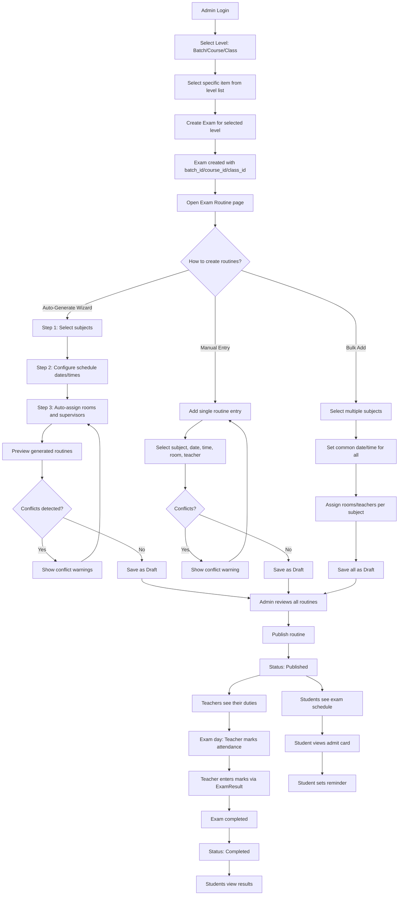
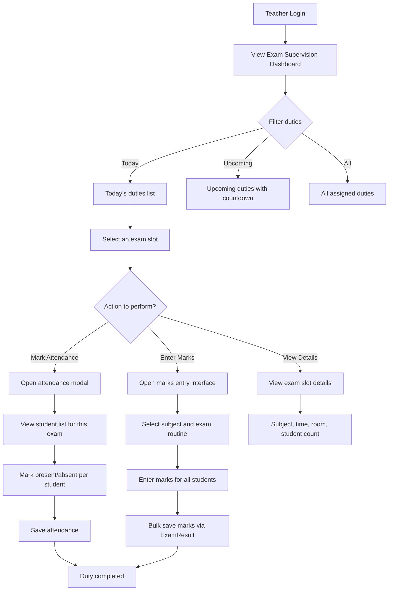
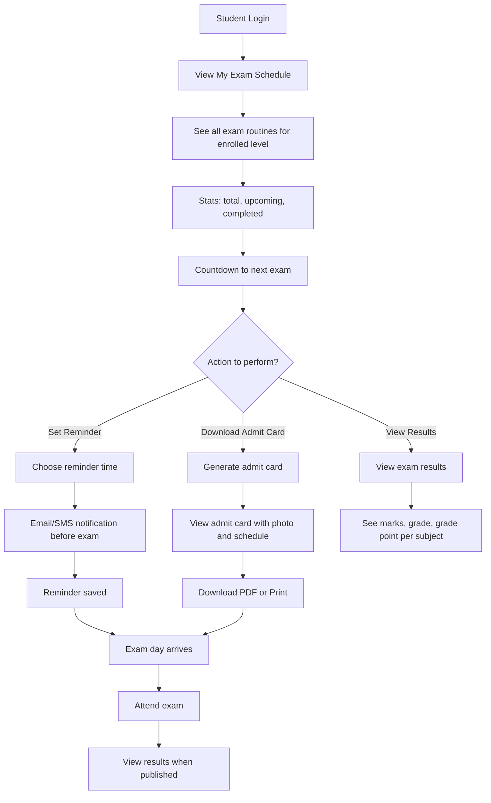
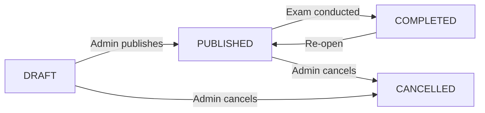
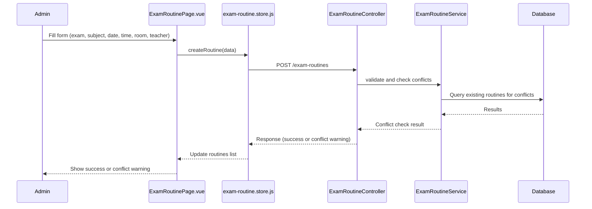
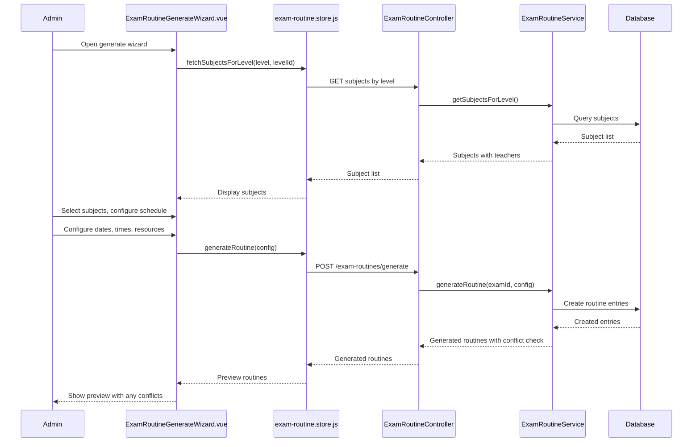
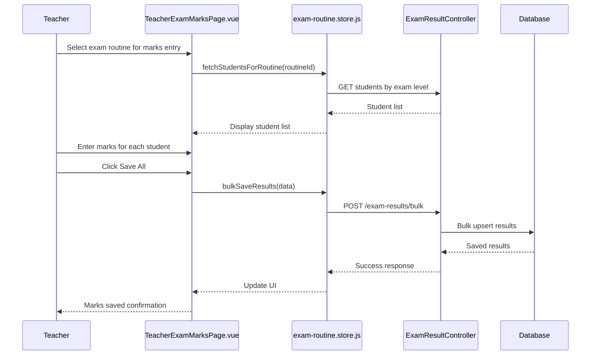
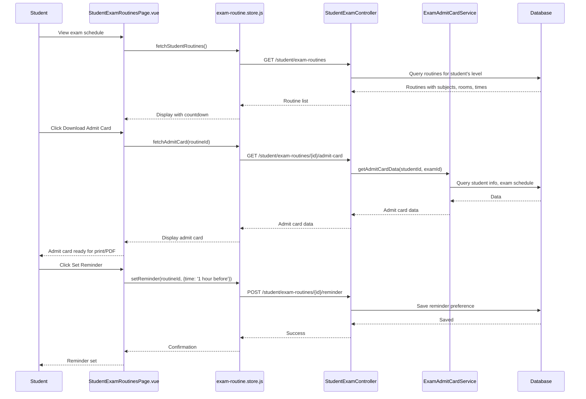

# Exam Routine System — Modern & Advanced Plan

## 1. Overview

The Exam Routine System will be a **full-featured, multi-role** module built on top of the existing [`Modules/Exam`](Modules/Exam) module. It will follow the same architectural patterns as the Class Routine system (which uses [`Modules/Academic`](Modules/Academic) as a reference) but with **exam-specific enhancements**: date-based scheduling (not weekly), room/supervisor assignment, conflict detection, status workflow (draft → published → completed), PDF/print export, and role-based views for admin, super admin, teacher, and student.

**Key difference from class routines**: Exams can be created at **3 levels** — **Batch**, **Course**, or **Class** — just like the class routine system. The [`Exam`](Modules/Exam/app/Models/Exam.php) model and [`ExamRoutine`](Modules/Exam/app/Models/ExamRoutine.php) model both need `batch_id`, `course_id`, and `class_id` to support this.

---

## 2. Current State Analysis

### What Already Exists

| Component | File | Status |
|-----------|------|--------|
| **Exam Model** | [`Modules/Exam/app/Models/Exam.php`](Modules/Exam/app/Models/Exam.php) | Basic CRUD, linked to `exam_types`, `classes`, `sections` — **missing** `batch_id`, `course_id` for multi-level support |
| **ExamRoutine Model** | [`Modules/Exam/app/Models/ExamRoutine.php`](Modules/Exam/app/Models/ExamRoutine.php) | Basic CRUD, linked to `exam`, `subject` — **missing** `batch_id`, `course_id`, `room_id`, `teacher_id`, `class_id`, `group_id`, `status` |
| **ExamResult Model** | [`Modules/Exam/app/Models/ExamResult.php`](Modules/Exam/app/Models/ExamResult.php) | Has marks, grades, bulk store — **usable but needs enhancement** for teacher portal |
| **ExamRoutineController** | [`Modules/Exam/app/Http/Controllers/Api/V1/ExamRoutineController.php`](Modules/Exam/app/Http/Controllers/Api/V1/ExamRoutineController.php) | Basic CRUD — **missing** bulk create, publish, conflict detection, PDF export |
| **ExamResultController** | [`Modules/Exam/app/Http/Controllers/Api/V1/ExamResultController.php`](Modules/Exam/app/Http/Controllers/Api/V1/ExamResultController.php) | Has CRUD + bulkStore — **usable** |
| **Exam API Routes** | [`Modules/Exam/routes/api.php`](Modules/Exam/routes/api.php) | Basic CRUD routes — **missing** teacher/student-specific endpoints |
| **Frontend Service** | [`frontend/src/services/exam.service.js`](frontend/src/services/exam.service.js) | Basic CRUD for exams, types, routines, results |
| **Admin ExamRoutinePage** | [`frontend/src/pages/dashboard/exams/ExamRoutinePage.vue`](frontend/src/pages/dashboard/exams/ExamRoutinePage.vue) | Basic table with modal CRUD — **basic UI, no grid view, no PDF, no stats** |
| **Student ExamRoutinesPage** | [`frontend/src/pages/student/StudentExamRoutinesPage.vue`](frontend/src/pages/student/StudentExamRoutinesPage.vue) | Basic PrimeVue DataTable — **basic, no styling, no filters** |
| **Teacher Exam Routine** | ❌ Missing | No teacher portal exam routine page exists |
| **Exam DB Schema** | [`Modules/Exam/database/migrations/2026_05_01_090000_create_exams_table.php`](Modules/Exam/database/migrations/2026_05_01_090000_create_exams_table.php) | `exams` table has `class_id`, `section_id` but **missing** `batch_id`, `course_id`. `exam_routines` table has `exam_id`, `subject_id`, `exam_date`, `start_time`, `end_time`, `total_marks`, `pass_marks` — **missing** `batch_id`, `course_id`, `room_id`, `teacher_id`, `class_id`, `group_id`, `status` |

### Key Gaps

1. **Exam model** only supports `class` level — needs `batch_id` and `course_id` for multi-level support (just like [`ClassRoutine`](Modules/Academic/app/Models/ClassRoutine.php) has `batch_id`, `course_id`, `class_id`)
2. **ExamRoutine model** lacks `batch_id`, `course_id`, `room_id`, `teacher_id` (supervisor), `group_id`, `status` fields
3. **No bulk create** for exam routines (adding multiple subjects at once)
4. **No conflict detection** (teacher/room double-booking on same date/time)
5. **No status workflow** (draft → published → completed)
6. **No PDF/print export** for exam routines
7. **No teacher portal** exam routine view (duties, attendance, marks entry)
8. **Student page** uses PrimeVue (inconsistent with rest of app styling)
9. **No stats/dashboard** cards for exam routines
10. **No date-based grid view** (calendar-style layout)
11. **No auto-generate wizard** for creating routines from subjects
12. **No admit card** generation for students
13. **No countdown/reminder** system for upcoming exams
14. **No monthly calendar view** for admin overview

---

## 3. Database Schema Changes

The exam system needs to support **3 levels** just like the class routine system:
- **Batch-level exam**: e.g., "HSC 2026 Batch Final Exam" — all students in a batch
- **Course-level exam**: e.g., "Science Course Midterm" — all students in a course
- **Class-level exam**: e.g., "Class 10 Annual Exam" — all students in a class

### Migration 1: Add `batch_id` and `course_id` to `exams` Table

```php
Schema::table('exams', function (Blueprint $table) {
    $table->foreignUuid('batch_id')->nullable()->constrained('batches')->cascadeOnDelete();
    $table->foreignUuid('course_id')->nullable()->constrained('courses')->cascadeOnDelete();
    // class_id already exists
});
```

### Migration 2: Enhance `exam_routines` Table

```php
Schema::table('exam_routines', function (Blueprint $table) {
    $table->foreignUuid('batch_id')->nullable()->constrained('batches')->cascadeOnDelete();
    $table->foreignUuid('course_id')->nullable()->constrained('courses')->cascadeOnDelete();
    $table->foreignUuid('class_id')->nullable()->constrained('classes')->cascadeOnDelete();
    $table->foreignUuid('group_id')->nullable()->constrained('academic_groups')->nullOnDelete();
    $table->foreignUuid('room_id')->nullable()->constrained('rooms')->nullOnDelete();
    $table->foreignUuid('teacher_id')->nullable()->constrained('teachers')->nullOnDelete();
    $table->enum('status', ['draft', 'published', 'completed', 'cancelled'])->default('draft');
    $table->foreignUuid('created_by')->nullable()->constrained('users');
    $table->softDeletes();
});
```

### Updated `Exam` Model Fillable Fields

```php
protected $fillable = [
    'academic_session_id', 'exam_type_id',
    'batch_id', 'course_id', 'class_id', 'section_id',
    'name', 'start_date', 'end_date', 'description', 'status'
];
```

### Updated `ExamRoutine` Model Fillable Fields

```php
protected $fillable = [
    'exam_id', 'subject_id',
    'batch_id', 'course_id', 'class_id', 'group_id',
    'exam_date', 'start_time', 'end_time',
    'room_id', 'teacher_id',
    'total_marks', 'pass_marks',
    'status', 'created_by',
];
```

---

## 4. Backend Architecture

### 4.1 New/Updated Files

```
Modules/Exam/
├── app/
│   ├── Http/
│   │   ├── Controllers/Api/V1/
│   │   │   ├── ExamController.php                ← ENHANCE: add batch/course/class support
│   │   │   ├── ExamRoutineController.php         ← ENHANCE: add bulk, publish, conflicts, export, by-level
│   │   │   ├── ExamResultController.php          ← ENHANCE: add teacher marks entry endpoint
│   │   │   ├── TeacherExamRoutineController.php  ← NEW: teacher-specific endpoints
│   │   │   └── StudentExamController.php         ← NEW: student-specific endpoints (admit card, countdown)
│   │   ├── Requests/
│   │   │   ├── StoreExamRoutineRequest.php       ← NEW: validation request
│   │   │   ├── BulkStoreExamRoutineRequest.php   ← NEW: bulk validation
│   │   │   └── GenerateRoutineRequest.php        ← NEW: auto-generate validation
│   │   └── Resources/
│   │       └── ExamRoutineResource.php           ← NEW: API resource with relationships
│   ├── Models/
│   │   ├── Exam.php                              ← ENHANCE: add batch/course relationships
│   │   └── ExamRoutine.php                       ← ENHANCE: add new fields, relationships, scopes
│   ├── Repositories/
│   │   └── ExamRoutineRepository.php             ← NEW: query logic, conflict detection
│   └── Services/
│       ├── ExamRoutineService.php                ← NEW: business logic, PDF generation
│       └── ExamAdmitCardService.php              ← NEW: admit card generation
├── database/
│   └── migrations/
│       ├── 2026_05_24_000001_add_levels_to_exams.php          ← NEW
│       └── 2026_05_24_000002_enhance_exam_routines.php        ← NEW
└── routes/
    └── api.php                                   ← ENHANCE: add new routes
```

### 4.2 API Routes

```php
// Read-only (all authenticated users)
Route::middleware(['api.auth'])->prefix('v1')->group(function () {
    Route::get('exams', [ExamController::class, 'index']);
    Route::get('exams/{id}', [ExamController::class, 'show']);
    Route::get('exams/by-batch/{batchId}', [ExamController::class, 'byBatch']);
    Route::get('exams/by-course/{courseId}', [ExamController::class, 'byCourse']);
    Route::get('exams/by-class/{classId}', [ExamController::class, 'byClass']);

    Route::get('exam-routines', [ExamRoutineController::class, 'index']);
    Route::get('exam-routines/{id}', [ExamRoutineController::class, 'show']);
    Route::get('exam-routines/by-exam/{examId}', [ExamRoutineController::class, 'byExam']);
    Route::get('exam-routines/by-batch/{batchId}', [ExamRoutineController::class, 'byBatch']);
    Route::get('exam-routines/by-course/{courseId}', [ExamRoutineController::class, 'byCourse']);
    Route::get('exam-routines/by-class/{classId}', [ExamRoutineController::class, 'byClass']);
    Route::get('exam-routines/export/{examId}', [ExamRoutineController::class, 'export']);
    Route::get('exam-routines/calendar', [ExamRoutineController::class, 'calendar']); // Monthly calendar view

    Route::get('exam-results', [ExamResultController::class, 'index']);
    Route::get('exam-results/{id}', [ExamResultController::class, 'show']);
});

// Admin write routes
Route::middleware(['api.auth', 'role:super-admin,admin'])->prefix('v1')->group(function () {
    Route::post('exams', [ExamController::class, 'store']);
    Route::put('exams/{id}', [ExamController::class, 'update']);
    Route::delete('exams/{id}', [ExamController::class, 'destroy']);
    Route::post('exams/{id}/publish', [ExamController::class, 'publish']);

    Route::post('exam-routines', [ExamRoutineController::class, 'store']);
    Route::post('exam-routines/bulk', [ExamRoutineController::class, 'bulkStore']);
    Route::post('exam-routines/generate', [ExamRoutineController::class, 'generate']); // Auto-generate wizard
    Route::put('exam-routines/{id}', [ExamRoutineController::class, 'update']);
    Route::delete('exam-routines/{id}', [ExamRoutineController::class, 'destroy']);
    Route::post('exam-routines/publish', [ExamRoutineController::class, 'publish']);
    Route::post('exam-routines/conflicts', [ExamRoutineController::class, 'checkConflicts']);
});

// Teacher-specific
Route::middleware(['api.auth', 'role:teacher'])->prefix('v1/teacher')->group(function () {
    Route::get('exam-routines', [TeacherExamRoutineController::class, 'index']); // My supervision duties
    Route::get('exam-routines/today', [TeacherExamRoutineController::class, 'today']); // Today's duties
    Route::get('exam-routines/upcoming', [TeacherExamRoutineController::class, 'upcoming']); // Upcoming duties
    Route::post('exam-routines/{id}/attendance', [TeacherExamRoutineController::class, 'markAttendance']); // Student attendance
    Route::post('exam-results/bulk', [ExamResultController::class, 'bulkStore']); // Marks entry
});

// Student-specific
Route::middleware(['api.auth', 'role:student'])->prefix('v1/student')->group(function () {
    Route::get('exam-routines', [StudentExamController::class, 'routines']); // My exam schedule
    Route::get('exam-routines/upcoming', [StudentExamController::class, 'upcoming']); // Next exam countdown
    Route::get('exam-routines/{id}/admit-card', [StudentExamController::class, 'admitCard']); // Admit card
    Route::post('exam-routines/{id}/reminder', [StudentExamController::class, 'setReminder']); // Set reminder
    Route::get('exam-results', [StudentExamController::class, 'results']); // My results
});
```

### 4.3 Key Backend Features

#### ExamRoutineService

- **`generateRoutine(examId, data)`** — Auto-generate routine slots based on subjects assigned to the exam's level (batch/course/class). Uses the same level-resolution logic as [`ClassRoutineService::generate()`](Modules/Academic/app/Services/ClassRoutineService.php:42)
- **`checkConflicts(routines)`** — Detect teacher/room double-booking on same date/time
- **`publish(examId)`** — Bulk-publish all draft routines for an exam
- **`exportPdf(examId)`** — Generate PDF of exam routine
- **`getByTeacher(teacherId)`** — Get exam routines where teacher is supervisor
- **`getByStudent(studentId)`** — Get exam routines for student's enrolled batch/course/class
- **`getCalendarData(month, year, level, levelId)`** — Monthly calendar view data

#### ExamRoutineRepository

- **`getByExam(examId, filters)`** — Get all routines for an exam with eager-loaded relations
- **`getByLevel(level, levelId)`** — Get routines by batch/course/class level (same pattern as [`ClassRoutineRepository::getWeeklyGrid()`](Modules/Academic/app/Repositories/ClassRoutineRepository.php:110))
- **`findConflicts(date, startTime, endTime, roomId, teacherId, excludeId)`** — Find overlapping schedules
- **`bulkCreate(routines)`** — Insert multiple routine entries in a transaction
- **`getSubjectsForLevel(level, levelId)`** — Resolve subjects based on exam level (batch→course subjects, course→course subjects, class→class_teacher pivot)

#### ExamAdmitCardService

- **`generate(studentId, examId)`** — Generate admit card with student info, exam schedule, photo
- **`generateBulk(examId)`** — Generate admit cards for all students in an exam
- **`getAdmitCardData(studentId, examId)`** — Prepare data for admit card view/print

#### TeacherExamRoutineController

- **`index()`** — List all exam supervision duties for the authenticated teacher
- **`today()`** — Show only today's exam duties
- **`upcoming()`** — Show upcoming exam duties with countdown
- **`markAttendance(id)`** — Mark student attendance for an exam slot

#### StudentExamController

- **`routines()`** — Get exam schedule for the authenticated student's enrolled level
- **`upcoming()`** — Get next upcoming exam with countdown data
- **`admitCard(id)`** — Generate/view admit card for a specific exam routine
- **`setReminder(id)`** — Save a reminder preference for an exam
- **`results()`** — Get exam results for the student

---

## 5. Frontend Architecture

### 5.1 New/Updated Files

```
frontend/src/
├── components/exam-routine/
│   ├── ExamRoutineGrid.vue          ← NEW: Calendar-style date grid view
│   ├── ExamRoutineCard.vue          ← NEW: Individual exam day card
│   ├── ExamRoutineFormModal.vue     ← NEW: Enhanced create/edit modal
│   ├── ExamRoutineBulkModal.vue     ← NEW: Bulk add subjects modal
│   ├── ExamRoutineGenerateWizard.vue ← NEW: Auto-generate wizard (step-by-step)
│   ├── ExamRoutineStats.vue         ← NEW: Stats cards component
│   ├── ExamRoutineCalendar.vue      ← NEW: Monthly calendar view
│   ├── ExamAdmitCard.vue            ← NEW: Admit card view/print component
│   └── ExamCountdown.vue            ← NEW: Countdown timer component
├── pages/dashboard/exams/
│   ├── ExamRoutinePage.vue          ← REWRITE: Full-featured management page with level selector
│   ├── ExamListPage.vue             ← ENHANCE: Add "View Routine" action
│   └── ExamTypeListPage.vue         ← Keep as-is
├── pages/dashboard/teachers/
│   ├── TeacherExamRoutinePage.vue   ← NEW: Teacher exam routine view (duties)
│   └── TeacherExamMarksPage.vue     ← NEW: Teacher marks entry page
├── pages/student/
│   ├── StudentExamRoutinesPage.vue  ← REWRITE: Modern UI with countdown, admit card
│   └── StudentExamResultsPage.vue   ← NEW: Student results view
├── stores/
│   └── exam-routine.store.js        ← NEW: Pinia store
└── services/
    └── exam.service.js              ← ENHANCE: Add new API methods
```

### 5.2 Pinia Store: `exam-routine.store.js`

```javascript
// State
const routines = ref([])
const loading = ref(false)
const error = ref(null)
const selectedLevel = ref('class')   // 'batch' | 'course' | 'class'
const selectedLevelId = ref(null)
const selectedExam = ref(null)
const viewMode = ref('grid')         // 'grid' | 'table' | 'calendar'
const calendarMonth = ref(new Date().getMonth())
const calendarYear = ref(new Date().getFullYear())
const teacherDuties = ref([])
const studentRoutines = ref([])
const upcomingExam = ref(null)
const admitCard = ref(null)

// Computed
const groupedByDate = computed(() => { /* group routines by exam_date */ })
const examStats = computed(() => { /* total, published, draft, subjects count */ })
const conflicts = computed(() => { /* detect overlapping entries */ })
const nextExamCountdown = computed(() => { /* days/hours until next exam */ })

// Actions
fetchRoutines(examId, params)
fetchByLevel(level, levelId)
fetchCalendarData(month, year, level, levelId)
createRoutine(data)
updateRoutine(id, data)
deleteRoutine(id)
bulkCreate(data)
generateRoutine(data)           // Auto-generate wizard
publishRoutine(examId)
checkConflicts(data)
exportPdf(examId)
fetchTeacherDuties(params)
fetchTeacherTodayDuties()
markAttendance(routineId, data)
fetchStudentRoutines()
fetchUpcomingExam()
fetchAdmitCard(routineId)
setReminder(routineId, data)
fetchStudentResults()
```

### 5.3 Admin Page: `ExamRoutinePage.vue` (Rewrite)

The admin page will have a **level selector** at the top (just like [`RoutineManagementPage.vue`](frontend/src/pages/dashboard/academic/RoutineManagementPage.vue)) to choose between Batch/Course/Class, then show exams for that level.

**Layout:**

```
┌─────────────────────────────────────────────────────────────┐
│  📅 Exam Routines                        [Refresh] [+ Add]  │
│  [Level: Batch ▼] [Batch: HSC 2026 ▼]  [Exam ▼]            │
│  [Status ▼]                    [Publish] [PDF] [Calendar ▼] │
├─────────────────────────────────────────────────────────────┤
│  ┌──────┐ ┌──────┐ ┌──────┐ ┌──────┐ ┌──────┐ ┌──────┐     │
│  │ Total │ │Subjects│ │ Rooms │ │Teachers│ │Draft │ │Pub'd │
│  │  24   │ │   8   │ │   6   │ │   12  │ │  5   │ │  19  │ │
│  └──────┘ └──────┘ └──────┘ └──────┘ └──────┘ └──────┘     │
├─────────────────────────────────────────────────────────────┤
│  [Grid View] [Table View] [Calendar View]                   │
├─────────────────────────────────────────────────────────────┤
│  ┌──────────────────────────────────────────────────────┐   │
│  │  May 24, 2026 (Sunday)                               │   │
│  │  ┌──────────┐ ┌──────────┐ ┌──────────┐             │   │
│  │  │ Physics   │ │ Chemistry│ │ Math     │             │   │
│  │  │ 9:00-11:00│ │ 11:30-1:30│ │ 2:00-4:00│             │   │
│  │  │ Room 201  │ │ Room 205 │ │ Room 203 │             │   │
│  │  │ Mr. Rahman│ │ Mrs. Sultana│ │ Mr. Hasan│             │   │
│  │  │ 100 marks │ │ 100 marks│ │ 100 marks│             │   │
│  │  └──────────┘ └──────────┘ └──────────┘             │   │
│  ├──────────────────────────────────────────────────────┤   │
│  │  May 25, 2026 (Monday)                               │   │
│  │  ┌──────────┐ ┌──────────┐                           │   │
│  │  │ Biology   │ │ English   │                           │   │
│  │  │ 9:00-11:00│ │ 11:30-1:30│                           │   │
│  │  │ Room 201  │ │ Room 205 │                           │   │
│  │  │ Mrs. Akter│ │ Mr. Kamal│                           │   │
│  │  └──────────┘ └──────────┘                           │   │
│  └──────────────────────────────────────────────────────┘   │
└─────────────────────────────────────────────────────────────┘
```

**Features:**
- **Level selector**: Batch/Course/Class tabs or dropdown (same as class routine page)
- **Filter bar**: Level-specific item dropdown, Exam dropdown, Status dropdown
- **6 Stats cards**: Total Entries, Unique Subjects, Rooms Used, Supervisors Assigned, Draft, Published
- **View toggle**: Grid (calendar-style by date) / Table (sortable columns) / Calendar (monthly)
- **Grid view**: Date cards with subject cards inside, color-coded by subject
- **Table view**: Sortable columns with inline status badges
- **Calendar view**: Monthly calendar with exam days highlighted
- **Actions per entry**: Edit, Delete, Mark Completed
- **Bulk actions**: Publish All, Export PDF, Print View, Generate All
- **Conflict warnings**: Red highlight on overlapping entries
- **Auto-generate wizard**: Step-by-step modal to auto-create routines from subjects

### 5.4 Auto-Generate Wizard: `ExamRoutineGenerateWizard.vue` (New)

A step-by-step wizard modal:

```
┌─────────────────────────────────────────────────────┐
│  ✨ Auto-Generate Exam Routine                       │
│  Step 1 of 3: Configure                              │
├─────────────────────────────────────────────────────┤
│  Exam: [Midterm Exam 2026 ▼]                        │
│  Level: Batch - HSC 2026                            │
│  Subjects found: 8                                  │
│                                                      │
│  □ Select All Subjects                              │
│  ☑ Physics     ☑ Chemistry    ☑ Math               │
│  ☑ Biology     ☑ English      ☑ Bangla             │
│  ☑ ICT         ☑ Religion                           │
├─────────────────────────────────────────────────────┤
│  Step 2 of 3: Schedule                              │
├─────────────────────────────────────────────────────┤
│  Start Date: [2026-05-24]                           │
│  End Date:   [2026-06-10]                           │
│  Shift: [Morning ▼] [Day ▼] [Evening ▼]            │
│  Slot Duration: [2 hours]                           │
│  Gap Between Slots: [30 min]                        │
│  Exclude: [Friday ▼] [Saturday ▼]                   │
├─────────────────────────────────────────────────────┤
│  Step 3 of 3: Assign Resources                      │
├─────────────────────────────────────────────────────┤
│  Auto-assign rooms & supervisors? [Yes] [No]        │
│  If Yes:                                             │
│  - Rooms will be assigned round-robin               │
│  - Teachers will be assigned by subject specialty   │
│  - Conflicts will be auto-resolved                  │
├─────────────────────────────────────────────────────┤
│              [Cancel]  [< Back]  [Generate]         │
└─────────────────────────────────────────────────────┘
```

### 5.5 Teacher Page: `TeacherExamRoutinePage.vue` (New)

**Layout:**

```
┌─────────────────────────────────────────────────────────────┐
│  📋 My Exam Supervision                    [Today] [Week]   │
├─────────────────────────────────────────────────────────────┤
│  ┌──────┐ ┌──────┐ ┌──────┐ ┌──────┐ ┌──────┐             │
│  │ Total │ │Today  │ │Upcoming│ │ This Wk│ │Completed│     │
│  │  12   │ │   2   │ │   3   │ │    5  │ │    4    │       │
│  └──────┘ └──────┘ └──────┘ └──────┘ └──────┘              │
├─────────────────────────────────────────────────────────────┤
│  🔴 Today's Duties (May 24, 2026)                          │
│  ┌──────┬──────────┬────────┬────────┬────────┬──────────┐ │
│  │ Time │ Subject  │ Exam   │ Room   │ Students│ Actions  │ │
│  ├──────┼──────────┼────────┼────────┼────────┼──────────┤ │
│  │9-11AM│ Physics  │Midterm │Rm 201  │ 45     │[Mark Att]│ │
│  │11-1PM│ Chemistry│Midterm │Rm 205  │ 42     │[Enter Mk]│ │
│  └──────┴──────────┴────────┴────────┴────────┴──────────┘ │
├─────────────────────────────────────────────────────────────┤
│  📅 Upcoming Duties                                         │
│  ┌──────┬──────────┬────────┬────────┬────────┬──────────┐ │
│  │ Date │ Subject  │ Exam   │ Room   │ Time   │ Countdown│ │
│  ├──────┼──────────┼────────┼────────┼────────┼──────────┤ │
│  │May 26│ Biology  │Midterm │Rm 201  │9-11AM  │ 2 days   │ │
│  │May 28│ English  │Midterm │Rm 205  │11-1PM  │ 4 days   │ │
│  └──────┴──────────┴────────┴────────┴────────┴──────────┘ │
└─────────────────────────────────────────────────────────────┘
```

**Teacher Actions:**
- **Mark Attendance**: Opens a modal to mark student attendance for the exam slot
- **Enter Marks**: Opens marks entry interface (reuses existing [`ExamResultController::bulkStore()`](Modules/Exam/app/Http/Controllers/Api/V1/ExamResultController.php:49))
- **Download Question Paper**: If question papers are uploaded
- **View Student List**: See enrolled students for that exam

### 5.6 Student Page: `StudentExamRoutinesPage.vue` (Rewrite)

**Layout:**

```
┌─────────────────────────────────────────────────────────────┐
│  📅 My Exam Routine                                         │
├─────────────────────────────────────────────────────────────┤
│  ┌──────────┐ ┌──────────┐ ┌──────────┐ ┌──────────┐       │
│  │ Total    │ │ Upcoming │ │Completed │ │ Next Exam│       │
│  │   8      │ │   3      │ │   5      │ │ 2 days   │       │
│  └──────────┘ └──────────┘ └──────────┘ └──────────┘       │
├─────────────────────────────────────────────────────────────┤
│  ⏰ Next Upcoming: Physics - May 26, 2026                   │
│  ┌──────────────────────────────────────────────────────┐   │
│  │             02 : 14 : 32 : 18                         │   │
│  │           Days Hours Min  Sec                         │   │
│  │          [Set Reminder] [Download Admit Card]         │   │
│  └──────────────────────────────────────────────────────┘   │
├─────────────────────────────────────────────────────────────┤
│  ┌──────────────────────────────────────────────────────┐   │
│  │  May 24 (Sun)                                        │   │
│  │  ┌──────────┐ ┌──────────┐ ┌──────────┐             │   │
│  │  │ Physics   │ │ Chemistry│ │ Math     │             │   │
│  │  │ 9:00-11:00│ │ 11:30-1:30│ │ 2:00-4:00│             │   │
│  │  │ Room 201  │ │ Room 205 │ │ Room 203 │             │   │
│  │  │ 100 marks │ │ 100 marks│ │ 100 marks│             │   │
│  │  └──────────┘ └──────────┘ └──────────┘             │   │
│  ├──────────────────────────────────────────────────────┤   │
│  │  May 26 (Tue)                                        │   │
│  │  ┌──────────┐ ┌──────────┐                           │   │
│  │  │ Biology   │ │ English   │                           │   │
│  │  │ 9:00-11:00│ │ 11:30-1:30│                           │   │
│  │  │ Room 201  │ │ Room 205 │                           │   │
│  │  └──────────┘ └──────────┘                           │   │
│  └──────────────────────────────────────────────────────┘   │
└─────────────────────────────────────────────────────────────┘
```

**Student Features:**
- **Countdown timer**: Live countdown to next exam (days/hours/min/sec)
- **Set Reminder**: Button to set email/SMS reminder before exam
- **Download Admit Card**: Generate and download admit card as PDF
- **Date-grouped grid**: Same card-based style as class routine pages
- **Subject color coding**: Same palette as class routines
- **Marks display**: Total/pass marks shown on each card
- **Print-friendly view**: Print button with optimized styles

### 5.7 Admit Card: `ExamAdmitCard.vue` (New)

```
┌─────────────────────────────────────────────────────┐
│                    ADMIT CARD                        │
│                                                     │
│  ┌──────────────┐  ┌──────────────────────────────┐ │
│  │   [Photo]    │  │ Student Name: John Doe       │ │
│  │              │  │ ID: STU-2026-0001            │ │
│  │              │  │ Batch: HSC 2026              │ │
│  │              │  │ Course: Science              │ │
│  │              │  │ Class: Section A             │ │
│  └──────────────┘  └──────────────────────────────┘ │
│                                                     │
│  Exam: Midterm Examination 2026                     │
│  ┌──────┬──────────┬────────┬────────┬──────────┐  │
│  │ Date │ Subject  │ Time   │ Room   │ Signature│  │
│  ├──────┼──────────┼────────┼────────┼──────────┤  │
│  │May 24│ Physics  │9-11AM  │Rm 201  │__________│  │
│  │May 24│ Chemistry│11-1PM  │Rm 205  │__________│  │
│  │May 25│ Biology  │9-11AM  │Rm 201  │__________│  │
│  │May 25│ English  │11-1PM  │Rm 205  │__________│  │
│  └──────┴──────────┴────────┴────────┴──────────┘  │
│                                                     │
│  ┌──────────────────────────────────────────────┐   │
│  │  Instructions:                               │   │
│  │  • Arrive 15 minutes before exam             │   │
│  │  • Bring own stationery                      │   │
│  │  • Mobile phones strictly prohibited         │   │
│  └──────────────────────────────────────────────┘   │
│                                                     │
│              [Download PDF] [Print]                  │
└─────────────────────────────────────────────────────┘
```

---

## 6. Full Workflow

### 6.1 Complete Admin Workflow



### 6.2 Teacher Workflow



### 6.3 Student Workflow



### 6.4 Role-Based Access Matrix

| Action | Super Admin | Admin | Teacher | Student |
|--------|:-----------:|:-----:|:-------:|:-------:|
| Create Exam (any level) | ✅ | ✅ | ❌ | ❌ |
| Add Routine Entries | ✅ | ✅ | ❌ | ❌ |
| Bulk Create Routines | ✅ | ✅ | ❌ | ❌ |
| Auto-Generate Wizard | ✅ | ✅ | ❌ | ❌ |
| Assign Rooms | ✅ | ✅ | ❌ | ❌ |
| Assign Supervisors | ✅ | ✅ | ❌ | ❌ |
| Publish Routine | ✅ | ✅ | ❌ | ❌ |
| View All Routines | ✅ | ✅ | ❌ | ❌ |
| View My Supervision | ✅ | ✅ | ✅ | ❌ |
| Mark Attendance | ❌ | ❌ | ✅ | ❌ |
| Enter Marks | ❌ | ❌ | ✅ | ❌ |
| View My Exam Schedule | ❌ | ❌ | ❌ | ✅ |
| Download Admit Card | ❌ | ❌ | ❌ | ✅ |
| Set Reminder | ❌ | ❌ | ❌ | ✅ |
| View Results | ✅ | ✅ | ✅ | ✅ |
| Export PDF | ✅ | ✅ | ✅ | ✅ |
| Print View | ✅ | ✅ | ✅ | ✅ |

### 6.5 Status Flow



---

## 7. Conflict Detection Logic

The system will detect and warn about:

1. **Teacher double-booking**: Same teacher assigned to two exams at the same date/time
2. **Room double-booking**: Same room assigned to two exams at the same date/time
3. **Student overlap**: Same class has two exams at the same date/time

```javascript
// Conflict detection algorithm
function findConflicts(routines) {
  const conflicts = []
  const teacherSchedule = {}
  const roomSchedule = {}

  for (const r of routines) {
    const key = `${r.exam_date}_${r.start_time}_${r.end_time}`
    
    // Check teacher
    if (r.teacher_id) {
      if (teacherSchedule[key]?.includes(r.teacher_id)) {
        conflicts.push({ type: 'teacher', ... })
      }
      teacherSchedule[key] = [...(teacherSchedule[key] || []), r.teacher_id]
    }
    
    // Check room
    if (r.room_id) {
      if (roomSchedule[key]?.includes(r.room_id)) {
        conflicts.push({ type: 'room', ... })
      }
      roomSchedule[key] = [...(roomSchedule[key] || []), r.room_id]
    }
  }
  return conflicts
}
```

---

## 8. UI/UX Design Principles

### Color Palette
- **Primary**: `#4F46E5` (Indigo) — same as class routine system
- **Success**: `#10B981` (Emerald) — Published/Completed
- **Warning**: `#F59E0B` (Amber) — Draft
- **Danger**: `#EF4444` (Red) — Cancelled/Conflicts
- **Subject colors**: Same palette as [`class-routine.store.js`](frontend/src/stores/class-routine.store.js)

### Typography & Spacing
- Same as existing class routine pages (consistent with [`RoutineManagementPage.vue`](frontend/src/pages/dashboard/academic/RoutineManagementPage.vue))
- Card-based layout with rounded corners (12px), subtle shadows
- Responsive grid: 1 column on mobile, 2 on tablet, 3+ on desktop

### Key UI Components
- **Date cards**: White background, subtle border, date header with day name
- **Subject cards**: Color-coded left border, subject name, time, room, supervisor
- **Status badges**: Pill-shaped, color-coded (green=published, amber=draft, red=cancelled)
- **Conflict badges**: Red pulsing indicator on conflicting entries
- **Stats cards**: Icon + number + label, same style as class routine stats
- **Countdown timer**: Large digital-style display for next exam
- **Admit card**: Print-optimized layout with photo, schedule, signature column

---

## 9. Implementation Steps (Todo List)

### Phase 1: Database & Backend Foundation

1. **Create migration 1** — Add `batch_id`, `course_id` to `exams` table
2. **Create migration 2** — Add `batch_id`, `course_id`, `class_id`, `group_id`, `room_id`, `teacher_id`, `status`, `created_by`, `soft_deletes` to `exam_routines` table
3. **Enhance [`Exam`](Modules/Exam/app/Models/Exam.php)** model — Add `batch()` and `course()` relationships, update `filterable` array
4. **Enhance [`ExamRoutine`](Modules/Exam/app/Models/ExamRoutine.php)** model — Add `batch()`, `course()`, `class()`, `group()`, `room()`, `teacher()`, `creator()` relationships and scopes (`scopePublished()`, `scopeByExam()`, `scopeByBatch()`, `scopeByCourse()`, `scopeByClass()`, `scopeByTeacher()`)
5. **Create [`ExamRoutineResource`](Modules/Exam/app/Http/Resources/ExamRoutineResource.php)** with eager-loaded relationships (same pattern as [`ClassRoutineResource`](Modules/Academic/app/Http/Resources/ClassRoutineResource.php))
6. **Create [`StoreExamRoutineRequest`](Modules/Exam/app/Http/Requests/StoreExamRoutineRequest.php)** with validation rules
7. **Create [`BulkStoreExamRoutineRequest`](Modules/Exam/app/Http/Requests/BulkStoreExamRoutineRequest.php)** for bulk operations
8. **Create [`GenerateRoutineRequest`](Modules/Exam/app/Http/Requests/GenerateRoutineRequest.php)** for auto-generate wizard
9. **Create [`ExamRoutineRepository`](Modules/Exam/app/Repositories/ExamRoutineRepository.php)** with `getByExam()`, `getByLevel()`, `findConflicts()`, `bulkCreate()`, `getSubjectsForLevel()`
10. **Create [`ExamRoutineService`](Modules/Exam/app/Services/ExamRoutineService.php)** with `checkConflicts()`, `publish()`, `exportPdf()`, `generateRoutine()`, `getCalendarData()`
11. **Create [`ExamAdmitCardService`](Modules/Exam/app/Services/ExamAdmitCardService.php)** with `generate()`, `generateBulk()`, `getAdmitCardData()`
12. **Enhance [`ExamRoutineController`](Modules/Exam/app/Http/Controllers/Api/V1/ExamRoutineController.php)** with `byExam()`, `byBatch()`, `byCourse()`, `byClass()`, `bulkStore()`, `generate()`, `publish()`, `checkConflicts()`, `export()`, `calendar()` methods
13. **Enhance [`ExamController`](Modules/Exam/app/Http/Controllers/Api/V1/ExamController.php)** — Update `store()` to accept `batch_id`/`course_id`/`class_id`, add `byBatch()`, `byCourse()`, `byClass()` methods
14. **Create [`TeacherExamRoutineController`](Modules/Exam/app/Http/Controllers/Api/V1/TeacherExamRoutineController.php)** with `index()`, `today()`, `upcoming()`, `markAttendance()`
15. **Create [`StudentExamController`](Modules/Exam/app/Http/Controllers/Api/V1/StudentExamController.php)** with `routines()`, `upcoming()`, `admitCard()`, `setReminder()`, `results()`
16. **Update [`routes/api.php`](Modules/Exam/routes/api.php)** with all new endpoints

### Phase 2: Frontend Foundation

17. **Enhance [`exam.service.js`](frontend/src/services/exam.service.js)** — Add all new API methods for exams, routines, teacher, student endpoints
18. **Create [`exam-routine.store.js`](frontend/src/stores/exam-routine.store.js)** Pinia store with state (including `selectedLevel`, `selectedLevelId`, `viewMode`, `calendarMonth`, `teacherDuties`, `studentRoutines`, `upcomingExam`, `admitCard`), computed properties (`groupedByDate`, `examStats`, `nextExamCountdown`), and actions
19. **Create [`ExamRoutineStats.vue`](frontend/src/components/exam-routine/ExamRoutineStats.vue)** — Reusable stats cards component
20. **Create [`ExamRoutineCard.vue`](frontend/src/components/exam-routine/ExamRoutineCard.vue)** — Individual exam slot card with subject color, time, room, supervisor, marks
21. **Create [`ExamRoutineGrid.vue`](frontend/src/components/exam-routine/ExamRoutineGrid.vue)** — Date-based grid layout with date headers and cards
22. **Create [`ExamRoutineFormModal.vue`](frontend/src/components/exam-routine/ExamRoutineFormModal.vue)** — Create/edit modal with all fields, conflict warnings
23. **Create [`ExamRoutineBulkModal.vue`](frontend/src/components/exam-routine/ExamRoutineBulkModal.vue)** — Bulk add subjects modal
24. **Create [`ExamRoutineGenerateWizard.vue`](frontend/src/components/exam-routine/ExamRoutineGenerateWizard.vue)** — 3-step auto-generate wizard
25. **Create [`ExamRoutineCalendar.vue`](frontend/src/components/exam-routine/ExamRoutineCalendar.vue)** — Monthly calendar view component
26. **Create [`ExamCountdown.vue`](frontend/src/components/exam-routine/ExamCountdown.vue)** — Live countdown timer component
27. **Create [`ExamAdmitCard.vue`](frontend/src/components/exam-routine/ExamAdmitCard.vue)** — Admit card view/print component

### Phase 3: Admin Page (Rewrite)

28. **Rewrite [`ExamRoutinePage.vue`](frontend/src/pages/dashboard/exams/ExamRoutinePage.vue)** with:
    - Level selector (Batch/Course/Class tabs)
    - Level-specific item dropdown (batches/courses/classes list)
    - Exam dropdown filtered by selected level
    - Filter bar (exam, status)
    - Stats cards row
    - View toggle (grid/table/calendar)
    - Grid view with date-grouped cards
    - Table view with sortable columns
    - Calendar view with monthly overview
    - Bulk actions (publish, PDF, print, generate)
    - Conflict detection display
    - Status management (publish, complete, cancel)
    - Auto-generate wizard integration

### Phase 4: Teacher & Student Pages

29. **Create [`TeacherExamRoutinePage.vue`](frontend/src/pages/dashboard/teachers/TeacherExamRoutinePage.vue)** with:
    - Stats cards (total duties, today, upcoming, this week, completed)
    - Today's duties section with action buttons
    - Upcoming duties with countdown
    - Attendance marking modal
    - Marks entry integration
    - Filter by exam, status, date range
    - Print/PDF export

30. **Create [`TeacherExamMarksPage.vue`](frontend/src/pages/dashboard/teachers/TeacherExamMarksPage.vue)** with:
    - Select exam routine
    - Student list with marks input fields
    - Bulk save functionality
    - Grade auto-calculation

31. **Rewrite [`StudentExamRoutinesPage.vue`](frontend/src/pages/student/StudentExamRoutinesPage.vue)** with:
    - Stats cards (total exams, upcoming, completed, next exam countdown)
    - Live countdown timer to next exam
    - Set Reminder button
    - Download Admit Card button
    - Date-grouped grid view matching class routine style
    - Subject color coding
    - Marks display (total/pass marks)
    - Print-friendly view

32. **Create [`StudentExamResultsPage.vue`](frontend/src/pages/student/StudentExamResultsPage.vue)** with:
    - Exam results list with marks, grade, grade point
    - Subject-wise breakdown
    - Overall performance summary

### Phase 5: PDF Export & Polish

33. **Implement PDF export** on backend using a PDF library (or frontend `window.print()` for simplicity)
34. **Implement admit card PDF generation** via [`ExamAdmitCardService`](Modules/Exam/app/Services/ExamAdmitCardService.php)
35. **Add print styles** to all exam routine pages
36. **Add loading states, error handling, empty states** to all components
37. **Add responsive design** for mobile/tablet views
38. **Add confirmation dialogs** for destructive actions (delete, cancel)
39. **Add notification/reminder system** for student exam reminders

---

## 10. Data Flow Diagrams

### Creating an Exam Routine (Manual)



### Auto-Generate Routine



### Teacher Marks Entry



### Student Admit Card & Countdown



---

## 11. Level-Based Subject Resolution

When creating exam routines, subjects are resolved based on the exam's level:

- **Batch-level exam**: Subjects are those assigned to the batch's course
- **Course-level exam**: Subjects are those assigned to the course
- **Class-level exam**: Subjects are those assigned to the class (via `class_teacher`/`subject_teacher` pivot)

```php
// In ExamRoutineRepository
public function getSubjectsForLevel(string $level, string $levelId): Collection
{
    return match ($level) {
        'batch' => Subject::whereHas('course', fn($q) =>
            $q->whereHas('batches', fn($q) => $q->where('id', $levelId))
        )->get(),
        'course' => Subject::where('course_id', $levelId)->get(),
        'class' => Subject::whereHas('classTeachers', fn($q) =>
            $q->where('class_id', $levelId)
        )->get(),
        default => collect(),
    };
}
```

---

## 12. Data Hierarchy Reference

```
COURSE (HSC Science)
├── BATCH (Batch-2027)
│   ├── CLASS (Section A)
│   └── CLASS (Section B)
└── BATCH (Batch-2026)
    └── CLASS (Section A)

EXAM CAN BE GENERATED AT:
• Course Level → All batches under HSC Science get same exam schedule
• Batch Level  → Specific batch gets exam schedule
• Class Level  → Specific class section gets exam schedule
```
