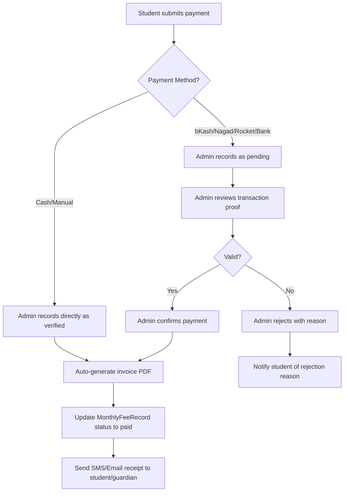
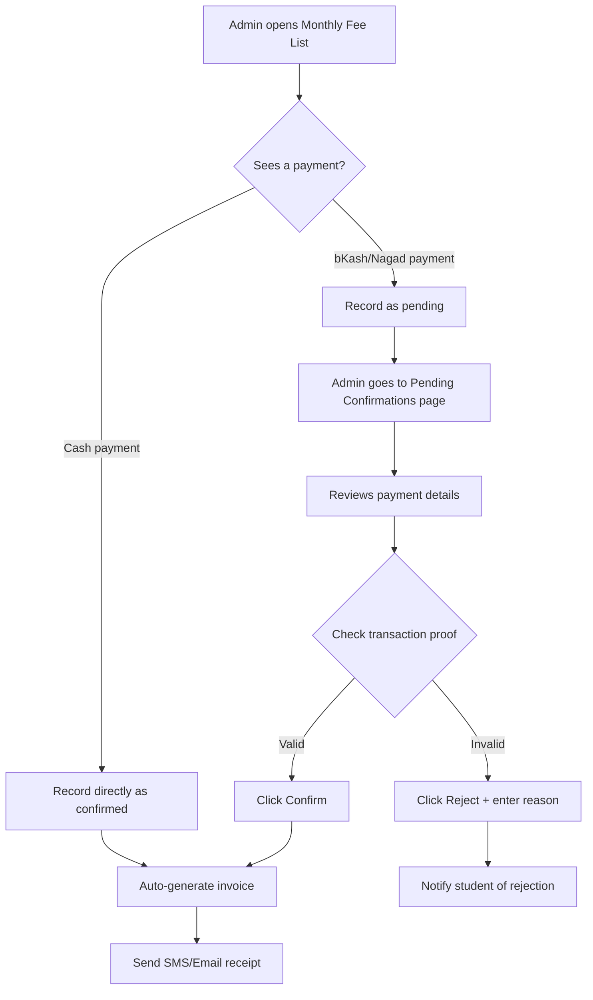
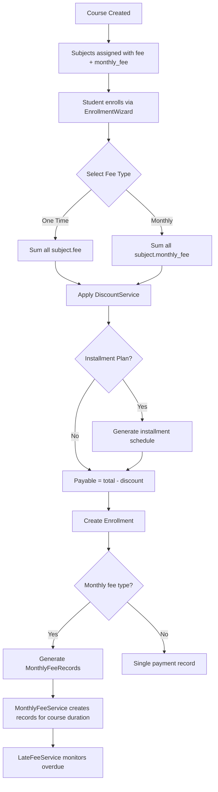
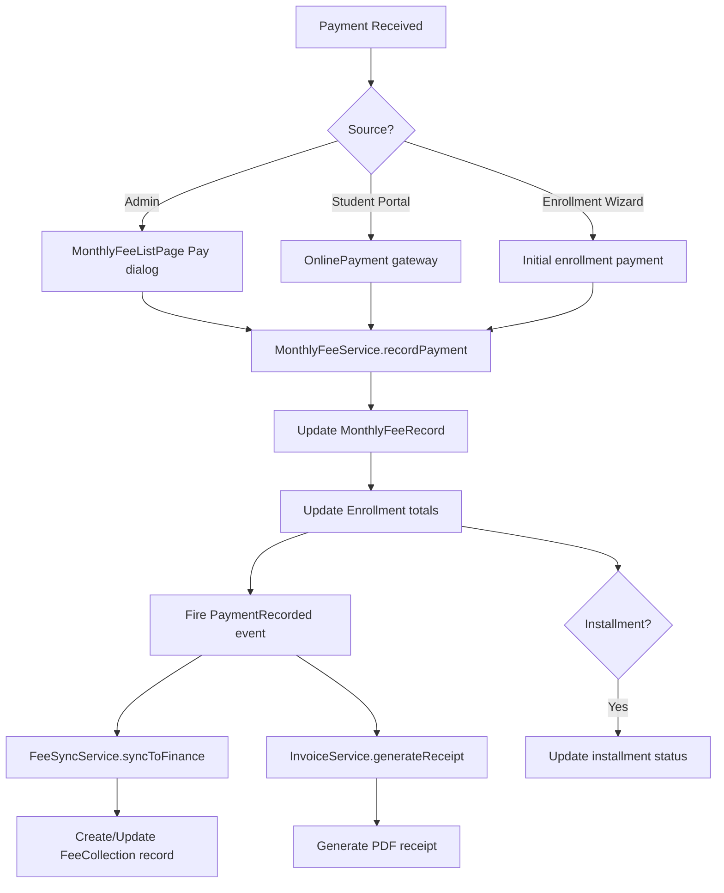
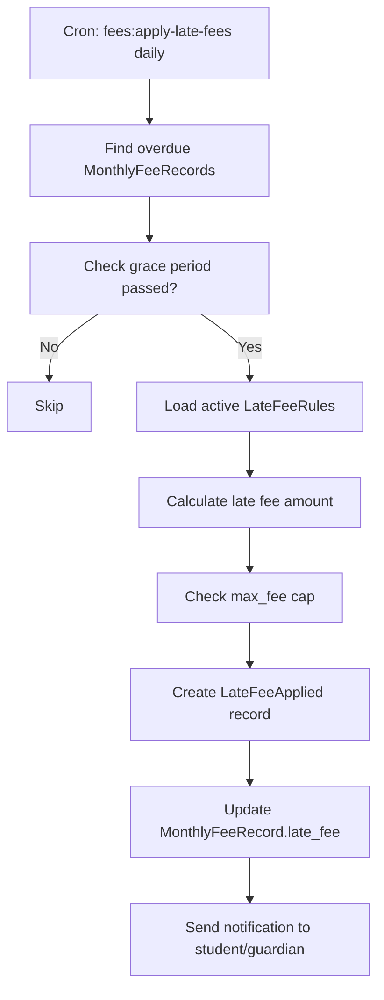

# Fee Management System — Complete Redesign Plan

> **Note:** The immediate bug fixes (monthly_fee input in course creation, API acceptance, course details display, UUID generation) have already been applied. This plan covers the full professional redesign.

---

## 0. Immediate Improvements Needed (User's Request)

Before the full 5-phase plan, the user specifically wants these areas made more dynamic and professional:

### 0.1 Monthly Fee List Page (`MonthlyFeeListPage.vue`)

**Current Problems:**
- Basic table with minimal visual hierarchy
- No summary/dashboard stats at top
- Payment dialog is basic — no receipt preview, no SMS/email notification option
- No bulk actions (pay multiple months at once)
- No export functionality
- No late fee column or overdue highlighting
- No student contact info visible inline
- No payment history per record

**Required Improvements:**

| Feature | Description |
|---------|-------------|
| **Summary Cards** | Total collected this month, total pending, overdue count, collection rate % |
| **Advanced Filters** | Date range picker, student class/group filter, enrollment type filter |
| **Enhanced Table** | Student photo/avatar, contact phone, enrollment link, late fee column, overdue badge, payment progress bar |
| **Inline Actions** | Quick pay, send reminder (SMS/Email), view payment history, download receipt |
| **Bulk Payment** | Select multiple months for a student and pay in one transaction |
| **Payment Dialog v2** | Show receipt preview before confirming, auto-generate invoice no, send notification toggle |
| **Export** | CSV/Excel/PDF export of filtered records |
| **Payment Timeline** | Click a record to see full payment history timeline |
| **Row Grouping** | Group by student to see all their monthly records collapsed/expanded |

### 0.2 Enrollment Details Page (`EnrollmentDetailsPage.vue`)

**Current Problems:**
- Fee summary is basic — no visual payment timeline
- Monthly fee records table is mini and cramped
- Payment dialog for monthly fees is separate and basic
- No receipt/invoice download
- No late fee display
- No discount breakdown visualization
- No payment method icons/branding
- No notification sending (SMS/Email receipt)

**Required Improvements:**

| Feature | Description |
|---------|-------------|
| **Fee Payment Timeline** | Visual timeline showing each month's payment status (paid/pending/overdue) with dates |
| **Enhanced Fee Summary** | Pie/bar chart showing paid vs due, discount breakdown, late fees |
| **Monthly Records Table v2** | Full-width table with late fee column, payment method, receipt link, progress indicator |
| **Unified Payment Dialog** | One dialog for both one-time and monthly payments with receipt preview |
| **Receipt/Invoice Download** | Download PDF receipt for any payment |
| **Send Receipt** | Send payment receipt via SMS or email to student/guardian |
| **Payment History Modal** | Click any paid record to see full payment details (who collected, when, method, transaction ID) |
| **Discount Visualization** | Show how discount was applied (rule name, percentage, amount saved) |
| **Late Fee Warning** | Highlight overdue records with late fee amount and days overdue |
| **Action Buttons** | Print receipt, email statement, send payment reminder |

### 0.3 Student Monthly Fee Payment Workflow Redesign (User's Latest Request)

The user specifically highlighted these problems with the current payment system:

> **Problems:**
> 1. It's not clear which month's fee was paid and how many months are remaining
> 2. No invoice is generated when a student pays
> 3. When a student pays via various methods (bKash, Nagad, etc.), the super admin or admin should confirm the payment
> 4. Auto invoice should be generated on successful payment confirmation
> 5. None of these features exist currently

#### 0.3.1 Payment Confirmation Workflow

The current system records payments directly as `paid` with no confirmation step. We need a **two-step workflow**:



#### 0.3.2 Key Features to Implement

| # | Feature | Description | Priority |
|---|---------|-------------|----------|
| 1 | **Payment Status Tracking** | Each monthly fee record shows: month, fee amount, paid amount, due amount, payment status (pending/partial/paid/awaiting_confirmation), payment method, transaction ID, confirmed by whom, confirmed at | P0 |
| 2 | **Months Remaining Indicator** | Show "Month X of Y" for each record, plus a summary card showing "Paid: 5/12 months" with a progress bar | P0 |
| 3 | **Admin Confirmation Flow** | Payments via bKash/Nagad/Rocket/Bank are recorded as `awaiting_confirmation`. Admin sees a list of unconfirmed payments and can confirm or reject them | P0 |
| 4 | **Auto Invoice Generation** | On payment confirmation, auto-generate a PDF invoice with: invoice number, student info, month, amount, payment method, transaction ID, admin name, date, institute stamp | P0 |
| 5 | **Invoice Download** | Downloadable PDF invoice from both Monthly Fee List page and Enrollment Details page | P0 |
| 6 | **Payment History Timeline** | Click any paid record to see full timeline: who recorded it, who confirmed it, when, method, transaction ID, invoice link | P0 |
| 7 | **SMS/Email Notification** | On confirmation, send receipt to student/guardian via SMS and/or email with invoice link | P1 |
| 8 | **Multi-Method Payment Support** | bKash, Nagad, Rocket, Bank Transfer, Cash, Card — each with appropriate fields (transaction ID, sender number, bank name, etc.) | P0 |

#### 0.3.3 Database Changes for Payment Workflow

```sql
-- Add confirmation fields to monthly_fee_payments table
ALTER TABLE monthly_fee_payments
  ADD COLUMN payment_status ENUM('pending','awaiting_confirmation','confirmed','rejected') DEFAULT 'pending',
  ADD COLUMN confirmed_by UUID NULL REFERENCES users(id),
  ADD COLUMN confirmed_at TIMESTAMP NULL,
  ADD COLUMN rejection_reason TEXT NULL,
  ADD COLUMN sender_number VARCHAR(50) NULL,        -- bKash/Nagad sender number
  ADD COLUMN bank_name VARCHAR(100) NULL,            -- Bank name for bank transfers
  ADD COLUMN gateway_response JSON NULL,             -- Raw gateway response if applicable
  ADD COLUMN invoice_no VARCHAR(50) NULL UNIQUE;     -- Auto-generated invoice number

-- Add invoice tracking table
CREATE TABLE payment_invoices (
    id UUID PRIMARY KEY,
    monthly_fee_payment_id UUID REFERENCES monthly_fee_payments(id),
    invoice_no VARCHAR(50) UNIQUE NOT NULL,
    invoice_type ENUM('monthly_fee','one_time','installment') DEFAULT 'monthly_fee',
    generated_at TIMESTAMP DEFAULT CURRENT_TIMESTAMP,
    generated_by UUID REFERENCES users(id),
    file_path VARCHAR(255) NULL,                     -- Path to stored PDF (optional)
    metadata JSON NULL                               -- Invoice data snapshot
);

-- Add months_remaining tracking to enrollment
ALTER TABLE enrollments
  ADD COLUMN total_months INT NULL,                  -- Total months for the course
  ADD COLUMN paid_months INT DEFAULT 0;              -- How many months fully paid
```

#### 0.3.4 Backend Changes

| File | Change |
|------|--------|
| [`MonthlyFeeService.php`](Modules/Enrollment/app/Services/MonthlyFeeService.php) | Add `recordPendingPayment()` method that creates payment with `awaiting_confirmation` status. Add `confirmPayment()` method that transitions to confirmed, generates invoice, updates totals. Add `rejectPayment()` method. Add `getUnconfirmedPayments()` method. |
| [`MonthlyFeeController.php`](Modules/Enrollment/app/Http/Controllers/Api/V1/MonthlyFeeController.php) | Add `pendingConfirmations()` endpoint. Add `confirmPayment()` endpoint. Add `rejectPayment()` endpoint. Add `invoice()` endpoint. |
| [`InvoiceService.php`](Modules/Enrollment/app/Services/InvoiceService.php) | NEW: Generate PDF invoices using `barryvdh/laravel-dompdf`. Methods: `generateMonthlyFeeInvoice()`, `generateReceipt()`, `download()`. |
| [`MonthlyFeeRecord.php`](Modules/Enrollment/app/Models/MonthlyFeeRecord.php) | Add `confirmedPayments()` relationship. Add `unconfirmedPayments()` relationship. Add `invoice()` relationship. |
| [`MonthlyFeePayment.php`](Modules/Enrollment/app/Models/MonthlyFeePayment.php) | Add fillable fields: `payment_status`, `confirmed_by`, `confirmed_at`, `rejection_reason`, `sender_number`, `bank_name`, `gateway_response`, `invoice_no`. Add `confirmer()` relationship. Add `invoice()` relationship. |
| [`PaymentInvoice.php`](Modules/Enrollment/app/Models/PaymentInvoice.php) | NEW model for `payment_invoices` table. |
| [`EnrollmentService.php`](Modules/Enrollment/app/Services/EnrollmentService.php) | Update `enroll()` to calculate and store `total_months` on enrollment. |
| [`NotificationService.php`](Modules/Enrollment/app/Services/NotificationService.php) | Add `sendPaymentConfirmationSms()`, `sendPaymentConfirmationEmail()`, `sendPaymentRejectionNotification()`. |

#### 0.3.5 New API Endpoints

```
# Payment Confirmation Workflow
GET    /api/v1/monthly-fees/pending-confirmations     → List payments awaiting admin confirmation
POST   /api/v1/monthly-fees/{recordId}/pay-pending     → Record a payment as pending (awaiting confirmation)
POST   /api/v1/monthly-fees/{recordId}/confirm         → Admin confirms a pending payment
POST   /api/v1/monthly-fees/{recordId}/reject          → Admin rejects a pending payment

# Invoices
GET    /api/v1/invoices/monthly/{paymentId}/download   → Download PDF invoice for a monthly fee payment
GET    /api/v1/invoices/enrollment/{enrollmentId}      → List all invoices for an enrollment

# Enrollment months tracking
GET    /api/v1/enrollments/{id}/months-progress        → Get months progress (paid/total/remaining)
```

#### 0.3.6 Frontend Changes

| Page | Changes |
|------|---------|
| [`MonthlyFeeListPage.vue`](frontend/src/pages/dashboard/enrollment/MonthlyFeeListPage.vue) | Add summary cards at top (total collected, pending confirmation count, overdue count, collection rate). Add "Awaiting Confirmation" tab/filter. Add confirmation dialog for admin. Add invoice download button. Add months progress column. Add payment timeline modal. |
| [`EnrollmentDetailsPage.vue`](frontend/src/pages/dashboard/enrollment/EnrollmentDetailsPage.vue) | Add months progress bar (X of Y months paid). Add payment timeline visualization. Add invoice download links. Update monthly fee records table with confirmation status. Add "Confirm Payment" button for pending payments. |
| New: [`PaymentConfirmationPage.vue`](frontend/src/pages/dashboard/enrollment/PaymentConfirmationPage.vue) | Dedicated page showing all payments awaiting admin confirmation. Each row shows: student name, month, amount, payment method, transaction ID, sender number, timestamp. Actions: Confirm (with optional note) or Reject (with required reason). |
| New: [`InvoiceDownloadButton.vue`](frontend/src/components/enrollment/InvoiceDownloadButton.vue) | Reusable component for downloading invoices. |
| [`monthly-fee.service.js`](frontend/src/services/monthly-fee.service.js) | Add methods: `getPendingConfirmations()`, `recordPendingPayment()`, `confirmPayment()`, `rejectPayment()`, `downloadInvoice()`, `getMonthsProgress()`. |

#### 0.3.7 Payment Confirmation UI Flow



#### 0.3.8 Invoice Format

The generated PDF invoice should contain:

```
============================================
          COACHING MANAGEMENT SYSTEM
            MONTHLY FEE RECEIPT
============================================

Invoice No: INV-2026-05-XXXXXX
Date: 16 May 2026

Student:     [Name]
Student ID:  [STU-2026-XXXXXX]
Enrollment:  [ENR-2026-XXXXXX]
Course:      [Course Name]
Batch:       [Batch Name]
Month:       May 2026

--------------------------------------------
Description              Amount
--------------------------------------------
Monthly Fee              ৳ X,XXX.00
--------------------------------------------
Total Paid:              ৳ X,XXX.00
Payment Method:          bKash
Transaction ID:          BKASH-XXXXXX
--------------------------------------------

Payment Status: ✅ CONFIRMED
Confirmed By:  [Admin Name]
Confirmed At:  [Date Time]

============================================
        Thank you for your payment!
============================================
```

### 0.4 Implementation Priority

These improvements should be done **first**, before the larger Phase 1-5 features, because they directly address the user's complaint about the system not being "professional" enough.

**Order of implementation:**
1. **Section 0.1** — Monthly Fee List Page improvements (summary cards, enhanced table, better filters)
2. **Section 0.2** — Enrollment Details Page improvements (months progress, payment timeline)
3. **Section 0.3** — Payment workflow redesign (confirmation flow, auto-invoice, multi-method support)

## 1. Current State Analysis

### Existing Components

| Layer | What Exists | Status |
|-------|------------|--------|
| **Finance Module** | `FeeType`, `FeeStructure`, `FeeCollection`, `Expense`, `ExpenseCategory` models + CRUD APIs | ✅ Basic |
| **Enrollment Module** | `Course` → `subjects()` pivot with `fee` + `monthly_fee` | ✅ Fixed |
| **Enrollment Module** | `Enrollment` with `fee_type`, `total_fee`, `payable_fee`, `paid_amount`, `due_amount`, `payment_status` | ✅ Basic |
| **Enrollment Module** | `Payment` model + `PaymentService` (receipt, refund, history) | ✅ Basic |
| **Enrollment Module** | `MonthlyFeeRecord` + `MonthlyFeePayment` + `MonthlyFeeService` | ✅ Basic |
| **Enrollment Module** | `EnrollmentService::calculateFee()` — calculates fee from subject pivots | ✅ Fixed |
| **Enrollment Module** | `EnrollmentService::enroll()` — creates enrollment + monthly records | ✅ Fixed |
| **Frontend** | `EnrollmentWizard.vue` — enrollment flow with fee type selection | ✅ Basic |
| **Frontend** | `MonthlyFeeListPage.vue` — list + payment dialog | ✅ Basic |
| **Frontend** | `FeeCollectionPage.vue` — Finance module fee collection | ⚠️ Standalone |
| **Frontend** | `CourseCreatePage.vue` — subject fee + monthly_fee input | ✅ Fixed |

### Gaps & Problems

1. **No unified fee dashboard** — Finance module (FeeCollection) and Enrollment module (MonthlyFeeRecords) are completely disconnected
2. **No fee structure templates** — FeeStructure exists but isn't linked to course creation
3. **No discount engine** — Only sibling discount exists; no scholarship, early-bird, referral discounts
4. **No late fee / fine system** — Overdue tracking exists but no automatic fine calculation
5. **No installment plans** — Only full payment or monthly; no custom installment schedules
6. **No student fee portal** — Students can't view their fee breakdown, due dates, or payment history
7. **No receipt/invoice generation** — Basic receipt_no exists but no formal PDF invoice
8. **No financial reporting** — No P&L, fee collection reports, aging reports
9. **No payment gateway integration UI** — Backend gateway service exists but no frontend integration
10. **FeeCollection is standalone** — Not linked to enrollments; manual entry only

---

## 2. Architecture Overview

```
┌─────────────────────────────────────────────────────────────┐
│                    FEE MANAGEMENT SYSTEM                      │
├─────────────────────────────────────────────────────────────┤
│                                                               │
│  ┌─────────────────────┐    ┌──────────────────────────┐     │
│  │   FEE CONFIGURATION  │    │    ENROLLMENT FEE FLOW    │     │
│  │                      │    │                           │     │
│  │ • FeeType (master)   │    │ Course → Subjects         │     │
│  │ • FeeStructure       │───▶│   ↓ (fee + monthly_fee)   │     │
│  │   (class/session)    │    │ Enrollment                │     │
│  │ • Discount Rules     │    │   ↓ (fee_type, payable)   │     │
│  │ • Late Fee Rules     │    │ MonthlyFeeRecords         │     │
│  │ • Installment Plans  │    │   ↓ (per month records)   │     │
│  └─────────────────────┘    │ MonthlyFeePayments         │     │
│                              │   ↓ (per payment)          │     │
│  ┌─────────────────────┐    │ Payment (receipts)         │     │
│  │   FINANCE INTEGRATION│    └──────────────────────────┘     │
│  │                      │                                      │
│  │ • FeeCollection      │◀── Syncs with Enrollment payments   │
│  │   (general ledger)   │                                      │
│  │ • Expense tracking   │                                      │
│  │ • P&L Reports        │                                      │
│  └─────────────────────┘                                      │
│                                                               │
│  ┌─────────────────────┐    ┌──────────────────────────┐     │
│  │   STUDENT PORTAL     │    │    ADMIN DASHBOARD       │     │
│  │                      │    │                           │     │
│  │ • View fee breakdown │    │ • Fee collection summary  │     │
│  │ • Due dates calendar │    │ • Overdue alerts          │     │
│  │ • Payment history    │    │ • Monthly collection      │     │
│  │ • Online payment     │    │ • Aging reports           │     │
│  │ • Download receipts  │    │ • Discount/Late fee logs  │     │
│  └─────────────────────┘    └──────────────────────────┘     │
│                                                               │
└─────────────────────────────────────────────────────────────┘
```

---

## 3. Database Schema Changes

### 3.1 New Tables

```sql
-- Discount rules (configurable)
CREATE TABLE discount_rules (
    id UUID PRIMARY KEY,
    name VARCHAR(255),              -- e.g., "Sibling Discount", "Merit Scholarship"
    code VARCHAR(50) UNIQUE,        -- e.g., "SIBLING_10", "MERIT_50"
    type ENUM('percentage','fixed'),-- percentage off or fixed amount
    value DECIMAL(10,2),            -- e.g., 10 for 10%, or 500 for fixed
    applies_to ENUM('one_time','monthly','both'), -- which fee type it applies to
    priority INT DEFAULT 0,         -- lower number = applied first
    conditions JSON,                -- { "min_subjects": 3, "min_gpa": 4.5, "sibling_required": true }
    status ENUM('active','inactive') DEFAULT 'active',
    created_at TIMESTAMP,
    updated_at TIMESTAMP
);

-- Late fee rules
CREATE TABLE late_fee_rules (
    id UUID PRIMARY KEY,
    name VARCHAR(255),
    grace_days INT DEFAULT 5,       -- days after due date before fine applies
    type ENUM('percentage','fixed'),
    value DECIMAL(10,2),            -- e.g., 2 for 2% of due, or 100 for fixed 100 BDT
    max_fee DECIMAL(10,2) NULL,     -- cap on late fee
    recurring ENUM('once','daily','weekly','monthly'), -- how often it applies
    status ENUM('active','inactive') DEFAULT 'active',
    created_at TIMESTAMP,
    updated_at TIMESTAMP
);

-- Installment plans
CREATE TABLE installment_plans (
    id UUID PRIMARY KEY,
    name VARCHAR(255),              -- e.g., "3-month installment", "50-25-25"
    total_installments INT,         -- e.g., 3
    schedule_type ENUM('equal','custom'), -- equal splits or custom percentages
    intervals JSON,                 -- [{"percent": 50, "due_day": 0}, {"percent": 25, "due_day": 30}, ...]
    status ENUM('active','inactive') DEFAULT 'active',
    created_at TIMESTAMP,
    updated_at TIMESTAMP
);

-- Enrollment installment assignments
CREATE TABLE enrollment_installments (
    id UUID PRIMARY KEY,
    enrollment_id UUID REFERENCES enrollments(id),
    installment_no INT,
    amount DECIMAL(12,2),
    due_date DATE,
    paid_amount DECIMAL(12,2) DEFAULT 0,
    status ENUM('pending','partial','paid','overdue') DEFAULT 'pending',
    created_at TIMESTAMP,
    updated_at TIMESTAMP
);

-- Late fee applied records
CREATE TABLE late_fee_applied (
    id UUID PRIMARY KEY,
    monthly_fee_record_id UUID REFERENCES monthly_fee_records(id),
    late_fee_rule_id UUID REFERENCES late_fee_rules(id),
    original_due DECIMAL(12,2),
    late_fee_amount DECIMAL(12,2),
    total_due DECIMAL(12,2),
    applied_at TIMESTAMP,
    created_at TIMESTAMP
);

-- Fee waivers/adjustments
CREATE TABLE fee_adjustments (
    id UUID PRIMARY KEY,
    enrollment_id UUID REFERENCES enrollments(id),
    monthly_fee_record_id UUID NULL REFERENCES monthly_fee_records(id),
    type ENUM('discount','waiver','fine','refund','adjustment'),
    amount DECIMAL(12,2),
    reason TEXT,
    approved_by UUID REFERENCES users(id),
    created_at TIMESTAMP,
    updated_at TIMESTAMP
);
```

### 3.2 Existing Table Modifications

```sql
-- Add installment_plan_id to enrollments
ALTER TABLE enrollments ADD COLUMN installment_plan_id UUID NULL REFERENCES installment_plans(id);

-- Add discount_rule_id to enrollments (which discount was applied)
ALTER TABLE enrollments ADD COLUMN discount_rule_id UUID NULL REFERENCES discount_rules(id);

-- Add late_fee to monthly_fee_records
ALTER TABLE monthly_fee_records ADD COLUMN late_fee DECIMAL(10,2) DEFAULT 0;
ALTER TABLE monthly_fee_records ADD COLUMN total_due_with_late DECIMAL(10,2) GENERATED ALWAYS AS (due_amount + late_fee) STORED;

-- Link fee_collections to enrollments
ALTER TABLE fee_collections ADD COLUMN enrollment_id UUID NULL REFERENCES enrollments(id);
ALTER TABLE fee_collections ADD COLUMN monthly_fee_record_id UUID NULL REFERENCES monthly_fee_records(id);
```

---

## 4. Backend Service Architecture

### 4.1 New Services

```
Modules/Enrollment/app/Services/
├── DiscountService.php          ← NEW: Calculate all applicable discounts
├── LateFeeService.php           ← NEW: Calculate & apply late fees
├── InstallmentService.php       ← NEW: Generate & track installment plans
├── FeeAdjustmentService.php     ← NEW: Waivers, refunds, adjustments
├── InvoiceService.php           ← NEW: Generate PDF invoices/receipts
└── FeeSyncService.php           ← NEW: Sync enrollment payments → Finance module
```

### 4.2 Service Responsibilities

#### `DiscountService`
- Load all active `discount_rules`
- Check conditions against student + enrollment data
- Return array of applicable discounts with amounts
- Handle stacking (multiple discounts) with priority ordering

#### `LateFeeService`
- Scheduled command: `php artisan fees:apply-late-fees`
- Find overdue `monthly_fee_records` past grace period
- Apply late fee based on rules
- Create `late_fee_applied` records
- Update `monthly_fee_records.late_fee`

#### `InstallmentService`
- When enrollment created with `installment_plan_id`, generate `enrollment_installments`
- Track payment against each installment
- Determine if installment is overdue
- Allow switching installment plans mid-course

#### `FeeSyncService`
- When a payment is recorded in Enrollment module (`Payment` or `MonthlyFeePayment`), automatically create/update a `FeeCollection` record in Finance module
- This bridges the gap between the two modules
- Run as an event listener on `PaymentRecorded` / `MonthlyFeePaid` events

#### `InvoiceService`
- Generate PDF receipt for any payment
- Generate monthly fee statement for a student
- Generate annual fee summary

### 4.3 Events & Listeners

```php
// New Events
PaymentRecorded        → [FeeSyncService::syncToFinance, InvoiceService::generateReceipt]
MonthlyFeePaid         → [FeeSyncService::syncToFinance, InstallmentService::updateInstallment]
EnrollmentCreated      → [DiscountService::applyDiscounts, InstallmentService::generateSchedule]
MonthlyFeeOverdue      → [LateFeeService::applyLateFee, NotificationService::sendReminder]
```

---

## 5. API Endpoints

### 5.1 New Endpoints

```
# Discount Rules
GET    /api/v1/discount-rules              → List all
POST   /api/v1/discount-rules              → Create
PUT    /api/v1/discount-rules/{id}         → Update
DELETE /api/v1/discount-rules/{id}         → Delete

# Late Fee Rules
GET    /api/v1/late-fee-rules              → List all
POST   /api/v1/late-fee-rules              → Create
PUT    /api/v1/late-fee-rules/{id}         → Update
DELETE /api/v1/late-fee-rules/{id}         → Delete

# Installment Plans
GET    /api/v1/installment-plans           → List all
POST   /api/v1/installment-plans           → Create
PUT    /api/v1/installment-plans/{id}      → Update
DELETE /api/v1/installment-plans/{id}      → Delete

# Enrollment Installments
GET    /api/v1/enrollments/{id}/installments       → Get installment schedule
POST   /api/v1/enrollments/{id}/installments/pay   → Pay an installment

# Fee Adjustments
GET    /api/v1/fee-adjustments                     → List all
POST   /api/v1/fee-adjustments                     → Create adjustment
GET    /api/v1/enrollments/{id}/adjustments        → Get adjustments for enrollment

# Late Fees
POST   /api/v1/monthly-fees/apply-late-fees        → Manual trigger late fee calculation
GET    /api/v1/monthly-fees/{id}/late-fees          → Get late fee details for a record

# Invoices
GET    /api/v1/invoices/payment/{paymentId}        → Download payment receipt PDF
GET    /api/v1/invoices/enrollment/{enrollmentId}  → Download enrollment fee statement PDF
GET    /api/v1/invoices/monthly/{recordId}         → Download monthly fee invoice PDF

# Reports
GET    /api/v1/finance/reports/fee-collection       → Fee collection report (date range)
GET    /api/v1/finance/reports/aging                → Accounts receivable aging
GET    /api/v1/finance/reports/monthly-summary      → Monthly fee collection summary
GET    /api/v1/finance/reports/student-ledger/{id}  → Student fee ledger

# Student Portal
GET    /api/v1/student/fee-summary                  → Logged-in student's fee overview
GET    /api/v1/student/fee-records                  → Student's monthly fee records
GET    /api/v1/student/payment-history              → Student's payment history
POST   /api/v1/student/pay-monthly-fee              → Student self-payment via gateway
```

### 5.2 Modified Existing Endpoints

```
# Enrollment → enroll() — Add installment_plan_id, discount_rule_id to request
POST /api/v1/enrollments

# Enrollment → calculateFee() — Include discount breakdown, installment options
POST /api/v1/enrollments/calculate-fee

# Finance → FeeCollection — Link to enrollment_id, monthly_fee_record_id
POST /api/v1/fee-collections
```

---

## 6. Frontend Pages & Components

### 6.1 New Pages

```
frontend/src/pages/dashboard/finance/
├── DiscountRuleListPage.vue        ← CRUD for discount rules
├── LateFeeRuleListPage.vue         ← CRUD for late fee rules
├── InstallmentPlanListPage.vue     ← CRUD for installment plans
├── FeeAdjustmentListPage.vue       ← Fee adjustments log
├── FeeReportsPage.vue              ← Financial reports dashboard
│   ├── FeeCollectionReport.vue     ← Date-range collection report
│   ├── AgingReport.vue             ← Accounts receivable aging
│   └── MonthlySummaryReport.vue    ← Monthly collection summary
└── StudentLedgerPage.vue           ← Individual student fee ledger

frontend/src/pages/dashboard/enrollment/
├── EnrollmentFeeDetails.vue        ← Detailed fee breakdown for an enrollment
└── InstallmentSchedule.vue         ← Installment plan view for enrollment

frontend/src/pages/student/
├── FeeDashboard.vue                ← Student's fee overview
├── FeeRecords.vue                  ← Student's monthly fee records
├── PaymentHistory.vue              ← Student's payment history
└── OnlinePayment.vue               ← Student self-payment page
```

### 6.2 Modified Existing Pages

```
EnrollmentWizard.vue
├── Add installment plan selection step
├── Add discount display in fee summary
├── Add late fee warning if applicable
└── Improve monthly fee breakdown display

MonthlyFeeListPage.vue
├── Add late fee column
├── Add bulk payment option
├── Add export to CSV/PDF
└── Add send reminder button

FeeCollectionPage.vue
├── Link to enrollment_id
├── Show enrollment context
└── Auto-create from enrollment payments

CourseCreatePage.vue
├── Already fixed (monthly_fee input added)
└── Add discount rule assignment option
```

---

## 7. Implementation Phases

### Phase 0: Payment Workflow Redesign (IMMEDIATE — User's Top Priority)
**Goal**: Fix the student payment tracking, admin confirmation, and auto-invoice system

| Step | Task | Files |
|------|------|-------|
| 0.1 | **Migration**: Add confirmation fields to `monthly_fee_payments` table | `Modules/Enrollment/database/migrations/` |
| 0.2 | **Migration**: Create `payment_invoices` table | `Modules/Enrollment/database/migrations/` |
| 0.3 | **Migration**: Add `total_months`, `paid_months` to `enrollments` table | `Modules/Enrollment/database/migrations/` |
| 0.4 | **Model**: Update `MonthlyFeePayment` with new fields + relationships | `Models/MonthlyFeePayment.php` |
| 0.5 | **Model**: Create `PaymentInvoice` model | `Models/PaymentInvoice.php` |
| 0.6 | **Model**: Update `MonthlyFeeRecord` with confirmation relationships | `Models/MonthlyFeeRecord.php` |
| 0.7 | **Service**: Add `recordPendingPayment()`, `confirmPayment()`, `rejectPayment()` to `MonthlyFeeService` | `Services/MonthlyFeeService.php` |
| 0.8 | **Service**: Create `InvoiceService` with PDF generation | `Services/InvoiceService.php` |
| 0.9 | **Controller**: Add confirmation endpoints to `MonthlyFeeController` | `Controllers/Api/V1/MonthlyFeeController.php` |
| 0.10 | **Routes**: Add new API routes for confirmation + invoice | `routes/api.php` |
| 0.11 | **Frontend**: Update `MonthlyFeeListPage.vue` — summary cards, pending confirmation tab, invoice download, months progress | `frontend/src/pages/dashboard/enrollment/MonthlyFeeListPage.vue` |
| 0.12 | **Frontend**: Update `EnrollmentDetailsPage.vue` — months progress bar, payment timeline, confirm/reject buttons, invoice links | `frontend/src/pages/dashboard/enrollment/EnrollmentDetailsPage.vue` |
| 0.13 | **Frontend**: Create `PaymentConfirmationPage.vue` — dedicated page for admin to confirm/reject payments | `frontend/src/pages/dashboard/enrollment/PaymentConfirmationPage.vue` |
| 0.14 | **Frontend**: Update `monthly-fee.service.js` — new API methods | `frontend/src/services/monthly-fee.service.js` |
| 0.15 | **Notification**: Update `NotificationService` for payment confirmation SMS/Email | `Services/NotificationService.php` |
| 0.16 | **Install**: Add `barryvdh/laravel-dompdf` for PDF generation | `composer.json` |

### Phase 1: UI/UX Improvements (IMMEDIATE — Professional Look)
**Goal**: Make Monthly Fee List and Enrollment Details pages more dynamic and professional

| Step | Task | Files |
|------|------|-------|
| 1.1 | **MonthlyFeeListPage**: Add summary dashboard cards (total collected, pending, overdue, rate) | `MonthlyFeeListPage.vue` |
| 1.2 | **MonthlyFeeListPage**: Add advanced filters (date range, class/group, enrollment type) | `MonthlyFeeListPage.vue` |
| 1.3 | **MonthlyFeeListPage**: Enhanced table with student photo, contact, late fee column, progress bar | `MonthlyFeeListPage.vue` |
| 1.4 | **MonthlyFeeListPage**: Add export CSV/Excel/PDF | `MonthlyFeeListPage.vue` |
| 1.5 | **MonthlyFeeListPage**: Add payment timeline modal | `MonthlyFeeListPage.vue` |
| 1.6 | **EnrollmentDetailsPage**: Add fee payment timeline visualization | `EnrollmentDetailsPage.vue` |
| 1.7 | **EnrollmentDetailsPage**: Enhanced fee summary with charts | `EnrollmentDetailsPage.vue` |
| 1.8 | **EnrollmentDetailsPage**: Unified payment dialog with receipt preview | `EnrollmentDetailsPage.vue` |
| 1.9 | **EnrollmentDetailsPage**: Add send receipt SMS/Email buttons | `EnrollmentDetailsPage.vue` |

### Phase 2: Foundation (Next)
**Goal**: Create the discount/late fee infrastructure

| Step | Task | Files |
|------|------|-------|
| 2.1 | Create `discount_rules` migration + model + CRUD API | `Modules/Enrollment/database/migrations/`, `Models/DiscountRule.php`, `Controllers/Api/V1/DiscountRuleController.php` |
| 2.2 | Create `late_fee_rules` migration + model + CRUD API | Similar structure |
| 2.3 | Create `DiscountService` with condition checking | `Services/DiscountService.php` |
| 2.4 | Create `LateFeeService` with scheduled command | `Services/LateFeeService.php`, `Console/ApplyLateFees.php` |
| 2.5 | Frontend: DiscountRuleListPage.vue | CRUD UI |
| 2.6 | Frontend: LateFeeRuleListPage.vue | CRUD UI |
| 2.7 | Integrate discount into `EnrollmentService::calculateFee()` | Modify `EnrollmentService.php` |
| 2.8 | Integrate late fee into `MonthlyFeeService` | Modify `MonthlyFeeService.php` |

### Phase 3: Installments & Adjustments
**Goal**: Installment plans and fee adjustment system

| Step | Task | Files |
|------|------|-------|
| 3.1 | Create `installment_plans` migration + model + CRUD API | New files |
| 3.2 | Create `enrollment_installments` migration + model | New files |
| 3.3 | Create `fee_adjustments` migration + model + CRUD API | New files |
| 3.4 | Create `InstallmentService` | New service |
| 3.5 | Create `FeeAdjustmentService` | New service |
| 3.6 | Modify `EnrollmentService::enroll()` to handle installments | Modify |
| 3.7 | Frontend: InstallmentPlanListPage.vue | CRUD UI |
| 3.8 | Frontend: FeeAdjustmentListPage.vue | CRUD UI |
| 3.9 | Frontend: Update EnrollmentWizard with installment selection | Modify |

### Phase 4: Finance Integration
**Goal**: Bridge Enrollment payments with Finance module

| Step | Task | Files |
|------|------|-------|
| 4.1 | Add `enrollment_id`, `monthly_fee_record_id` to `fee_collections` | Migration |
| 4.2 | Create `FeeSyncService` with event listeners | New service + events |
| 4.3 | Create `PaymentRecorded` event + listener | New |
| 4.4 | Create `MonthlyFeePaid` event + listener | New |
| 4.5 | Update `FeeCollectionPage.vue` to show linked enrollments | Modify |
| 4.6 | Update `FeeCollection` API to accept enrollment context | Modify |

### Phase 5: Reports & Student Portal
**Goal**: Financial reporting and student self-service

| Step | Task | Files |
|------|------|-------|
| 5.1 | Create fee collection report API | New controller method |
| 5.2 | Create aging report API | New controller method |
| 5.3 | Frontend: FeeReportsPage.vue with charts | New page |
| 5.4 | Frontend: StudentLedgerPage.vue | New page |
| 5.5 | Create student fee API endpoints (authenticated) | New controller |
| 5.6 | Frontend: FeeDashboard.vue | New page |
| 5.7 | Frontend: FeeRecords.vue | New page |
| 5.8 | Frontend: PaymentHistory.vue | New page |
| 5.9 | Frontend: OnlinePayment.vue with gateway integration | New page |
| 5.10 | Add student portal routes + navigation | Modify router |

---

## 8. Data Flow Diagrams

### 8.1 Enrollment Fee Calculation Flow



### 8.2 Payment Recording Flow



### 8.3 Late Fee Application Flow



---

## 9. Key Design Decisions

| Decision | Rationale |
|----------|-----------|
| **Discount rules stored as JSON conditions** | Flexible — can add new condition types without schema changes |
| **Late fee as separate table + column** | Preserves original due amount; late fee is additive, not modifying original |
| **FeeSyncService as event listener** | Decouples Enrollment from Finance; Finance module is optional extension |
| **Installments as separate table** | More flexible than adding columns to enrollments; supports partial payments per installment |
| **Student portal as new route group** | Separate auth middleware (student vs admin); cleaner code separation |
| **PDF generation on-demand** | Avoids storing files; generates when user clicks download; can cache if needed |

---

## 10. Risks & Mitigations

| Risk | Mitigation |
|------|------------|
| **Data inconsistency** between Enrollment payments and Finance FeeCollection | FeeSyncService ensures eventual consistency via events |
| **Performance** with large monthly fee record sets | Pagination, indexes on (enrollment_id, month), chunked processing for late fee cron |
| **Concurrent payment processing** | Database transactions + row-level locking on MonthlyFeeRecord |
| **Student portal security** | Separate auth guard, rate limiting, OTP verification for payments |
| **PDF generation memory usage** | Stream PDF to browser instead of saving to disk; set memory limits |

---

## 11. Migration Strategy

1. **Run new migrations** — All new tables created without breaking existing data
2. **Backfill existing enrollments** — For existing monthly fee enrollments, ensure `monthly_fee_records` have correct amounts (already fixed)
3. **Data sync** — One-time script to link existing `FeeCollection` records to enrollments where possible
4. **Feature flags** — New features (installments, student portal) behind config flags until tested
5. **Rollback plan** — Each phase is independent; can roll back individual features without affecting core enrollment
