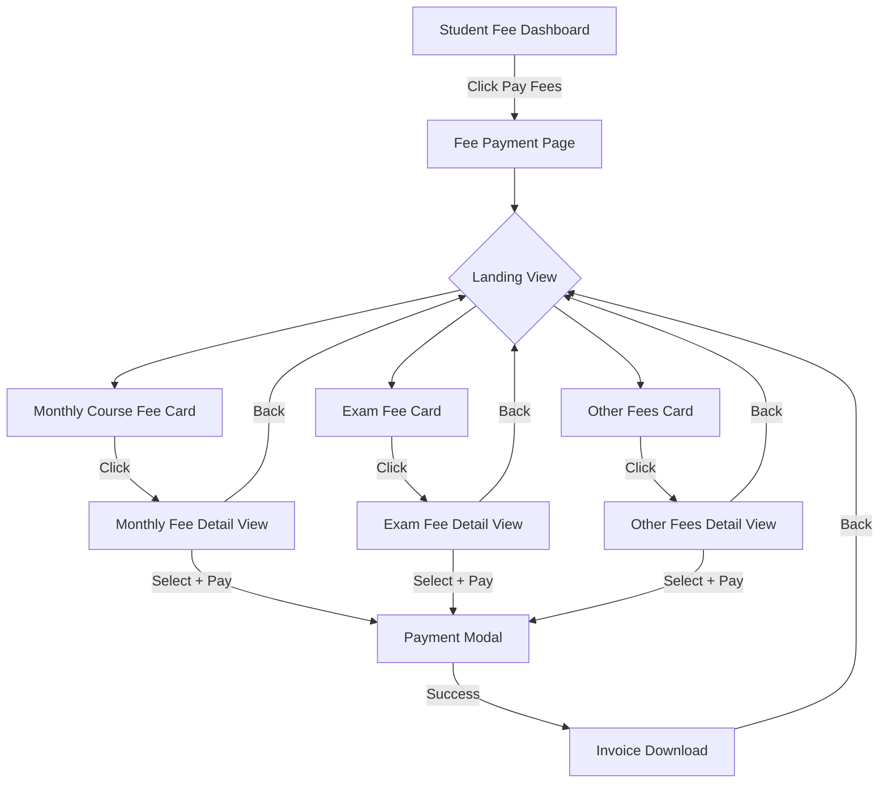
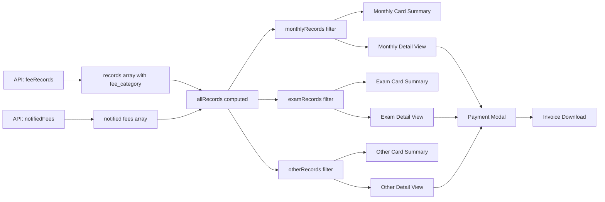

# Plan: Student Fee Payment Page - 3 Category Cards (Monthly, Exam, Other)

## Overview

The student "Pay Fees" page currently shows all fee records (monthly + notified/exam) in a single flat list. The user wants it redesigned so that upon entering the page, the student sees **3 category cards**:

1. **Monthly Course Fee / Tuition Fee** (fee_category = `monthly`)
2. **Exam Fee** (fee_category = `event_based`)
3. **Other Fees** (fee_category = `one_time` or any other category)

Clicking a card navigates to a dedicated sub-view showing only fees of that category, with full payment + invoice download capabilities. Each category has **separate calculations** (total due, paid, discount, etc.).

## Current Architecture

### Backend: [`StudentPortalController.php::feeRecords()`](Modules/Student/app/Http/Controllers/Api/V1/StudentPortalController.php:615)
- Returns `records[]` array with each record having `fee_category` field:
  - `'monthly'` — Monthly/Tuition fees
  - `'event_based'` — Exam fees (from notifications)
  - `'one_time'` — One-time/other fees
- Also returns `notifiedFees` from a separate API call (`smartFeeService.student.notifiedFees()`)

### Frontend: [`StudentFeePaymentPage.vue`](frontend/src/pages/student/StudentFeePaymentPage.vue)
- Single page showing all records in one grid
- "Notified Fees" section (exam/event-based) shown separately from "Fee Records" (monthly)
- Payment modal handles both single and bulk payments
- Invoice download after successful payment

### Frontend: [`StudentFeeDashboardPage.vue`](frontend/src/pages/student/StudentFeeDashboardPage.vue)
- Dashboard with overall stats + enrollment cards
- "Pay Now" button navigates to `StudentFeePaymentDetail` with enrollment ID
- Exam fee cards with "Pay Now" that navigate with query params

## Proposed Design

### New Page Structure

Instead of modifying the existing single-page layout, we'll **redesign the page** to have:

1. **Landing View** (default): Shows 3 category cards with summary stats per category
2. **Category Detail View**: Shows fee records filtered by that category, with payment + invoice

We can implement this as:
- **Option A**: A single Vue component with tab/section switching (simpler, keeps all logic together)
- **Option B**: Separate route-based pages for each category (cleaner URLs, but more routing)

**Recommendation: Option A** — Single component with internal view switching, since the payment logic is shared.

### Component Architecture

```
StudentFeePaymentPage.vue (refactored)
├── Landing View (default)
│   ├── Enrollment Selector (existing)
│   ├── Category Card: Monthly/Tuition Fee
│   │   ├── Icon + Title
│   │   ├── Summary: Total Due, Paid, Pending count
│   │   └── Click → Category Detail View (filtered to 'monthly')
│   ├── Category Card: Exam Fee
│   │   ├── Icon + Title
│   │   ├── Summary: Total Due, Paid, Pending count
│   │   └── Click → Category Detail View (filtered to 'event_based')
│   └── Category Card: Other Fees
│       ├── Icon + Title
│       ├── Summary: Total Due, Paid, Pending count
│       └── Click → Category Detail View (filtered to 'one_time' + others)
│
├── Category Detail View (when a card is clicked)
│   ├── Back button → Landing View
│   ├── Category header with summary stats
│   ├── Fee records list (filtered by category)
│   │   ├── Checkbox selection
│   │   ├── Pay button per record
│   │   └── Invoice download (if paid/approved)
│   ├── Floating pay bar (existing)
│   └── Payment modal (existing, reused)
│
└── Payment Modal (existing, unchanged)
```

### Data Flow

1. **On page load**: Call `feeRecords(enrollmentId)` which already returns all records with `fee_category` field
2. **Compute category-specific data** from the same `records` array:
   - `monthlyRecords` = records filtered by `fee_category === 'monthly'`
   - `examRecords` = records filtered by `fee_category === 'event_based'`
   - `otherRecords` = records filtered by `fee_category` not in `['monthly', 'event_based']`
3. **Landing View**: Show 3 cards with computed summaries per category
4. **Category Detail View**: Show filtered records, reuse existing selection/payment logic

### Key Design Decisions

1. **No new backend API needed** — The existing `feeRecords()` endpoint already returns all records with `fee_category`. We just filter on the frontend.
2. **Notified fees** (from `smartFeeService.student.notifiedFees()`) should be merged into the appropriate category. Currently they're loaded separately. We'll map them:
   - `event_based` → Exam Fee card
   - Any other category from notified fees → appropriate card
3. **Payment logic** is shared — The existing bulk payment and single payment flows work regardless of category. The `assignment_ids` sent to the backend already identify which fees to pay.
4. **Invoice download** — Already works via `smartFeeService.invoices.download()`. We just need to expose it in the category detail view for paid records.

## Implementation Steps

### Step 1: Refactor [`StudentFeePaymentPage.vue`](frontend/src/pages/student/StudentFeePaymentPage.vue) Template

**Landing View (new section before main content):**
- Replace the current summary cards with 3 category cards
- Each card shows: category icon, title, total due amount, paid count/total count, overdue indicator
- Cards are clickable and set `activeCategory` ref

**Category Detail View (modified existing content):**
- Wrap existing fee records section with `v-if="activeCategory"` 
- Filter `records` by `activeCategory`
- Show category-specific header with back button
- Show category-specific summary stats
- Show filtered records in card grid
- Payment modal remains unchanged

### Step 2: Add Category Filtering Logic in Script

```javascript
// View state
const viewMode = ref('landing') // 'landing' | 'detail'
const activeCategory = ref(null) // 'monthly' | 'event_based' | 'one_time' | 'other'

// Computed category data
const monthlyRecords = computed(() => records.value.filter(r => r.fee_category === 'monthly'))
const examRecords = computed(() => records.value.filter(r => r.fee_category === 'event_based'))
const otherRecords = computed(() => records.value.filter(r => !['monthly', 'event_based'].includes(r.fee_category)))

// Category summary
const categorySummary = (catRecords) => ({
  total: catRecords.length,
  paid: catRecords.filter(r => r.payment_status === 'paid').length,
  totalDue: catRecords.reduce((sum, r) => sum + getRecordDue(r), 0),
  totalPaid: catRecords.reduce((sum, r) => sum + (r.paid_amount || 0), 0),
  overdue: catRecords.filter(r => r.payment_status !== 'paid' && isOverdue(r.due_date)).length,
})

// Navigation
const selectCategory = (category) => {
  activeCategory.value = category
  viewMode.value = 'detail'
  clearAllSelections()
}

const backToLanding = () => {
  activeCategory.value = null
  viewMode.value = 'landing'
  clearAllSelections()
}
```

### Step 3: Update Category Labels Mapping

```javascript
const categoryConfig = {
  monthly: { 
    label: 'Monthly Course Fee', 
    icon: '📚', 
    color: 'blue',
    description: 'Tuition & monthly course fees'
  },
  event_based: { 
    label: 'Exam Fee', 
    icon: '📝', 
    color: 'purple',
    description: 'Exam & event-based fees'
  },
  one_time: { 
    label: 'Other Fees', 
    icon: '📋', 
    color: 'green',
    description: 'Admission, library & other one-time fees'
  },
  other: { 
    label: 'Other Fees', 
    icon: '📋', 
    color: 'green',
    description: 'Miscellaneous fees'
  },
}
```

### Step 4: Merge Notified Fees into Records

Currently, notified fees are loaded separately and stored in `notifiedFees` ref. We need to merge them into the `records` array so they appear in the correct category card.

In `loadNotifiedFees()`, after flattening, map each notified fee to the same format as records and add to a computed that merges both:

```javascript
const allRecords = computed(() => {
  const merged = [...records.value]
  notifiedFees.value.forEach(fee => {
    // Check if this fee is already in records (by fee_assignment_id or id)
    const exists = merged.some(r => r.id === fee.id || r.fee_assignment_id === fee.assignment_id)
    if (!exists) {
      merged.push({
        id: fee.id,
        enrollment_id: fee.enrollment_id,
        month: fee.title || fee.fee_type_name || 'Fee',
        total_monthly_fee: Number(fee.amount || 0),
        due_amount: Number(fee.amount || 0),
        paid_amount: 0,
        payment_status: fee.status === 'paid' ? 'paid' : 'pending',
        due_date: fee.due_date,
        is_smart_fee: true,
        fee_assignment_id: fee.assignment_id,
        fee_type_name: fee.fee_type_name || fee.title || 'Fee',
        fee_category: fee.fee_category || 'event_based',
      })
    }
  })
  return merged
})
```

Then all computed properties (`monthlyRecords`, `examRecords`, `otherRecords`) use `allRecords` instead of `records`.

### Step 5: Update Category Detail View Template

The existing fee records card grid and payment modal can be reused with minimal changes:
- Filter by `activeCategory`
- Show category header with back button
- Keep existing selection, bulk payment, and payment modal logic

### Step 6: Add Invoice Download Button for Paid Records

In the category detail view, for each paid record, add an invoice download button:

```html
<button v-if="rec.payment_status === 'paid'" @click.stop="downloadInvoiceForRecord(rec)">
  📄 Invoice
</button>
```

This requires a new method that fetches invoice by transaction for that record.

### Step 7: Update Styles

Add styles for:
- Category cards (landing view) — large clickable cards with icon, title, summary
- Category detail header with back button
- Responsive layout for 3 cards

## Files to Modify

### Frontend (Primary)
1. [`frontend/src/pages/student/StudentFeePaymentPage.vue`](frontend/src/pages/student/StudentFeePaymentPage.vue) — Major refactor of template + script
   - Add landing view with 3 category cards
   - Add view switching logic
   - Merge notified fees into records
   - Add invoice download for paid records
   - Keep existing payment modal unchanged

### Backend (Minor/None)
2. No backend changes needed — the existing `feeRecords()` API already returns all records with `fee_category` field. The `notifiedFees` API also returns fees with category info.

### Router (None)
3. No router changes needed — the existing `/student/fee-payment/:enrollmentId` route still works.

## Mermaid Diagram: Page Flow



## Mermaid Diagram: Data Flow



## Risk Assessment

| Risk | Impact | Mitigation |
|------|--------|------------|
| Notified fees don't merge cleanly with records | Medium | Map fields carefully; use fee_assignment_id for dedup |
| Payment modal needs to work across categories | Low | Modal already works with any selected IDs; no change needed |
| Category cards show wrong totals | Medium | Test with real data; verify fee_category values from backend |
| Invoice download not available for legacy records | Low | Only show invoice button for smart fee records with confirmed transactions |
