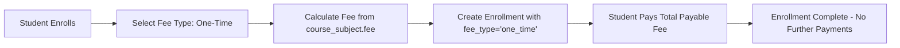
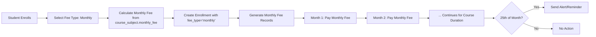
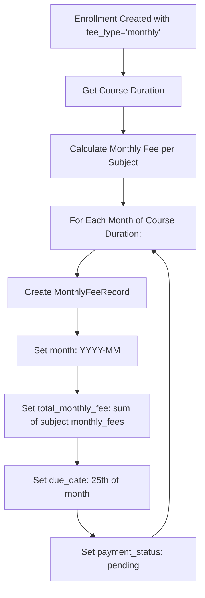

# Fee Type Feature: One-Time vs Monthly Fee Structure

## Overview

The user wants two fee types for student enrollment:

1. **এককালিন (One-time)**: Student pays enrollment fee + course fee once. No further payments needed.
2. **মাসিক (Monthly)**: Student pays enrollment fee once, then pays monthly subject-wise fees. On the 25th of each month, an alert/reminder is triggered for the monthly fee.

### Concrete Example

> A student enrolls in a course with 2 subjects: English = 500 TK/month and Bangla = 500 TK/month.
> - **One-time**: Student pays the total course fee once (e.g., English 500 + Bangla 500 = 1000 TK × course duration months, or a fixed one-time price).
> - **Monthly**: Student pays 1000 TK every month (500 + 500) until the end of the full course duration. On the 25th of each month, an alert reminds the student to pay.

### Enrollment Activation Rule

> **When a student pays the enrollment fee (initial payment), the student becomes `active` immediately.** This applies to both one-time and monthly fee types:
> - **One-time**: Paying the full (or partial) payable fee activates the student. If partial, remaining due is tracked.
> - **Monthly**: Paying the initial enrollment fee activates the student. Monthly fee records are generated, and each month's fee is tracked separately.
>
> The existing logic in [`determineEnrollmentStatus()`](Modules/Enrollment/app/Services/EnrollmentService.php:429) already handles this: if `paid >= payable`, status = `active`. For monthly enrollments, the `payable_fee` would be the initial enrollment fee (not the full course duration total), so paying it activates the student.

### Payment & Notification Requirements

1. **Self-payment via Student Portal**: Students can log into their own portal and pay fees online using integrated payment gateways (bKash, Nagad, Rocket, Bank, Card, etc.).
2. **Admin/Super Admin Manual Payment**: Admins can record payments on behalf of students (already partially exists in the system).
3. **Payment Confirmation**: After every successful payment (whether self or admin), the student receives:
   - **Email confirmation** to their registered email
   - **SMS confirmation** to their registered mobile number
4. **Existing Infrastructure**: The system already has:
   - [`NotificationService`](Modules/Enrollment/app/Services/NotificationService.php) — handles email + SMS for enrollment events
   - [`SmsService`](Modules/Core/app/Services/SmsService.php) — SMS gateway integration (configurable via `config/services.php`)
   - Laravel Mail — configured with SMTP/SES/Postmark support
   - Payment methods already include: `cash`, `bkash`, `nagad`, `rocket`, `bank`, `card`

---

## Current System Analysis

### Existing Database Schema

- **`enrollments` table**: Has `total_fee`, `discount_percent`, `discount_reason`, `payable_fee`, `paid_amount`, `due_amount`, `payment_status` — but **no `fee_type` column**.
- **`course_subject` pivot table**: Has a single `fee` column per subject — **no `monthly_fee` column**.
- **`payments` table**: Generic payment records tied to `enrollment_id` — no concept of monthly vs one-time.

### Existing Backend Logic

- [`EnrollmentService::calculateFee()`](Modules/Enrollment/app/Services/EnrollmentService.php:80) sums subject fees from the pivot table, applies discounts, returns `total_fee`, `payable_fee`, etc. No fee type awareness.
- [`EnrollmentService::enroll()`](Modules/Enrollment/app/Services/EnrollmentService.php:192) creates enrollment with calculated fee. No fee type stored.
- [`EnrollmentController::enroll()`](Modules/Enrollment/app/Http/Controllers/Api/V1/EnrollmentController.php:89) validates and delegates to service. No `fee_type` in validation.

### Existing Frontend

- [`EnrollmentWizard.vue`](frontend/src/pages/dashboard/enrollment/EnrollmentWizard.vue:152) has a 5-step wizard (Type → Student → Academic → Course → Payment). No fee type selector.
- [`EnrollmentListPage.vue`](frontend/src/pages/dashboard/enrollment/EnrollmentListPage.vue:1) shows Fee, Paid, Status, Payment columns. No fee type column.
- [`EnrollmentDetailsPage.vue`](frontend/src/pages/dashboard/enrollment/EnrollmentDetailsPage.vue:1) shows enrollment details. No fee type display.

---

## Proposed Architecture

### 1. Database Changes

#### 1.1 New Migration: Add `fee_type` to `enrollments` table

```php
Schema::table('enrollments', function (Blueprint $table) {
    $table->enum('fee_type', ['one_time', 'monthly'])->default('one_time')->after('payment_status');
});
```

#### 1.2 New Migration: Add `monthly_fee` to `course_subject` pivot table

```php
Schema::table('course_subject', function (Blueprint $table) {
    $table->decimal('monthly_fee', 10, 2)->default(0)->after('fee');
});
```

This allows each subject to have:
- `fee` → One-time fee (for one-time enrollments)
- `monthly_fee` → Monthly fee (for monthly enrollments)

#### 1.3 New Migration: Create `monthly_fee_records` table

```php
Schema::create('monthly_fee_records', function (Blueprint $table) {
    $table->uuid('id')->primary();
    $table->uuid('enrollment_id');
    $table->string('month', 7); // e.g., '2026-05'
    $table->decimal('total_monthly_fee', 10, 2)->default(0);
    $table->decimal('paid_amount', 10, 2)->default(0);
    $table->decimal('due_amount', 10, 2)->default(0);
    $table->enum('payment_status', ['pending', 'partial', 'paid'])->default('pending');
    $table->date('due_date')->nullable(); // 25th of each month
    $table->timestamp('paid_at')->nullable();
    $table->timestamps();

    $table->foreign('enrollment_id')->references('id')->on('enrollments')->onDelete('cascade');
    $table->unique(['enrollment_id', 'month']); // one record per month per enrollment
});
```

#### 1.4 New Migration: Create `monthly_fee_payments` table (for tracking individual payments against monthly records)

```php
Schema::create('monthly_fee_payments', function (Blueprint $table) {
    $table->uuid('id')->primary();
    $table->uuid('monthly_fee_record_id');
    $table->uuid('payment_id')->nullable(); // link to existing payments table
    $table->decimal('amount', 10, 2);
    $table->string('payment_method', 50);
    $table->string('transaction_id', 100)->nullable();
    $table->string('reference', 100)->nullable();
    $table->datetime('payment_date');
    $table->text('note')->nullable();
    $table->timestamps();

    $table->foreign('monthly_fee_record_id')->references('id')->on('monthly_fee_records')->onDelete('cascade');
    $table->foreign('payment_id')->references('id')->on('payments')->onDelete('set null');
});
```

### 2. Backend Changes

#### 2.1 Update [`Course.php`](Modules/Enrollment/app/Models/Course.php:69) Model

Add `monthly_fee` to the pivot columns in the `subjects()` relationship:

```php
public function subjects()
{
    return $this->belongsToMany(Subject::class, 'course_subject', 'course_id', 'subject_id')
        ->withPivot(['fee', 'monthly_fee', 'is_optional', 'is_mandatory', 'sort_order'])
        ->withTimestamps();
}
```

#### 2.2 Update [`Enrollment.php`](Modules/Enrollment/app/Models/Enrollment.php:17) Model

Add `fee_type` to `$fillable`:

```php
protected $fillable = [
    // ... existing fields ...
    'fee_type', // NEW
];
```

Add new relationship:

```php
public function monthlyFeeRecords()
{
    return $this->hasMany(MonthlyFeeRecord::class, 'enrollment_id');
}
```

#### 2.3 Create `MonthlyFeeRecord` Model

```php
// Modules/Enrollment/app/Models/MonthlyFeeRecord.php
class MonthlyFeeRecord extends BaseModel
{
    protected $table = 'monthly_fee_records';
    
    protected $fillable = [
        'enrollment_id', 'month', 'total_monthly_fee',
        'paid_amount', 'due_amount', 'payment_status',
        'due_date', 'paid_at',
    ];

    public function enrollment()
    {
        return $this->belongsTo(Enrollment::class);
    }

    public function payments()
    {
        return $this->hasMany(MonthlyFeePayment::class, 'monthly_fee_record_id');
    }
}
```

#### 2.4 Create `MonthlyFeePayment` Model

```php
// Modules/Enrollment/app/Models/MonthlyFeePayment.php
class MonthlyFeePayment extends BaseModel
{
    protected $table = 'monthly_fee_payments';

    protected $fillable = [
        'monthly_fee_record_id', 'payment_id', 'amount',
        'payment_method', 'transaction_id', 'reference',
        'payment_date', 'note',
    ];

    public function monthlyFeeRecord()
    {
        return $this->belongsTo(MonthlyFeeRecord::class);
    }
}
```

#### 2.5 Payment Gateway Integration (for Student Self-Payment)

Create a payment gateway abstraction layer to support multiple providers (bKash, Nagad, Rocket, etc.):

```php
// Modules/Enrollment/app/Services/Payment/PaymentGatewayInterface.php
interface PaymentGatewayInterface
{
    public function initiatePayment(array $data): array;
    public function verifyPayment(string $transactionId): array;
    public function processRefund(string $transactionId, float $amount): array;
}
```

```php
// Modules/Enrollment/app/Services/Payment/BkashGateway.php
class BkashGateway implements PaymentGatewayInterface
{
    public function initiatePayment(array $data): array
    {
        // Call bKash API to create payment session
        // Return payment URL + transaction ID for redirect
    }
    public function verifyPayment(string $transactionId): array
    {
        // Call bKash API to verify payment status
    }
    public function processRefund(string $transactionId, float $amount): array
    {
        // Call bKash API to process refund
    }
}
```

```php
// Modules/Enrollment/app/Services/Payment/NagadGateway.php
class NagadGateway implements PaymentGatewayInterface
{
    // Similar implementation for Nagad API
}
```

```php
// Modules/Enrollment/app/Services/Payment/PaymentGatewayManager.php
class PaymentGatewayManager
{
    private array $gateways = [];

    public function __construct()
    {
        $this->gateways = [
            'bkash' => app(BkashGateway::class),
            'nagad' => app(NagadGateway::class),
            'rocket' => app(RocketGateway::class),
            'bank'   => app(BankGateway::class),
            'card'   => app(CardGateway::class),
        ];
    }

    public function gateway(string $name): PaymentGatewayInterface
    {
        if (!isset($this->gateways[$name])) {
            throw new \Exception("Unsupported payment gateway: {$name}");
        }
        return $this->gateways[$name];
    }

    public function initiate(string $gateway, array $data): array
    {
        return $this->gateway($gateway)->initiatePayment($data);
    }

    public function verify(string $gateway, string $transactionId): array
    {
        return $this->gateway($gateway)->verifyPayment($transactionId);
    }
}
```

#### 2.6 Payment Notification Service (Email + SMS on Payment)

Extend the existing [`NotificationService`](Modules/Enrollment/app/Services/NotificationService.php) to handle payment confirmations:

```php
// Add to NotificationService.php
public function sendPaymentConfirmation(
    Enrollment $enrollment,
    float $amount,
    string $method,
    string $type = 'one_time',
    ?string $month = null
): array
{
    $results = ['email_sent' => false, 'sms_sent' => false];
    $student = $enrollment->student;

    $data = [
        'student_name'  => $student?->full_name ?? $student?->first_name ?? 'Student',
        'enrollment_no' => $enrollment->enrollment_no,
        'amount'        => $amount,
        'payment_method'=> $method,
        'payment_type'  => $type, // 'one_time' or 'monthly'
        'month'         => $month, // e.g., '2026-05' for monthly payments
        'total_paid'    => $enrollment->paid_amount,
        'total_due'     => $enrollment->due_amount,
        'payment_date'  => now()->format('d/m/Y h:i A'),
    ];

    // Send email to student
    if ($student?->email) {
        $this->sendEmail(
            $student->email,
            "Payment Confirmed - {$enrollment->enrollment_no}",
            $this->buildPaymentEmailBody($data),
            $data
        );
        $results['email_sent'] = true;
    }

    // Send email to guardian
    $guardianEmail = $enrollment->guardian_email
        ?? $student?->guardian?->guardian_email
        ?? null;
    if ($guardianEmail) {
        $this->sendEmail(
            $guardianEmail,
            "Payment Receipt - {$enrollment->enrollment_no}",
            $this->buildPaymentEmailBody($data),
            $data
        );
    }

    // Send SMS to student
    if ($student?->phone) {
        $this->sendSms($student->phone, $this->buildPaymentSms($data));
        $results['sms_sent'] = true;
    }

    // Send SMS to guardian
    $guardianPhone = $enrollment->guardian_phone
        ?? $student?->guardian?->guardian_phone
        ?? null;
    if ($guardianPhone && $guardianPhone !== $student?->phone) {
        $this->sendSms($guardianPhone, $this->buildPaymentSms($data));
    }

    return $results;
}

private function buildPaymentEmailBody(array $data): string
{
    $typeLabel = $data['payment_type'] === 'monthly'
        ? "Monthly Fee ({$data['month']})"
        : "One-time Fee";

    return <<<HTML
    <div style="font-family: Arial, sans-serif; max-width: 600px; margin: 0 auto;">
        <h2 style="color: #27ae60;">✅ Payment Confirmed</h2>
        <p>Dear <strong>{$data['student_name']}</strong>,</p>
        <p>Your payment has been received successfully.</p>
        <table style="width: 100%; border-collapse: collapse; margin: 20px 0;">
            <tr><td style="padding: 8px; border: 1px solid #ddd;"><strong>Enrollment</strong></td>
                <td style="padding: 8px; border: 1px solid #ddd;">{$data['enrollment_no']}</td></tr>
            <tr><td style="padding: 8px; border: 1px solid #ddd;"><strong>Payment Type</strong></td>
                <td style="padding: 8px; border: 1px solid #ddd;">{$typeLabel}</td></tr>
            <tr><td style="padding: 8px; border: 1px solid #ddd;"><strong>Amount</strong></td>
                <td style="padding: 8px; border: 1px solid #ddd;">৳{$data['amount']}</td></tr>
            <tr><td style="padding: 8px; border: 1px solid #ddd;"><strong>Method</strong></td>
                <td style="padding: 8px; border: 1px solid #ddd;">{$data['payment_method']}</td></tr>
            <tr><td style="padding: 8px; border: 1px solid #ddd;"><strong>Date</strong></td>
                <td style="padding: 8px; border: 1px solid #ddd;">{$data['payment_date']}</td></tr>
            <tr><td style="padding: 8px; border: 1px solid #ddd;"><strong>Total Paid</strong></td>
                <td style="padding: 8px; border: 1px solid #ddd;">৳{$data['total_paid']}</td></tr>
        </table>
        <hr>
        <p style="color: #888; font-size: 12px;">CMS Coaching Management System</p>
    </div>
    HTML;
}

private function buildPaymentSms(array $data): string
{
    $typeLabel = $data['payment_type'] === 'monthly'
        ? "Monthly Fee ({$data['month']})"
        : "One-time Fee";

    return "CMS Coaching: Payment Received!\n"
        . "Enrollment: {$data['enrollment_no']}\n"
        . "Type: {$typeLabel}\n"
        . "Amount: ৳{$data['amount']}\n"
        . "Method: {$data['payment_method']}\n"
        . "Date: {$data['payment_date']}\n"
        . "Total Paid: ৳{$data['total_paid']}\n"
        . "Thank you!";
}
```

#### 2.7 Update [`EnrollmentService::enroll()`](Modules/Enrollment/app/Services/EnrollmentService.php:192) — Fee Type Logic for Activation

For **monthly** enrollments, the `payable_fee` stored on the enrollment should represent the **initial enrollment fee** (not the full course duration total), so that paying it activates the student immediately:

```php
// Inside enroll() method, when creating enrollment:
if ($data['fee_type'] === 'monthly') {
    // For monthly, payable_fee = initial enrollment fee only
    // (e.g., first month's fee or a separate enrollment fee)
    // The monthly fee records handle subsequent months
    $payableFee = $feeCalculation['payable_fee']; // This is the first month's fee
} else {
    // For one-time, payable_fee = total course fee
    $payableFee = $feeCalculation['payable_fee'];
}
```

This ensures that:
- **Monthly enrollment**: Student pays the first month's fee → `paid >= payable` → status becomes `active` immediately
- **One-time enrollment**: Student pays the full course fee → status becomes `active`

#### 2.8 Create `MonthlyFeeService`

```php
// Modules/Enrollment/app/Services/MonthlyFeeService.php
class MonthlyFeeService
{
    /**
     * Generate monthly fee records for a monthly-type enrollment.
     * Called when enrollment is created with fee_type='monthly'.
     */
    public function generateMonthlyRecords(Enrollment $enrollment): void
    {
        // Calculate total monthly fee from course subjects' monthly_fee
        // Generate records for upcoming months based on course duration
        // Set due_date to 25th of each month
    }

    /**
     * Get or create the monthly fee record for a specific month.
     */
    public function getOrCreateMonthlyRecord(Enrollment $enrollment, string $month): MonthlyFeeRecord
    {
        // Find existing record for enrollment_id + month
        // If not found, create one with calculated monthly fee
    }

    /**
     * Record a payment against a monthly fee record.
     */
    public function recordMonthlyPayment(MonthlyFeeRecord $record, array $data): MonthlyFeePayment
    {
        // Create payment record
        // Update paid_amount, due_amount, payment_status on the monthly record
        // Also create a record in the main payments table for consistency
    }

    /**
     * Get students with overdue monthly fees (for alert on 25th).
     */
    public function getOverdueMonthlyFees(string $month): Collection
    {
        // Return all monthly fee records for given month where payment_status != 'paid'
        // Include enrollment and student data for alert generation
    }

    /**
     * Calculate monthly fee for an enrollment based on its course subjects.
     */
    public function calculateMonthlyFee(Enrollment $enrollment): float
    {
        // Sum monthly_fee from course_subject pivot for all subjects
        // Apply any discounts
    }
}
```

#### 2.6 Update [`EnrollmentService::calculateFee()`](Modules/Enrollment/app/Services/EnrollmentService.php:80)

Add `fee_type` parameter to control which fee column to use:

```php
public function calculateFee(Course $course, array $subjectIds = [], ?Student $student = null, string $feeType = 'one_time'): array
{
    $totalFee = 0;
    $subjects = [];
    $feeColumn = $feeType === 'monthly' ? 'monthly_fee' : 'fee';

    if (empty($subjectIds)) {
        $courseSubjects = $course->subjects()->wherePivot('is_mandatory', true)->get();
        foreach ($courseSubjects as $subject) {
            $totalFee += $subject->pivot->{$feeColumn};
            $subjects[] = [
                'id' => $subject->id,
                'name' => $subject->name,
                'fee' => $subject->pivot->{$feeColumn},
                'is_mandatory' => true,
            ];
        }
    } else {
        // ... similar but with selected subjects
    }

    // ... discount calculation remains the same ...

    return [
        'subjects' => $subjects,
        'total_fee' => $totalFee,
        'fee_type' => $feeType, // NEW
        // ... rest remains the same
    ];
}
```

#### 2.7 Update [`EnrollmentService::enroll()`](Modules/Enrollment/app/Services/EnrollmentService.php:192)

Add `fee_type` to enrollment creation and trigger monthly record generation:

```php
public function enroll(Student $student, array $data): Enrollment
{
    return DB::transaction(function () use ($student, $data) {
        // ... existing validation ...

        $feeCalculation = $this->calculateFee(
            $batch->course,
            $data['subject_ids'] ?? [],
            $student,
            $data['fee_type'] ?? 'one_time'  // NEW: pass fee_type
        );

        // ... enrollment number generation ...

        $enrollment = Enrollment::create([
            // ... existing fields ...
            'fee_type' => $data['fee_type'] ?? 'one_time', // NEW
            'total_fee' => $feeCalculation['total_fee'],
            // ... rest remains the same ...
        ]);

        // ... attach subjects ...

        // NEW: If monthly fee type, generate monthly fee records
        if (($data['fee_type'] ?? 'one_time') === 'monthly') {
            app(MonthlyFeeService::class)->generateMonthlyRecords($enrollment);
        }

        // ... increment batch count ...
    });
}
```

#### 2.8 Update [`EnrollmentController::enroll()`](Modules/Enrollment/app/Http/Controllers/Api/V1/EnrollmentController.php:89)

Add `fee_type` to validation rules:

```php
$validated = $request->validate([
    // ... existing rules ...
    'fee_type' => 'in:one_time,monthly', // NEW
]);
```

#### 2.9 Create `MonthlyFeeController`

```php
// Modules/Enrollment/app/Http/Controllers/Api/V1/MonthlyFeeController.php
class MonthlyFeeController extends BaseApiController
{
    public function __construct(
        private MonthlyFeeService $monthlyFeeService
    ) {}

    /**
     * Get monthly fee records for an enrollment.
     */
    public function index(Request $request, $enrollmentId)
    {
        $records = MonthlyFeeRecord::where('enrollment_id', $enrollmentId)
            ->orderBy('month', 'desc')
            ->paginate($this->getPerPage($request));
        return $this->paginatedResponse($records);
    }

    /**
     * Get overdue monthly fees (for alert on 25th).
     */
    public function overdue(Request $request)
    {
        $month = $request->input('month', now()->format('Y-m'));
        $records = $this->monthlyFeeService->getOverdueMonthlyFees($month);
        return $this->collectionResponse(collect($records));
    }

    /**
     * Record payment for a monthly fee record.
     */
    public function pay(Request $request, $recordId)
    {
        $validated = $request->validate([
            'amount' => 'required|numeric|min:0',
            'payment_method' => 'required|string|max:50',
            'transaction_id' => 'nullable|string|max:100',
            'payment_date' => 'nullable|date',
            'note' => 'nullable|string',
        ]);

        $record = MonthlyFeeRecord::findOrFail($recordId);
        $payment = $this->monthlyFeeService->recordMonthlyPayment($record, $validated);
        return $this->created($payment, 'Monthly fee payment recorded');
    }

    /**
     * Get monthly fee summary/dashboard stats.
     */
    public function stats()
    {
        $currentMonth = now()->format('Y-m');
        $totalDue = MonthlyFeeRecord::where('month', $currentMonth)
            ->where('payment_status', '!=', 'paid')
            ->sum('due_amount');
        $totalCollected = MonthlyFeeRecord::where('month', $currentMonth)
            ->sum('paid_amount');
        $pendingCount = MonthlyFeeRecord::where('month', $currentMonth)
            ->where('payment_status', 'pending')
            ->count();

        return $this->success([
            'month' => $currentMonth,
            'total_due' => $totalDue,
            'total_collected' => $totalCollected,
            'pending_count' => $pendingCount,
        ]);
    }
}
```

#### 2.10 Add API Routes

In [`Modules/Enrollment/routes/api.php`]:

```php
// Monthly fee routes
Route::prefix('enrollments/{enrollment}/monthly-fees')->group(function () {
    Route::get('/', [MonthlyFeeController::class, 'index']);
});
Route::prefix('monthly-fees')->group(function () {
    Route::get('overdue', [MonthlyFeeController::class, 'overdue']);
    Route::post('{record}/pay', [MonthlyFeeController::class, 'pay']);
    Route::get('stats', [MonthlyFeeController::class, 'stats']);
});
```

#### 2.11 Create Artisan Command for 25th Alert

```php
// Modules/Enrollment/app/Console/Commands/SendMonthlyFeeReminder.php
class SendMonthlyFeeReminder extends Command
{
    protected $signature = 'monthly-fee:send-reminders';
    protected $description = 'Send monthly fee reminders on the 25th';

    public function handle(MonthlyFeeService $monthlyFeeService)
    {
        $month = now()->format('Y-m');
        $overdue = $monthlyFeeService->getOverdueMonthlyFees($month);

        foreach ($overdue as $record) {
            // Send SMS/Email/Notification to guardian
            // Use existing notification system or SmsService
            $this->info("Reminder sent for enrollment: {$record->enrollment->enrollment_no}");
        }
    }
}
```

Register the command in [`Modules/Enrollment/app/Providers/EnrollmentServiceProvider.php`] and schedule it in the Laravel console kernel:

```php
// In bootstrap/app.php or a service provider
$schedule->command('monthly-fee:send-reminders')->monthlyOn(25, '08:00');
```

### 3. Frontend Changes

#### 3.1 Create `MonthlyFeeService` (Frontend API Service)

```javascript
// frontend/src/services/monthly-fee.service.js
import api from '@/services/api.service';

export default {
    getMonthlyFeeRecords(enrollmentId, params = {}) {
        return api.get(`/enrollments/${enrollmentId}/monthly-fees`, { params });
    },
    getOverdueMonthlyFees(params = {}) {
        return api.get('/monthly-fees/overdue', { params });
    },
    payMonthlyFee(recordId, data) {
        return api.post(`/monthly-fees/${recordId}/pay`, data);
    },
    getMonthlyFeeStats() {
        return api.get('/monthly-fees/stats');
    },
};
```

#### 3.2 Update [`EnrollmentWizard.vue`](frontend/src/pages/dashboard/enrollment/EnrollmentWizard.vue:152)

**Add Fee Type Selection Step** (or add to the Payment step):

In the Payment step template, add a radio button group:

```html
<div class="fee-type-selector">
    <label class="form-label">Fee Type</label>
    <div class="radio-group">
        <label class="radio-card" :class="{ active: feeType === 'one_time' }">
            <input type="radio" v-model="feeType" value="one_time" @change="recalculateFee" />
            <div class="radio-card-content">
                <strong>এককালিন (One-time)</strong>
                <small>Pay full course fee once</small>
            </div>
        </label>
        <label class="radio-card" :class="{ active: feeType === 'monthly' }">
            <input type="radio" v-model="feeType" value="monthly" @change="recalculateFee" />
            <div class="radio-card-content">
                <strong>মাসিক (Monthly)</strong>
                <small>Pay monthly subject-wise fees</small>
            </div>
        </label>
    </div>
</div>
```

Add `feeType` ref:

```javascript
const feeType = ref('one_time');
```

Update `onCourseSelected` to pass fee type:

```javascript
const onCourseSelected = async (course) => {
    selectedCourse.value = course;
    if (course) {
        try {
            const res = await enrollmentService.calculateFee({
                course_id: course.id,
                subject_ids: [],
                fee_type: feeType.value, // NEW
            });
            feeData.value = res.data?.data || res.data;
        } catch {}
    }
};
```

Add `recalculateFee` function triggered when fee type changes:

```javascript
const recalculateFee = async () => {
    if (!selectedCourse.value) return;
    try {
        const res = await enrollmentService.calculateFee({
            course_id: selectedCourse.value.id,
            subject_ids: [],
            fee_type: feeType.value,
        });
        feeData.value = res.data?.data || res.data;
    } catch {}
};
```

Update `submitEnrollment` to include `fee_type` in payload:

```javascript
const enrollPayload = {
    // ... existing fields ...
    fee_type: feeType.value, // NEW
};
```

#### 3.3 Update [`EnrollmentListPage.vue`](frontend/src/pages/dashboard/enrollment/EnrollmentListPage.vue:1)

Add "Fee Type" column in the table header and body:

```html
<th>Fee Type</th>
<!-- ... -->
<td>
    <span :class="['fee-type-badge', enr.fee_type]">
        {{ enr.fee_type === 'monthly' ? '📅 Monthly' : '💳 One-time' }}
    </span>
</td>
```

Add a "Monthly Fees" action button in the row dropdown (only for monthly enrollments):

```html
<router-link 
    v-if="enr.fee_type === 'monthly'" 
    :to="`/dashboard/enrollment/enrollments/${enr.id}/monthly-fees`" 
    class="dropdown-item">
    📅 Monthly Fees
</router-link>
```

#### 3.4 Create `MonthlyFeeListPage.vue`

A new page to view and manage monthly fee records for a specific enrollment:

```vue
<template>
  <div class="monthly-fee-page">
    <div class="page-header">
      <div>
        <h1>📅 Monthly Fees</h1>
        <p>{{ enrollment?.enrollment_no }} - {{ enrollment?.student?.first_name }} {{ enrollment?.student?.last_name }}</p>
      </div>
      <router-link :to="`/dashboard/enrollment/enrollments/${enrollmentId}`" class="btn btn-outline">
        ← Back to Enrollment
      </router-link>
    </div>

    <!-- Monthly Fee Records Table -->
    <table class="table">
      <thead>
        <tr>
          <th>Month</th>
          <th>Total Fee</th>
          <th>Paid</th>
          <th>Due</th>
          <th>Status</th>
          <th>Due Date</th>
          <th>Actions</th>
        </tr>
      </thead>
      <tbody>
        <tr v-for="record in records" :key="record.id">
          <td>{{ record.month }}</td>
          <td>৳{{ Number(record.total_monthly_fee).toLocaleString() }}</td>
          <td>৳{{ Number(record.paid_amount).toLocaleString() }}</td>
          <td>৳{{ Number(record.due_amount).toLocaleString() }}</td>
          <td><span :class="['status-badge', record.payment_status]">{{ record.payment_status }}</span></td>
          <td>{{ record.due_date }}</td>
          <td>
            <button v-if="record.payment_status !== 'paid'" class="btn btn-sm btn-primary" @click="openPayModal(record)">
              💰 Pay
            </button>
          </td>
        </tr>
      </tbody>
    </table>

    <!-- Pay Modal -->
    <div v-if="showPayModal" class="modal-overlay" @click.self="showPayModal = false">
      <div class="modal-content">
        <h3>Pay Monthly Fee - {{ selectedRecord?.month }}</h3>
        <div class="form-group">
          <label>Amount (Due: ৳{{ selectedRecord?.due_amount }})</label>
          <input v-model.number="payAmount" type="number" class="form-control" :max="selectedRecord?.due_amount" />
        </div>
        <div class="form-group">
          <label>Payment Method</label>
          <select v-model="payMethod" class="form-control">
            <option value="cash">Cash</option>
            <option value="bkash">bKash</option>
            <option value="nagad">Nagad</option>
            <option value="rocket">Rocket</option>
            <option value="bank">Bank</option>
          </select>
        </div>
        <div class="form-group">
          <label>Transaction ID (optional)</label>
          <input v-model="payTransactionId" class="form-control" />
        </div>
        <div class="modal-footer">
          <button class="btn btn-outline" @click="showPayModal = false">Cancel</button>
          <button class="btn btn-primary" @click="submitPayment" :disabled="paying">
            {{ paying ? 'Processing...' : 'Pay Now' }}
          </button>
        </div>
      </div>
    </div>
  </div>
</template>
```

#### 3.5 Create `MonthlyFeeDashboard.vue` (Optional)

A dashboard widget showing monthly fee collection stats, overdue students, and alerts for the 25th.

#### 3.6 Add Routes to [`frontend/src/router/index.js`](frontend/src/router/index.js:59)

```javascript
{ path: 'enrollment/enrollments/:id/monthly-fees', name: 'MonthlyFeeList', component: () => import('@/pages/dashboard/enrollment/MonthlyFeeListPage.vue'), meta: { permission: 'view enrollments' } },
```

Add `'view monthly fees'` permission to admin defaults if needed, or reuse `'view enrollments'`.

#### 3.7 Update [`EnrollmentDetailsPage.vue`](frontend/src/pages/dashboard/enrollment/EnrollmentDetailsPage.vue:1)

Add fee type display in the fee summary section:

```html
<div class="detail-row">
    <span class="label">Fee Type</span>
    <span class="value">
        <span :class="['fee-type-badge', enrollment.fee_type]">
            {{ enrollment.fee_type === 'monthly' ? '📅 Monthly' : '💳 One-time' }}
        </span>
    </span>
</div>
```

Add a "View Monthly Fees" button when `fee_type === 'monthly'`:

```html
<router-link 
    v-if="enrollment.fee_type === 'monthly'" 
    :to="`/dashboard/enrollment/enrollments/${enrollment.id}/monthly-fees`" 
    class="btn btn-sm btn-info">
    📅 Monthly Fees
</router-link>
```

#### 3.8 Student Portal: Self-Payment Page (New)

Create a student-facing page where students can view their enrollments and pay fees online:

```vue
<!-- frontend/src/pages/student/StudentFeePaymentPage.vue -->
<template>
  <div class="student-fee-page">
    <h1>💰 My Fee Payments</h1>
    
    <!-- One-Time Enrollments -->
    <div v-for="enr in oneTimeEnrollments" :key="enr.id" class="fee-card">
      <div class="fee-card-header">
        <strong>{{ enr.batch?.course?.name }}</strong>
        <span class="badge" :class="enr.payment_status">{{ enr.payment_status }}</span>
      </div>
      <div class="fee-card-body">
        <p>Enrollment: {{ enr.enrollment_no }}</p>
        <p>Total Fee: ৳{{ enr.payable_fee }} | Paid: ৳{{ enr.paid_amount }} | Due: ৳{{ enr.due_amount }}</p>
      </div>
      <div class="fee-card-actions" v-if="enr.due_amount > 0">
        <button class="btn btn-primary" @click="payOneTime(enr)">
          💳 Pay Due (৳{{ enr.due_amount }})
        </button>
      </div>
    </div>

    <!-- Monthly Enrollments -->
    <div v-for="enr in monthlyEnrollments" :key="enr.id" class="fee-card monthly">
      <div class="fee-card-header">
        <strong>{{ enr.batch?.course?.name }} (Monthly)</strong>
        <span class="badge" :class="enr.payment_status">{{ enr.payment_status }}</span>
      </div>
      <div class="fee-card-body">
        <p>Enrollment: {{ enr.enrollment_no }}</p>
        <!-- Monthly Records -->
        <table class="table table-sm">
          <thead>
            <tr><th>Month</th><th>Fee</th><th>Paid</th><th>Due</th><th>Status</th><th>Action</th></tr>
          </thead>
          <tbody>
            <tr v-for="rec in enr.monthly_records" :key="rec.id">
              <td>{{ rec.month }}</td>
              <td>৳{{ rec.total_monthly_fee }}</td>
              <td>৳{{ rec.paid_amount }}</td>
              <td>৳{{ rec.due_amount }}</td>
              <td><span class="badge" :class="rec.payment_status">{{ rec.payment_status }}</span></td>
              <td>
                <button v-if="rec.payment_status !== 'paid'" class="btn btn-sm btn-primary"
                        @click="payMonthly(rec)">
                  Pay
                </button>
              </td>
            </tr>
          </tbody>
        </table>
      </div>
    </div>

    <!-- Payment Gateway Modal -->
    <div v-if="showGatewayModal" class="modal-overlay" @click.self="showGatewayModal = false">
      <div class="modal-content">
        <h3>Select Payment Method</h3>
        <p>Amount: ৳{{ paymentAmount }}</p>
        <div class="gateway-grid">
          <button v-for="gw in gateways" :key="gw.id" class="gateway-btn"
                  @click="initiateGatewayPayment(gw.id)">
            
            <span>{{ gw.name }}</span>
          </button>
        </div>
        <div class="modal-footer">
          <button class="btn btn-outline" @click="showGatewayModal = false">Cancel</button>
        </div>
      </div>
    </div>
  </div>
</template>
```

The student portal page would:
1. List all enrollments for the logged-in student (filtered by `student_id` from JWT)
2. Show due amounts for one-time enrollments
3. Show monthly fee records for monthly enrollments
4. Allow students to select a payment gateway (bKash, Nagad, Rocket, etc.)
5. Redirect to the gateway for payment, then verify on return
6. After successful payment, trigger [`NotificationService::sendPaymentConfirmation()`](Modules/Enrollment/app/Services/NotificationService.php) for email + SMS

#### 3.9 Add Student Portal Route

In [`frontend/src/router/index.js`](frontend/src/router/index.js:59):

```javascript
{ path: 'student/fees', name: 'StudentFeePayment', component: () => import('@/pages/student/StudentFeePaymentPage.vue'), meta: { permission: 'view fee collections' } },
```

This route would be under the student role's accessible paths (already has `'view fee collections'` in the student role defaults at line 169).

---

## Data Flow Diagrams

### One-Time Fee Flow



### Monthly Fee Flow



### Monthly Fee Record Generation



---

## File Change Summary

### New Files to Create

| File | Purpose |
|------|---------|
| `Modules/Enrollment/database/migrations/2026_05_16_000001_add_fee_type_to_enrollments.php` | Add `fee_type` column |
| `Modules/Enrollment/database/migrations/2026_05_16_000002_add_monthly_fee_to_course_subject.php` | Add `monthly_fee` column |
| `Modules/Enrollment/database/migrations/2026_05_16_000003_create_monthly_fee_records_table.php` | Create monthly fee records table |
| `Modules/Enrollment/database/migrations/2026_05_16_000004_create_monthly_fee_payments_table.php` | Create monthly fee payments table |
| `Modules/Enrollment/app/Models/MonthlyFeeRecord.php` | MonthlyFeeRecord model |
| `Modules/Enrollment/app/Models/MonthlyFeePayment.php` | MonthlyFeePayment model |
| `Modules/Enrollment/app/Services/MonthlyFeeService.php` | Monthly fee business logic |
| `Modules/Enrollment/app/Services/Payment/PaymentGatewayInterface.php` | Payment gateway interface |
| `Modules/Enrollment/app/Services/Payment/PaymentGatewayManager.php` | Payment gateway manager/factory |
| `Modules/Enrollment/app/Services/Payment/BkashGateway.php` | bKash payment gateway implementation |
| `Modules/Enrollment/app/Services/Payment/NagadGateway.php` | Nagad payment gateway implementation |
| `Modules/Enrollment/app/Services/Payment/RocketGateway.php` | Rocket payment gateway implementation |
| `Modules/Enrollment/app/Services/Payment/BankGateway.php` | Bank transfer gateway implementation |
| `Modules/Enrollment/app/Services/Payment/CardGateway.php` | Card payment gateway implementation |
| `Modules/Enrollment/app/Http/Controllers/Api/V1/MonthlyFeeController.php` | Monthly fee API endpoints |
| `Modules/Enrollment/app/Http/Controllers/Api/V1/PaymentGatewayController.php` | Payment gateway initiation/verification endpoints |
| `Modules/Enrollment/app/Console/Commands/SendMonthlyFeeReminder.php` | Artisan command for 25th alerts |
| `frontend/src/services/monthly-fee.service.js` | Frontend API service |
| `frontend/src/pages/dashboard/enrollment/MonthlyFeeListPage.vue` | Monthly fee list/management page (admin) |
| `frontend/src/pages/student/StudentFeePaymentPage.vue` | Student self-payment portal page |

### Existing Files to Modify

| File | Changes |
|------|---------|
| `Modules/Enrollment/app/Models/Course.php` | Add `monthly_fee` to pivot columns |
| `Modules/Enrollment/app/Models/Enrollment.php` | Add `fee_type` to fillable, add `monthlyFeeRecords()` relationship |
| `Modules/Enrollment/app/Services/EnrollmentService.php` | Update `calculateFee()` to accept `fee_type`, update `enroll()` to store `fee_type` and trigger monthly record generation |
| `Modules/Enrollment/app/Services/NotificationService.php` | Add `sendPaymentConfirmation()` method with email + SMS |
| `Modules/Enrollment/app/Http/Controllers/Api/V1/EnrollmentController.php` | Add `fee_type` to validation rules |
| `Modules/Enrollment/routes/api.php` | Add monthly fee + payment gateway API routes |
| `frontend/src/pages/dashboard/enrollment/EnrollmentWizard.vue` | Add fee type selector, pass `fee_type` to API |
| `frontend/src/pages/dashboard/enrollment/EnrollmentListPage.vue` | Add Fee Type column, add Monthly Fees action |
| `frontend/src/pages/dashboard/enrollment/EnrollmentDetailsPage.vue` | Display fee type, add Monthly Fees link |
| `frontend/src/router/index.js` | Add MonthlyFeeList route + StudentFeePayment route |
| `Modules/Enrollment/app/Providers/EnrollmentServiceProvider.php` | Register MonthlyFeeService, PaymentGatewayManager, register command |
| `bootstrap/app.php` or scheduler | Schedule monthly fee reminder command |

---

## Implementation Order

1. **Database Migrations** — Create all 4 new migrations
2. **Models** — Create MonthlyFeeRecord, MonthlyFeePayment models; update Course and Enrollment models
3. **Backend Services** — Create MonthlyFeeService, PaymentGatewayInterface + implementations, PaymentGatewayManager; update EnrollmentService, NotificationService
4. **Backend Controllers** — Create MonthlyFeeController, PaymentGatewayController; update EnrollmentController
5. **API Routes** — Add monthly fee + payment gateway routes
6. **Artisan Command** — Create and schedule the 25th reminder command
7. **Frontend Service** — Create monthly-fee.service.js
8. **Frontend Wizard** — Update EnrollmentWizard.vue with fee type selector
9. **Frontend List** — Update EnrollmentListPage.vue with fee type column
10. **Frontend Details** — Update EnrollmentDetailsPage.vue
11. **Frontend Monthly Fee Page (Admin)** — Create MonthlyFeeListPage.vue
12. **Frontend Student Portal** — Create StudentFeePaymentPage.vue
13. **Router** — Add admin + student routes
14. **Test** — Verify one-time and monthly enrollment flows, payment gateways, and notifications end-to-end
