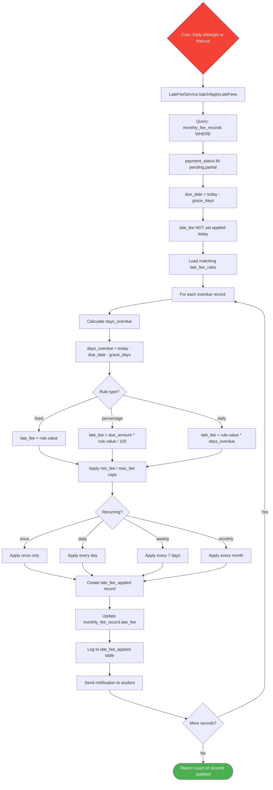
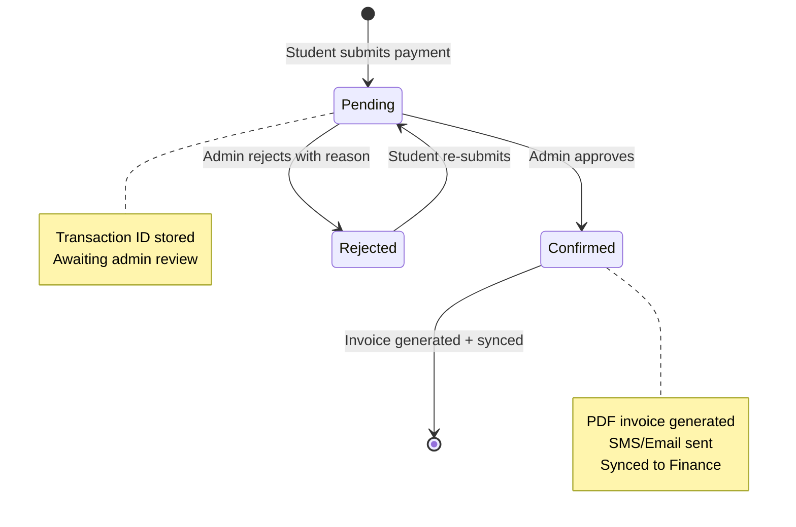
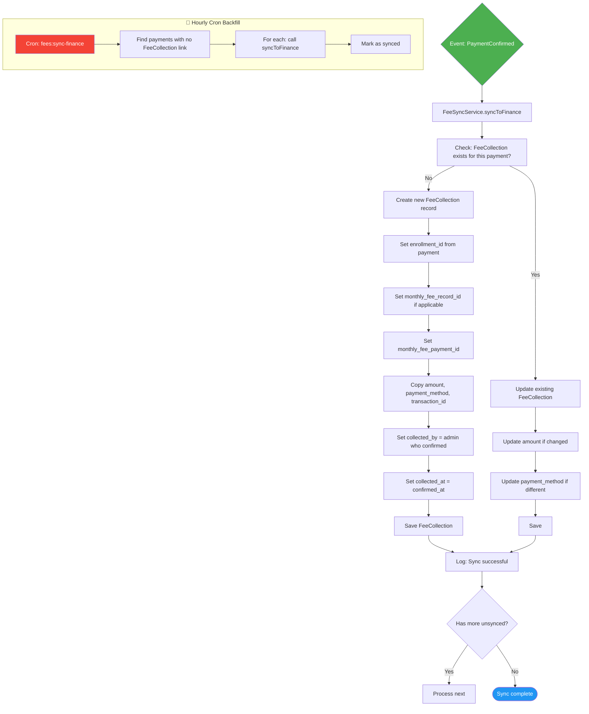
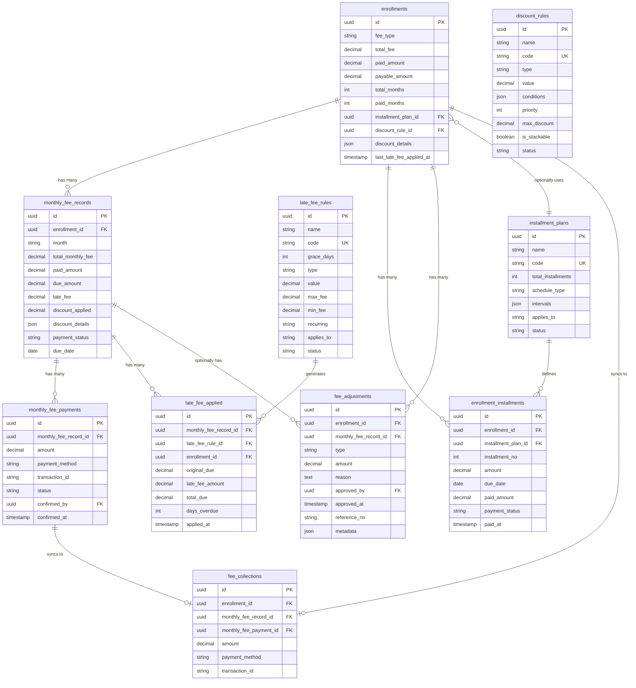

# Level 1: Working Flow & Diagrams — Advanced Dynamic Fee Management

> **Project:** Coaching Management System (CMS)
> **Scope:** Phases 0-5 (Configurable Rules, Installments, Finance Sync, Reports, Student Portal)
> **Date:** 2026-05-18

---

## Table of Contents

1. [Complete Fee Lifecycle Flow](#1-complete-fee-lifecycle-flow)
2. [Discount Rule Engine Flow](#2-discount-rule-engine-flow)
3. [Late Fee Application Flow](#3-late-fee-application-flow)
4. [Installment Plan Flow](#4-installment-plan-flow)
5. [Payment Confirmation Workflow](#5-payment-confirmation-workflow)
6. [Finance Sync Flow](#6-finance-sync-flow)
7. [Student Portal Flow](#7-student-portal-flow)
8. [Scheduled Jobs Flow](#8-scheduled-jobs-flow)
9. [Database Relationship Diagram](#9-database-relationship-diagram)
10. [Frontend Navigation Flow](#10-frontend-navigation-flow)

---

## 1. Complete Fee Lifecycle Flow

This diagram shows the **end-to-end lifecycle** of a fee — from setup through enrollment, payment, and monitoring.

```mermaid
flowchart TD
    %% ===== SETUP PHASE =====
    subgraph Setup["🏗️ Setup Phase Admin Configures"]
        A1[Create Course] --> A2[Assign Subjects with fee/monthly_fee]
        A3[Create Discount Rules] --> A4[Set Conditions sibling/merit/early-bird/loyalty]
        A5[Create Late Fee Rules] --> A6[Set grace_days type value max_cap]
        A7[Create Installment Plans] --> A8[Define schedule 50-25-25 / 3-month-equal]
    end

    %% ===== ENROLLMENT PHASE =====
    subgraph Enrollment["📝 Enrollment Phase"]
        B1[Student Enrolls] --> B2{Select Fee Type}
        B2 -->|One-time| B3[Calculate total fee from subjects]
        B2 -->|Monthly| B4[Calculate monthly fee from subjects]
        B3 --> B5[DiscountService: Load active rules]
        B4 --> B5
        B5 --> B6[Evaluate each rule's conditions]
        B6 --> B7[Apply highest stackable discount]
        B7 --> B8{Installment Plan Selected?}
        B8 -->|Yes| B9[InstallmentService: Generate schedule]
        B8 -->|No| B10[Payable = total_fee - discount]
        B9 --> B10
        B10 --> B11[Create Enrollment record]
        B11 --> B12{Fee Type = monthly?}
        B12 -->|Yes| B13[MonthlyFeeService: Generate 12 monthly records]
        B12 -->|No| B14[Single payment tracking only]
    end

    %% ===== PAYMENT PHASE =====
    subgraph Payment["💳 Payment Phase"]
        C1[Payment Received] --> C2{Source?}
        C2 -->|Admin Dashboard| C3[Admin records payment manually]
        C2 -->|Student Portal| C4[Student pays via gateway]
        C2 -->|Enrollment Wizard| C5[Initial payment at enrollment]
        C3 --> C6{Payment Method?}
        C4 --> C6
        C5 --> C6
        C6 -->|Cash| C7[Immediately Confirmed]
        C6 -->|bKash / Nagad / Rocket| C8[Pending Confirmation]
        C8 --> C9[Admin reviews in PaymentConfirmationPage]
        C9 -->|Approve| C7
        C9 -->|Reject| C10[Notify student with reason]
        C7 --> C11[InvoiceService: Generate PDF invoice]
        C11 --> C12[Update MonthlyFeeRecord: paid_amount += amount]
        C12 --> C13[Update Enrollment: paid_amount += amount]
        C13 --> C14{Has Installments?}
        C14 -->|Yes| C15[InstallmentService: Mark installment as paid]
        C14 -->|No| C16[Skip]
        C15 --> C17[FeeSyncService: Sync to Finance module]
        C16 --> C17
        C17 --> C18[NotificationService: Send SMS + Email receipt]
    end

    %% ===== MONITORING PHASE =====
    subgraph Monitoring["⏰ Monitoring Phase Cron Jobs"]
        D1[Cron: Daily midnight] --> D2[LateFeeService: Find overdue records]
        D2 --> D3[Check grace period]
        D3 --> D4[Calculate late fee amount]
        D4 --> D5[Create late_fee_applied log]
        D5 --> D6[Update monthly_fee_record.late_fee]
        D6 --> D7[NotificationService: Send overdue SMS]
        
        D8[Cron: 25th each month] --> D9[Find records due this month]
        D9 --> D10[Send due reminder SMS/Email]
        
        D11[Cron: Hourly] --> D12[FeeSyncService: Find unsynced payments]
        D12 --> D13[Sync to Finance FeeCollection]
    end

    %% ===== STYLE =====
    style A1 fill:#4CAF50,color:#fff
    style A3 fill:#FF9800,color:#fff
    style A5 fill:#FF9800,color:#fff
    style A7 fill:#FF9800,color:#fff
    style B1 fill:#2196F3,color:#fff
    style C1 fill:#9C27B0,color:#fff
    style C7 fill:#4CAF50,color:#fff
    style D1 fill:#f44336,color:#fff
    style D8 fill:#f44336,color:#fff
    style D11 fill:#f44336,color:#fff
```



---

## 2. Discount Rule Engine Flow

This diagram shows how the `DiscountService` evaluates rules and applies discounts.

```mermaid
flowchart TD
    START([Enrollment Created or Fee Calculated]) --> A[DiscountService.calculateDiscounts]
    A --> B[Load all active discount_rules from DB]
    B --> C[Sort rules by priority ASC]
    C --> D[Initialize: applicable = []]
    D --> E{More rules to check?}
    E -->|Yes| F[Get next rule]
    F --> G[Parse rule.conditions JSON]
    G --> H{Rule type?}
    
    H -->|sibling| SIB[Check guardian phone match]
    SIB --> SIB1[Get student's guardian phone]
    SIB1 --> SIB2[Count active enrollments with same phone]
    SIB2 --> SIB3{count >= min_count?}
    SIB3 -->|Yes| PASS[Rule applies]
    SIB3 -->|No| E
    
    H -->|merit| MER[Check student's previous GPA]
    MER --> MER1[Load previous academic results]
    MER1 --> MER2{GPA >= min_gpa?}
    MER2 -->|Yes| PASS
    MER2 -->|No| E
    
    H -->|early_bird| EAR[Check enrollment date vs session start]
    EAR --> EAR1{now < session.start_date - days_before?}
    EAR1 -->|Yes| PASS
    EAR1 -->|No| E
    
    H -->|loyalty| LOY[Count previous completed enrollments]
    LOY --> LOY1{count >= min_renewals?}
    LOY1 -->|Yes| PASS
    LOY1 -->|No| E
    
    H -->|referral| REF[Count referrals by this student]
    REF --> REF1{count >= referral_count?}
    REF1 -->|Yes| PASS
    REF1 -->|No| E
    
    H -->|subject_count| SUB[Count enrolled subjects]
    SUB --> SUB1{count >= min_subjects?}
    SUB1 -->|Yes| PASS
    SUB1 -->|No| E
    
    H -->|payment_method| PAY{Selected method matches?}
    PAY -->|Yes| PASS
    PAY -->|No| E
    
    PASS --> APPLY[Add to applicable list]
    APPLY --> E
    
    E -->|No more rules| F1[Separate stackable vs non-stackable]
    F1 --> F2[For non-stackable: pick highest percent]
    F2 --> F3[For stackable: combine all applicable]
    F3 --> F4[Check max_discount cap]
    F4 --> F5[Calculate final discount amount]
    F5 --> F6[Return: percent, amount, breakdown]
    F6 --> END([Fee calculation updated with discount])

    style START fill:#4CAF50,color:#fff
    style END fill:#2196F3,color:#fff
    style PASS fill:#FF9800,color:#fff
```

### Discount Rule Data Model

```sql
-- Each rule stored as a row in discount_rules table
-- conditions column stores JSON like:
-- {"type": "sibling", "min_count": 1, "same_guardian": true}
-- {"type": "merit", "min_gpa": 4.5, "subject": "all"}
-- {"type": "early_bird", "days_before_start": 30}
-- {"type": "loyalty", "min_renewals": 1}

discount_rules
├── id              UUID PRIMARY KEY
├── name            VARCHAR(255)      -- "Sibling Discount"
├── code            VARCHAR(50)       -- "SIBLING_10"
├── type            ENUM             -- percentage / fixed
├── value           DECIMAL(10,2)    -- 10.00 for 10%
├── conditions      JSON             -- Rule-specific conditions
├── priority        INT              -- Evaluation order
├── max_discount    DECIMAL(10,2)    -- Cap
├── is_stackable    BOOLEAN          -- Can combine?
└── status          ENUM             -- active / inactive
```

---

## 3. Late Fee Application Flow

This diagram shows how late fees are calculated and applied automatically.



### Late Fee Data Model

```sql
late_fee_rules
├── id              UUID PRIMARY KEY
├── name            VARCHAR(255)      -- "Standard Late Fee"
├── code            VARCHAR(50)       -- "LATE_STANDARD"
├── grace_days      INT DEFAULT 5     -- No fee within 5 days
├── type            ENUM             -- percentage / fixed / daily
├── value           DECIMAL(10,2)    -- 50 for fixed, 2 for 2%, 10 for daily
├── max_fee         DECIMAL(10,2)    -- Cap at 500
├── min_fee         DECIMAL(10,2)    -- Minimum 20
├── recurring       ENUM             -- once / daily / weekly / monthly
└── status          ENUM             -- active / inactive

late_fee_applied
├── id                      UUID PRIMARY KEY
├── monthly_fee_record_id   UUID FK → monthly_fee_records
├── late_fee_rule_id        UUID FK → late_fee_rules
├── enrollment_id           UUID FK → enrollments
├── original_due            DECIMAL(12,2)
├── late_fee_amount         DECIMAL(12,2)
├── total_due               DECIMAL(12,2)
├── days_overdue            INT
└── applied_at              TIMESTAMP
```

---

## 4. Installment Plan Flow

This diagram shows how installment plans are created, assigned, and tracked.

```mermaid
flowchart TD
    %% ===== ADMIN SETUP =====
    subgraph Admin["👨‍💼 Admin Setup"]
        A1[Create Installment Plan] --> A2[Define schedule_type: equal or custom]
        A2 --> A3[Define intervals JSON]
        A3 --> A4[Example: 50-25-25]
        A4 --> A5[{percent:50, due_days:0}, {percent:25, due_days:30}, {percent:25, due_days:60}]
        A5 --> A6[Set applies_to: one_time / monthly / both]
        A6 --> A7[Save to installment_plans table]
    end

    %% ===== ENROLLMENT =====
    subgraph Enrollment["📝 At Enrollment Time"]
        B1[Student selects fee type] --> B2[Fee calculated with discount]
        B2 --> B3{Installment plan available?}
        B3 -->|Yes| B4[Show installment options to student]
        B4 --> B5[Student selects plan]
        B5 --> B6[InstallmentService.generateSchedule]
        B6 --> B7[Calculate per-installment amounts]
        B7 --> B8[Calculate due dates from intervals]
        B8 --> B9[Bulk insert enrollment_installments]
        B9 --> B10[Link installment_plan_id to enrollment]
    end

    %% ===== PAYMENT =====
    subgraph Payment["💳 Payment Tracking"]
        C1[Student makes payment] --> C2{Which installment?}
        C2 -->|Auto-detect| C3[Find oldest unpaid installment]
        C2 -->|Student selects| C4[Student picks specific installment]
        C3 --> C5[InstallmentService.recordInstallmentPayment]
        C4 --> C5
        C5 --> C6[Update installment.paid_amount]
        C6 --> C7{paid_amount >= amount?}
        C7 -->|Yes| C8[Mark as paid + set paid_at]
        C7 -->|No| C9[Mark as partial]
        C8 --> C10[Check: all installments paid?]
        C10 -->|Yes| C11[Mark enrollment as fully paid]
        C10 -->|No| C12[Show next installment due date]
    end

    %% ===== OVERDUE =====
    subgraph Overdue["⚠️ Overdue Monitoring"]
        D1[Cron: Daily] --> D2[Find installments with due_date < today]
        D2 --> D3[payment_status IN pending,partial]
        D3 --> D4[Mark as overdue]
        D4 --> D5[Send reminder to student]
    end

    style A1 fill:#FF9800,color:#fff
    style B1 fill:#2196F3,color:#fff
    style C1 fill:#9C27B0,color:#fff
    style D1 fill:#f44336,color:#fff
```

### Installment Plan Examples

```sql
-- Plan: "50-25-25" (One-time fee of 10,000)
-- intervals: [
--   {"percent": 50, "due_days": 0},    -- 5,000 due at enrollment
--   {"percent": 25, "due_days": 30},   -- 2,500 due in 30 days
--   {"percent": 25, "due_days": 60}    -- 2,500 due in 60 days
-- ]

-- Plan: "3-Month Equal" (Monthly fee of 3,000)
-- intervals: [
--   {"percent": 33.33, "due_days": 0},   -- 1,000 due at enrollment
--   {"percent": 33.33, "due_days": 30},  -- 1,000 due in 30 days
--   {"percent": 33.34, "due_days": 60}   -- 1,000 due in 60 days
-- ]

-- Plan: "Full Payment" (Default)
-- intervals: [
--   {"percent": 100, "due_days": 0}      -- Full amount due at enrollment
-- ]
```

---

## 5. Payment Confirmation Workflow

This diagram shows the **two-step payment confirmation process** (student submits → admin confirms).

```mermaid
flowchart TD
    %% ===== STUDENT SUBMITS =====
    subgraph Student["👨‍🎓 Student Action"]
        A1[Student selects payment method] --> A2{Cash?}
        A2 -->|Yes| A3[Admin marks as confirmed immediately]
        A2 -->|bKash/Nagad/Rocket| A4[Student enters transaction ID]
        A4 --> A5[Student submits payment]
        A5 --> A6[MonthlyFeeService.recordPendingPayment]
        A6 --> A7[Create MonthlyFeePayment with status=pending]
        A7 --> A8[Show: Awaiting Confirmation]
    end

    %% ===== ADMIN REVIEWS =====
    subgraph Admin["👨‍💼 Admin Review"]
        B1[Admin opens PaymentConfirmationPage] --> B2[View all unconfirmed payments]
        B2 --> B3[Filter by: date, method, student]
        B3 --> B4[Admin clicks payment to review]
        B4 --> B5[Show payment details:]
        B5 --> B5A[Student info + amount + method + transaction ID]
        B5 --> B6{Admin decision?}
        B6 -->|Confirm| B7[MonthlyFeeService.confirmPayment]
        B6 -->|Reject| B8[MonthlyFeeService.rejectPayment]
    end

    %% ===== CONFIRMED =====
    subgraph Confirmed["✅ Confirmed Flow"]
        C1[confirmPayment called] --> C2[Update payment: status=confirmed, confirmed_by, confirmed_at]
        C2 --> C3[Apply payment to MonthlyFeeRecord]
        C3 --> C4[MonthlyFeeRecord.paid_amount += amount]
        C4 --> C5[Update MonthlyFeeRecord.payment_status]
        C5 --> C6[Sync enrollment totals]
        C6 --> C7[InvoiceService: Generate PDF]
        C7 --> C8[Save PaymentInvoice record]
        C8 --> C9[FeeSyncService: Sync to Finance]
        C9 --> C10[SMS: Payment confirmed + amount]
        C10 --> C11[Email: Attach invoice PDF]
    end

    %% ===== REJECTED =====
    subgraph Rejected["❌ Rejected Flow"]
        D1[rejectPayment called] --> D2[Update payment: status=rejected, rejected_by, reason]
        D2 --> D3[SMS: Payment rejected + reason]
        D3 --> D4[Email: Explain rejection reason]
        D4 --> D5[Student can re-submit with correct info]
    end

    style A1 fill:#2196F3,color:#fff
    style B1 fill:#FF9800,color:#fff
    style C1 fill:#4CAF50,color:#fff
    style D1 fill:#f44336,color:#fff
```



### Payment Status State Machine



---

## 6. Finance Sync Flow

This diagram shows how Enrollment payments are synchronized to the Finance module.



### Data Mapping: Enrollment → Finance

```sql
-- Enrollment Module                    Finance Module
-- ------------------                   -----------------
-- Payment.id                          FeeCollection.id
-- Payment.enrollment_id               FeeCollection.enrollment_id
-- Payment.amount                      FeeCollection.amount
-- Payment.payment_method              FeeCollection.payment_method
-- Payment.transaction_id              FeeCollection.transaction_id
-- MonthlyFeePayment.confirmed_by      FeeCollection.collected_by
-- MonthlyFeePayment.confirmed_at      FeeCollection.paid_date
-- MonthlyFeeRecord.id                 FeeCollection.monthly_fee_record_id
-- MonthlyFeePayment.id                FeeCollection.monthly_fee_payment_id
```

---

## 7. Student Portal Flow

This diagram shows the student self-service portal flow.

```mermaid
flowchart TD
    %% ===== AUTH =====
    subgraph Auth["🔐 Authentication"]
        A1[Student Login] --> A2[JWT Auth Guard: student role]
        A2 --> A3[Load student's enrollments]
    end

    %% ===== DASHBOARD =====
    subgraph Dashboard["📊 Student Dashboard"]
        B1[FeeDashboard.vue] --> B2[API: GET /api/v1/student/fee-summary]
        B2 --> B3[Return: total_fee, paid, due, next_due_date, status]
        B3 --> B4[Show KPI cards]
        B4 --> B4A[Total Fee: ৳12,000]
        B4 --> B4B[Paid: ৳8,000]
        B4 --> B4C[Due: ৳4,000]
        B4 --> B4D[Next Due: 25 June 2026]
        B4 --> B5[Show fee progress bar]
        B5 --> B6[Show recent payments timeline]
    end

    %% ===== FEE RECORDS =====
    subgraph Records["📋 Fee Records"]
        C1[FeeRecords.vue] --> C2[API: GET /api/v1/student/fee-records]
        C2 --> C3[Return monthly fee records list]
        C3 --> C4[Show DataTable with:]
        C4 --> C4A[Month, Due Date, Amount, Paid, Status]
        C4 --> C4B[Late Fee if any]
        C4 --> C4C[Download Invoice button]
    end

    %% ===== PAYMENT =====
    subgraph Payment["💳 Online Payment"]
        D1[OnlinePayment.vue] --> D2[Show outstanding amount]
        D2 --> D3[Student enters amount to pay]
        D3 --> D4[Select payment method]
        D4 --> D5{bKash / Nagad / Rocket?}
        D5 -->|Yes| D6[Show gateway instructions]
        D5 -->|Bank / Cash| D7[Show bank details / office address]
        D6 --> D8[Student enters transaction ID]
        D8 --> D9[API: POST /api/v1/student/pay-monthly-fee]
        D9 --> D10[MonthlyFeeService.recordPendingPayment]
        D10 --> D11[Show: Payment submitted, awaiting confirmation]
    end

    %% ===== HISTORY =====
    subgraph History["📜 Payment History"]
        E1[PaymentHistory.vue] --> E2[API: GET /api/v1/student/payment-history]
        E2 --> E3[Return all payments with status]
        E3 --> E4[Show timeline view]
        E4 --> E4A[Date, Amount, Method, Status, Invoice]
    end

    style A1 fill:#2196F3,color:#fff
    style B1 fill:#4CAF50,color:#fff
    style C1 fill:#FF9800,color:#fff
    style D1 fill:#9C27B0,color:#fff
    style E1 fill:#00BCD4,color:#fff
```



### Student Portal API Endpoints

```http
# All endpoints require JWT auth with student role

GET    /api/v1/student/fee-summary
Response: {
  "total_fee": 12000,
  "total_paid": 8000,
  "total_due": 4000,
  "next_due_date": "2026-06-25",
  "payment_status": "partial",
  "enrollments": [
    {
      "course": "HSC Science",
      "batch": "Morning Batch",
      "fee_type": "monthly",
      "paid_months": 6,
      "total_months": 12
    }
  ]
}

GET    /api/v1/student/fee-records
Response: {
  "records": [
    {
      "id": "uuid",
      "month": "2026-05",
      "due_date": "2026-05-25",
      "total_monthly_fee": 1000,
      "paid_amount": 1000,
      "late_fee": 0,
      "payment_status": "paid",
      "invoice_url": "/api/v1/student/invoice/uuid/download"
    }
  ]
}

POST   /api/v1/student/pay-monthly-fee
Body: {
  "record_id": "uuid",
  "amount": 1000,
  "payment_method": "bkash",
  "transaction_id": "BKASH-XXXXXX",
  "mobile_number": "017XXXXXXXX"
}
Response: {
  "message": "Payment submitted for confirmation",
  "payment_id": "uuid",
  "status": "pending"
}

GET    /api/v1/student/payment-history
GET    /api/v1/student/invoices
GET    /api/v1/student/invoice/{paymentId}/download
```

---

## 8. Scheduled Jobs Flow

This diagram shows all automated cron jobs and their schedules.

```mermaid
flowchart TD
    subgraph Daily["🌙 Daily Midnight 00:00"]
        J1[Command: fees:apply-late-fees] --> J1A[Find overdue monthly_fee_records]
        J1A --> J1B[Check grace period]
        J1B --> J1C[Calculate and apply late fee]
        J1C --> J1D[Create late_fee_applied log]
        J1D --> J1E[Send overdue SMS to student]
        
        J2[Command: fees:send-reminders] --> J2A[Find records due in 3 days]
        J2A --> J2B[Find records due today]
        J2B --> J2C[Send due reminder SMS/Email]
        J2C --> J2D[Include amount, due date, payment link]
    end

    subgraph Hourly["🔄 Every Hour"]
        J3[Command: fees:sync-finance] --> J3A[Find payments with no FeeCollection link]
        J3A --> J3B[Sync each to Finance module]
        J3B --> J3C[Mark as synced]
    end

    subgraph Monthly["📅 25th of Each Month"]
        J4[Command: fees:generate-monthly-records] --> J4A[Find monthly-type enrollments]
        J4A --> J4B[Generate next month's fee records]
        J4B --> J4C[Set due_date = 25th of next month]
        J4C --> J4D[Send notification: new month fee generated]
    end

    style J1 fill:#f44336,color:#fff
    style J2 fill:#FF9800,color:#fff
    style J3 fill:#2196F3,color:#fff
    style J4 fill:#4CAF50,color:#fff
```



### Console Commands Registration

```php
// Modules/Enrollment/app/Console/Kernel.php or
// App/Console/Kernel.php

protected function schedule(Schedule $schedule): void
{
    // Daily: Apply late fees to overdue records
    $schedule->command('fees:apply-late-fees')
        ->dailyAt('00:00')
        ->withoutOverlapping();

    // Daily: Send fee reminders
    $schedule->command('fees:send-reminders')
        ->dailyAt('08:00')
        ->withoutOverlapping();

    // Hourly: Sync unsynced payments to Finance
    $schedule->command('fees:sync-finance')
        ->hourly()
        ->withoutOverlapping();

    // Monthly: Generate next month's fee records
    $schedule->command('fees:generate-monthly-records')
        ->monthlyOn(25, '00:00')
        ->withoutOverlapping();
}
```

---

## 9. Database Relationship Diagram

This diagram shows all new tables and their relationships with existing tables.



---

## 10. Frontend Navigation Flow

This diagram shows how users navigate through the fee management UI.

```mermaid
flowchart TD
    %% ===== ADMIN SIDEBAR =====
    subgraph Sidebar["📱 Admin Dashboard Sidebar"]
        NAV[Finance Menu] --> NAV1[⚙️ Discount Rules]
        NAV --> NAV2[⚙️ Late Fee Rules]
        NAV --> NAV3[⚙️ Installment Plans]
        NAV --> NAV4[📋 Fee Adjustments]
        NAV --> NAV5[📊 Fee Reports]
        NAV --> NAV6[👤 Student Ledger]
        NAV --> NAV7[💳 Payment Confirmation]
    end

    %% ===== DISCOUNT RULES =====
    subgraph Discount["DiscountRuleListPage.vue"]
        DR1[List all discount rules] --> DR2[Create / Edit]
        DR2 --> DR3[Condition Builder UI]
        DR3 --> DR3A[Select condition type: sibling/merit/early-bird/loyalty]
        DR3A --> DR3B[Set parameters: min_count, min_gpa, days_before]
        DR3B --> DR3C[Set value: 10% or 500 fixed]
        DR3C --> DR3D[Set priority, stackable, max_discount]
        DR3D --> DR3E[Save rule]
    end

    %% ===== LATE FEE RULES =====
    subgraph LateFee["LateFeeRuleListPage.vue"]
        LF1[List all late fee rules] --> LF2[Create / Edit]
        LF2 --> LF3[Set grace_days: 5]
        LF3 --> LF4[Select type: fixed / percentage / daily]
        LF4 --> LF5[Set value: 50 or 2% or 10/day]
        LF5 --> LF6[Set max_fee: 500, min_fee: 20]
        LF6 --> LF7[Set recurring: once / daily / weekly / monthly]
        LF7 --> LF8[Save rule]
    end

    %% ===== INSTALLMENT PLANS =====
    subgraph Installment["InstallmentPlanListPage.vue"]
        IP1[List all installment plans] --> IP2[Create / Edit]
        IP2 --> IP3[Set name: 50-25-25]
        IP3 --> IP4[Set total_installments: 3]
        IP4 --> IP5[Choose schedule_type: equal / custom]
        IP5 --> IP6[For each installment: set percent + due_days]
        IP6 --> IP7[Set applies_to: one_time / monthly / both]
        IP7 --> IP8[Save plan]
    end

    %% ===== FEE REPORTS =====
    subgraph Reports["FeeReportsPage.vue"]
        FR1[Select report type] --> FR2{Fee Collection / Aging / Monthly Summary / Student Ledger?}
        FR2 -->|Fee Collection| FR3[Select date range + filters]
        FR3 --> FR4[Show chart: daily/weekly collection]
        FR4 --> FR5[Export to CSV/Excel/PDF]
        FR2 -->|Aging Report| FR6[Show 0-30, 31-60, 61-90, 90+ days]
        FR6 --> FR7[Total overdue: ৳X]
        FR2 -->|Monthly Summary| FR8[Select month]
        FR8 --> FR9[Show: collected, pending, overdue, vs last month]
        FR2 -->|Student Ledger| FR10[Search student]
        FR10 --> FR11[Show: all charges, payments, adjustments, balance]
    end

    %% ===== PAYMENT CONFIRMATION =====
    subgraph Confirmation["PaymentConfirmationPage.vue"]
        PC1[List all unconfirmed payments] --> PC2[Filter by method/date]
        PC2 --> PC3[Click payment to review]
        PC3 --> PC4[Show: student, amount, method, transaction ID, screenshot]
        PC4 --> PC5{Confirm or Reject?}
        PC5 -->|Confirm| PC6[Payment confirmed → Invoice generated]
        PC5 -->|Reject| PC7[Enter reason → Student notified]
    end

    style NAV fill:#2196F3,color:#fff
    style DR1 fill:#FF9800,color:#fff
    style LF1 fill:#FF9800,color:#fff
    style IP1 fill:#FF9800,color:#fff
    style FR1 fill:#4CAF50,color:#fff
    style PC1 fill:#9C27B0,color:#fff
```



---

## Summary: Level 1 Complete Flow

This document covers **10 complete working flows** for Level 1 (Phases 0-5) of the Advanced Dynamic Fee Management System:

| # | Flow | Key Components |
|---|------|---------------|
| 1 | **Complete Fee Lifecycle** | Setup → Enrollment → Payment → Monitoring |
| 2 | **Discount Rule Engine** | 7 condition types, stackable logic, priority-based |
| 3 | **Late Fee Application** | Grace period, 3 calculation types, recurring support |
| 4 | **Installment Plans** | Equal/custom schedules, auto-detect overdue |
| 5 | **Payment Confirmation** | Two-step: student submits → admin confirms/rejects |
| 6 | **Finance Sync** | Event-driven sync + hourly backfill cron |
| 7 | **Student Portal** | Dashboard, records, online payment, history |
| 8 | **Scheduled Jobs** | 4 cron jobs: daily, hourly, monthly |
| 9 | **Database Relationships** | 6 new tables + 4 modified tables |
| 10 | **Frontend Navigation** | 7 admin pages + 4 student pages |

### Next Steps

1. Review this document and confirm if the flows match your requirements
2. I'll switch to **Code mode** to begin implementation starting with **Phase 1** (Discount Rules + Late Fee Rules)
3. Each phase will be implemented following the task tables in the main plan document

> **Main Plan:** [`plans/advanced-dynamic-fee-management-plan.md`](plans/advanced-dynamic-fee-management-plan.md)
> **This Document:** [`plans/level-1-working-flow.md`](plans/level-1-working-flow.md)