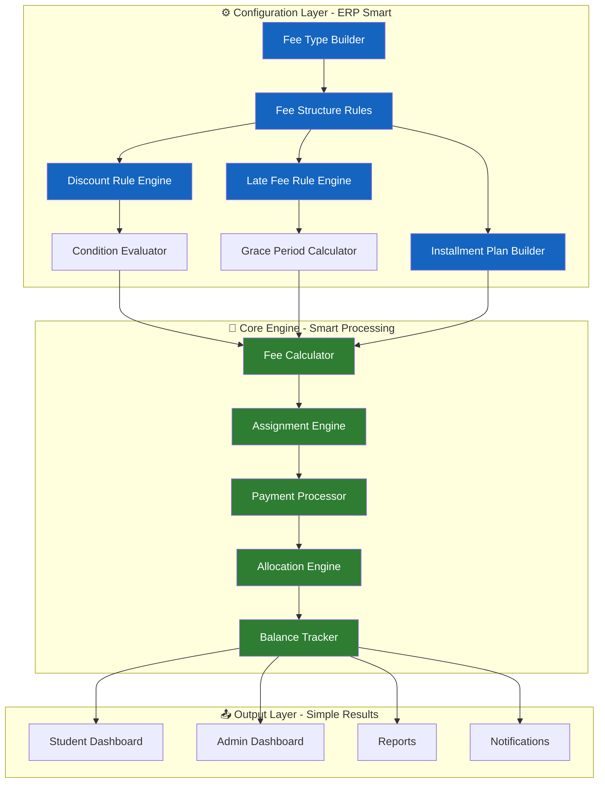
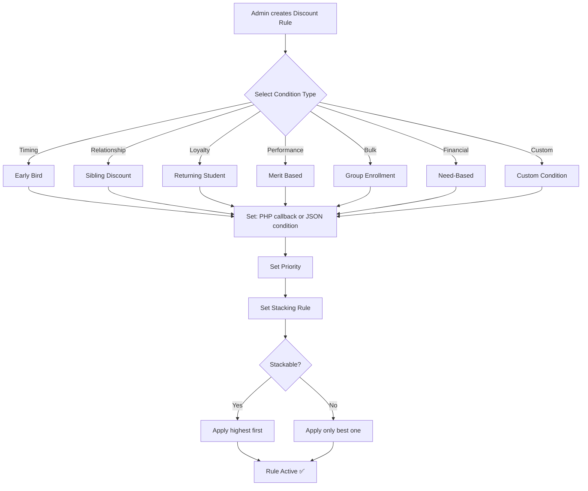
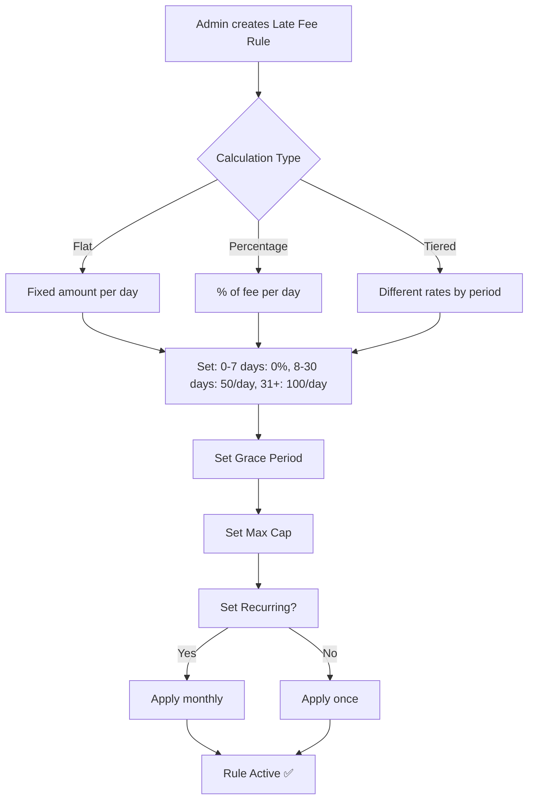
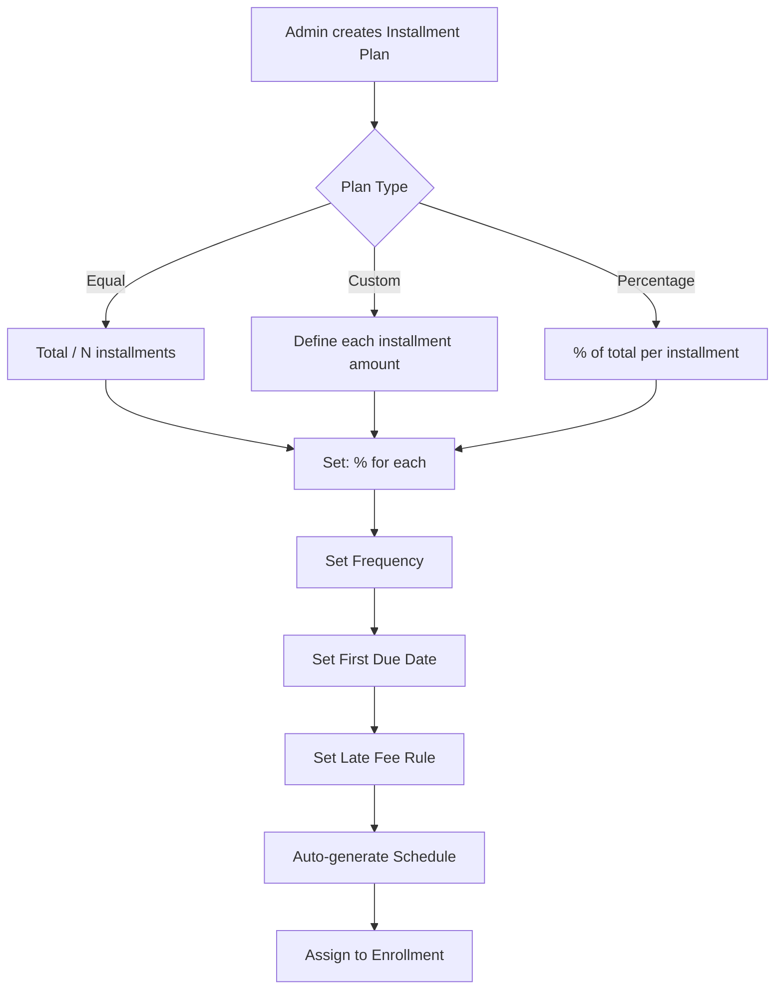
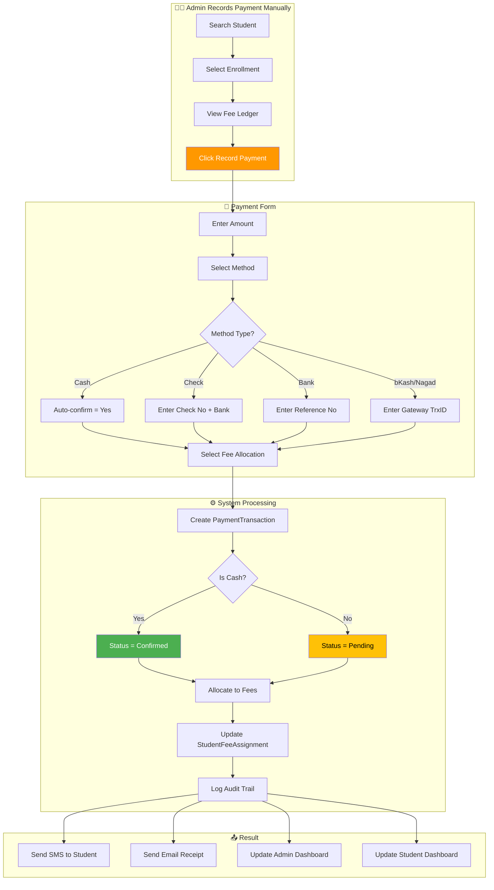

# Smart Fee Management Plan — ERP Intelligence + Student Simplicity

> **Philosophy:** "ERP-level smartness under the hood, but dead-simple for students and admins"
> **Project:** Coaching Management System (CMS)
> **Date:** 2026-05-18

---

## Core Design Principle

```
┌─────────────────────────────────────────────────────────┐
│                    STUDENT sees                          │
│  "My Dashboard → My Fees → Pay → Done"                  │
│  3 clicks maximum                                       │
├─────────────────────────────────────────────────────────┤
│                    ADMIN sees                            │
│  "Create Fee Type → Assign → Track → Reports"           │
│  Everything configurable, nothing hardcoded             │
├─────────────────────────────────────────────────────────┤
│                    SYSTEM does (hidden)                  │
│  ERP-grade: Auto-calculations, Audit trail,             │
│  Smart defaults, Bulk operations, Notifications         │
└─────────────────────────────────────────────────────────┘
```

---

## 1. Smart Fee Engine Architecture



---

## 2. Smart Features (ERP-Level Intelligence)

### 2.1 Dynamic Fee Type Builder

Admin can create **ANY** fee type dynamically — no coding needed:

| Feature | What It Does | ERP-Level Smartness |
|---------|-------------|-------------------|
| **Fee Type Name** | Admission, Monthly, Exam, Lab, Library, Sports, Development, etc. | Unlimited types |
| **Frequency** | One-time, Monthly, Yearly, Custom (every N days) | Auto-generates due dates |
| **Amount Type** | Fixed, Per-subject, Per-credit, Slab-based | Smart calculation |
| **Due Date Rule** | Fixed date, Days from enrollment, Days from previous due | Auto-scheduling |
| **Late Fee** | Flat/day, Percentage/day, Cap amount, Grace period | Auto-applied |
| **Discount** | Early-bird %, Sibling %, Loyalty %, Custom condition | Rule engine evaluates |
| **Installment** | Equal split, Custom split, Interest-free, With interest | Auto-generate schedule |
| **Applicable To** | All students, Specific class, Specific batch, Individual | Smart targeting |
| **Payment Methods** | bKash, Nagad, Rocket, Bank, Cash, Card, Check | Per-type restriction |

### 2.2 Smart Discount Rule Engine



**Example Rules (Pre-seeded):**

| Rule Name | Type | Value | Condition | Stackable |
|-----------|------|-------|-----------|-----------|
| Early Bird 10% | Timing | 10% off | If paid 15 days before start | Yes |
| Sibling 10% | Relationship | 10% off | If sibling exists (by guardian phone) | Yes |
| Loyalty 5% | Loyalty | 5% off | If previous enrollment exists | Yes |
| Merit 15% | Performance | 15% off | If GPA >= 4.5 in last exam | No |
| Group 20% | Bulk | 20% off | If 5+ students enroll together | No |

### 2.3 Smart Late Fee Engine



### 2.4 Smart Installment Plan Builder



---

## 3. Student Experience (Dead Simple)

### 3.1 Student Fee Dashboard

```
┌──────────────────────────────────────────────────────────┐
│  👋 Welcome, Rafiq!                        [Logout]      │
├──────────────────────────────────────────────────────────┤
│  ┌──────────┐  ┌──────────┐  ┌──────────┐  ┌──────────┐ │
│  │ Total Due │  │ This Month│  │ Paid     │  │ Overdue  │ │
│  │ ৳ 5,500  │  │ ৳ 2,000  │  │ ৳ 15,000│  │ ৳ 500   │ │
│  └──────────┘  └──────────┘  └──────────┘  └──────────┘ │
├──────────────────────────────────────────────────────────┤
│  📋 My Enrollments & Fees                                │
│  ┌────────────────────────────────────────────────────┐  │
│  │ 📘 HSC English Batch A                   Active    │  │
│  │  ┌────────┬──────────┬────────┬────────┬────────┐ │  │
│  │  │ Fee    │ Amount   │ Due    │ Status │ Action │ │  │
│  │  ├────────┼──────────┼────────┼────────┼────────┤ │  │
│  │  │Admission│ 3,000   │ Paid   │ ✅     │ Receipt│ │  │
│  │  │Monthly  │ 1,000   │ 25 May │ ⏳     │ Pay Now│ │  │
│  │  │Exam Fee │ 500     │ 15 Jun │ 📅     │ Pay Now│ │  │
│  │  │Library  │ 200     │ Overdue│ ⚠️     │ Pay Now│ │  │
│  │  └────────┴──────────┴────────┴────────┴────────┘ │  │
│  │  [💰 Pay Selected] [💰 Pay All Due]                 │  │
│  └────────────────────────────────────────────────────┘  │
├──────────────────────────────────────────────────────────┤
│  📄 Payment History (Last 5)                             │
│  ┌────────────────────────────────────────────────────┐  │
│  │ 12 May │ Admission Fee  │ 3,000 │ ✅ Confirmed    │  │
│  │ 05 May │ Monthly Fee    │ 1,000 │ ✅ Confirmed    │  │
│  │ 10 Apr │ Monthly Fee    │ 1,000 │ ⏳ Pending      │  │
│  │ 01 Apr │ Library Fee    │ 200   │ ✅ Confirmed    │  │
│  └────────────────────────────────────────────────────┘  │
│  [📄 View Full History]                                   │
└──────────────────────────────────────────────────────────┘
```

### 3.2 Payment Flow (3 Clicks Max)

```
Step 1: Select Fee(s) to Pay
┌─────────────────────────────────────────────┐
│  ☑ Monthly Fee (May)    — ৳ 1,000          │
│  ☑ Exam Fee             — ৳ 500            │
│  ☑ Library Fee (Overdue) — ৳ 200 + 50 late │
│  ─────────────────────────────────────      │
│  Total: ৳ 1,750                             │
│  [Proceed to Pay]                           │
└─────────────────────────────────────────────┘

Step 2: Choose Payment Method
┌─────────────────────────────────────────────┐
│  💳 bKash (Personal)                        │
│  💳 Nagad                                   │
│  💳 Rocket                                  │
│  🏦 Bank Transfer                           │
│  💵 Cash (On-site)                          │
│  [Confirm Payment]                          │
└─────────────────────────────────────────────┘

Step 3: Confirmation
┌─────────────────────────────────────────────┐
│  ✅ Payment Submitted!                      │
│  Amount: ৳ 1,750                            │
│  Method: bKash                               │
│  TrxID: BKASH-ABC123                        │
│  Status: ⏳ Pending Admin Confirmation       │
│                                              │
│  📱 SMS sent to your phone                  │
│  📧 Receipt sent to your email              │
│                                              │
│  [Back to Dashboard]                        │
└─────────────────────────────────────────────┘
```

---

## 4. Admin Experience (ERP-Grade Smart)

### 4.1 Admin Fee Dashboard

```
┌──────────────────────────────────────────────────────────┐
│  📊 Fee Management Dashboard                             │
├──────────────────────────────────────────────────────────┤
│  ┌──────────┐  ┌──────────┐  ┌──────────┐  ┌──────────┐ │
│  │ Collection│  │ Pending  │  │ Overdue  │  │ This Month│ │
│  │ ৳ 2,85,000│  │ ৳ 45,000│  │ ৳ 12,000│  │ ৳ 1,20,000│ │
│  └──────────┘  └──────────┘  └──────────┘  └──────────┘ │
├──────────────────────────────────────────────────────────┤
│  Quick Actions:                                          │
│  [➕ New Fee Type] [📋 Create Fee] [✅ Confirm Payments]  │
│  [📤 Bulk Reminder] [📊 Reports] [⚙️ Rules]              │
├──────────────────────────────────────────────────────────┤
│  📈 Monthly Collection Chart                             │
│  ████████████████████  ৳ 1,20,000  (May)               │
│  ████████████████      ৳ 95,000   (Apr)                │
│  █████████████████     ৳ 1,10,000  (Mar)               │
├──────────────────────────────────────────────────────────┤
│  ⏳ Recent Unconfirmed Payments                          │
│  ┌────────┬────────┬────────┬────────┬────────┐        │
│  │ Student│ Amount │ Method │ Time   │ Action │        │
│  ├────────┼────────┼────────┼────────┼────────┤        │
│  │ Rafiq  │ 1,000  │ bKash  │ 2 min  │ [✅][❌]│        │
│  │ Sumaiya│ 3,000  │ Nagad  │ 5 min  │ [✅][❌]│        │
│  │ Karim  │ 500    │ Cash   │ 10 min │ [✅][❌]│        │
│  └────────┴────────┴────────┴────────┴────────┘        │
│  [View All Pending]                                      │
└──────────────────────────────────────────────────────────┘
```

### 4.2 Smart Fee Type Creation (4 Steps)

```
Step 1: Basic Info
┌─────────────────────────────────────────────┐
│  Fee Type Name: [Exam Fee 2026    ]         │
│  Code:         [EXAM-2026        ]          │
│  Description:  [Mid-term exam fee ]         │
│  Status:       [● Active]                    │
│  [Next →]                                    │
└─────────────────────────────────────────────┘

Step 2: Fee Structure
┌─────────────────────────────────────────────┐
│  Amount:      [500             ]  BDT       │
│  Frequency:   [▼ One-time       ]           │
│  Due Date:    [▼ Fixed Date     ]           │
│  Fixed Date:  [15/06/2026      ]           │
│  Applicable To:                               │
│  ○ All Students  ○ By Class  ○ By Batch     │
│  ● By Enrollment  ○ Individual              │
│                                              │
│  [← Back]  [Next →]                         │
└─────────────────────────────────────────────┘

Step 3: Rules (Optional - Smart)
┌─────────────────────────────────────────────┐
│  Late Fee:  [● Enable]  [50] BDT/day        │
│  Grace Period: [3] days                     │
│  Max Late Fee: [500] BDT                    │
│                                              │
│  Discount:  [○ Enable]                      │
│  Installment: [● Enable]                    │
│  Plan: [▼ 2 Equal Installments]             │
│                                              │
│  [← Back]  [Next →]                         │
└─────────────────────────────────────────────┘

Step 4: Payment Methods
┌─────────────────────────────────────────────┐
│  Allowed Payment Methods:                    │
│  ☑ bKash  ☑ Nagad  ☑ Rocket                │
│  ☑ Bank Transfer  ☑ Cash  ☐ Card           │
│                                              │
│  Notification:                               │
│  ☑ Send SMS on due date                     │
│  ☑ Send Email on confirmation               │
│  ☑ Send reminder 7 days before              │
│                                              │
│  [← Back]  [Create Fee Type ✅]             │
└─────────────────────────────────────────────┘
```

### 4.3 Smart Student Ledger

```
┌──────────────────────────────────────────────────────────┐
│  Student: Rafiq Islam  |  ID: STU-2026-0001              │
│  Enrollment: HSC English Batch A  |  Status: Active      │
├──────────────────────────────────────────────────────────┤
│  ┌──────────┬──────────┬──────────┬──────────┬──────────┐│
│  │ Date     │ Particular│ Debit   │ Credit   │ Balance  ││
│  ├──────────┼──────────┼──────────┼──────────┼──────────┤│
│  │ 01 Jan   │ Admission │ 3,000   │          │ 3,000    ││
│  │ 01 Jan   │ Paid     │          │ 3,000    │ 0        ││
│  │ 01 Feb   │ Monthly   │ 1,000   │          │ 1,000    ││
│  │ 05 Feb   │ Paid     │          │ 1,000    │ 0        ││
│  │ 01 Mar   │ Monthly   │ 1,000   │          │ 1,000    ││
│  │ 10 Mar   │ Paid     │          │ 1,000    │ 0        ││
│  │ 01 Apr   │ Monthly   │ 1,000   │          │ 1,000    ││
│  │ 01 Apr   │ Library   │ 200     │          │ 1,200    ││
│  │ 15 Apr   │ Late Fee  │ 50      │          │ 1,250    ││
│  │ 20 Apr   │ Paid     │          │ 1,000    │ 250      ││
│  │ 01 May   │ Monthly   │ 1,000   │          │ 1,250    ││
│  │ 15 May   │ Exam Fee  │ 500     │          │ 1,750    ││
│  ├──────────┼──────────┼──────────┼──────────┼──────────┤│
│  │          │ Total    │ 7,750   │ 6,000    │ 1,750    ││
│  └──────────┴──────────┴──────────┴──────────┴──────────┘│
│  [📄 Download Statement] [📧 Email Statement]             │
│  [➕ Add Adjustment] [💰 Record Payment]                  │
└──────────────────────────────────────────────────────────┘
```
```

---

## 7. Smart API Architecture

### 7.1 Student-Facing APIs

| Method | Endpoint | Purpose | Smart Feature |
|--------|----------|---------|--------------|
| GET | `/api/v1/student/fee-dashboard` | Dashboard with all fees, due, overdue | Auto-calculates late fees |
| GET | `/api/v1/student/fee-records` | All fee assignments for student | Grouped by enrollment |
| GET | `/api/v1/student/payment-history` | Full payment history with status | Timeline format |
| POST | `/api/v1/student/pay` | Submit payment for selected fees | Auto-allocation engine |
| GET | `/api/v1/student/invoices/{id}` | Download invoice PDF | Auto-generated |
| GET | `/api/v1/student/ledger` | Complete debit/credit ledger | Running balance |
| GET | `/api/v1/student/notification-preferences` | Get notification settings | Per-student config |
| PUT | `/api/v1/student/notification-preferences` | Update notification settings | Toggle SMS/Email |

### 7.2 Admin-Facing APIs

| Method | Endpoint | Purpose | Smart Feature |
|--------|----------|---------|--------------|
| GET | `/api/v1/admin/fee-dashboard` | Dashboard with KPIs + charts | Real-time aggregation |
| CRUD | `/api/v1/admin/fee-types` | Manage fee types | Dynamic type builder |
| CRUD | `/api/v1/admin/fee-structures` | Manage fee structures | Rule association |
| CRUD | `/api/v1/admin/discount-rules` | Manage discount rules | Condition evaluator |
| CRUD | `/api/v1/admin/late-fee-rules` | Manage late fee rules | Grace period calc |
| CRUD | `/api/v1/admin/installment-plans` | Manage installment plans | Auto-schedule gen |
| GET | `/api/v1/admin/payments/pending` | List unconfirmed payments | Smart filters |
| POST | `/api/v1/admin/payments/{id}/confirm` | Confirm payment | Auto-update ledger |
| POST | `/api/v1/admin/payments/{id}/reject` | Reject payment | Auto-notify student |
| GET | `/api/v1/admin/students/{id}/ledger` | View student ledger | Full audit trail |
| POST | `/api/v1/admin/adjustments` | Manual fee adjustment | Audit logged |
| POST | `/api/v1/admin/bulk/assign-fees` | Assign fee to multiple students | Smart targeting |
| POST | `/api/v1/admin/bulk/remind` | Send bulk reminders | SMS + Email |
| GET | `/api/v1/admin/reports/collection` | Collection report | Date range + filters |
| GET | `/api/v1/admin/reports/aging` | Aging report | 30/60/90+ days |
| GET | `/api/v1/admin/reports/defaulter` | Top defaulters list | Sort by amount/days |

---

## 8. Smart Frontend Pages

### 8.1 Student Pages (Simple)

| Page | Route | Purpose |
|------|-------|---------|
| FeeDashboardPage | `/student/fees` | All fees, due amounts, pay buttons |
| FeePaymentPage | `/student/fees/pay` | Select fees, choose method, confirm |
| PaymentHistoryPage | `/student/fees/history` | Full timeline with filters |
| InvoiceViewPage | `/student/fees/invoice/:id` | View/download invoice PDF |
| NotificationPrefsPage | `/student/settings/notifications` | Toggle SMS/Email preferences |

### 8.2 Admin Pages (Smart)

| Page | Route | Purpose |
|------|-------|---------|
| FeeDashboardPage | `/admin/fees` | KPIs, charts, quick actions |
| FeeTypeListPage | `/admin/fees/types` | List all fee types |
| FeeTypeFormPage | `/admin/fees/types/create` | Create fee type (4-step wizard) |
| FeeTypeFormPage | `/admin/fees/types/:id/edit` | Edit fee type |
| FeeStructureListPage | `/admin/fees/structures` | List all fee structures |
| FeeStructureFormPage | `/admin/fees/structures/create` | Create fee structure |
| DiscountRuleListPage | `/admin/fees/discounts` | Manage discount rules |
| LateFeeRuleListPage | `/admin/fees/late-fees` | Manage late fee rules |
| InstallmentPlanListPage | `/admin/fees/installments` | Manage installment plans |
| PaymentConfirmationPage | `/admin/fees/payments` | Confirm/reject payments |
| StudentLedgerPage | `/admin/fees/ledger/:studentId` | View student ledger |
| BulkOperationsPage | `/admin/fees/bulk` | Bulk assign, remind, export |
| CollectionReportPage | `/admin/fees/reports/collection` | Collection report |
| AgingReportPage | `/admin/fees/reports/aging` | Aging analysis |
| DefaulterReportPage | `/admin/fees/reports/defaulters` | Top defaulters |

---

## 9. Smart Notifications (Complete)

| Trigger | Channel | Template | When |
|---------|---------|----------|------|
| Fee Due Reminder | SMS + Email | বাংলা: "আপনার {amount} টাকা ফি {date} তারিখের মধ্যে পরিশোধ করুন" | 7 days before |
| Overdue Alert | SMS | বাংলা: "আপনার {amount} টাকা ফি {days} দিন ওভারডিউ। দেরী ফি {late_fee} যোগ হয়েছে" | Daily after due |
| Payment Submitted | SMS | "পেমেন্ট জমা দেওয়া হয়েছে। অ্যাডমিন নিশ্চিতকরণ অপেক্ষায়" | On submit |
| Payment Confirmed | SMS + Email | "পেমেন্ট নিশ্চিত করা হয়েছে! ইনভয়েস: {invoice_no}" | On confirm |
| Payment Rejected | SMS | "পেমেন্ট প্রত্যাখ্যান। কারণ: {reason}" | On reject |
| Full Payment Complete | SMS + Email | "অভিনন্দন! সকল ফি সম্পূর্ণ পরিশোধ করা হয়েছে" | When balance = 0 |

---

## 10. Implementation Phases

### Phase 1: Foundation (Week 1)
```
Day 1-2: Database migrations (fee_types, fee_structures, student_fee_assignments,
         payment_transactions, payment_allocations, fee_audit_logs)
Day 3-4: FeeManagementService core (assignFees, processPayment, confirmPayment)
Day 5:   Student Fee Dashboard API + Frontend
Day 6:   Student Payment Flow API + Frontend
Day 7:   Payment History API + Frontend
```

### Phase 2: Admin Management (Week 2)
```
Day 1-2: Fee Type CRUD (backend + frontend wizard)
Day 3-4: Payment Confirmation workflow (backend + frontend)
Day 5-6: Student Ledger (backend + frontend)
Day 7:   Invoice generation + testing
```

### Phase 3: Smart Rules Engine (Week 3)
```
Day 1-2: Discount rules (CRUD + condition evaluator)
Day 3-4: Late fee rules (CRUD + auto-apply cron)
Day 5-6: Installment plans (CRUD + auto-schedule)
Day 7:   Integration testing
```

### Phase 4: Notifications + Reports (Week 4)
```
Day 1-2: SMS templates (Bangla + English) + NotificationService enhancement
Day 3-4: Cron jobs (due reminders, overdue alerts, installment reminders)
Day 5-6: Reports (collection, aging, defaulter)
Day 7:   Bulk operations + final testing
```

---

## 11. Smart vs ERP Comparison

| Feature | Traditional ERP | Our Smart System | Advantage |
|---------|---------------|-----------------|-----------|
| Fee Types | Fixed set (Admission, Tuition) | **Dynamic** — Admin creates any type | More flexible |
| Discounts | Hardcoded logic | **Rule engine** — Configurable conditions | No coding needed |
| Late Fee | Fixed rate | **Tiered + Grace period** — Configurable | Fair to students |
| Installments | Manual tracking | **Auto-schedule** — Generated from plan | Zero manual work |
| Payment Flow | Student submits → Admin confirms | **Same but with auto-allocation** | No manual allocation |
| Notifications | Basic email | **SMS + Email + Bangla** — Full coverage | Better reach |
| Reports | Static | **Real-time + Filters** — Dynamic | Instant insights |
| Audit Trail | None | **Full before/after snapshots** | Complete accountability |
| Student Experience | Complicated portal | **3-click payment** — Dead simple | Higher satisfaction |
| Admin Experience | Multiple screens | **Single dashboard** — All in one place | Faster workflow |

---

## Summary

This plan combines:
1. **ERP-level intelligence** — Dynamic fee types, smart rule engines, auto-calculations, full audit trail
2. **Student-centric simplicity** — 3-click payment, unified dashboard, Bangla notifications
3. **Admin-grade control** — Complete fee lifecycle management, real-time reports, bulk operations

The result is a system that is **smarter than an ERP** (because it's dynamic, not hardcoded) but **simpler than a basic system** (because students can pay in 3 clicks).

> **Philosophy:** "ERP-level smartness under the hood, but dead-simple for students and admins"
> **Project:** Coaching Management System (CMS)
> **Date:** 2026-05-18

---

## Core Design Principle

```
┌─────────────────────────────────────────────────────────┐
│                    STUDENT sees                          │
│  "My Dashboard → My Fees → Pay → Done"                  │
│  3 clicks maximum                                       │
├─────────────────────────────────────────────────────────┤
│                    ADMIN sees                            │
│  "Create Fee Type → Assign → Track → Reports"           │
│  Everything configurable, nothing hardcoded             │
├─────────────────────────────────────────────────────────┤
│                    SYSTEM does (hidden)                  │
│  ERP-grade: Auto-calculations, Audit trail,             │
│  Smart defaults, Bulk operations, Notifications         │
└─────────────────────────────────────────────────────────┘
```

---

## 1. Smart Fee Engine Architecture


---

## 2. Smart Features (ERP-Level Intelligence)

### 2.1 Dynamic Fee Type Builder

Admin can create **ANY** fee type dynamically — no coding needed:

| Feature | What It Does | ERP-Level Smartness |
|---------|-------------|-------------------|
| **Fee Type Name** | Admission, Monthly, Exam, Lab, Library, Sports, Development, etc. | Unlimited types |
| **Frequency** | One-time, Monthly, Yearly, Custom (every N days) | Auto-generates due dates |
| **Amount Type** | Fixed, Per-subject, Per-credit, Slab-based | Smart calculation |
| **Due Date Rule** | Fixed date, Days from enrollment, Days from previous due | Auto-scheduling |
| **Late Fee** | Flat/day, Percentage/day, Cap amount, Grace period | Auto-applied |
| **Discount** | Early-bird %, Sibling %, Loyalty %, Custom condition | Rule engine evaluates |
| **Installment** | Equal split, Custom split, Interest-free, With interest | Auto-generate schedule |
| **Applicable To** | All students, Specific class, Specific batch, Individual | Smart targeting |
| **Payment Methods** | bKash, Nagad, Rocket, Bank, Cash, Card, Check | Per-type restriction |

### 2.2 Smart Discount Rule Engine


**Example Rules (Pre-seeded):**

| Rule Name | Type | Value | Condition | Stackable |
|-----------|------|-------|-----------|-----------|
| Early Bird 10% | Timing | 10% off | If paid 15 days before start | Yes |
| Sibling 10% | Relationship | 10% off | If sibling exists (by guardian phone) | Yes |
| Loyalty 5% | Loyalty | 5% off | If previous enrollment exists | Yes |
| Merit 15% | Performance | 15% off | If GPA >= 4.5 in last exam | No |
| Group 20% | Bulk | 20% off | If 5+ students enroll together | No |

### 2.3 Smart Late Fee Engine


### 2.4 Smart Installment Plan Builder


---

## 3. Student Experience (Dead Simple)

### 3.1 Student Fee Dashboard

```
┌──────────────────────────────────────────────────────────┐
│  👋 Welcome, Rafiq!                        [Logout]      │
├──────────────────────────────────────────────────────────┤
│  ┌──────────┐  ┌──────────┐  ┌──────────┐  ┌──────────┐ │
│  │ Total Due │  │ This Month│  │ Paid     │  │ Overdue  │ │
│  │ ৳ 5,500  │  │ ৳ 2,000  │  │ ৳ 15,000│  │ ৳ 500   │ │
│  └──────────┘  └──────────┘  └──────────┘  └──────────┘ │
├──────────────────────────────────────────────────────────┤
│  📋 My Enrollments & Fees                                │
│  ┌────────────────────────────────────────────────────┐  │
│  │ 📘 HSC English Batch A                   Active    │  │
│  │  ┌────────┬──────────┬────────┬────────┬────────┐ │  │
│  │  │ Fee    │ Amount   │ Due    │ Status │ Action │ │  │
│  │  ├────────┼──────────┼────────┼────────┼────────┤ │  │
│  │  │Admission│ 3,000   │ Paid   │ ✅     │ Receipt│ │  │
│  │  │Monthly  │ 1,000   │ 25 May │ ⏳     │ Pay Now│ │  │
│  │  │Exam Fee │ 500     │ 15 Jun │ 📅     │ Pay Now│ │  │
│  │  │Library  │ 200     │ Overdue│ ⚠️     │ Pay Now│ │  │
│  │  └────────┴──────────┴────────┴────────┴────────┘ │  │
│  │  [💰 Pay Selected] [💰 Pay All Due]                 │  │
│  └────────────────────────────────────────────────────┘  │
├──────────────────────────────────────────────────────────┤
│  📄 Payment History (Last 5)                             │
│  ┌────────────────────────────────────────────────────┐  │
│  │ 12 May │ Admission Fee  │ 3,000 │ ✅ Confirmed    │  │
│  │ 05 May │ Monthly Fee    │ 1,000 │ ✅ Confirmed    │  │
│  │ 10 Apr │ Monthly Fee    │ 1,000 │ ⏳ Pending      │  │
│  │ 01 Apr │ Library Fee    │ 200   │ ✅ Confirmed    │  │
│  └────────────────────────────────────────────────────┘  │
│  [📄 View Full History]                                   │
└──────────────────────────────────────────────────────────┘
```

### 3.2 Payment Flow (3 Clicks Max)

```
Step 1: Select Fee(s) to Pay
┌─────────────────────────────────────────────┐
│  ☑ Monthly Fee (May)    — ৳ 1,000          │
│  ☑ Exam Fee             — ৳ 500            │
│  ☑ Library Fee (Overdue) — ৳ 200 + 50 late │
│  ─────────────────────────────────────      │
│  Total: ৳ 1,750                             │
│  [Proceed to Pay]                           │
└─────────────────────────────────────────────┘

Step 2: Choose Payment Method
┌─────────────────────────────────────────────┐
│  💳 bKash (Personal)                        │
│  💳 Nagad                                   │
│  💳 Rocket                                  │
│  🏦 Bank Transfer                           │
│  💵 Cash (On-site)                          │
│  [Confirm Payment]                          │
└─────────────────────────────────────────────┘

Step 3: Confirmation
┌─────────────────────────────────────────────┐
│  ✅ Payment Submitted!                      │
│  Amount: ৳ 1,750                            │
│  Method: bKash                               │
│  TrxID: BKASH-ABC123                        │
│  Status: ⏳ Pending Admin Confirmation       │
│                                              │
│  📱 SMS sent to your phone                  │
│  📧 Receipt sent to your email              │
│                                              │
│  [Back to Dashboard]                        │
└─────────────────────────────────────────────┘
```

---

## 4. Admin Experience (ERP-Grade Smart)

### 4.1 Admin Fee Dashboard

```
┌──────────────────────────────────────────────────────────┐
│  📊 Fee Management Dashboard                             │
├──────────────────────────────────────────────────────────┤
│  ┌──────────┐  ┌──────────┐  ┌──────────┐  ┌──────────┐ │
│  │ Collection│  │ Pending  │  │ Overdue  │  │ This Month│ │
│  │ ৳ 2,85,000│  │ ৳ 45,000│  │ ৳ 12,000│  │ ৳ 1,20,000│ │
│  └──────────┘  └──────────┘  └──────────┘  └──────────┘ │
├──────────────────────────────────────────────────────────┤
│  Quick Actions:                                          │
│  [➕ New Fee Type] [📋 Create Fee] [✅ Confirm Payments]  │
│  [📤 Bulk Reminder] [📊 Reports] [⚙️ Rules]              │
├──────────────────────────────────────────────────────────┤
│  📈 Monthly Collection Chart                             │
│  ████████████████████  ৳ 1,20,000  (May)               │
│  ████████████████      ৳ 95,000   (Apr)                │
│  █████████████████     ৳ 1,10,000  (Mar)               │
├──────────────────────────────────────────────────────────┤
│  ⏳ Recent Unconfirmed Payments                          │
│  ┌────────┬────────┬────────┬────────┬────────┐        │
│  │ Student│ Amount │ Method │ Time   │ Action │        │
│  ├────────┼────────┼────────┼────────┼────────┤        │
│  │ Rafiq  │ 1,000  │ bKash  │ 2 min  │ [✅][❌]│        │
│  │ Sumaiya│ 3,000  │ Nagad  │ 5 min  │ [✅][❌]│        │
│  │ Karim  │ 500    │ Cash   │ 10 min │ [✅][❌]│        │
│  └────────┴────────┴────────┴────────┴────────┘        │
│  [View All Pending]                                      │
└──────────────────────────────────────────────────────────┘
```

### 4.2 Smart Fee Type Creation (4 Steps)

```
Step 1: Basic Info
┌─────────────────────────────────────────────┐
│  Fee Type Name: [Exam Fee 2026    ]         │
│  Code:         [EXAM-2026        ]          │
│  Description:  [Mid-term exam fee ]         │
│  Status:       [● Active]                    │
│  [Next →]                                    │
└─────────────────────────────────────────────┘

Step 2: Fee Structure
┌─────────────────────────────────────────────┐
│  Amount:      [500             ]  BDT       │
│  Frequency:   [▼ One-time       ]           │
│  Due Date:    [▼ Fixed Date     ]           │
│  Fixed Date:  [15/06/2026      ]           │
│  Applicable To:                               │
│  ○ All Students  ○ By Class  ○ By Batch     │
│  ● By Enrollment  ○ Individual              │
│                                              │
│  [← Back]  [Next →]                         │
└─────────────────────────────────────────────┘

Step 3: Rules (Optional - Smart)
┌─────────────────────────────────────────────┐
│  Late Fee:  [● Enable]  [50] BDT/day        │
│  Grace Period: [3] days                     │
│  Max Late Fee: [500] BDT                    │
│                                              │
│  Discount:  [○ Enable]                      │
│  Installment: [● Enable]                    │
│  Plan: [▼ 2 Equal Installments]             │
│                                              │
│  [← Back]  [Next →]                         │
└─────────────────────────────────────────────┘

Step 4: Payment Methods
┌─────────────────────────────────────────────┐
│  Allowed Payment Methods:                    │
│  ☑ bKash  ☑ Nagad  ☑ Rocket                │
│  ☑ Bank Transfer  ☑ Cash  ☐ Card           │
│                                              │
│  Notification:                               │
│  ☑ Send SMS on due date                     │
│  ☑ Send Email on confirmation               │
│  ☑ Send reminder 7 days before              │
│                                              │
│  [← Back]  [Create Fee Type ✅]             │
└─────────────────────────────────────────────┘
```

### 4.3 Smart Student Ledger

```
┌──────────────────────────────────────────────────────────┐
│  Student: Rafiq Islam  |  ID: STU-2026-0001              │
│  Enrollment: HSC English Batch A  |  Status: Active      │
├──────────────────────────────────────────────────────────┤
│  ┌──────────┬──────────┬──────────┬──────────┬──────────┐│
│  │ Date     │ Particular│ Debit   │ Credit   │ Balance  ││
│  ├──────────┼──────────┼──────────┼──────────┼──────────┤│
│  │ 01 Jan   │ Admission │ 3,000   │          │ 3,000    ││
│  │ 01 Jan   │ Paid     │          │ 3,000    │ 0        ││
│  │ 01 Feb   │ Monthly   │ 1,000   │          │ 1,000    ││
│  │ 05 Feb   │ Paid     │          │ 1,000    │ 0        ││
│  │ 01 Mar   │ Monthly   │ 1,000   │          │ 1,000    ││
│  │ 10 Mar   │ Paid     │          │ 1,000    │ 0        ││
│  │ 01 Apr   │ Monthly   │ 1,000   │          │ 1,000    ││
│  │ 01 Apr   │ Library   │ 200     │          │ 1,200    ││
│  │ 15 Apr   │ Late Fee  │ 50      │          │ 1,250    ││
│  │ 20 Apr   │ Paid     │          │ 1,000    │ 250      ││
│  │ 01 May   │ Monthly   │ 1,000   │          │ 1,250    ││
│  │ 15 May   │ Exam Fee  │ 500     │          │ 1,750    ││
│  ├──────────┼──────────┼──────────┼──────────┼──────────┤│
│  │          │ Total    │ 7,750   │ 6,000    │ 1,750    ││
│  └──────────┴──────────┴──────────┴──────────┴──────────┘│
│  [📄 Download Statement] [📧 Email Statement]             │
│  [➕ Add Adjustment] [💰 Record Payment]                  │
└──────────────────────────────────────────────────────────┘
```

---

## 5. Smart Data Model

```sql
-- ============================================
-- CORE TABLES (New)
-- ============================================

-- 1. Fee Types - Admin creates ANY fee type dynamically
CREATE TABLE fee_types (
    id              BIGINT UNSIGNED AUTO_INCREMENT PRIMARY KEY,
    name            VARCHAR(100) NOT NULL,          -- e.g., "Exam Fee 2026"
    code            VARCHAR(50) NOT NULL UNIQUE,    -- e.g., "EXAM-2026"
    description     TEXT NULL,
    frequency       ENUM('one_time','monthly','yearly','custom') NOT NULL,
    custom_frequency_days INT UNSIGNED NULL,        -- for 'custom' frequency
    status          ENUM('active','inactive') DEFAULT 'active',
    created_by      BIGINT UNSIGNED NOT NULL,
    created_at      TIMESTAMP DEFAULT CURRENT_TIMESTAMP,
    updated_at      TIMESTAMP DEFAULT CURRENT_TIMESTAMP ON UPDATE CURRENT_TIMESTAMP
);

-- 2. Fee Structures - Amount, due date, applicability per fee type
CREATE TABLE fee_structures (
    id              BIGINT UNSIGNED AUTO_INCREMENT PRIMARY KEY,
    fee_type_id     BIGINT UNSIGNED NOT NULL,
    amount          DECIMAL(12,2) NOT NULL,
    amount_type     ENUM('fixed','per_subject','per_credit','slab') DEFAULT 'fixed',
    due_date_type   ENUM('fixed_date','days_from_enrollment','days_from_previous') NOT NULL,
    fixed_due_date  DATE NULL,
    days_offset     INT UNSIGNED NULL,              -- for days_from_* types
    applicable_type ENUM('all','class','batch','enrollment','individual') DEFAULT 'all',
    applicable_ids  JSON NULL,                      -- [class_id_1, class_id_2] or null for 'all'
    late_fee_rule_id BIGINT UNSIGNED NULL,
    discount_rule_id BIGINT UNSIGNED NULL,
    installment_plan_id BIGINT UNSIGNED NULL,
    allowed_methods JSON NULL,                      -- ["bkash","nagad","cash"]
    status          ENUM('active','inactive') DEFAULT 'active',
    created_at      TIMESTAMP DEFAULT CURRENT_TIMESTAMP,
    updated_at      TIMESTAMP DEFAULT CURRENT_TIMESTAMP ON UPDATE CURRENT_TIMESTAMP,
    FOREIGN KEY (fee_type_id) REFERENCES fee_types(id) ON DELETE CASCADE
);

-- 3. Student Fee Assignments - Links fee structures to enrollments
CREATE TABLE student_fee_assignments (
    id              BIGINT UNSIGNED AUTO_INCREMENT PRIMARY KEY,
    enrollment_id   BIGINT UNSIGNED NOT NULL,
    fee_structure_id BIGINT UNSIGNED NOT NULL,
    original_amount DECIMAL(12,2) NOT NULL,         -- Before any discount
    discounted_amount DECIMAL(12,2) NULL,           -- After discount
    final_amount    DECIMAL(12,2) NOT NULL,          -- After all adjustments
    due_date        DATE NOT NULL,
    status          ENUM('pending','paid','overdue','waived') DEFAULT 'pending',
    late_fee_applied DECIMAL(12,2) DEFAULT 0.00,
    paid_amount     DECIMAL(12,2) DEFAULT 0.00,
    balance         DECIMAL(12,2) GENERATED ALWAYS AS (final_amount + late_fee_applied - paid_amount) STORED,
    created_at      TIMESTAMP DEFAULT CURRENT_TIMESTAMP,
    updated_at      TIMESTAMP DEFAULT CURRENT_TIMESTAMP ON UPDATE CURRENT_TIMESTAMP,
    FOREIGN KEY (enrollment_id) REFERENCES enrollments(id) ON DELETE CASCADE,
    FOREIGN KEY (fee_structure_id) REFERENCES fee_structures(id) ON DELETE CASCADE,
    UNIQUE KEY (enrollment_id, fee_structure_id)
);

-- 4. Payment Transactions - Every payment attempt logged
CREATE TABLE payment_transactions (
    id              BIGINT UNSIGNED AUTO_INCREMENT PRIMARY KEY,
    enrollment_id   BIGINT UNSIGNED NOT NULL,
    student_id      BIGINT UNSIGNED NOT NULL,
    transaction_no  VARCHAR(50) NOT NULL UNIQUE,    -- Auto-generated: TXN-20260518-0001
    amount          DECIMAL(12,2) NOT NULL,
    payment_method  ENUM('bkash','nagad','rocket','bank','cash','card','check') NOT NULL,
    gateway_trx_id  VARCHAR(100) NULL,              -- bKash/Nagad transaction ID
    reference_no    VARCHAR(100) NULL,              -- Bank reference or check no
    status          ENUM('pending','confirmed','rejected','refunded') DEFAULT 'pending',
    confirmed_by    BIGINT UNSIGNED NULL,
    confirmed_at    TIMESTAMP NULL,
    rejection_reason TEXT NULL,
    remarks         TEXT NULL,
    created_at      TIMESTAMP DEFAULT CURRENT_TIMESTAMP,
    updated_at      TIMESTAMP DEFAULT CURRENT_TIMESTAMP ON UPDATE CURRENT_TIMESTAMP,
    FOREIGN KEY (enrollment_id) REFERENCES enrollments(id),
    FOREIGN KEY (student_id) REFERENCES students(id)
);

-- 5. Payment Allocations - How a payment is split across fees
CREATE TABLE payment_allocations (
    id              BIGINT UNSIGNED AUTO_INCREMENT PRIMARY KEY,
    transaction_id  BIGINT UNSIGNED NOT NULL,
    fee_assignment_id BIGINT UNSIGNED NOT NULL,
    amount          DECIMAL(12,2) NOT NULL,          -- Amount allocated to this fee
    created_at      TIMESTAMP DEFAULT CURRENT_TIMESTAMP,
    FOREIGN KEY (transaction_id) REFERENCES payment_transactions(id) ON DELETE CASCADE,
    FOREIGN KEY (fee_assignment_id) REFERENCES student_fee_assignments(id)
);

-- 6. Fee Audit Log - Every change tracked
CREATE TABLE fee_audit_logs (
    id              BIGINT UNSIGNED AUTO_INCREMENT PRIMARY KEY,
    entity_type     VARCHAR(50) NOT NULL,            -- 'fee_assignment','transaction','allocation'
    entity_id       BIGINT UNSIGNED NOT NULL,
    action          VARCHAR(50) NOT NULL,            -- 'created','confirmed','rejected','adjusted'
    old_values      JSON NULL,
    new_values      JSON NOT NULL,
    performed_by    BIGINT UNSIGNED NOT NULL,
    ip_address      VARCHAR(45) NULL,
    user_agent      TEXT NULL,
    created_at      TIMESTAMP DEFAULT CURRENT_TIMESTAMP,
    INDEX (entity_type, entity_id),
    INDEX (created_at)
);

-- ============================================
-- RULES TABLES (Smart Engine)
-- ============================================

-- 7. Discount Rules
CREATE TABLE discount_rules (
    id              BIGINT UNSIGNED AUTO_INCREMENT PRIMARY KEY,
    name            VARCHAR(100) NOT NULL,
    condition_type  ENUM('early_bird','sibling','loyalty','merit','bulk','need_based','custom') NOT NULL,
    condition_config JSON NOT NULL,                 -- {"days_before":15,"percentage":10,"max_cap":500}
    discount_type   ENUM('percentage','fixed') NOT NULL,
    discount_value  DECIMAL(12,2) NOT NULL,
    max_cap         DECIMAL(12,2) NULL,
    priority        INT DEFAULT 0,
    stackable       BOOLEAN DEFAULT FALSE,
    status          ENUM('active','inactive') DEFAULT 'active',
    created_at      TIMESTAMP DEFAULT CURRENT_TIMESTAMP,
    updated_at      TIMESTAMP DEFAULT CURRENT_TIMESTAMP ON UPDATE CURRENT_TIMESTAMP
);

-- 8. Late Fee Rules
CREATE TABLE late_fee_rules (
    id              BIGINT UNSIGNED AUTO_INCREMENT PRIMARY KEY,
    name            VARCHAR(100) NOT NULL,
    calculation_type ENUM('flat_per_day','percentage_per_day','tiered') NOT NULL,
    flat_rate       DECIMAL(12,2) NULL,             -- For flat_per_day
    percentage_rate DECIMAL(5,2) NULL,              -- For percentage_per_day
    tier_config     JSON NULL,                      -- [{"from":0,"to":7,"rate":0},{"from":8,"to":30,"rate":50}]
    grace_period_days INT DEFAULT 0,
    max_cap         DECIMAL(12,2) NULL,
    recurring       ENUM('none','monthly') DEFAULT 'none',
    status          ENUM('active','inactive') DEFAULT 'active',
    created_at      TIMESTAMP DEFAULT CURRENT_TIMESTAMP,
    updated_at      TIMESTAMP DEFAULT CURRENT_TIMESTAMP ON UPDATE CURRENT_TIMESTAMP
);

-- 9. Installment Plans
CREATE TABLE installment_plans (
    id              BIGINT UNSIGNED AUTO_INCREMENT PRIMARY KEY,
    name            VARCHAR(100) NOT NULL,
    plan_type       ENUM('equal','custom','percentage') NOT NULL,
    total_installments INT UNSIGNED NOT NULL,
    frequency_days  INT UNSIGNED NOT NULL,
    config          JSON NOT NULL,                  -- [{"amount":2500,"due_offset_days":0},{"amount":2500,"due_offset_days":30}]
    late_fee_rule_id BIGINT UNSIGNED NULL,
    status          ENUM('active','inactive') DEFAULT 'active',
    created_at      TIMESTAMP DEFAULT CURRENT_TIMESTAMP,
    updated_at      TIMESTAMP DEFAULT CURRENT_TIMESTAMP ON UPDATE CURRENT_TIMESTAMP,
    FOREIGN KEY (late_fee_rule_id) REFERENCES late_fee_rules(id)
);

-- 10. Notification Preferences
CREATE TABLE notification_preferences (
    id              BIGINT UNSIGNED AUTO_INCREMENT PRIMARY KEY,
    student_id      BIGINT UNSIGNED NOT NULL UNIQUE,
    sms_enabled     BOOLEAN DEFAULT TRUE,
    email_enabled   BOOLEAN DEFAULT TRUE,
    due_reminder    BOOLEAN DEFAULT TRUE,
    overdue_alert   BOOLEAN DEFAULT TRUE,
    payment_confirmation BOOLEAN DEFAULT TRUE,
    payment_rejection     BOOLEAN DEFAULT TRUE,
    installment_reminder  BOOLEAN DEFAULT TRUE,
    sms_phone       VARCHAR(20) NULL,
    email_address   VARCHAR(100) NULL,
    created_at      TIMESTAMP DEFAULT CURRENT_TIMESTAMP,
    updated_at      TIMESTAMP DEFAULT CURRENT_TIMESTAMP ON UPDATE CURRENT_TIMESTAMP,
    FOREIGN KEY (student_id) REFERENCES students(id) ON DELETE CASCADE
);
```

---

## 6. Smart Service Layer

### 6.1 FeeManagementService (Core Engine)

```php
<?php
namespace Modules\Finance\app\Services;

use Modules\Finance\app\Models\FeeType;
use Modules\Finance\app\Models\FeeStructure;
use Modules\Finance\app\Models\StudentFeeAssignment;
use Modules\Finance\app\Models\PaymentTransaction;
use Modules\Finance\app\Models\PaymentAllocation;
use Modules\Finance\app\Models\FeeAuditLog;
use Modules\Enrollment\app\Models\Enrollment;
use Illuminate\Support\Facades\DB;
use Illuminate\Support\Str;

class FeeManagementService
{
    /**
     * Assign fee structures to an enrollment.
     * Called when a student enrolls or when admin creates new fee.
     */
    public function assignFeesToEnrollment(Enrollment $enrollment): array
    {
        $assigned = [];

        // Find all active fee structures applicable to this enrollment
        $structures = FeeStructure::where('status', 'active')
            ->where(function ($q) use ($enrollment) {
                $q->where('applicable_type', 'all')
                  ->orWhere(function ($q2) use ($enrollment) {
                      $q2->where('applicable_type', 'class')
                         ->whereJsonContains('applicable_ids', (string)$enrollment->class_id);
                  })
                  ->orWhere(function ($q2) use ($enrollment) {
                      $q2->where('applicable_type', 'batch')
                         ->whereJsonContains('applicable_ids', (string)$enrollment->batch_id);
                  })
                  ->orWhere(function ($q2) use ($enrollment) {
                      $q2->where('applicable_type', 'enrollment')
                         ->where('id', $enrollment->id); // pivot table in real impl
                  });
            })
            ->get();

        foreach ($structures as $structure) {
            $dueDate = $this->calculateDueDate($structure, $enrollment);
            $discountedAmount = $this->applyDiscounts($structure, $enrollment);

            $assignment = StudentFeeAssignment::create([
                'enrollment_id'     => $enrollment->id,
                'fee_structure_id'  => $structure->id,
                'original_amount'   => $structure->amount,
                'discounted_amount' => $discountedAmount,
                'final_amount'      => $discountedAmount ?? $structure->amount,
                'due_date'          => $dueDate,
                'status'            => 'pending',
            ]);

            // If installment plan exists, create installment records
            if ($structure->installment_plan_id) {
                $this->createInstallments($assignment, $structure);
            }

            $assigned[] = $assignment;
        }

        return $assigned;
    }

    /**
     * Calculate due date based on fee structure rules.
     */
    private function calculateDueDate(FeeStructure $structure, Enrollment $enrollment): string
    {
        return match ($structure->due_date_type) {
            'fixed_date' => $structure->fixed_due_date,
            'days_from_enrollment' => now()->addDays($structure->days_offset)->toDateString(),
            'days_from_previous' => $this->getPreviousDueDate($enrollment, $structure->id)
                ->addDays($structure->days_offset)
                ->toDateString(),
            default => now()->addDays(30)->toDateString(),
        };
    }

    /**
     * Apply discount rules and return discounted amount (or null if no discount).
     */
    private function applyDiscounts(FeeStructure $structure, Enrollment $enrollment): ?float
    {
        if (!$structure->discount_rule_id) {
            return null;
        }

        $rule = \Modules\Finance\app\Models\DiscountRule::find($structure->discount_rule_id);
        if (!$rule || $rule->status !== 'active') {
            return null;
        }

        $eligible = $this->evaluateDiscountCondition($rule, $enrollment);
        if (!$eligible) {
            return null;
        }

        $discountAmount = $rule->discount_type === 'percentage'
            ? ($structure->amount * $rule->discount_value / 100)
            : $rule->discount_value;

        if ($rule->max_cap && $discountAmount > $rule->max_cap) {
            $discountAmount = $rule->max_cap;
        }

        return $structure->amount - $discountAmount;
    }

    /**
     * Evaluate a discount condition against enrollment data.
     */
    private function evaluateDiscountCondition($rule, Enrollment $enrollment): bool
    {
        return match ($rule->condition_type) {
            'early_bird' => $this->checkEarlyBird($rule, $enrollment),
            'sibling'    => $this->checkSibling($rule, $enrollment),
            'loyalty'    => $this->checkLoyalty($rule, $enrollment),
            'merit'      => $this->checkMerit($rule, $enrollment),
            'bulk'       => $this->checkBulk($rule, $enrollment),
            'custom'     => $this->evaluateCustomCondition($rule, $enrollment),
            default      => false,
        };
    }

    /**
     * Process a payment transaction with full audit trail.
     * Uses DB transaction for data integrity.
     */
    public function processPayment(
        Enrollment $enrollment,
        float $amount,
        string $method,
        ?string $gatewayTrxId = null,
        ?string $referenceNo = null,
        array $feeAssignmentIds = []  // Which specific fees to pay
    ): PaymentTransaction {
        return DB::transaction(function () use ($enrollment, $amount, $method, $gatewayTrxId, $referenceNo, $feeAssignmentIds) {
            // 1. Create transaction
            $transaction = PaymentTransaction::create([
                'enrollment_id'  => $enrollment->id,
                'student_id'     => $enrollment->student_id,
                'transaction_no' => $this->generateTransactionNo(),
                'amount'         => $amount,
                'payment_method' => $method,
                'gateway_trx_id' => $gatewayTrxId,
                'reference_no'   => $referenceNo,
                'status'         => 'pending',
            ]);

            // 2. Log audit
            FeeAuditLog::create([
                'entity_type' => 'transaction',
                'entity_id'   => $transaction->id,
                'action'      => 'created',
                'new_values' => $transaction->toArray(),
                'performed_by' => auth()->id() ?? 1,
                'ip_address' => request()->ip(),
            ]);

            // 3. If specific fee assignments selected, allocate proportionally
            if (!empty($feeAssignmentIds)) {
                $assignments = StudentFeeAssignment::whereIn('id', $feeAssignmentIds)
                    ->where('enrollment_id', $enrollment->id)
                    ->where('status', '!=', 'paid')
                    ->orderBy('due_date')
                    ->get();

                $remaining = $amount;
                foreach ($assignments as $assignment) {
                    $dueAmount = ($assignment->final_amount + $assignment->late_fee_applied) - $assignment->paid_amount;
                    $allocated = min($remaining, $dueAmount);
                    
                    if ($allocated <= 0) continue;

                    PaymentAllocation::create([
                        'transaction_id'    => $transaction->id,
                        'fee_assignment_id' => $assignment->id,
                        'amount'            => $allocated,
                    ]);

                    $assignment->paid_amount += $allocated;
                    $assignment->balance = ($assignment->final_amount + $assignment->late_fee_applied) - $assignment->paid_amount;
                    $assignment->status = $assignment->balance <= 0 ? 'paid' : 'pending';
                    $assignment->save();

                    $remaining -= $allocated;
                    if ($remaining <= 0) break;
                }
            }

            return $transaction;
        });
    }

    /**
     * Confirm a payment (admin action).
     */
    public function confirmPayment(string $transactionId, int $confirmedBy): PaymentTransaction
    {
        return DB::transaction(function () use ($transactionId, $confirmedBy) {
            $transaction = PaymentTransaction::findOrFail($transactionId);
            
            $oldStatus = $transaction->status;
            $transaction->status = 'confirmed';
            $transaction->confirmed_by = $confirmedBy;
            $transaction->confirmed_at = now();
            $transaction->save();

            FeeAuditLog::create([
                'entity_type' => 'transaction',
                'entity_id'   => $transaction->id,
                'action'      => 'confirmed',
                'old_values'  => ['status' => $oldStatus],
                'new_values'  => ['status' => 'confirmed', 'confirmed_by' => $confirmedBy],
                'performed_by' => $confirmedBy,
                'ip_address'  => request()->ip(),
            ]);

            return $transaction->load('allocations.feeAssignment');
        });
    }

    /**
     * Get student's complete fee ledger.
     */
    public function getStudentLedger(int $enrollmentId): array
    {
        $assignments = StudentFeeAssignment::with('feeStructure.feeType')
            ->where('enrollment_id', $enrollmentId)
            ->orderBy('due_date')
            ->get();

        $transactions = PaymentTransaction::with('allocations')
            ->where('enrollment_id', $enrollmentId)
            ->orderBy('created_at')
            ->get();

        $ledger = [];
        $runningBalance = 0;

        // Add fee assignments as debit entries
        foreach ($assignments as $assignment) {
            $amount = $assignment->final_amount + $assignment->late_fee_applied;
            $runningBalance += $amount;
            $ledger[] = [
                'date'        => $assignment->due_date,
                'particular'  => $assignment->feeStructure->feeType->name,
                'debit'       => $amount,
                'credit'      => 0,
                'balance'     => $runningBalance,
                'type'        => 'fee',
                'status'      => $assignment->status,
            ];
        }

        // Add payments as credit entries
        foreach ($transactions as $txn) {
            $runningBalance -= $txn->amount;
            $ledger[] = [
                'date'        => $txn->created_at->format('Y-m-d'),
                'particular'  => "Payment via {$txn->payment_method} ({$txn->transaction_no})",
                'debit'       => 0,
                'credit'      => $txn->amount,
                'balance'     => $runningBalance,
                'type'        => 'payment',
                'status'      => $txn->status,
            ];
        }

        usort($ledger, fn($a, $b) => strcmp($a['date'], $b['date']));

        return [
            'ledger'   => $ledger,
            'total_debit' => array_sum(array_column($ledger, 'debit')),
            'total_credit' => array_sum(array_column($ledger, 'credit')),
            'balance'  => $runningBalance,
        ];
    }

    private function generateTransactionNo(): string
    {
        $prefix = 'TXN';
        $date = now()->format('Ymd');
        $last = PaymentTransaction::whereDate('created_at', today())
            ->lockForUpdate()
            ->count();
        return "{$prefix}-{$date}-" . str_pad($last + 1, 4, '0', STR_PAD_LEFT);
    }
}
```

---

## 7. Smart API Architecture

### 7.1 Student-Facing APIs

| Method | Endpoint | Purpose | Smart Feature |
|--------|----------|---------|--------------|
| GET | `/api/v1/student/fee-dashboard` | Dashboard with all fees, due, overdue | Auto-calculates late fees |
| GET | `/api/v1/student/fee-records` | All fee assignments for student | Grouped by enrollment |
| GET | `/api/v1/student/payment-history` | Full payment history with status | Timeline format |
| POST | `/api/v1/student/pay` | Submit payment for selected fees | Auto-allocation engine |
| GET | `/api/v1/student/invoices/{id}` | Download invoice PDF | Auto-generated |
| GET | `/api/v1/student/ledger` | Complete debit/credit ledger | Running balance |
| GET | `/api/v1/student/notification-preferences` | Get notification settings | Per-student config |
| PUT | `/api/v1/student/notification-preferences` | Update notification settings | Toggle SMS/Email |

### 7.2 Admin-Facing APIs

| Method | Endpoint | Purpose | Smart Feature |
|--------|----------|---------|--------------|
| GET | `/api/v1/admin/fee-dashboard` | Dashboard with KPIs + charts | Real-time aggregation |
| CRUD | `/api/v1/admin/fee-types` | Manage fee types | Dynamic type builder |
| CRUD | `/api/v1/admin/fee-structures` | Manage fee structures | Rule association |
| CRUD | `/api/v1/admin/discount-rules` | Manage discount rules | Condition evaluator |
| CRUD | `/api/v1/admin/late-fee-rules` | Manage late fee rules | Grace period calc |
| CRUD | `/api/v1/admin/installment-plans` | Manage installment plans | Auto-schedule gen |
| GET | `/api/v1/admin/payments/pending` | List unconfirmed payments | Smart filters |
| POST | `/api/v1/admin/payments/{id}/confirm` | Confirm payment | Auto-update ledger |
| POST | `/api/v1/admin/payments/{id}/reject` | Reject payment | Auto-notify student |
| GET | `/api/v1/admin/students/{id}/ledger` | View student ledger | Full audit trail |
| POST | `/api/v1/admin/adjustments` | Manual fee adjustment | Audit logged |
| POST | `/api/v1/admin/bulk/assign-fees` | Assign fee to multiple students | Smart targeting |
| POST | `/api/v1/admin/bulk/remind` | Send bulk reminders | SMS + Email |
| GET | `/api/v1/admin/reports/collection` | Collection report | Date range + filters |
| GET | `/api/v1/admin/reports/aging` | Aging report | 30/60/90+ days |
| GET | `/api/v1/admin/reports/defaulter` | Top defaulters list | Sort by amount/days |

---

## 8. Smart Frontend Pages

### 8.1 Student Pages (Simple)

| Page | Route | Purpose |
|------|-------|---------|
| FeeDashboardPage | `/student/fees` | All fees, due amounts, pay buttons |
| FeePaymentPage | `/student/fees/pay` | Select fees, choose method, confirm |
| PaymentHistoryPage | `/student/fees/history` | Full timeline with filters |
| InvoiceViewPage | `/student/fees/invoice/:id` | View/download invoice PDF |
| NotificationPrefsPage | `/student/settings/notifications` | Toggle SMS/Email preferences |

### 8.2 Admin Pages (Smart)

| Page | Route | Purpose |
|------|-------|---------|
| FeeDashboardPage | `/admin/fees` | KPIs, charts, quick actions |
| FeeTypeListPage | `/admin/fees/types` | List all fee types |
| FeeTypeFormPage | `/admin/fees/types/create` | Create fee type (4-step wizard) |
| FeeTypeFormPage | `/admin/fees/types/:id/edit` | Edit fee type |
| FeeStructureListPage | `/admin/fees/structures` | List all fee structures |
| FeeStructureFormPage | `/admin/fees/structures/create` | Create fee structure |
| DiscountRuleListPage | `/admin/fees/discounts` | Manage discount rules |
| LateFeeRuleListPage | `/admin/fees/late-fees` | Manage late fee rules |
| InstallmentPlanListPage | `/admin/fees/installments` | Manage installment plans |
| PaymentConfirmationPage | `/admin/fees/payments` | Confirm/reject payments |
| StudentLedgerPage | `/admin/fees/ledger/:studentId` | View student ledger |
| BulkOperationsPage | `/admin/fees/bulk` | Bulk assign, remind, export |
| CollectionReportPage | `/admin/fees/reports/collection` | Collection report |
| AgingReportPage | `/admin/fees/reports/aging` | Aging analysis |
| DefaulterReportPage | `/admin/fees/reports/defaulters` | Top defaulters |

---

## 9. Smart Notifications (Complete)

| Trigger | Channel | Template | When |
|---------|---------|----------|------|
| Fee Due Reminder | SMS + Email | বাংলা: "আপনার {amount} টাকা ফি {date} তারিখের মধ্যে পরিশোধ করুন" | 7 days before |
| Overdue Alert | SMS | বাংলা: "আপনার {amount} টাকা ফি {days} দিন ওভারডিউ। দেরী ফি {late_fee} যোগ হয়েছে" | Daily after due |
| Payment Submitted | SMS | "পেমেন্ট জমা দেওয়া হয়েছে। অ্যাডমিন নিশ্চিতকরণ অপেক্ষায়" | On submit |
| Payment Confirmed | SMS + Email | "পেমেন্ট নিশ্চিত করা হয়েছে! ইনভয়েস: {invoice_no}" | On confirm |
| Payment Rejected | SMS | "পেমেন্ট প্রত্যাখ্যান। কারণ: {reason}" | On reject |
| Full Payment Complete | SMS + Email | "অভিনন্দন! সকল ফি সম্পূর্ণ পরিশোধ করা হয়েছে" | When balance = 0 |

---

## 10. Manual Payment Recording by Admin

> **Yes!** Admin can manually record payments in multiple scenarios. This is essential for cash counter collections, phone orders, or any offline payment.

### 10.1 Manual Payment Scenarios

| Scenario | How It Works | Example |
|----------|-------------|---------|
| **Cash at Counter** | Admin records payment → Auto-confirmed (no pending) | Student pays 1,000 cash at reception |
| **Check Payment** | Admin records → Status = pending → Confirm after clearance | Student gives a check |
| **Bank Deposit** | Admin records with reference → Confirm after verification | Student deposits to bank account |
| **Phone Order** | Admin records → Student gets SMS receipt | Guardian calls and pays over phone |
| **Adjustment** | Admin adds credit/debit note | Waive late fee, correct overpayment |

### 10.2 Manual Payment Flow



### 10.3 Manual Payment API

```php
/**
 * Admin manually records a payment for a student.
 * For cash: auto-confirmed immediately.
 * For other methods: status = pending, needs separate confirmation.
 */
public function recordManualPayment(
    int $enrollmentId,
    float $amount,
    string $method,        // cash, check, bank, bkash, nagad, etc.
    string $collectedBy,   // admin user ID
    ?string $referenceNo = null,
    ?string $gatewayTrxId = null,
    ?string $remarks = null,
    array $feeAssignmentIds = [],  // which fees to pay (empty = auto-allocate)
    bool $autoConfirm = null       // null = auto for cash, false for others
): PaymentTransaction
{
    return DB::transaction(function () use (
        $enrollmentId, $amount, $method, $collectedBy,
        $referenceNo, $gatewayTrxId, $remarks, $feeAssignmentIds, $autoConfirm
    ) {
        $enrollment = Enrollment::findOrFail($enrollmentId);
        
        // Determine if auto-confirm
        $isAutoConfirm = $autoConfirm ?? ($method === 'cash');
        
        // Create transaction
        $transaction = PaymentTransaction::create([
            'enrollment_id'  => $enrollment->id,
            'student_id'     => $enrollment->student_id,
            'transaction_no' => $this->generateTransactionNo(),
            'amount'         => $amount,
            'payment_method' => $method,
            'reference_no'   => $referenceNo,
            'gateway_trx_id' => $gatewayTrxId,
            'status'         => $isAutoConfirm ? 'confirmed' : 'pending',
            'confirmed_by'   => $isAutoConfirm ? $collectedBy : null,
            'confirmed_at'   => $isAutoConfirm ? now() : null,
            'remarks'        => $remarks ? "Manual entry by admin: {$remarks}" : 'Manual entry by admin',
        ]);

        // Auto-allocate to fees or use specified assignments
        if (!empty($feeAssignmentIds)) {
            $this->allocateToSpecificFees($transaction, $feeAssignmentIds);
        } else {
            $this->autoAllocateToOldestFees($transaction);
        }

        // Log audit
        FeeAuditLog::create([
            'entity_type'  => 'transaction',
            'entity_id'    => $transaction->id,
            'action'       => $isAutoConfirm ? 'manual_cash_confirmed' : 'manual_payment_recorded',
            'new_values'   => $transaction->toArray(),
            'performed_by' => $collectedBy,
            'ip_address'   => request()->ip(),
        ]);

        // Send notification
        if ($isAutoConfirm) {
            $this->notificationService->sendPaymentConfirmation(
                $enrollment, $amount, $method, $gatewayTrxId
            );
        } else {
            $this->notificationService->sendPaymentSubmitted(
                $enrollment, $amount, $method, $gatewayTrxId
            );
        }

        return $transaction;
    });
}

/**
 * Auto-allocate payment to oldest unpaid fees first.
 */
private function autoAllocateToOldestFees(PaymentTransaction $transaction): void
{
    $assignments = StudentFeeAssignment::where('enrollment_id', $transaction->enrollment_id)
        ->where('status', '!=', 'paid')
        ->whereRaw('(final_amount + late_fee_applied - paid_amount) > 0')
        ->orderBy('due_date')
        ->get();

    $remaining = $transaction->amount;
    foreach ($assignments as $assignment) {
        $dueAmount = ($assignment->final_amount + $assignment->late_fee_applied) - $assignment->paid_amount;
        $allocated = min($remaining, $dueAmount);
        
        if ($allocated <= 0) continue;

        PaymentAllocation::create([
            'transaction_id'    => $transaction->id,
            'fee_assignment_id' => $assignment->id,
            'amount'            => $allocated,
        ]);

        $assignment->paid_amount += $allocated;
        $assignment->balance = ($assignment->final_amount + $assignment->late_fee_applied) - $assignment->paid_amount;
        $assignment->status = $assignment->balance <= 0 ? 'paid' : 'pending';
        $assignment->save();

        $remaining -= $allocated;
        if ($remaining <= 0) break;
    }
}
```

### 10.4 Manual Payment Admin UI

```
┌──────────────────────────────────────────────────────────┐
│  💰 Record Manual Payment                                │
├──────────────────────────────────────────────────────────┤
│  Student: [Rafiq Islam          ]  🔍 Search             │
│  Enrollment: HSC English Batch A  |  Due: ৳ 1,750       │
├──────────────────────────────────────────────────────────┤
│  Amount:     [1750           ]  BDT                      │
│  Method:     [▼ Cash          ]                          │
│  Reference:  [Optional                   ]               │
│  Remarks:    [Paid at counter by guardian   ]            │
│                                                          │
│  Allocate To:                                           │
│  ☑ Monthly Fee (May)       — ৳ 1,000  (Oldest due)     │
│  ☑ Exam Fee                — ৳ 500    (Due: 15 Jun)    │
│  ☐ Library Fee (Overdue)   — ৳ 200    (Due: 01 Apr)    │
│  ─────────────────────────────────────                  │
│  Selected: ৳ 1,750  |  Remaining: ৳ 0                  │
│                                                          │
│  [Auto-Allocate to Oldest]  [💰 Confirm Payment]        │
├──────────────────────────────────────────────────────────┤
│  ⚡ Quick Actions:                                       │
│  [Record Cash Payment] [Record Check] [Add Adjustment]   │
└──────────────────────────────────────────────────────────┘
```

### 10.5 Manual Payment API Endpoints

| Method | Endpoint | Purpose |
|--------|----------|---------|
| POST | `/api/v1/admin/payments/manual` | Record manual payment (auto-confirm for cash) |
| POST | `/api/v1/admin/payments/{id}/confirm` | Confirm a pending manual payment |
| POST | `/api/v1/admin/payments/{id}/reject` | Reject a pending manual payment |
| POST | `/api/v1/admin/adjustments` | Add manual adjustment (waive late fee, correct amount) |
| GET | `/api/v1/admin/payments/manual-history` | View all manually recorded payments |

---

## 11. Implementation Phases

### Phase 1: Foundation (Week 1)
```
Day 1-2: Database migrations (fee_types, fee_structures, student_fee_assignments,
         payment_transactions, payment_allocations, fee_audit_logs)
Day 3-4: FeeManagementService core (assignFees, processPayment, confirmPayment)
Day 5:   Student Fee Dashboard API + Frontend
Day 6:   Student Payment Flow API + Frontend
Day 7:   Payment History API + Frontend
```

### Phase 2: Admin Management (Week 2)
```
Day 1-2: Fee Type CRUD (backend + frontend wizard)
Day 3-4: Payment Confirmation workflow (backend + frontend)
Day 5-6: Student Ledger (backend + frontend)
Day 7:   Invoice generation + testing
```

### Phase 3: Smart Rules Engine (Week 3)
```
Day 1-2: Discount rules (CRUD + condition evaluator)
Day 3-4: Late fee rules (CRUD + auto-apply cron)
Day 5-6: Installment plans (CRUD + auto-schedule)
Day 7:   Integration testing
```

### Phase 4: Notifications + Reports (Week 4)
```
Day 1-2: SMS templates (Bangla + English) + NotificationService enhancement
Day 3-4: Cron jobs (due reminders, overdue alerts, installment reminders)
Day 5-6: Reports (collection, aging, defaulter)
Day 7:   Bulk operations + final testing
```

---

## 12. Smart vs ERP Comparison

| Feature | Traditional ERP | Our Smart System | Advantage |
|---------|---------------|-----------------|-----------|
| Fee Types | Fixed set (Admission, Tuition) | **Dynamic** — Admin creates any type | More flexible |
| Discounts | Hardcoded logic | **Rule engine** — Configurable conditions | No coding needed |
| Late Fee | Fixed rate | **Tiered + Grace period** — Configurable | Fair to students |
| Installments | Manual tracking | **Auto-schedule** — Generated from plan | Zero manual work |
| Payment Flow | Student submits → Admin confirms | **Same but with auto-allocation** | No manual allocation |
| Notifications | Basic email | **SMS + Email + Bangla** — Full coverage | Better reach |
| Reports | Static | **Real-time + Filters** — Dynamic | Instant insights |
| Audit Trail | None | **Full before/after snapshots** | Complete accountability |
| Student Experience | Complicated portal | **3-click payment** — Dead simple | Higher satisfaction |
| Manual Payment | Separate cash module | **Built-in** — Auto-confirm for cash, pending for others | Unified workflow |
| Admin Experience | Multiple screens | **Single dashboard** — All in one place | Faster workflow |

---

## 13. Summary

This plan combines:
1. **ERP-level intelligence** — Dynamic fee types, smart rule engines, auto-calculations, full audit trail
2. **Student-centric simplicity** — 3-click payment, unified dashboard, Bangla notifications
3. **Admin-grade control** — Complete fee lifecycle management, real-time reports, bulk operations

The result is a system that is **smarter than an ERP** (because it's dynamic, not hardcoded) but **simpler than a basic system** (because students can pay in 3 clicks).
