# Student-Centric Fee Management Flow

> **Focus:** Hassle-free student payment experience + Full admin fee management
> **Project:** Coaching Management System (CMS)
> **Date:** 2026-05-18

---

## Core Philosophy

```
Student Experience:  "I want to pay any fee, anytime, hassle-free"
Admin Experience:    "I want to create any fee type, track everything, smart management"
System Requirement:  "Critical (no data loss) but simple (easy to use)"
```

---

## 1. Complete User Journey Map

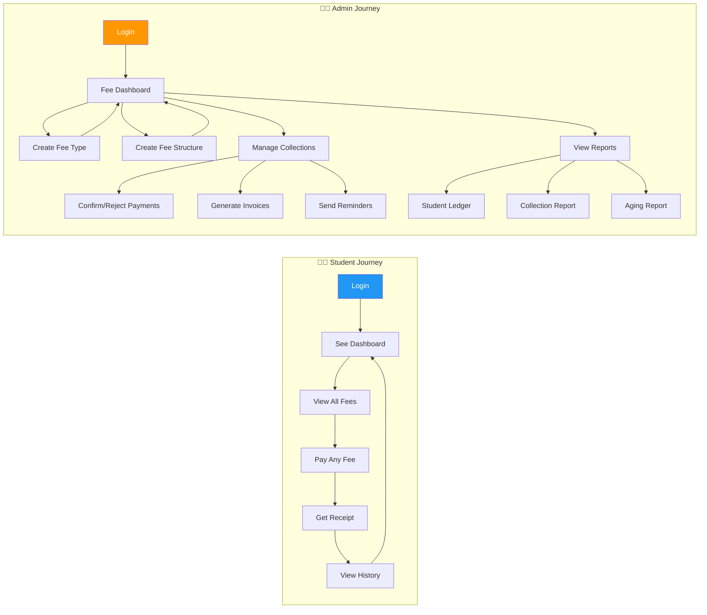

---

## 2. Student Experience — Detailed Flow

### 2.1 Student Fee Dashboard

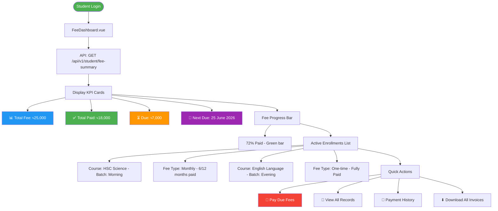

### 2.2 Student Fee Records Page

```mermaid
flowchart TD
    START([Student clicks View All Records]) --> A[FeeRecords.vue]
    
    A --> B[API: GET /api/v1/student/fee-records]
    B --> C[Show ALL fees grouped by enrollment]
    
    C --> D[Enrollment: HSC Science Morning]
    D --> D1[Monthly Fee Records Table]
    D1 --> D1a[| Month | Due Date | Amount | Paid | Late Fee | Status | Invoice |]
    D1a --> D1b[| May 2026 | 25-May | 1,000 | 1,000 | 0 | ✅ Paid | 📄 Download |]
    D1a --> D1c[| Jun 2026 | 25-Jun | 1,000 | 0 | 0 | ⏳ Pending | - |]
    D1a --> D1d[| Jul 2026 | 25-Jul | 1,000 | 0 | 0 | ⏳ Pending | - |]
    
    D --> D2[One-time Fees]
    D2 --> D2a[| Fee Name | Amount | Paid | Status |]
    D2a --> D2b[| Admission Fee | 5,000 | 5,000 | ✅ Paid |]
    D2a --> D2c[| Library Fee | 1,000 | 0 | ⏳ Pending |]
    
    C --> E[Enrollment: English Language Evening]
    E --> E1[One-time Fee: 8,000 - ✅ Fully Paid]
    
    C --> F[Total Summary]
    F --> F1[Total Payable: 25,000]
    F --> F2[Total Paid: 18,000]
    F --> F3[Total Due: 7,000]

    style START fill:#4CAF50,color:#fff
    style D1a fill:#E3F2FD
    style F fill:#FFF3E0
```

### 2.3 Student Payment Flow — Hassle-Free

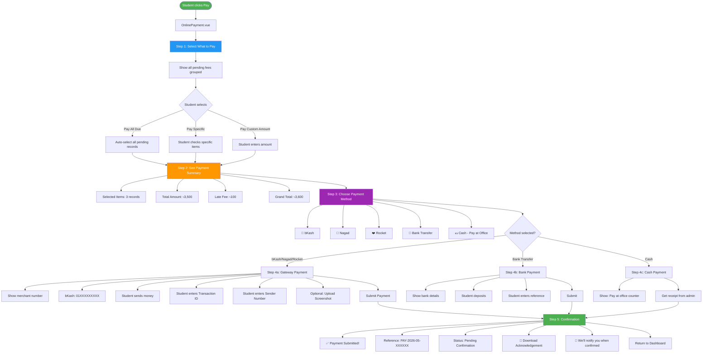

### 2.4 Student Payment History

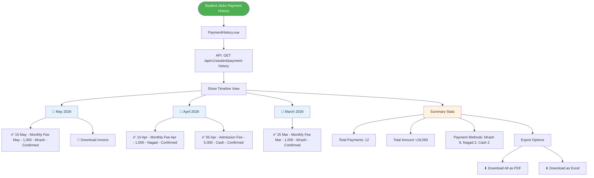

---

## 3. Admin Experience — Full Fee Management

### 3.1 Admin Fee Dashboard

```mermaid
flowchart TD
    START([Admin Login]) --> A[Fee Management Dashboard]
    
    A --> B[KPI Row]
    B --> B1[📊 Total Collected This Month: ৳1,50,000]
    B --> B2[⏳ Pending Confirmation: 23 payments]
    B --> B3[🔴 Overdue: ৳45,000]
    B --> B4[📈 Collection Rate: 78%]
    
    A --> C[Quick Actions]
    C --> C1[➕ Create New Fee Type]
    C --> C2[📋 Create Fee Structure]
    C --> C3[💳 Confirm Payments]
    C --> C4[📊 View Reports]
    
    A --> D[Recent Unconfirmed Payments]
    D --> D1[| Student | Amount | Method | Time | Action |]
    D --> D1a[| Rahim | 1,000 | bKash | 2 min ago | ✅ / ❌ |]
    D --> D1b[| Karim | 2,500 | Nagad | 5 min ago | ✅ / ❌ |]
    D --> D1c[| Fatima | 1,000 | Rocket | 10 min ago | ✅ / ❌ |]
    
    A --> E[Monthly Collection Chart]
    E --> E1[Bar chart: Jan to May 2026]
    
    A --> F[Overdue Alerts]
    F --> F1[🔴 15 students overdue by more than 30 days]
    F --> F2[Send Bulk Reminder →]

    style START fill:#4CAF50,color:#fff
    style B1 fill:#4CAF50,color:#fff
    style B2 fill:#FF9800,color:#fff
    style B3 fill:#f44336,color:#fff
    style C1 fill:#2196F3,color:#fff
```

### 3.2 Fee Type Creation — Admin

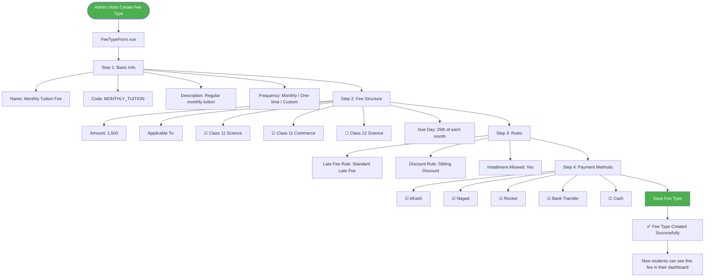

### 3.3 Fee Structure Examples

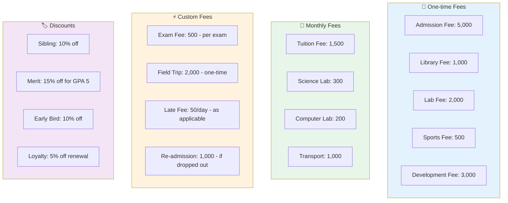

### 3.4 Payment Confirmation — Admin

```mermaid
flowchart TD
    START([Admin opens Payment Confirmation]) --> A[PaymentConfirmationPage.vue]
    
    A --> B[Filters]
    B --> B1[All | bKash | Nagad | Rocket | Bank | Cash]
    B --> B2[Today | This Week | This Month | Custom]
    
    B --> C[Unconfirmed Payments List]
    C --> C1[| # | Student | Amount | Method | Txn ID | Time | Action |]
    C --> C1a[| 1 | Rahim | 1,000 | bKash | BK-123 | 2 min ago | 👁️ |]
    C --> C1b[| 2 | Karim | 2,500 | Nagad | NG-456 | 5 min ago | 👁️ |]
    
    C1a --> D[Click to Review]
    D --> D1[Student: Rahim Uddin]
    D --> D2[Course: HSC Science Morning]
    D --> D3[Fee: Monthly Fee - May 2026]
    D --> D4[Amount: ৳1,000]
    D --> D5[Method: bKash - 01XXXXXXXXX]
    D --> D6[Transaction ID: BK-123]
    D --> D7[Sent From: 017XXXXXXXX]
    D --> D8[🖼️ Screenshot]
    
    D --> E{Admin Decision}
    E -->|✅ Confirm| F[Payment Confirmed!]
    E -->|❌ Reject| G[Enter Reason]
    
    F --> F1[Invoice Generated: INV-2026-05-XXXX]
    F --> F2[SMS Sent: Your payment of 1,000 is confirmed]
    F --> F3[Email Sent: Invoice attached]
    F --> F4[Fee Record Updated]
    F --> F5[Finance Synced]
    
    G --> G1[Reason: Transaction ID not matching]
    G --> G2[SMS Sent: Your payment was rejected - Transaction ID not matching]
    G --> G3[Student can re-submit]

    style START fill:#4CAF50,color:#fff
    style E fill:#FF9800,color:#fff
    style F fill:#4CAF50,color:#fff
    style G fill:#f44336,color:#fff
```

### 3.5 Student Ledger — Full History

```mermaid
flowchart TD
    START([Admin clicks Student Ledger]) --> A[StudentLedgerPage.vue]
    
    A --> B[Search Student]
    B --> B1[Type: Rahim Uddin or ID: STU-2026-001]
    B --> B2[Select student from results]
    
    B2 --> C[Student Profile Summary]
    C --> C1[Name: Rahim Uddin]
    C --> C2[ID: STU-2026-001]
    C --> C3[Guardian: 017XXXXXXXX]
    C --> C4[Active Enrollments: 2]
    
    C --> D[Enrollment: HSC Science Morning]
    D --> D1[Fee Type: Monthly | Total: 12,000 | Paid: 8,000 | Due: 4,000]
    D --> D2[Complete Ledger:]
    D2 --> D2a[| Date | Description | Debit | Credit | Balance |]
    D2 --> D2b[| 01-Jan | Enrollment | 12,000 | - | 12,000 |]
    D2 --> D2c[| 05-Jan | Payment - Cash | - | 5,000 | 7,000 |]
    D2 --> D2d[| 25-Jan | Monthly Fee Jan | 1,000 | - | 8,000 |]
    D2 --> D2e[| 28-Jan | Payment - bKash | - | 1,000 | 7,000 |]
    D2 --> D2f[| 25-Feb | Monthly Fee Feb | 1,000 | - | 8,000 |]
    D2 --> D2g[| 26-Feb | Payment - Nagad | - | 1,000 | 7,000 |]
    D2 --> D2h[| 25-Mar | Monthly Fee Mar | 1,000 | - | 8,000 |]
    D2 --> D2i[| 10-Apr | Sibling Discount | -500 | - | 7,500 |]
    D2 --> D2j[| ... | ... | ... | ... | ... |]
    
    D --> D3[Actions]
    D3 --> D3a[📄 Download Full Statement]
    D3 --> D3b[📧 Send Statement to Email]
    D3 --> D3c[➕ Add Manual Adjustment]
    D3 --> D3d[📱 Send Payment Reminder]

    style START fill:#4CAF50,color:#fff
    style D2a fill:#E3F2FD
    style D3 fill:#FFF3E0
```

---

## 4. Smart Fee Management — Admin Features

### 4.1 Bulk Operations

```mermaid
flowchart TD
    subgraph BulkPayments["💳 Bulk Payment Confirmation"]
        BP1[Select multiple pending payments] --> BP2[Confirm All Selected]
        BP2 --> BP3[All invoices generated automatically]
        BP3 --> BP4[Bulk SMS sent to all students]
    end

    subgraph BulkReminders["📱 Bulk Reminder Send"]
        BR1[Filter: Overdue > 30 days] --> BR2[Select All]
        BR2 --> BR3[Send Bulk SMS Reminder]
        BR3 --> BR4[Send Bulk Email Reminder]
    end

    subgraph BulkExport["📊 Bulk Export"]
        BE1[Select report type] --> BE2[Select date range]
        BE2 --> BE3[Export to CSV / Excel / PDF]
    end

    subgraph BulkAdjustment["➕ Bulk Adjustment"]
        BA1[Select multiple students] --> BA2[Select adjustment type]
        BA2 --> BA3[Enter amount + reason]
        BA3 --> BA4[Apply to all selected]
    end

    style BP1 fill:#4CAF50,color:#fff
    style BR1 fill:#FF9800,color:#fff
    style BE1 fill:#2196F3,color:#fff
    style BA1 fill:#9C27B0,color:#fff
```

### 4.2 Smart Dashboard Widgets

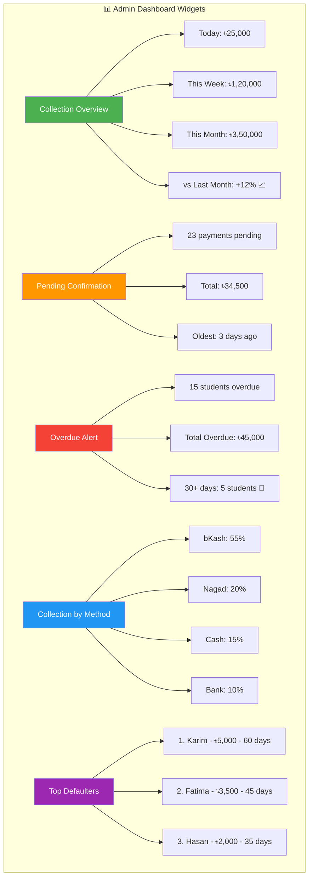

---

## 5. Critical Data Integrity — No Data Loss

### 5.1 Payment Transaction Flow

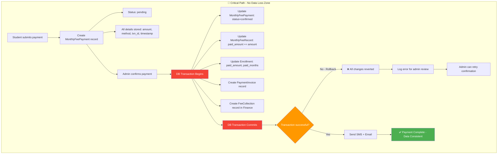

### 5.2 Audit Trail

```sql
-- Every payment action is logged
CREATE TABLE fee_audit_logs (
    id              UUID PRIMARY KEY,
    enrollment_id   UUID NOT NULL REFERENCES enrollments(id),
    action          VARCHAR(50) NOT NULL,  -- payment_created, payment_confirmed, payment_rejected, adjustment_made
    old_values      JSON NULL,             -- Before state
    new_values      JSON NULL,             -- After state
    performed_by    UUID NOT NULL REFERENCES users(id),
    performed_at    TIMESTAMP DEFAULT CURRENT_TIMESTAMP,
    ip_address      VARCHAR(45) NULL,
    user_agent      TEXT NULL
);

-- Example audit entries:
-- | action             | old_values                          | new_values                                    |
-- |--------------------|-------------------------------------|-----------------------------------------------|
-- | payment_created    | NULL                                | {"amount":1000, "status":"pending"}           |
-- | payment_confirmed  | {"status":"pending"}                | {"status":"confirmed", "confirmed_by":"Admin"}|
-- | payment_rejected   | {"status":"pending"}                | {"status":"rejected", "reason":"Wrong txn"}   |
```

---

## 6. Complete API Architecture

### 6.1 Student-Facing APIs

```http
# ===== STUDENT PORTAL =====
GET    /api/v1/student/dashboard
  → { total_fee, total_paid, total_due, next_due, enrollments: [...] }

GET    /api/v1/student/fee-records?enrollment_id=uuid
  → { records: [{ month, due_date, amount, paid, late_fee, status, invoice_url }] }

GET    /api/v1/student/payment-history?page=1&per_page=20
  → { payments: [{ date, amount, method, status, invoice_url }], pagination }

POST   /api/v1/student/pay
  Body: {
    "enrollment_id": "uuid",
    "record_ids": ["uuid1", "uuid2"],     // Which records to pay
    "amount": 3500,                        // Total amount
    "payment_method": "bkash",
    "transaction_id": "BKASH-123",
    "sender_number": "017XXXXXXXX",
    "screenshot": "base64-image"           // Optional
  }
  → { payment_id: "uuid", status: "pending", reference: "PAY-2026-05-XXX" }

GET    /api/v1/student/invoices
  → { invoices: [{ id, invoice_no, date, amount, status, download_url }] }

GET    /api/v1/student/invoices/{id}/download
  → PDF file

GET    /api/v1/student/payment-status/{paymentId}
  → { status: "pending|confirmed|rejected", confirmed_at, confirmed_by }
```

### 6.2 Admin-Facing APIs

```http
# ===== FEE TYPES =====
GET    /api/v1/fee-types                    → List all fee types
POST   /api/v1/fee-types                    → Create fee type
PUT    /api/v1/fee-types/{id}               → Update fee type
DELETE /api/v1/fee-types/{id}               → Delete fee type

# ===== FEE STRUCTURES =====
GET    /api/v1/fee-structures               → List fee structures
POST   /api/v1/fee-structures               → Create fee structure
PUT    /api/v1/fee-structures/{id}          → Update fee structure
DELETE /api/v1/fee-structures/{id}          → Delete fee structure

# ===== PAYMENT CONFIRMATION =====
GET    /api/v1/payments/unconfirmed         → List unconfirmed payments
GET    /api/v1/payments/{id}                → Get payment details
POST   /api/v1/payments/{id}/confirm        → Confirm payment
POST   /api/v1/payments/{id}/reject         → Reject payment with reason
POST   /api/v1/payments/bulk-confirm        → Bulk confirm payments

# ===== STUDENT LEDGER =====
GET    /api/v1/students/{id}/ledger         → Complete fee ledger
GET    /api/v1/students/{id}/ledger/export  → Export ledger as PDF/Excel

# ===== REPORTS =====
GET    /api/v1/reports/collection           → Collection report (date range)
GET    /api/v1/reports/aging                → Aging report
GET    /api/v1/reports/monthly-summary      → Monthly summary
GET    /api/v1/reports/dashboard            → Dashboard stats

# ===== BULK OPERATIONS =====
POST   /api/v1/payments/bulk-remind         → Send bulk reminders
POST   /api/v1/adjustments/bulk             → Bulk fee adjustments
GET    /api/v1/exports/payments             → Export payments as CSV/Excel
```

---

## 7. Database Schema — Core Tables

### 7.1 New Tables

```sql
-- ===== FEE TYPES =====
CREATE TABLE fee_types (
    id              UUID PRIMARY KEY,
    name            VARCHAR(255) NOT NULL,       -- "Monthly Tuition Fee"
    code            VARCHAR(50) UNIQUE NOT NULL, -- "MONTHLY_TUITION"
    description     TEXT,
    frequency       ENUM('one_time','monthly','custom') NOT NULL,
    amount          DECIMAL(12,2) NOT NULL,
    due_day         INT NULL,                    -- 25 for 25th of month
    applicable_to   JSON NULL,                   -- { "classes": ["uuid1","uuid2"] }
    late_fee_rule_id UUID NULL,
    discount_rule_id UUID NULL,
    installment_allowed BOOLEAN DEFAULT FALSE,
    payment_methods JSON NULL,                   -- ["bkash","nagad","rocket","bank","cash"]
    status          ENUM('active','inactive') DEFAULT 'active',
    created_at      TIMESTAMP,
    updated_at      TIMESTAMP
);

-- ===== FEE STRUCTURES =====
-- Links fee types to specific classes/sessions
CREATE TABLE fee_structures (
    id                  UUID PRIMARY KEY,
    academic_session_id UUID NOT NULL,
    class_id            UUID NOT NULL,
    fee_type_id         UUID NOT NULL REFERENCES fee_types(id),
    amount              DECIMAL(12,2) NOT NULL,  -- Override amount if different
    is_mandatory        BOOLEAN DEFAULT TRUE,
    status              ENUM('active','inactive') DEFAULT 'active',
    created_at          TIMESTAMP,
    updated_at          TIMESTAMP
);

-- ===== STUDENT FEE ASSIGNMENTS =====
-- Links students to their applicable fees
CREATE TABLE student_fee_assignments (
    id                  UUID PRIMARY KEY,
    enrollment_id       UUID NOT NULL REFERENCES enrollments(id) ON DELETE CASCADE,
    fee_type_id         UUID NOT NULL REFERENCES fee_types(id),
    amount              DECIMAL(12,2) NOT NULL,
    total_paid          DECIMAL(12,2) DEFAULT 0,
    status              ENUM('pending','partial','paid','overdue') DEFAULT 'pending',
    created_at          TIMESTAMP,
    updated_at          TIMESTAMP
);

-- ===== PAYMENT TRANSACTIONS =====
CREATE TABLE payment_transactions (
    id                  UUID PRIMARY KEY,
    enrollment_id       UUID NOT NULL REFERENCES enrollments(id),
    student_id          UUID NOT NULL REFERENCES students(id),
    amount              DECIMAL(12,2) NOT NULL,
    payment_method      ENUM('bkash','nagad','rocket','bank','cash') NOT NULL,
    transaction_id      VARCHAR(255) NULL,
    sender_number       VARCHAR(20) NULL,
    screenshot_path     VARCHAR(255) NULL,
    status              ENUM('pending','confirmed','rejected') DEFAULT 'pending',
    confirmed_by        UUID NULL REFERENCES users(id),
    confirmed_at        TIMESTAMP NULL,
    rejected_by         UUID NULL REFERENCES users(id),
    rejected_at         TIMESTAMP NULL,
    rejection_reason    TEXT NULL,
    reference_no        VARCHAR(100) UNIQUE,
    metadata            JSON NULL,
    created_at          TIMESTAMP,
    updated_at          TIMESTAMP
);

-- ===== PAYMENT ALLOCATIONS =====
-- Links a payment to specific fee records
CREATE TABLE payment_allocations (
    id                      UUID PRIMARY KEY,
    payment_transaction_id  UUID NOT NULL REFERENCES payment_transactions(id),
    student_fee_assignment_id UUID NOT NULL REFERENCES student_fee_assignments(id),
    monthly_fee_record_id   UUID NULL REFERENCES monthly_fee_records(id),
    amount                  DECIMAL(12,2) NOT NULL,
    created_at              TIMESTAMP
);
```

### 7.2 Modified Existing Tables

```sql
-- Add to enrollments
ALTER TABLE enrollments
    ADD COLUMN fee_type_ids JSON NULL,           -- ["uuid1","uuid2"] - assigned fee types
    ADD COLUMN total_fee_amount DECIMAL(12,2) DEFAULT 0,
    ADD COLUMN total_paid_amount DECIMAL(12,2) DEFAULT 0,
    ADD COLUMN last_payment_at TIMESTAMP NULL;

-- Add to monthly_fee_records
ALTER TABLE monthly_fee_records
    ADD COLUMN fee_type_id UUID NULL REFERENCES fee_types(id),
    ADD COLUMN late_fee DECIMAL(10,2) DEFAULT 0,
    ADD COLUMN discount_amount DECIMAL(10,2) DEFAULT 0,
    ADD COLUMN discount_details JSON NULL;
```

---

## 8. Implementation Priority

### Phase 1: Foundation (Week 1)
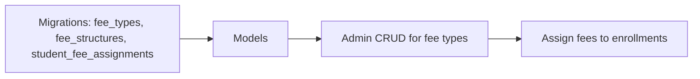

### Phase 2: Student Payment (Week 2)
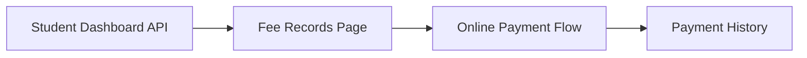

### Phase 3: Admin Management (Week 3)
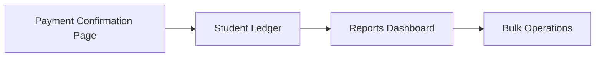

### Phase 4: Smart Features (Week 4)
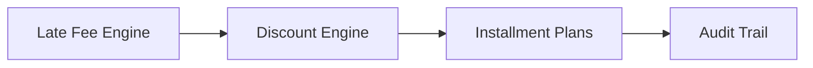

---

## 10. Notification System (SMS + Email)

> **Current Status:** Your project already has a robust notification infrastructure:
> - [`Modules/Enrollment/app/Services/NotificationService.php`](Modules/Enrollment/app/Services/NotificationService.php) — Sends enrollment + payment confirmations via email + SMS
> - [`Modules/Core/app/Services/SmsService.php`](Modules/Core/app/Services/SmsService.php) — Gateway-based SMS with templating, bulk, OTP support
> - [`Modules/Communication/app/Models/Notification.php`](Modules/Communication/app/Models/Notification.php) — Notification log model
> - [`Modules/Communication/app/Models/SmsLog.php`](Modules/Communication/app/Models/SmsLog.php) — SMS log model

### 10.1 Notification Triggers (What triggers a notification)

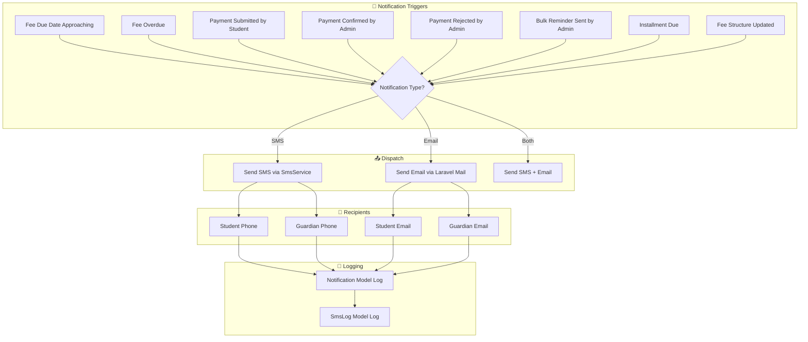

### 10.2 Notification Matrix (Complete)

| Trigger | Channel | Recipient | Template | When |
|---------|---------|-----------|----------|------|
| **Fee Due Reminder** | SMS + Email | Student + Guardian | "Your fee of ৳{amount} is due on {date}" | 7 days before due date |
| **Fee Overdue Alert** | SMS + Email | Student + Guardian | "⚠️ Your fee of ৳{amount} is overdue by {days} days. Late fee: ৳{late_fee}" | Daily after due date |
| **Payment Submitted** | SMS | Student | "✅ Payment of ৳{amount} submitted. Waiting for admin confirmation." | Immediately on submission |
| **Payment Confirmed** | SMS + Email | Student + Guardian | "✅ Payment of ৳{amount} confirmed. Invoice: {invoice_no}" | Immediately on confirmation |
| **Payment Rejected** | SMS | Student | "❌ Payment of ৳{amount} rejected. Reason: {reason}. Please resubmit." | Immediately on rejection |
| **Bulk Reminder** | SMS + Email | Selected Students | "📚 Dear {name}, you have pending fees of ৳{amount}. Please pay soon." | On admin trigger |
| **Installment Due** | SMS + Email | Student + Guardian | "📅 Installment {n} of {total} of ৳{amount} is due on {date}" | 3 days before due date |
| **Receipt/Invoice** | Email | Student + Guardian | PDF invoice attached | On payment confirmation |
| **Full Payment Complete** | SMS + Email | Student + Guardian | "🎉 Congratulations! All fees paid in full for {course}." | When due_amount = 0 |

### 10.3 SMS Templates (Bangla + English)

```php
// config/sms-templates.php (new file to add)
<?php

return [
    // ===== FEE DUE REMINDERS =====
    'fee_due_reminder' => [
        'en' => "CMS Coaching: Dear :name, your fee of BDT :amount is due on :date. Please pay to avoid late fees. - CMS",
        'bn' => "CMS Coaching: প্রিয় :name, আপনার :amount টাকা ফি :date তারিখের মধ্যে পরিশোধ করুন। দেরী ফি এড়াতে দ্রুত পরিশোধ করুন। - CMS",
    ],

    'fee_overdue_alert' => [
        'en' => "⚠️ CMS Coaching: Dear :name, your fee of BDT :amount is :days days overdue. Late fee BDT :late_fee applied. Pay now: :payment_link - CMS",
        'bn' => "⚠️ CMS Coaching: প্রিয় :name, আপনার :amount টাকা ফি :days দিন ওভারডিউ। দেরী ফি :late_fee টাকা যোগ হয়েছে। এখনই পরিশোধ করুন: :payment_link - CMS",
    ],

    // ===== PAYMENT NOTIFICATIONS =====
    'payment_submitted' => [
        'en' => "✅ CMS Coaching: Payment of BDT :amount submitted via :method. TrxID: :trx_id. Waiting for admin confirmation. - CMS",
        'bn' => "✅ CMS Coaching: :amount টাকা পেমেন্ট জমা দেওয়া হয়েছে। TrxID: :trx_id. অ্যাডমিন নিশ্চিতকরণ অপেক্ষায়। - CMS",
    ],

    'payment_confirmed' => [
        'en' => "✅ CMS Coaching: Payment of BDT :amount confirmed! Invoice: :invoice_no. Total Paid: BDT :total_paid. Due: BDT :due. - CMS",
        'bn' => "✅ CMS Coaching: :amount টাকা পেমেন্ট নিশ্চিত করা হয়েছে! ইনভয়েস: :invoice_no. মোট পরিশোধ: :total_paid টাকা। বাকি: :due টাকা। - CMS",
    ],

    'payment_rejected' => [
        'en' => "❌ CMS Coaching: Payment of BDT :amount rejected. Reason: :reason. Please resubmit with correct info. - CMS",
        'bn' => "❌ CMS Coaching: :amount টাকা পেমেন্ট প্রত্যাখ্যান করা হয়েছে। কারণ: :reason. সঠিক তথ্য দিয়ে আবার জমা দিন। - CMS",
    ],

    // ===== INSTALLMENT =====
    'installment_due' => [
        'en' => "📅 CMS Coaching: Installment :n of :total (BDT :amount) for :course is due on :date. - CMS",
        'bn' => "📅 CMS Coaching: :course কোর্সের :n তম কিস্তি (:total এর) :amount টাকা :date তারিখের মধ্যে পরিশোধ করুন। - CMS",
    ],

    // ===== FULL PAYMENT =====
    'full_payment_complete' => [
        'en' => "🎉 CMS Coaching: Congratulations :name! All fees paid in full for :course. Total: BDT :total. - CMS",
        'bn' => "🎉 CMS Coaching: অভিনন্দন :name! :course কোর্সের সকল ফি সম্পূর্ণ পরিশোধ করা হয়েছে। মোট: :total টাকা। - CMS",
    ],

    // ===== BULK REMINDER =====
    'bulk_reminder' => [
        'en' => "📚 CMS Coaching: Dear :name, you have pending fees of BDT :amount. Please clear your dues at your earliest. - CMS",
        'bn' => "📚 CMS Coaching: প্রিয় :name, আপনার :amount টাকা বকেয়া ফি রয়েছে। অনুগ্রহ করে দ্রুত পরিশোধ করুন। - CMS",
    ],
];
```

### 10.4 Enhanced NotificationService (Fee-Specific Methods)

Add these methods to the existing [`NotificationService.php`](Modules/Enrollment/app/Services/NotificationService.php):

```php
/**
 * Send fee due reminder to a student.
 */
public function sendFeeDueReminder(Enrollment $enrollment, float $amount, string $dueDate): array
{
    $student = $enrollment->student;
    $phone = $student?->phone;
    $guardianPhone = $enrollment->guardian_phone ?? $student?->guardian?->guardian_phone ?? null;
    $email = $student?->email;
    $guardianEmail = $enrollment->guardian_email ?? $student?->guardian?->guardian_email ?? null;
    $name = $student?->full_name ?? $student?->first_name ?? 'Student';

    $results = ['sms_sent' => false, 'email_sent' => false];

    // Send SMS to student
    if ($phone) {
        $msg = str_replace(
            [':name', ':amount', ':date'],
            [$name, number_format($amount, 2), $dueDate],
            config('sms-templates.fee_due_reminder.bn')
        );
        $this->sendSms($phone, $msg);
        $results['sms_sent'] = true;
    }

    // Send SMS to guardian
    if ($guardianPhone && $guardianPhone !== $phone) {
        $msg = str_replace(
            [':name', ':amount', ':date'],
            [$name, number_format($amount, 2), $dueDate],
            config('sms-templates.fee_due_reminder.bn')
        );
        $this->sendSms($guardianPhone, $msg);
    }

    // Send email
    if ($email) {
        $this->sendEmail(
            $email,
            "Fee Due Reminder - BDT {$amount}",
            $this->buildFeeReminderEmailBody($name, $amount, $dueDate)
        );
        $results['email_sent'] = true;
    }

    if ($guardianEmail) {
        $this->sendEmail(
            $guardianEmail,
            "Fee Due Reminder - Guardian Copy - BDT {$amount}",
            $this->buildFeeReminderEmailBody($name, $amount, $dueDate)
        );
    }

    return $results;
}

/**
 * Send overdue alert with late fee info.
 */
public function sendOverdueAlert(Enrollment $enrollment, float $amount, int $daysOverdue, float $lateFee): array
{
    $student = $enrollment->student;
    $phone = $student?->phone;
    $name = $student?->full_name ?? $student?->first_name ?? 'Student';

    $msg = str_replace(
        [':name', ':amount', ':days', ':late_fee', ':payment_link'],
        [$name, number_format($amount, 2), $daysOverdue, number_format($lateFee, 2), config('app.url') . '/student/fees'],
        config('sms-templates.fee_overdue_alert.bn')
    );

    if ($phone) {
        $this->sendSms($phone, $msg);
    }

    return ['sms_sent' => (bool)$phone];
}

/**
 * Send payment rejection notification.
 */
public function sendPaymentRejection(Enrollment $enrollment, float $amount, string $reason): array
{
    $student = $enrollment->student;
    $phone = $student?->phone;

    $msg = str_replace(
        [':amount', ':reason'],
        [number_format($amount, 2), $reason],
        config('sms-templates.payment_rejected.bn')
    );

    if ($phone) {
        $this->sendSms($phone, $msg);
    }

    return ['sms_sent' => (bool)$phone];
}

/**
 * Send full payment completion notification.
 */
public function sendFullPaymentComplete(Enrollment $enrollment): array
{
    $student = $enrollment->student;
    $phone = $student?->phone;
    $email = $student?->email;
    $course = $enrollment->batch?->course?->name ?? 'Course';
    $name = $student?->full_name ?? $student?->first_name ?? 'Student';

    $results = ['sms_sent' => false, 'email_sent' => false];

    $msg = str_replace(
        [':name', ':course', ':total'],
        [$name, $course, number_format($enrollment->total_fee, 2)],
        config('sms-templates.full_payment_complete.bn')
    );

    if ($phone) {
        $this->sendSms($phone, $msg);
        $results['sms_sent'] = true;
    }

    if ($email) {
        $this->sendEmail(
            $email,
            "🎉 Full Payment Complete - {$course}",
            $this->buildFullPaymentEmailBody($name, $course, $enrollment->total_fee)
        );
        $results['email_sent'] = true;
    }

    return $results;
}
```

### 10.5 Email Templates (HTML)

```php
// Inside NotificationService.php — add these email body builders

private function buildFeeReminderEmailBody(string $name, float $amount, string $dueDate): string
{
    return <<<HTML
    <div style="font-family: Arial, sans-serif; max-width: 600px; margin: 0 auto;">
        <h2 style="color: #e67e22;">📅 Fee Due Reminder</h2>
        <p>Dear <strong>{$name}</strong>,</p>
        <p>This is a reminder that your fee of <strong>BDT {$amount}</strong> is due on <strong>{$dueDate}</strong>.</p>
        <p>Please make the payment before the due date to avoid late fees.</p>
        <div style="text-align: center; margin: 30px 0;">
            <a href="https://cms.example.com/student/fees"
               style="background: #e67e22; color: white; padding: 12px 30px; text-decoration: none; border-radius: 5px;">
                Pay Now
            </a>
        </div>
        <hr>
        <p style="color: #888; font-size: 12px;">CMS Coaching Management System</p>
    </div>
    HTML;
}

private function buildFullPaymentEmailBody(string $name, string $course, float $total): string
{
    return <<<HTML
    <div style="font-family: Arial, sans-serif; max-width: 600px; margin: 0 auto;">
        <h2 style="color: #27ae60;">🎉 Full Payment Complete!</h2>
        <p>Dear <strong>{$name}</strong>,</p>
        <p>Congratulations! You have completed all payments for <strong>{$course}</strong>.</p>
        <p><strong>Total Paid:</strong> BDT {$total}</p>
        <p>You can download your payment statement from your student portal.</p>
        <hr>
        <p style="color: #888; font-size: 12px;">CMS Coaching Management System</p>
    </div>
    HTML;
}
```

### 10.6 Scheduled Jobs for Notifications

Add these to the existing console kernel:

```php
// Modules/Enrollment/app/Console/Kernel.php or app/Console/Kernel.php

protected function schedule(Schedule $schedule): void
{
    // Send fee due reminders 7 days before due date (daily at 9 AM)
    $schedule->command('fees:send-due-reminders')
        ->dailyAt('09:00')
        ->withoutOverlapping();

    // Send overdue alerts daily at 10 AM
    $schedule->command('fees:send-overdue-alerts')
        ->dailyAt('10:00')
        ->withoutOverlapping();

    // Send installment due reminders 3 days before (daily at 9 AM)
    $schedule->command('fees:send-installment-reminders')
        ->dailyAt('09:00')
        ->withoutOverlapping();
}
```

### 10.7 Notification Preference Settings

Allow students/guardians to control notification preferences:

```sql
-- New table: notification_preferences
CREATE TABLE notification_preferences (
    id              BIGINT UNSIGNED AUTO_INCREMENT PRIMARY KEY,
    student_id      BIGINT UNSIGNED NOT NULL,
    -- Channels
    sms_enabled     BOOLEAN DEFAULT TRUE,
    email_enabled   BOOLEAN DEFAULT TRUE,
    -- What to notify
    due_reminder    BOOLEAN DEFAULT TRUE,
    overdue_alert   BOOLEAN DEFAULT TRUE,
    payment_confirmation BOOLEAN DEFAULT TRUE,
    payment_rejection     BOOLEAN DEFAULT TRUE,
    installment_reminder  BOOLEAN DEFAULT TRUE,
    bulk_reminder         BOOLEAN DEFAULT TRUE,
    -- Contact overrides (if different from profile)
    sms_phone       VARCHAR(20) NULL,
    email_address   VARCHAR(100) NULL,
    -- Timestamps
    created_at      TIMESTAMP DEFAULT CURRENT_TIMESTAMP,
    updated_at      TIMESTAMP DEFAULT CURRENT_TIMESTAMP ON UPDATE CURRENT_TIMESTAMP,

    FOREIGN KEY (student_id) REFERENCES students(id) ON DELETE CASCADE,
    UNIQUE KEY (student_id)
);
```

### 10.8 Notification Flow Diagram (Complete)

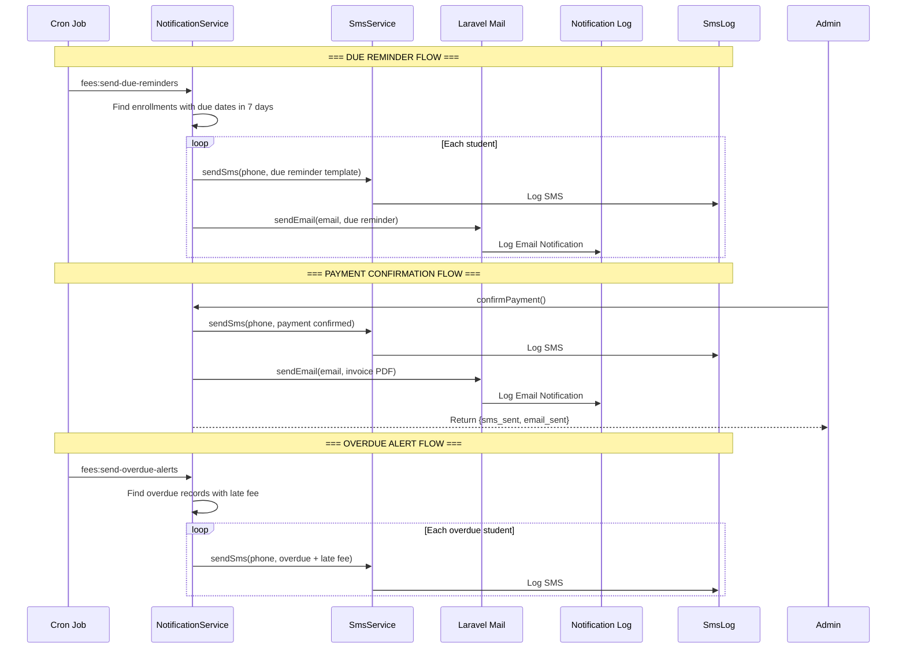

### Summary

| Feature | Current Status | Enhancement Needed |
|---------|---------------|-------------------|
| Enrollment Confirmation SMS | ✅ Already implemented | — |
| Enrollment Confirmation Email | ✅ Already implemented | — |
| Payment Confirmation SMS | ✅ Already implemented | — |
| Payment Confirmation Email | ✅ Already implemented | — |
| Fee Due Reminder SMS | ❌ Not implemented | Add `sendFeeDueReminder()` method |
| Fee Due Reminder Email | ❌ Not implemented | Add email template + method |
| Overdue Alert SMS | ❌ Not implemented | Add `sendOverdueAlert()` method |
| Payment Rejection SMS | ❌ Not implemented | Add `sendPaymentRejection()` method |
| Full Payment Complete SMS | ❌ Not implemented | Add `sendFullPaymentComplete()` method |
| Full Payment Complete Email | ❌ Not implemented | Add email template + method |
| Bulk Reminder SMS | ❌ Not implemented | Use existing `sendBulkReminders()` |
| Bangla SMS Templates | ❌ Not implemented | Add `config/sms-templates.php` |
| Notification Preferences | ❌ Not implemented | Add `notification_preferences` table |
| Scheduled Cron Jobs | ❌ Not implemented | Add 3 cron commands |

Your existing notification infrastructure is **solid** — it already handles enrollment confirmation and payment confirmation via SMS + Email to both students and guardians. The enhancements above add the missing pieces: due reminders, overdue alerts, rejection notifications, Bangla language support, and scheduled cron jobs.