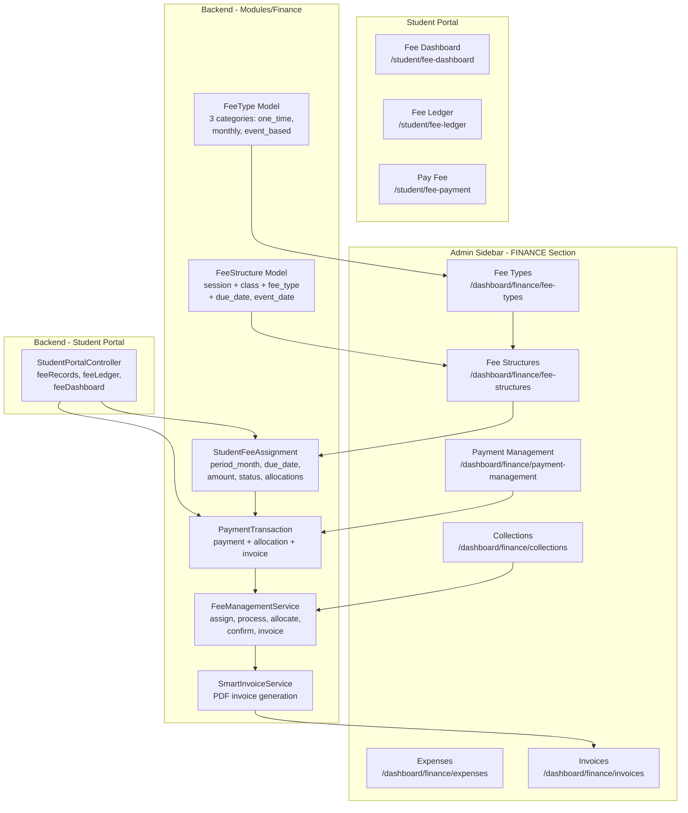

# Unified Smart Fee System — Comprehensive Plan

## Overview

Transform the current Smart Fee System (`Modules/Finance`) into a **unified, professional fee management system** that handles ALL fee types — replacing the legacy Monthly Fee System (`Modules/Enrollment`).

---

## Payment Flow: How Admin and Student Pay Fees

The existing system already supports the workflow you described. Here's how it works for ALL fee types (one-time, monthly, event-based):

### Flow A: Admin Manually Collects (via Collections page)

```
Admin selects student → sees pending fees grouped by category
    → selects specific assignments to pay
    → enters amount + payment method
```

| Payment Method | Auto-Confirmed? | Invoice Generated? |
|---------------|----------------|-------------------|
| **Cash** | ✅ Yes, immediately | ✅ Auto-generated |
| **Bank Transfer** | ❌ No, needs admin approval | ✅ After confirmation |
| **Check** | ❌ No, needs admin approval | ✅ After confirmation |

### Flow B: Student Pays from Portal (via Pay Fee page)

```
Student logs in → sees all pending fees grouped by category
    → selects fees to pay
    → chooses payment method
```

| Payment Method | Auto-Confirmed? | Invoice Generated? |
|---------------|----------------|-------------------|
| **bKash/Nagad/Rocket/Card** (online gateway) | ✅ Yes, immediately | ✅ Auto-generated |
| **Cash** (pay at office) | ❌ No, needs admin approval | ✅ After confirmation |

### Key Points
- **Every fee type** (one-time, monthly, event-based) supports both admin collection and student self-payment
- **Online gateways** auto-confirm and auto-generate invoice
- **Cash/manual** needs admin approval (pending → confirmed/rejected)
- **Invoice** is always generated upon confirmation
- Enhancement needed: allow admin to select **specific fee assignments** when collecting (currently uses FIFO auto-allocation)

---

## Architecture Diagram



---

## The 3 Fundamental Fee Categories

### 1. One-Time Fee
| Attribute | Value |
|-----------|-------|
| **Examples** | Admission fee, registration fee, library fee, lab fee, any one-time charge |
| **Generation** | 1 assignment at enrollment time |
| **Due date** | From FeeStructure `due_date` or calculated from `due_day` |
| **period_month** | Enrollment start month (`Y-m`) |

### 2. Monthly Fee
| Attribute | Value |
|-----------|-------|
| **Examples** | Monthly course fee / tuition fee |
| **Generation** | 1 assignment per month for entire course duration |
| **Due date** | Calculated from `due_day` (e.g., 10th of each month) |
| **period_month** | Each month's `Y-m` (e.g., `2026-01`, `2026-02`, ...) |

### 3. Event-Based Fee
| Attribute | Value |
|-----------|-------|
| **Examples** | Weekly exam fee, monthly exam fee, trimester exam fee, half-yearly exam fee, yearly/final exam fee, or any future exam/event fee |
| **Generation** | Based on academic calendar periods (weekly, monthly, term, half-yearly, yearly) |
| **Due date** | From FeeStructure `due_date` (absolute deadline before the event) |
| **event_date** | When the exam/event actually starts (for display) |
| **period_month** | Varies by frequency (see below) |

**Key insight:** Event-based fees can have ANY frequency (weekly, monthly, term, half-yearly, yearly) — but they all share the same behavior: each assignment has a payment deadline (`due_date`) and optionally an event date (`event_date`). The frequency just determines how many assignments are created per year.

---

## Data Model Changes

### 1. FeeType — Replace `frequency` Enum with `category` Enum

**Current:** `fee_types.frequency` = `one_time`, `monthly`, `yearly`, `term`

**New:** `fee_types.category` = `one_time`, `monthly`, `event_based`

The `frequency` field is **removed** from FeeType. Instead:
- `one_time` category → always generates 1 assignment
- `monthly` category → generates 1 assignment per month of course
- `event_based` category → generates assignments based on academic calendar periods

**Why this change?** The old `frequency` enum mixed two concepts: "how often" and "what kind". Now `category` defines the behavior, and the actual frequency for event-based fees is determined by the FeeStructure's `due_date`/`event_date` configuration.

```sql
-- Step 1: Add category column
ALTER TABLE fee_types ADD COLUMN category ENUM(
    'one_time', 'monthly', 'event_based'
) NOT NULL DEFAULT 'monthly' AFTER description;

-- Step 2: Migrate existing data
UPDATE fee_types SET category = 'one_time' WHERE frequency = 'one_time';
UPDATE fee_types SET category = 'monthly' WHERE frequency = 'monthly';
UPDATE fee_types SET category = 'event_based' WHERE frequency IN ('yearly', 'term');

-- Step 3: Drop old frequency column
ALTER TABLE fee_types DROP COLUMN frequency;
```

### 2. FeeStructure — Add `due_date` and `event_date` Columns

**Current schema:**
```sql
fee_structures (
    id, academic_session_id, class_id, fee_type_id,
    amount, description, due_day, status
)
```

**New columns:**
```sql
ALTER TABLE fee_structures ADD COLUMN due_date DATE NULL AFTER amount;
ALTER TABLE fee_structures ADD COLUMN event_date DATE NULL AFTER due_date;
```

- **`due_date`** (nullable date): For event-based fees, the absolute payment deadline. E.g., "Final Exam Fee must be paid by 2026-11-15". If set, this overrides `due_day`.
- **`event_date`** (nullable date): The actual event/exam date. Used for display: "Final Exam - Due before Nov 15, 2026"

**How `due_date` and `due_day` interact per category:**

| Category | `due_day` | `due_date` | How due date is determined |
|----------|-----------|------------|---------------------------|
| `one_time` | optional | optional | If `due_date` set, use it. Else use `due_day` from enrollment start. |
| `monthly` | required | ignored | Calculated: period date + `due_day` days |
| `event_based` | ignored | required | Directly from `due_date` (absolute deadline) |

### 3. StudentFeeAssignment — Already Enhanced

The `period_month` column was already added. No additional schema changes needed.

### 4. New: `fee_generation_logs` Table (Optional)

Track when fees were auto-generated for an enrollment to avoid duplicate generation.

---

## Backend Changes

### Phase 1: FeeType Category Restructure

#### 1.1 Create Migration
- New migration: `2026_05_20_180000_restructure_fee_types_category.php`
- Add `category` enum column, migrate data from `frequency`, drop `frequency`

#### 1.2 Update FeeType Model
- **File**: [`Modules/Finance/app/Models/FeeType.php`](Modules/Finance/app/Models/FeeType.php:9)
- Replace `frequency` with `category` in `$fillable`
- Add `$casts` for `category`
- Add helper methods:
  - `isOneTime(): bool`
  - `isMonthly(): bool`
  - `isEventBased(): bool`
  - `getCategoryLabelAttribute(): string`

#### 1.3 Update FeeController Validation
- **File**: [`Modules/Finance/app/Http/Controllers/Api/V1/FeeController.php`](Modules/Finance/app/Http/Controllers/Api/V1/FeeController.php:34)
- Replace `frequency` validation with `category` validation
- Update `storeType()` and `updateType()`

#### 1.4 Update FeeTypeListPage.vue
- **File**: [`frontend/src/pages/dashboard/finance/FeeTypeListPage.vue`](frontend/src/pages/dashboard/finance/FeeTypeListPage.vue:64)
- Replace frequency dropdown with category dropdown: One Time, Monthly, Event Based
- Show category as colored badge

### Phase 2: FeeStructure — Add due_date and event_date

#### 2.1 Create Migration
- New migration: `2026_05_20_180001_add_due_event_date_to_fee_structures.php`
- Add `due_date` (date, nullable) and `event_date` (date, nullable) columns

#### 2.2 Update FeeStructure Model
- **File**: [`Modules/Finance/app/Models/FeeStructure.php`](Modules/Finance/app/Models/FeeStructure.php:9)
- Add `due_date` and `event_date` to `$fillable`
- Add `$casts` for date fields

#### 2.3 Update FeeController Validation for FeeStructure
- **File**: [`Modules/Finance/app/Http/Controllers/Api/V1/FeeController.php`](Modules/Finance/app/Http/Controllers/Api/V1/FeeController.php:79)
- Conditional validation based on fee type category:
  - `monthly` → `due_day` is required
  - `event_based` → `due_date` is required
  - `one_time` → either `due_date` or `due_day` is optional
  - `event_date` is always optional

#### 2.4 Update FeeStructureListPage.vue
- **File**: [`frontend/src/pages/dashboard/finance/FeeStructureListPage.vue`](frontend/src/pages/dashboard/finance/FeeStructureListPage.vue)
- Conditional form fields based on fee type category:
  - Monthly: show `due_day` input
  - Event-based: show `due_date` and `event_date` date pickers
  - One-time: show both `due_date` and `due_day` (either is fine)

### Phase 3: Smart Fee Assignment — Multi-Period Generation

This is the **core change**. Currently `assignFeesToEnrollment()` creates ONE assignment per FeeStructure. Now it creates the right number based on category.

#### 3.1 Update `FeeManagementService::assignFeesToEnrollment()`
- **File**: [`Modules/Finance/app/Services/FeeManagementService.php`](Modules/Finance/app/Services/FeeManagementService.php:27)

```php
public function assignFeesToEnrollment(Enrollment $enrollment, ?string $installmentPlanId = null): array
{
    $feeStructures = FeeStructure::where('class_id', $enrollment->enrolled_class_id)
        ->where('academic_session_id', $enrollment->academic_session_id)
        ->where('status', 'active')
        ->get();

    foreach ($feeStructures as $feeStructure) {
        $category = $feeStructure->feeType->category;
        
        switch ($category) {
            case 'one_time':
                $this->generateOneTimeAssignment($enrollment, $feeStructure);
                break;
            case 'monthly':
                $this->generateMonthlyAssignments($enrollment, $feeStructure);
                break;
            case 'event_based':
                $this->generateEventBasedAssignments($enrollment, $feeStructure);
                break;
        }
    }
}
```

#### 3.2 New Helper: `generateOneTimeAssignment()`
```php
private function generateOneTimeAssignment(Enrollment $enrollment, FeeStructure $feeStructure): void
{
    $periodDate = $enrollment->start_date;
    $dueDate = $feeStructure->due_date 
        ?? $this->calculateDueDateFromDay($feeStructure->due_day, $periodDate);
    $periodMonth = $periodDate->format('Y-m');
    
    $this->createAssignment($enrollment, $feeStructure, $dueDate, $periodMonth);
}
```

#### 3.3 New Helper: `generateMonthlyAssignments()`
```php
private function generateMonthlyAssignments(Enrollment $enrollment, FeeStructure $feeStructure): void
{
    $months = $this->getMonthsForDuration($enrollment);
    
    foreach ($months as $periodDate) {
        $dueDate = $this->calculateDueDateFromDay($feeStructure->due_day, $periodDate);
        $periodMonth = $periodDate->format('Y-m');
        
        $this->createAssignment($enrollment, $feeStructure, $dueDate, $periodMonth);
    }
}
```

#### 3.4 New Helper: `generateEventBasedAssignments()`
```php
private function generateEventBasedAssignments(Enrollment $enrollment, FeeStructure $feeStructure): void
{
    // Event-based fees use the FeeStructure's due_date as the absolute deadline
    // The frequency is determined by how many periods exist in the academic calendar
    // For now, create one assignment per event period
    
    $periods = $this->getEventPeriods($enrollment, $feeStructure);
    
    foreach ($periods as $period) {
        $dueDate = $period['due_date']; // From FeeStructure's due_date
        $eventDate = $period['event_date'] ?? null; // From FeeStructure's event_date
        $periodMonth = $this->formatPeriodMonth($period);
        
        $this->createAssignment($enrollment, $feeStructure, $dueDate, $periodMonth, $eventDate);
    }
}
```

#### 3.5 New Helper Methods

- **`getMonthsForDuration(Enrollment $enrollment): Collection`**
  - Calculates months from `start_date` to `end_date`
  - Returns array of Carbon dates (first of each month)

- **`getEventPeriods(Enrollment $enrollment, FeeStructure $feeStructure): array`**
  - For event-based fees, determines how many periods exist
  - Uses the FeeStructure's `due_date` and `event_date` as the base
  - If the fee structure has a single `due_date`, creates 1 assignment
  - If the academic session has defined exam periods, creates one per period
  - Returns array of `['period_date' => Carbon, 'due_date' => Carbon, 'event_date' => Carbon|null]`

- **`formatPeriodMonth(array $period): string`**
  - For monthly: `Y-m` (e.g., `2026-06`)
  - For event-based: `Y-m` of the event date, or `Y-\T\P1`/`P2`/`P3` for terms, `Y-\H1`/`H2` for half-yearly, `Y` for yearly
  - For one-time: `Y-m` of enrollment start

- **`createAssignment(Enrollment $enrollment, FeeStructure $feeStructure, Carbon $dueDate, string $periodMonth, ?Carbon $eventDate = null): StudentFeeAssignment`**
  - Calculates discounts, creates the assignment record
  - Sets `period_month` from the parameter
  - Stores `event_date` if provided (new column on student_fee_assignments?)

#### 3.6 Update `calculateDueDate()` Method
- **File**: [`Modules/Finance/app/Services/FeeManagementService.php`](Modules/Finance/app/Services/FeeManagementService.php:108)
- Simplified: now just a helper `calculateDueDateFromDay(int $dueDay, Carbon $periodDate)` that returns the period date with the due day applied

### Phase 4: Admin Manual Collection Workflow

#### 4.1 Enhance `FeeManagementController::manualPayment()`
- **File**: [`Modules/Finance/app/Http/Controllers/Api/V1/FeeManagementController.php`](Modules/Finance/app/Http/Controllers/Api/V1/FeeManagementController.php:202)
- Add `fee_assignment_ids[]` optional parameter
- If provided, allocate payment to those specific assignments
- If not provided, fall back to FIFO auto-allocation

#### 4.2 Update `FeeManagementService::recordManualPayment()`
- **File**: [`Modules/Finance/app/Services/FeeManagementService.php`](Modules/Finance/app/Services/FeeManagementService.php:628)
- If `fee_assignment_ids` provided, allocate to those specific assignments
- If not, use existing FIFO logic

#### 4.3 New API Endpoint: Student's Pending Fees
- **File**: [`Modules/Finance/app/Http/Controllers/Api/V1/FeeManagementController.php`](Modules/Finance/app/Http/Controllers/Api/V1/FeeManagementController.php)
- New method: `studentPendingFees(string $enrollmentId)`
- Returns all unpaid/partial assignments grouped by fee type category with period_month labels
- Used by admin Collection page

### Phase 5: Student Portal Enhancements

#### 5.1 Update `StudentPortalController::feeRecords()`
- **File**: [`Modules/Student/app/Http/Controllers/Api/V1/StudentPortalController.php`](Modules/Student/app/Http/Controllers/Api/V1/StudentPortalController.php:438)
- Already updated with `period_month` support
- Add `category`, `event_date` to response
- Group fees by category (One-Time, Monthly, Event-Based)

#### 5.2 Update `StudentPortalController::feeLedger()`
- **File**: [`Modules/Student/app/Http/Controllers/Api/V1/StudentPortalController.php`](Modules/Student/app/Http/Controllers/Api/V1/StudentPortalController.php:267)
- Already updated with `period_month` support
- Show category badges and period info

#### 5.3 Update `StudentPortalController::feeDashboard()`
- **File**: [`Modules/Student/app/Http/Controllers/Api/V1/StudentPortalController.php`](Modules/Student/app/Http/Controllers/Api/V1/StudentPortalController.php:176)
- Show breakdown by fee type category
- Show upcoming event-based fees with deadlines
- Show monthly fees with next due date
- Show one-time fees status

### Phase 6: Invoice System Enhancement

#### 6.1 Update `SmartInvoiceService::resolvePeriodDescription()`
- **File**: [`Modules/Finance/app/Services/SmartInvoiceService.php`](Modules/Finance/app/Services/SmartInvoiceService.php:495)
- Already updated with `period_month` support
- For event-based fees: show "Exam Name - Due before Date"
- For monthly fees: show "Fee Name - Month Year"
- For one-time: show "Fee Name"

#### 6.2 Invoice PDF Template Enhancement
- **File**: [`Modules/Finance/app/Services/SmartInvoiceService.php`](Modules/Finance/app/Services/SmartInvoiceService.php:148)
- Show fee type name, category, period description
- Show event date if applicable
- Show discount and late fee breakdown

### Phase 7: Frontend UI Updates

#### 7.1 FeeTypeListPage — Category Dropdown
- **File**: [`frontend/src/pages/dashboard/finance/FeeTypeListPage.vue`](frontend/src/pages/dashboard/finance/FeeTypeListPage.vue:64)
- Replace frequency dropdown with: One Time, Monthly, Event Based
- Show category as colored badge in table

#### 7.2 FeeStructureListPage — Conditional Fields
- **File**: [`frontend/src/pages/dashboard/finance/FeeStructureListPage.vue`](frontend/src/pages/dashboard/finance/FeeStructureListPage.vue)
- When fee type is Monthly: show `due_day` input
- When fee type is Event Based: show `due_date` and `event_date` date pickers
- When fee type is One Time: show both `due_date` and `due_day`

#### 7.3 FeeCollectionPage — Enhanced Collection Form
- **File**: [`frontend/src/pages/dashboard/finance/FeeCollectionPage.vue`](frontend/src/pages/dashboard/finance/FeeCollectionPage.vue:59)
- Select student → show enrollments → show pending assignments
- Group assignments by category (One-Time, Monthly, Event-Based)
- Show period month names and deadlines
- Allow selecting specific assignments to pay

#### 7.4 PaymentManagementPage — Enhanced Display
- **File**: [`frontend/src/pages/dashboard/finance/PaymentManagementPage.vue`](frontend/src/pages/dashboard/finance/PaymentManagementPage.vue)
- Show fee type category and period info in payment rows
- Add filters by category

#### 7.5 StudentFeePaymentPage — Enhanced Payment UI
- **File**: [`frontend/src/pages/student/StudentFeePaymentPage.vue`](frontend/src/pages/student/StudentFeePaymentPage.vue)
- Show fees grouped by category (One-Time, Monthly Fees, Exam Fees)
- Show proper period month names
- Show exam deadlines prominently
- Show next upcoming fees

#### 7.6 StudentFeeLedgerPage — Enhanced Ledger
- **File**: [`frontend/src/pages/student/StudentFeeLedgerPage.vue`](frontend/src/pages/student/StudentFeeLedgerPage.vue)
- Show category badges (One-Time, Monthly, Event)
- Group by category

#### 7.7 StudentFeeDashboardPage — Enhanced Dashboard
- **File**: [`frontend/src/pages/student/StudentFeeDashboardPage.vue`](frontend/src/pages/student/StudentFeeDashboardPage.vue)
- Summary cards by category
- Upcoming event fees with countdown to deadline
- Monthly fee progress
- One-time fee status

### Phase 8: Legacy Monthly Fee System Deprecation

#### 8.1 Data Migration Script
- Create artisan command: `php artisan fee:migrate-monthly-to-smart`
- Reads all `MonthlyFeeRecord` and `MonthlyFeePayment` data
- Creates equivalent `StudentFeeAssignment` and `PaymentTransaction` records
- Sets `period_month` from the `month` field

#### 8.2 Update StudentPortalController Fallback
- **File**: [`Modules/Student/app/Http/Controllers/Api/V1/StudentPortalController.php`](Modules/Student/app/Http/Controllers/Api/V1/StudentPortalController.php)
- After migration, remove Monthly Fee fallback paths
- Always use Smart Fee system data

#### 8.3 Remove Monthly Fee Sidebar Links
- **File**: [`frontend/src/components/layout/SidebarNav.vue`](frontend/src/components/layout/SidebarNav.vue:263)
- Remove "Monthly Fees" link from Enrollment section

---

## Implementation Order

```mermaid
flowchart LR
    subgraph "Phase 1: FeeType Restructure"
        P1A["Replace frequency enum<br/>with category enum"]
        P1B["Migration: one_time, monthly, event_based"]
        P1C["Update FeeType model + controller"]
    end
    
    subgraph "Phase 2: FeeStructure Enhancement"
        P2A["Add due_date, event_date<br/>to fee_structures table"]
        P2B["Update FeeStructure model<br/>and controller validation"]
        P2C["Update FeeStructure UI<br/>conditional fields"]
    end
    
    subgraph "Phase 3: Core Logic"
        P3A["Multi-period fee generation<br/>One-time + Monthly + Event"]
        P3B["Helper methods for<br/>period calculation"]
        P3C["Update calculateDueDate"]
    end
    
    subgraph "Phase 4: Admin Workflow"
        P4A["Enhanced manual payment<br/>with assignment selection"]
        P4B["Student pending fees API"]
        P4C["Enhanced Collection UI"]
    end
    
    subgraph "Phase 5: Student Portal"
        P5A["Enhanced feeRecords API"]
        P5B["Enhanced feeLedger API"]
        P5C["Enhanced feeDashboard API"]
        P5D["UI updates for all<br/>student fee pages"]
    end
    
    subgraph "Phase 6: Invoices"
        P6A["Enhanced invoice PDF"]
        P6B["Period descriptions in invoices"]
    end
    
    subgraph "Phase 7: Cleanup"
        P7A["Data migration script"]
        P7B["Remove legacy Monthly Fee paths"]
        P7C["Sidebar cleanup"]
    end

    P1A --> P1B --> P1C --> P2A
    P2A --> P2B --> P2C
    P2C --> P3A
    P3A --> P3B --> P3C
    P3C --> P4A
    P4A --> P4B --> P4C
    P3C --> P5A --> P5B --> P5C --> P5D
    P4A --> P6A --> P6B
    P5D --> P7A --> P7B --> P7C
```



---

## Files to Create

| # | File | Purpose |
|---|------|---------|
| 1 | `Modules/Finance/database/migrations/2026_05_20_180000_restructure_fee_types_category.php` | Replace `frequency` enum with `category` enum |
| 2 | `Modules/Finance/database/migrations/2026_05_20_180001_add_due_event_date_to_fee_structures.php` | Add `due_date`, `event_date` to fee_structures |
| 3 | `Modules/Finance/database/migrations/2026_05_20_180002_create_fee_generation_logs_table.php` | Track fee generation per enrollment |
| 4 | `Modules/Finance/app/Console/Commands/MigrateMonthlyToSmartFee.php` | Data migration from Monthly Fee to Smart Fee |

## Files to Modify

| # | File | Changes |
|---|------|---------|
| 1 | [`Modules/Finance/app/Models/FeeType.php`](Modules/Finance/app/Models/FeeType.php:9) | Replace `frequency` with `category`, add helper methods |
| 2 | [`Modules/Finance/app/Models/FeeStructure.php`](Modules/Finance/app/Models/FeeStructure.php:9) | Add `due_date`, `event_date` to `$fillable` and `$casts` |
| 3 | [`Modules/Finance/app/Http/Controllers/Api/V1/FeeController.php`](Modules/Finance/app/Http/Controllers/Api/V1/FeeController.php:34) | Replace frequency validation with category, conditional FeeStructure validation |
| 4 | [`Modules/Finance/app/Services/FeeManagementService.php`](Modules/Finance/app/Services/FeeManagementService.php:27) | Multi-period generation for 3 categories, helper methods |
| 5 | [`Modules/Finance/app/Http/Controllers/Api/V1/FeeManagementController.php`](Modules/Finance/app/Http/Controllers/Api/V1/FeeManagementController.php:202) | Enhanced manual payment, student pending fees endpoint |
| 6 | [`Modules/Finance/app/Services/SmartInvoiceService.php`](Modules/Finance/app/Services/SmartInvoiceService.php:148) | Enhanced invoice PDF template with category info |
| 7 | [`Modules/Student/app/Http/Controllers/Api/V1/StudentPortalController.php`](Modules/Student/app/Http/Controllers/Api/V1/StudentPortalController.php:438) | Enhanced feeRecords, feeLedger, feeDashboard |
| 8 | [`frontend/src/pages/dashboard/finance/FeeTypeListPage.vue`](frontend/src/pages/dashboard/finance/FeeTypeListPage.vue:64) | Replace frequency with category dropdown |
| 9 | [`frontend/src/pages/dashboard/finance/FeeStructureListPage.vue`](frontend/src/pages/dashboard/finance/FeeStructureListPage.vue) | Conditional due_date/event_date/due_day fields |
| 10 | [`frontend/src/pages/dashboard/finance/FeeCollectionPage.vue`](frontend/src/pages/dashboard/finance/FeeCollectionPage.vue:59) | Enhanced collection form with assignment selection |
| 11 | [`frontend/src/pages/dashboard/finance/PaymentManagementPage.vue`](frontend/src/pages/dashboard/finance/PaymentManagementPage.vue) | Enhanced display with category info |
| 12 | [`frontend/src/pages/student/StudentFeePaymentPage.vue`](frontend/src/pages/student/StudentFeePaymentPage.vue) | Grouped fees by category, exam deadlines |
| 13 | [`frontend/src/pages/student/StudentFeeLedgerPage.vue`](frontend/src/pages/student/StudentFeeLedgerPage.vue) | Category badges, grouping |
| 14 | [`frontend/src/pages/student/StudentFeeDashboardPage.vue`](frontend/src/pages/student/StudentFeeDashboardPage.vue) | Summary by category |
| 15 | [`frontend/src/components/layout/SidebarNav.vue`](frontend/src/components/layout/SidebarNav.vue:263) | Remove Monthly Fees link |
| 16 | [`frontend/src/services/finance.service.js`](frontend/src/services/finance.service.js) | Add new API endpoints |
| 17 | [`frontend/src/services/student-portal.service.js`](frontend/src/services/student-portal.service.js) | Add enhanced endpoints if needed |

---

## Key Design Decisions

### 1. Three Clean Categories

| Category | Behavior | period_month | Due Date Source |
|----------|----------|-------------|-----------------|
| `one_time` | 1 assignment at enrollment | `Y-m` of enrollment start | `due_date` or `due_day` |
| `monthly` | 1 per month of course | `Y-m` of each month | `due_day` (e.g., 10th) |
| `event_based` | Based on academic periods | Varies by period | `due_date` (absolute) |

### 2. How `period_month` Works

| Category | period_month Value | Example |
|----------|-------------------|---------|
| `one_time` | `Y-m` of enrollment start | `2026-01` |
| `monthly` | `Y-m` of each month | `2026-01`, `2026-02`, ... |
| `event_based` (weekly) | `Y-\WW` (ISO week) | `2026-W23` |
| `event_based` (monthly exam) | `Y-m` of exam month | `2026-03` |
| `event_based` (trimester) | `Y-\T\P1`/`P2`/`P3` | `2026-TP1` |
| `event_based` (half-yearly) | `Y-\H1`/`H2` | `2026-H1` |
| `event_based` (yearly) | `Y` | `2026` |

### 3. Fee Generation Timing

All fees generated at **enrollment creation time**:
- One-time: 1 assignment
- Monthly (13-month course): 13 assignments
- Event-based: As many periods as the academic calendar defines

### 4. Payment Allocation (FIFO)

The existing `autoAllocateToOldestFees()` method handles FIFO allocation correctly — pays off oldest unpaid assignments first regardless of category. This remains unchanged.

### 5. Backward Compatibility

- Existing `period_month = null` records fall back to "Due: M Y" format
- Existing FeeTypes with `frequency` are migrated to `category` via the migration
- Existing FeeStructures without `due_date`/`event_date` work as before
- Monthly Fee system data untouched until migration script runs
- All API response formats preserved (new fields are additive)

---

## Risk Assessment

| Risk | Impact | Mitigation |
|------|--------|------------|
| Large number of assignments for long courses | Performance | Use chunked inserts, add DB indexes |
| Existing data with null period_month | Display quality | Fallback to due_date format |
| Migration from Monthly Fee to Smart Fee | Data loss | Test on staging first, keep backup |
| UI complexity with many fee types | User confusion | Group by category, use clear labels and colors |
| Exam fee deadlines not enforced | Revenue loss | Add validation: prevent exam participation if fee unpaid |
